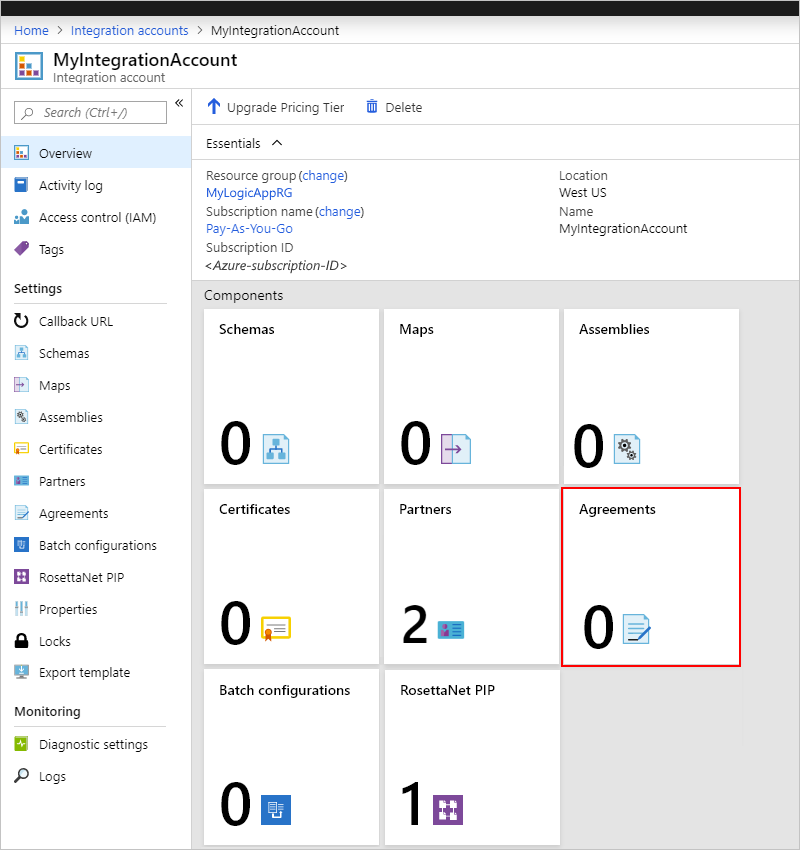
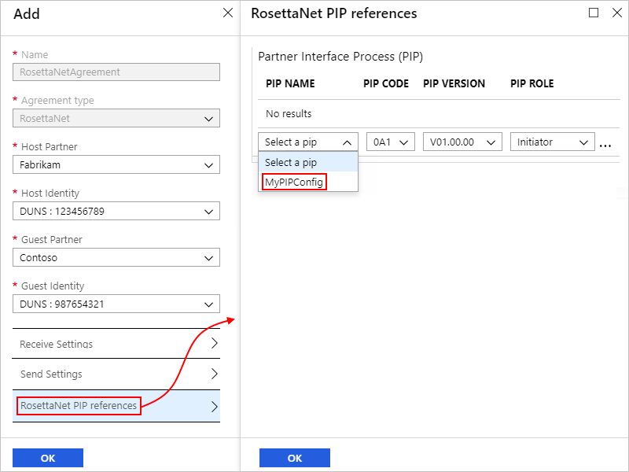

# Exchange RosettaNet messages for B2B enterprise integration in Azure Logic Apps 

RosettaNet is a non-profit consortium that has established standard process for sharing business information. These standards are widespread in semiconductor, electronics, and logistics industry and commonly used for supply chain processes. The RosettaNet consortium creates and maintains Partner Interface Processes (PIPs) to provide common business-process definitions for all RosettaNet message exchanges. <a href=https://resources.gs1us.org> RosettaNet </a> is based on XML and defines message guidelines, interfaces for business processes, and implementation frameworks for interaction between companies.

Logic Apps RosettaNet connector enables RosettaNet standard based integration solutions. The connector is based on (RNIF) version 2.0.01. RNIF is an open network application framework that enables business partners to collaboratively run RosettaNet Partner Interface Processes (PIPs). The framework defines message structure, the need for acknowledgments, Multipurpose Internet Mail Extensions (MIME) encoding, and the digital signature.

Specifically, the connector provides following capabilities
-	Encode or Receive RosettaNet messages
-	Decode or Send RosettaNet messages
- Wait for response and generation of Notification of Failure

For the above capabilities, the connector supports all PIPs defined by RNIF 2.0.01. The communication with the partner can be synchronous or asynchronous.

## RosettaNet concepts
Before you start, here are some concepts and terminologies unique to RosettaNet specification and are important when doing RosettaNet based integrations

- PIP
The RosettaNet organization creates and maintains Partner Interface Processes (PIPs) to provide common business-process definitions for all RosettaNet message exchanges. Each PIP specification provides a document type definition (DTD) file and a message guideline document. The DTD file defines the service-content message structure. The message-guideline document, which is a human-readable HTML file, specifies element-level constraints. Together, they provide a complete definition of the business process. PIPs are categorized by a high-level business function (cluster) and a subfunction (segment). For examples, 3A4 is the PIP for Purchase Order, where 3 is Order Management function, and 3A is Quote & Order Entry subfunction. You can find more details on RosettaNet <a href=https://resources.gs1us.org> site </a>.

- Action
These messages, part of a PIP, are business messages exchanged between partners. 

- Signal
These messages, also part of a PIP, are acknowledgments sent in response to the Action messages.

- Single and Double action
If the Partner Interface Process (PIP) is single-action, the only response is an acknowledgment signal message. If the PIP is double-action, the initiator will receive a response message, and reply with an acknowledgment, in addition to the single-action message flow.

## Before you start

Here are the steps to be completed before you can send or receive RosettaNet messages

1. An [integration account](logic-apps-enterprise-integration-create-integration-account.md) 
that's already defined and associated with your Azure subscription.

2. At least two [partners](../logic-apps/logic-apps-enterprise-integration-partners.md) 
that are defined in your integration account and configured with the qualifier DUNS **Business Identities**

3. [Certificates](./logic-apps-enterprise-integration-certificates.md) for encryption or decryption or signing of the messages uploaded in the integration account. 
This step is optional and is required only if you are using signing or encryption

4. Add PIP or Process Configurations
To create a PIP with a partner, you must first create a process configuration in Integration Account. The process configuration stores all configuration characteristics of the PIP. You can then reference this configuration to create an agreement with the partner. Here are the steps to add a PIP configuration in Integration Account:

* Select and open your integration account. Select the tile for RosettaNet PIP configurations.

  

  Select **Add** and enter the details about PIP. Provide the Name of the PIP, three-digit PIP code, and version of the PIP. You can find more details about PIP at RosettaNet <a href=https://resources.gs1us.org/RosettaNet-Standards/Standards-Library/PIP-Directory#1043208-pipsreg> website </a>. Click OK to save your selection and create the PIP configuration.

  

* To view or edit the Process configuration, choose the PIP and select **Edit as JSON**

  

  All process configuration settings come from the PIP specifications, and we populate most of the settings with default values that are the most typically used values for the fields. You must verify that the settings correspond to the values in the appropriate PIP specification and meets your business needs. If necessary, you can also update the values in JSON and save the changes by selecting OK.

5. Create RosettaNet agreement

* Select and open your integration account. Select the tile for Agreements.

  

* Under **Add**, enter a **Name** for your agreement. 
   For the agreement type, select **RosettaNet**. 
   Select the **Host Partner**, **Host Identity**, 
   **Guest Partner**, and **Guest Identity** for your agreement. 
   For more property details, see the table in this step.

	
  
	| Property | Description |
	| --- | --- |
	| Name |Name of the agreement |
	| Agreement Type | Should be X12 |
	| Host Partner |An agreement needs both a host and guest partner. The host partner represents the organization that configures the agreement. |
	| Host Identity |An identifier for the host partner |
	| Guest Partner |An agreement needs both a host and guest partner. The guest partner represents the organization that's doing business with the host partner. |
	| Guest Identity |An identifier for the guest partner |
	| Receive Settings |These properties apply to all messages received by an agreement. |
	| Send Settings |These properties apply to all messages sent by an agreement. |  

  
* To configure the agreement for Receive i.e Decode, select **Receive Settings**. To enable signing or encryption for the messages received from the guest partner, choose the Certificate from the drop-down. The drop-down lists the [certificates](./logic-apps-enterprise-integration-certificates.md) configured in the integration account.

  

* To configure the agreement for Send i.e Encode, select **Send Settings**. To enable signing or encryption for the messages to be sent to the guest partner, choose the Certificate from the drop-down. The drop-down lists the [certificates](./logic-apps-enterprise-integration-certificates.md) configured in the integration account.

  

  | Property | Description |
	| --- | --- |
	| Enable message signing | If selected, messages sent will be signed with the certificate using the selected Signing Algorithm  |
	| Enable message encryption | If selected, messages sent will be signed with the certificate using the selected Signing Algorithm  |
	| Action URL | URL to send action messages. The URL is a required field for both synchronous and asynchronous messages. |
	| Acknowledgment URL | URL to send acknowledgment messages. The URL is a required field for asynchronous messages. |
	
* All RosettaNet messages require PIP configurations. To configure the RosettaNet PIP references for the partners, select **RosettaNet PIP References**.

  

  Select the PIP name from the drop-down, rest of the properties will be populated based on the PIP name selection. The PIP references are populated from the PIPs configured in Integration Account. 

After these provisioning steps, you are ready to send or receive RosettaNet messages.

# RosettaNet templates

To accelerate development and recommend integration patterns, we have also published logic app templates to Decode and Encode RosettaNet messages. These templates are published in <a href="https://github.com/Azure/logicapps"> Logic Apps repo> </a>. To consume them, open a newly created logic app and select them from the template gallery in the designer.

 

# Receive or Decode RosettaNet messages

1. [Create a logic app](quickstart-create-first-logic-app-workflow.md).

2. Associate the integration account you have created in previous steps, with the Logic App.

  

3. Before you add the step to decode the RosettaNet message, 
you must add a trigger for starting your logic app, like a Request trigger. 
In the Logic App Designer, add a trigger, and then add a new step by clicking on the + sign

  

4. Search RosettaNet and select **RosettaNet Decode** action from the results. 

  

  | Property | Description |
	| --- | --- |
	| Message | RosettaNet message to decode  |
	| Headers | HTTP headers providing version and response type values. Version is RNIF version and Response type indicates the communication between the partners, which can be synchronous or asynchronous  |
	| Role | Role of the Host partner in the PIP |
	

> [!NOTE]
> The output of Decode action along with other properties includes **Outbound signal** that the you can choose to Encode and return back to the partner
> or take any other action on it. 

# Send or Encode RosettaNet messages

1. [Create a logic app](quickstart-create-first-logic-app-workflow.md).

2. Associate the integration account you have created in previous steps, with the Logic App.

  

3. Before you add the step to encode the RosettaNet message, 
you must add a trigger for starting your logic app, like a Request trigger. 
In the Logic App Designer, add a trigger, and then add a new step by clicking on the + sign

  

4.  Search RosettaNet and select **RosettaNet Encode** action from the results. 

  

  | Property | Description |
	| --- | --- |
	| Message | RosettaNet message to encode  |
	| Host partner | Host partner name |
	| Guest partner | Guest partner name |
  | PIP code | PIP code  |
	| PIP version | PIP version  |
	| PIP Identity | Unique identifier for this PIP message |
	| Message type | RosettaNet message to decode  |
	| Role | Role of the host partner   |
	| Tracking id | Tracking ID for the message |

  
5. The encoded message from the previous step is now ready to be sent to the partner. For this, we are going to **HTTP** connector.

  

6. As per the RosettaNet standards, business transactions are considered complete only when all the steps defined by the PIP are complete. After sending the encoded message to partner,
the host waits for the signal and acknowledgment. This is accomplished by using **RosettaNet wait for response action.

  

  The duration to wait and number of retries are driven from the PIP config in Integration Account. If the response is not received, this action generates Notification of Failure. To take care of retries, Encode and wait for response are always put in a loop.

  

## Get support

* For questions, visit the [Azure Logic Apps forum](https://social.msdn.microsoft.com/Forums/en-US/home?forum=azurelogicapps).
* To submit or vote on feature ideas, visit the 
[Logic Apps user feedback site](https://aka.ms/logicapps-wish).

## Next steps

* [Connect to on-premises systems](../logic-apps/logic-apps-gateway-connection.md) from logic apps
* Learn how to validate, transform, and other message operations with the 
[Enterprise Integration Pack](../logic-apps/logic-apps-enterprise-integration-overview.md)
* Learn about other [Logic Apps connectors](../connectors/apis-list.md)
