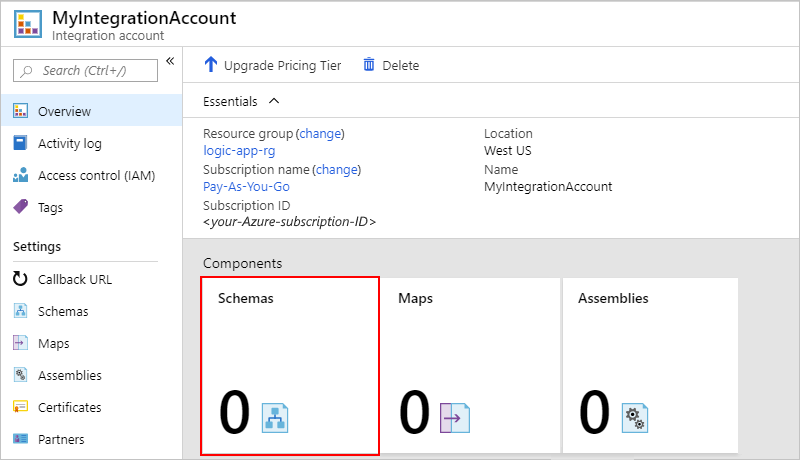

# Validate XML with schemas in Azure Logic Apps with Enterprise Integration Pack

To check that documents use valid XML and have the expected data 
in the predefined format for enterprise integration scenarios 
in Azure Logic Apps, your logic app can use schemas. 
A schema can also validate messages that logic apps exchange
in business-to-business (B2B) scenarios.

For limits related to integration accounts and artifacts such as schemas, 
see [Limits and configuration information for Azure Logic Apps](../logic-apps/logic-apps-limits-and-config.md#integration-account-limits).

## Prerequisites

* An Azure subscription. If you don't have a subscription, 
<a href="https://azure.microsoft.com/free/" target="_blank">sign up for a free Azure account</a>.

* An [integration account](../logic-apps/logic-apps-enterprise-integration-create-integration-account.md) 
where you store your schemas and other artifacts for enterprise 
integration and business-to-business (B2B) solutions.

You don't need a logic app when creating and adding schemas. However, 
to use a schema, your logic app needs linking to an integration account 
where you store that map. Learn 
[how to link logic apps to integration accounts](../logic-apps/logic-apps-enterprise-integration-create-integration-account.md#link-account). 
If you don't have a logic app yet, learn [how to create logic apps](../logic-apps/quickstart-create-first-logic-app-workflow.md).

## Add schemas

1. Sign in to the <a href="https://portal.azure.com" target="_blank">Azure portal</a> 
with your Azure account credentials.

1. To find and open your integration account, 
on the main Azure menu, select **All services**. 
In the search box, enter "integration account". 
Select **Integration accounts**.

   

1. Select the integration account where you want to add your schema, 
for example:

   

1. On your integration account's **Overview** page, 
under **Components**, select the **Schemas** tile.

   

1. After the **Schemas** page opens, choose **Add**.

   

1. Enter a name for your schema. 
1. ### Add schema less than 2 MB

Upload the schema file by 
selecting the folder icon next to the **Schema** box. 
After the upload process completes, select **OK**.

   

Now follow the steps to add a schema that's either 
smaller than 2 MB or larger than 2 MB, up to the limit.

### Add a schema file larger than 2 MB (up to 8 MB maximum)

These steps differ based on the blob container access level: **Public** or **No anonymous access**.

**To determine this access level**

1.	Open **Azure Storage Explorer**. 

2.	Under **Blob Containers**, select the blob container you want. 

3.	Select **Security**, **Access Level**.

If the blob security access level is **Public**, 
follow these steps.

1. Upload the schema to your storage account, 
and copy the URI.

	

2. In **Add Schema**, select **Large file**, 
and provide the URI in the **Content URI** text box.

	

If the blob security access level is **No anonymous access**, 
follow these steps.

1. Upload the schema to your storage account.

	

2. Generate a shared access signature for the schema.

	

3. In **Add Schema**, select **Large file**, 
and provide the shared access signature URI in the **Content URI** text box.

	

4. In the **Schemas** blade of your integration account, 
your newly added schema should appear.

	

## Edit schemas

1. Choose the **Schemas** tile.

2. After the **Schemas** blade opens, 
select the schema that you want to edit.

3. On the **Schemas** blade, choose **Edit**.

	

4. Select the schema file that you want to edit, then select **Open**.

	

Azure shows a message that the schema uploaded successfully.

## Delete schemas

1. Choose the **Schemas** tile.

2. After the **Schemas** blade opens, 
select the schema you want to delete.

3. On the **Schemas** blade, choose **Delete**.

	

4. To confirm that you want to delete the selected schema, 
choose **Yes**.

	

	In the **Schemas** blade, the schema list refreshes 
	and no longer includes the schema that you deleted.

	

## Next steps
* [Learn more about the Enterprise Integration Pack](logic-apps-enterprise-integration-overview.md "Learn about the enterprise integration pack").  

