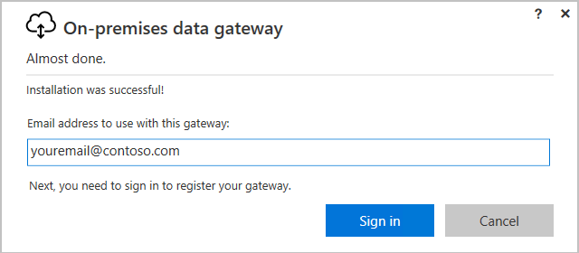
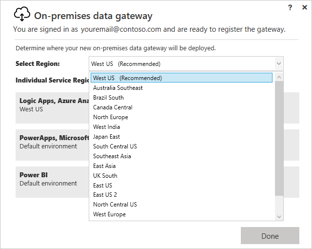
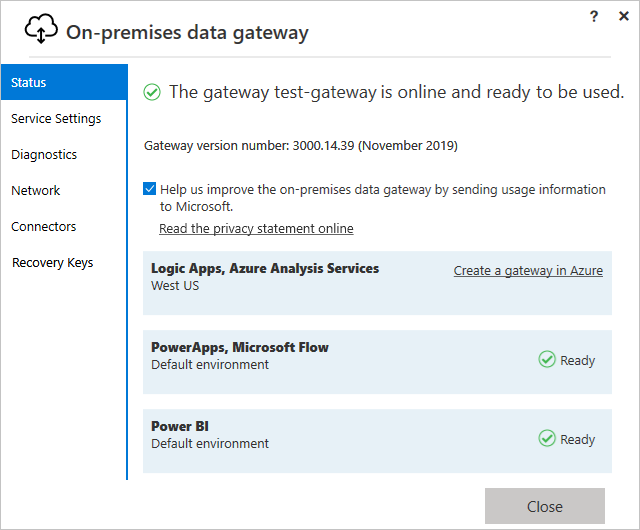
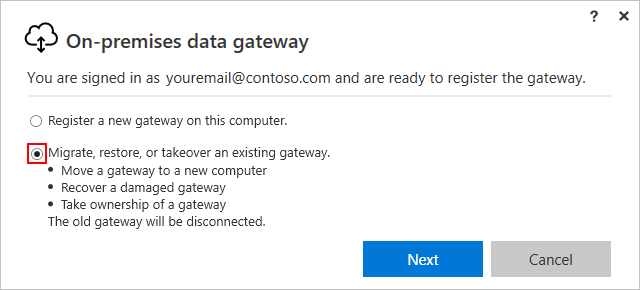
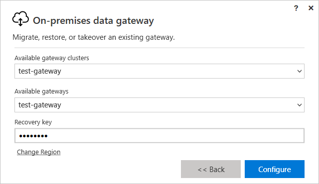
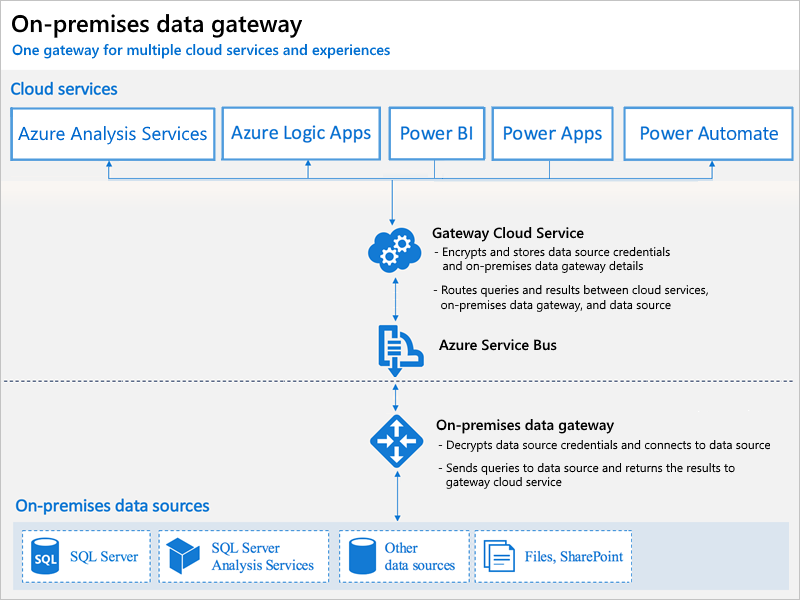

---
# required metadata
title: Install on-premises data gateway - Azure Logic Apps | Microsoft Docs
description: How to download and install the on-premises data gateway before you access data on premises from logic apps
services: logic-apps
ms.service: logic-apps
author: ecfan
ms.author: estfan
manager: jeconnoc
ms.topic: article
ms.date: 07/20/2018

# optional metadata
ms.reviewer: yshoukry, LADocs
ms.suite: integration
---

# Install the on-premises data gateway for Azure Logic Apps

Before you can connect your logic apps to on-premises data sources, 
you must download and install the on-premises data gateway on a local computer. 
The gateway works as a bridge that provides quick data transfer and 
encryption between data sources on premises and your logic apps. 
This article shows how you can download, install, 
and set up your on-premises data gateway. Learn more about 
[how the data gateway works](#gateway-cloud-service).

<a name="supported-connections"></a>

The gateway supports [on-premises connectors](../connectors/apis-list.md#on-premises-connectors) 
in Azure Logic Apps for these data sources:

*   BizTalk Server 2016
*   File System
*   IBM DB2  
*   IBM Informix
*   IBM MQ
*   MySQL
*   Oracle Database
*   PostgreSQL
*   SAP Application Server 
*   SAP Message Server
*   SharePoint Server
*   SQL Server
*   Teradata

For information about how to use the gateway with other services, see these articles:

* [Microsoft Power BI on-premises data gateway](https://powerbi.microsoft.com/documentation/powerbi-gateway-onprem/)
* [Microsoft Flow on-premises data gateway](https://flow.microsoft.com/documentation/gateway-manage/)
* [Microsoft PowerApps on-premises data gateway](https://powerapps.microsoft.com/tutorials/gateway-management/)
* [Azure Analysis Services on-premises data gateway](../analysis-services/analysis-services-gateway.md)

<a name="requirements"></a>

## Prerequisites

* A [work or school account](../active-directory/fundamentals/sign-up-organization.md) 
that has an [Azure subscription](../architecture/cloud-adoption-guide/adoption-intro/subscription-explainer.md). 
During gateway installation, you sign in to this account so you can 
associate the gateway installation with your Azure subscription. 
Later, you also use same account when you create an Azure resource 
for your gateway installation in the Azure portal. 
If you don't have an Azure subscription yet, 
<a href="https://azure.microsoft.com/free/" target="_blank">sign up for a free Azure account</a>.

* Here are requirements for your local computer:

  **Minimum requirements**
  * .NET 4.5 Framework
  * 64-bit version of Windows 7 or Windows Server 2008 R2 (or later)

  **Recommended requirements**
  * 8 Core CPU
  * 8 GB Memory
  * 64-bit version of Windows 2012 R2 (or later)

* **Important considerations**

  * You can only install the on-premises data gateway on a local computer, 
  not a domain controller. However, you don't have to install the gateway 
  on the same computer as your data source.

    > [!TIP]
    > To minimize latency, you can install the gateway as close 
    > as possible to your data source, or on the same computer, 
    > assuming that you have permissions.

  * Install the gateway on a computer that *doesn't* turn off, go to sleep, 
  or connect to the Internet. The gateway can't run under these conditions. 
  Gateway performance might also suffer over a wireless network.

  * During installation, you must sign in with a 
  [work or school account](../active-directory/sign-up-organization.md) 
  that's managed by Azure Active Directory (Azure AD) and not a Microsoft account.
  You must then use the same sign-in account in the Azure portal 
  when you create a gateway resource for your gateway installation. 
  You can then select this gateway resource when you create the 
  connection from your logic app to your on-premises data source. 
  [Why must I use an Azure AD work or school account?](#why-azure-work-school-account)

  > [!TIP]
  > If you signed up for an Office 365 offering 
  > and didn't provide your actual work email, 
  > you might have a sign-in address that looks 
  > like this example: `username@domain.onmicrosoft.com` 
  >
  > To use a Microsoft account that has a 
  > [Visual Studio Standard subscription](https://visualstudio.microsoft.com/vs/pricing/), first 
  > [create a directory (tenant) in Azure Active Directory](../active-directory/develop/active-directory-howto-tenant.md), 
  > or use the default directory, with your Microsoft account. 
  > Add a user with a password to the directory, 
  > then give that user access to your subscription. 
  > You can then sign in during gateway installation with this username and password.

  * The region you select for your gateway determines the location 
  where you later create the Azure resource for your gateway. 
  When you create this resource in Azure, you must select the same location 
  as your gateway installation. The default region is the same location 
  as your Azure AD tenant, which manages your Azure account, 
  but you can change the location during gateway installation.

  * If you have an existing gateway that you set up with an installer 
  that's earlier than version 14.16.6317.4, you can't change your 
  gateway's location by running the latest installer. However, 
  you can use the latest installer to set up a new gateway 
  with the location you want instead.
  
  If you have a gateway installer that's earlier than 
  version 14.16.6317.4, but you haven't installed your 
  gateway yet, you can download and use the latest installer.

<a name="install-gateway"></a>

## Install the data gateway

1. [Download, save, and run the gateway installer on a local computer](http://go.microsoft.com/fwlink/?LinkID=820931&clcid=0x409).

2. Accept the default installation path, 
or specify the location on your computer 
where you want to install the gateway.

3. Review and accept the terms of use and privacy statement, 
and then choose **Install**.

   

4. After the gateway successfully installs, 
provide the email address for your work or school account, 
and choose **Sign in**.

   

5. Choose **Register a new gateway on this computer** > **Next**, 
which registers your gateway installation with the 
[gateway cloud service](#gateway-cloud-service). 

   

6. Provide this information for your gateway installation:

   * The name you want for your installation 

   * The recovery key you want to create, 
   which must have at least eight characters

     > [!IMPORTANT]
     > Save and keep your recovery key in a safe place. 
     > You need this key when you change the gateway's location, 
     > or when you migrate, recover, or take over an existing gateway.

   * Confirmation for your recovery key 

     

7. Check the region selected for the gateway cloud service 
and Azure Service Bus that's used by your gateway installation. 

   

   > [!IMPORTANT]
   > To change this region after you finish installing your gateway, 
   > you need the recovery key for that gateway installation. 
   > Also, you must uninstall and reinstall the gateway. 
   > For more information, see 
   > [Change location, migrate, recover, or take over existing gateway](#update-gateway-installation).

   *Why change the region for your gateway installation?* 

   For example, to reduce latency, you might change your 
   gateway's region to the same region as your logic app. 
   Or, you might select the region closest to your on-premises data source. 
   Your gateway resource in Azure and your logic app can have different locations.

8. To accept the default region, choose **Configure**. 
Or, to change the default region, follow these steps:

   1. Next to the current region, select **Change Region**. 

      

   2. On the next page, open the **Select Region** list, 
   select the region you want, and choose **Done**.

      

9. After the confirmation page appears, choose **Close**. 

   The installer confirms that your gateway is now online and ready for use.

   

10. Now you can [create an Azure resource for your gateway installation](../logic-apps/logic-apps-gateway-connection.md). 

## High availability clusters

If you have an existing gateway when you create another gateway, 
you can optionally create high availability clusters. 
These clusters organize gateways into groups that can 
help avoid single points of failure. To use this capability, 
review these requirements and considerations:

* Only some connectors support high availability, 
such as the File System connector and others on the way. 
     
* You must already have at least one gateway installation 
within the same Azure subscription as the primary gateway 
and the recovery key for that installation. 

* Your primary gateway must be running the gateway update 
from November 2017 or later.

After meeting these requirements, when you create your next gateway, 
select **Add to an existing gateway cluster**, 
select the primary gateway for your cluster, 
and provide the recovery key for that primary gateway.
For more information, see 
[High availability clusters for on-premises data gateway](https://docs.microsoft.com/power-bi/service-gateway-high-availability-clusters).

<a name="update-gateway-installation"></a>

## Change location, migrate, restore, or take over existing gateway

If you must change your gateway's location, 
move your gateway installation to a new computer, 
recover a damaged gateway, or take ownership for an existing gateway, 
you need the recovery key that was provided during gateway installation. 
This action disconnects the old gateway.

1. From your computer's **Control Panel**, go to **Programs and Features**. 
In the programs list, select **On-premises data gateway**, and then choose **Uninstall**.

2. [Reinstall the on-premises data gateway](http://go.microsoft.com/fwlink/?LinkID=820931&clcid=0x409).

3. After the installer opens, sign in with the same Azure work 
or school account that was previously used to install the gateway.

4. Select **Migrate, restore, or takeover an existing gateway**, 
and then choose **Next**.

   

5. Under **Available gateways** or **Available gateway clusters**, 
select the gateway installation you want to change. 
Enter the recovery key for the gateway installation. 

   

6. To change the region, select **Change Region** and the new region.

7. When you're done, choose **Configure**.

<a name="windows-service-account"></a>

## Windows service account

The on-premises data gateway runs as a Windows service and is set up to 
use `NT SERVICE\PBIEgwService` for the Windows service login credentials. 
By default, the gateway has the "Log in as a service" permissions 
for the machine where you install the gateway. 
To create and maintain the gateway in the Azure portal, 
the Windows service account must have at least **Contributor** permissions. 

> [!NOTE]
> The Windows service account differs from the account 
> used for connecting to on-premises data sources, 
> and from the Azure work or school account used to sign in to cloud services.

<a name="restart-gateway"></a>

## Restart gateway

Like any other Windows service, you can start and stop the service in multiple ways. 
For example, you can open a command prompt with elevated permissions 
on the computer where the gateway is running, and run either these commands:

* To stop the service, run this command:
  
  `net stop PBIEgwService`

* To start the service, run this command:
  
  `net start PBIEgwService`

## Configure firewall or proxy

The gateway creates an outbound connection to 
[Azure Service Bus](https://azure.microsoft.com/services/service-bus/). 
To provide proxy information for your gateway, see 
[Configure proxy settings](https://powerbi.microsoft.com/documentation/powerbi-gateway-proxy/).

To check whether your firewall, or proxy, might block connections, 
confirm whether your machine can actually connect to the internet 
and the [Azure Service Bus](https://azure.microsoft.com/services/service-bus/). 
From a PowerShell prompt, run this command:

`Test-NetConnection -ComputerName watchdog.servicebus.windows.net -Port 9350`

> [!NOTE]
> This command only tests network connectivity 
> and connectivity to the Azure Service Bus. 
> The command doesn't do anything with the 
> gateway or the gateway cloud service that 
> encrypts and stores your credentials and gateway details. 
>
> Also, this command is only available on Windows Server 2012 R2 or later, 
> and Windows 8.1 or later. On earlier OS versions, you can use Telnet to 
> test connectivity. Learn more about 
> [Azure Service Bus and hybrid solutions](../service-bus-messaging/service-bus-fundamentals-hybrid-solutions.md).

Your results should look similar to this example:

```text
ComputerName           : watchdog.servicebus.windows.net
RemoteAddress          : 70.37.104.240
RemotePort             : 5672
InterfaceAlias         : vEthernet (Broadcom NetXtreme Gigabit Ethernet - Virtual Switch)
SourceAddress          : 10.120.60.105
PingSucceeded          : False
PingReplyDetails (RTT) : 0 ms
TcpTestSucceeded       : True
```

If **TcpTestSucceeded** is not set to **True**, you might be blocked by a firewall. 
If you want to be comprehensive, substitute the **ComputerName** and **Port** values 
with the values listed under [Configure ports](#configure-ports) in this article.

The firewall might also block connections that the Azure Service Bus makes to the Azure datacenters. 
If this scenario happens, approve (unblock) all the IP addresses for those datacenters in your region. 
For those IP addresses, [get the Azure IP addresses list here](https://www.microsoft.com/download/details.aspx?id=41653).

## Configure ports

The gateway creates an outbound connection to 
[Azure Service Bus](https://azure.microsoft.com/services/service-bus/) 
and communicates on outbound ports: TCP 443 (default), 5671, 5672, 9350 through 9354. 
The gateway doesn't require inbound ports. Learn more about 
[Azure Service Bus and hybrid solutions](../service-bus-messaging/service-bus-fundamentals-hybrid-solutions.md).

| Domain names | Outbound ports | Description |
| ------------ | -------------- | ----------- |
| *.analysis.windows.net | 443 | HTTPS | 
| *.login.windows.net | 443 | HTTPS | 
| *.servicebus.windows.net | 5671-5672 | Advanced Message Queuing Protocol (AMQP) | 
| *.servicebus.windows.net | 443, 9350-9354 | Listeners on Service Bus Relay over TCP (requires 443 for Access Control token acquisition) | 
| *.frontend.clouddatahub.net | 443 | HTTPS | 
| *.core.windows.net | 443 | HTTPS | 
| login.microsoftonline.com | 443 | HTTPS | 
| *.msftncsi.com | 443 | Used to test internet connectivity when the gateway is unreachable by the Power BI service. | 
||||

If you must approve IP addresses instead of the domains, 
you can download and use the [Microsoft Azure Datacenter IP ranges list](https://www.microsoft.com/download/details.aspx?id=41653). 
In some cases, the Azure Service Bus connections are made 
with IP Address rather than fully qualified domain names.

## Tenant level administration 

Currently, there's no single place where tenant administrators can 
manage all the gateways that other users have installed and configured.  
If you're a tenant administrator, you might want to have the users in 
your organization add you as an administrator for every gateway they install. 
This way, you can manage all the gateways in your organization 
through the Gateway Settings page or through 
[PowerShell commands](https://docs.microsoft.com/power-bi/service-gateway-high-availability-clusters#powershell-support-for-gateway-clusters). 

<a name="gateway-cloud-service"></a>

## How does the gateway work?

The data gateway facilitates quick and secure communication between your logic app, 
the gateway cloud service, and your on-premises data source. The gateway cloud 
service encrypts and stores your data source credentials and gateway details. 
The service also routes queries and their results between your logic app, 
the on-premises data gateway, and your data source on premises.

All traffic originates as secure outbound traffic from the gateway agent. 
The gateway relays data from on-premises sources on encrypted channels 
through the Azure Service Bus. This service bus creates a channel between 
the gateway and the calling service, but doesn't store any data. 
All data that travels through the gateway is encrypted.



These steps describe what happens when a user in the cloud interacts 
with an element that's connected to your on-premises data source:

1. The gateway cloud service creates a query, 
along with the encrypted credentials for the data source, 
and sends the query to the queue for the gateway to process.

2. The gateway cloud service analyzes the query 
and pushes the request to the Azure Service Bus.

3. The on-premises data gateway polls the 
Azure Service Bus for pending requests.

4. The gateway gets the query, decrypts the credentials, 
and connects to the data source with those credentials.

5. The gateway sends the query to the data source for execution.

6. The results are sent from the data source 
back to the gateway, and then to the gateway cloud service. 
The gateway cloud service then uses the results.

<a name="faq"></a>

## Frequently asked questions

### General

**Q**: Do I need a gateway for data sources in the cloud, such as Azure SQL Database? <br/>
**A**: No, the gateway connects to on-premises data sources only.

**Q**: Does the gateway have to be installed on the same machine as the data source? <br/>
**A**: No, the gateway connects to the data source using the provided connection information. 
Consider the gateway as a client application in this sense. The gateway just needs 
the capability to connect to the server name that was provided.

<a name="why-azure-work-school-account"></a>

**Q**: Why must I use an Azure work or school account to sign in? <br/>
**A**: You can only use an Azure work or school account when 
you install the on-premises data gateway. Your sign-in account 
is stored in a tenant that's managed by Azure Active Directory (Azure AD). 
Usually, your Azure AD account's user principal name (UPN) matches the email address.

**Q**: Where are my credentials stored? <br/>
**A**: The credentials that you enter for a data source 
are encrypted and stored in the gateway cloud service. 
The credentials are decrypted at the on-premises data gateway.

**Q**: Are there any requirements for network bandwidth? <br/>
**A**: Check that your network connection has good throughput. 
Every environment is different, and the amount of data sent can affect the results. 
To guarantee a throughput level between your on-premises data source and 
the Azure datacenters, try [Azure ExpressRoute](https://azure.microsoft.com/services/expressroute/). 
To help gauge your throughput, try an external tool such as Azure Speed Test.

**Q**: What is the latency for running queries to a data source from the gateway? What is the best architecture? <br/>
**A**: To reduce network latency, install the gateway as close to the data source as possible. 
If you can install the gateway on the actual data source, this proximity minimizes the latency introduced. 
Also, consider proximity to Azure datacenters. For example, if your service uses the West US datacenter, 
and you have SQL Server hosted in an Azure VM, then you might want your Azure VM in the West US region too. 
This proximity minimizes latency and avoids egress charges on the Azure VM.

**Q**: How are results sent back to the cloud? <br/>
**A**: Results are sent through the Azure Service Bus.

**Q**: Are there any inbound connections to the gateway from the cloud? <br/>
**A**: No. The gateway uses outbound connections to Azure Service Bus.

**Q**: What if I block outbound connections? What do I need to open? <br/>
**A**: See the ports and hosts that the gateway uses.

**Q**: What is the actual Windows service called?<br/>
**A**: In Services, the gateway is called Power BI Enterprise Gateway Service.

**Q**: Can the gateway Windows service run with an Azure Active Directory account? <br/>
**A**: No, the Windows service has to have a valid Windows account. By default, 
the service runs with the Service SID, NT SERVICE\PBIEgwService.

### Disaster recovery

**Q**: What options are available for disaster recovery? <br/>
**A**: You can use the recovery key to restore or move a gateway. 
When you install the gateway, specify the recovery key.

**Q**: What is the benefit of the recovery key? <br/>
**A**: The recovery key provides a way to migrate or recover your gateway settings after a disaster.

## Troubleshooting

[!INCLUDE [existing-gateway-location-changed](../../includes/logic-apps-existing-gateway-location-changed.md)]

**Q**: How can I see what queries are being sent to the on-premises data source? <br/>
**A**: You can enable query tracing, which includes the queries that are sent. 
Remember to change query tracing back to the original value when done troubleshooting. 
Leaving query tracing turned on creates larger logs.

You can also look at tools that your data source has for tracing queries. 
For example, you can use Extended Events or SQL Profiler for SQL Server and Analysis Services.

**Q**: Where are the gateway logs? <br/>
**A**: See Tools later in this article.

### Update to the latest version

Many issues can surface when the gateway version becomes outdated. 
As good general practice, make sure that you use the latest version. 
If you haven't updated the gateway for a month or longer, 
you might consider installing the latest version of the gateway, 
and see if you can reproduce the issue.

### Error: Failed to add user to group. (-2147463168 PBIEgwService Performance Log Users)

You might get this error if you try to install the gateway on a domain controller, 
which isn't supported. Make sure you deploy the gateway on a machine that isn't a domain controller.

## Tools

### Collect logs from the gateway configurer

You can collect several logs for the gateway. Always start with the logs!

#### Installer logs

`%localappdata%\Temp\Power_BI_Gateway_–Enterprise.log`

#### Configuration logs

`%localappdata%\Microsoft\Power BI Enterprise Gateway\GatewayConfigurator.log`

#### Enterprise gateway service logs

`C:\Users\PBIEgwService\AppData\Local\Microsoft\Power BI Enterprise Gateway\EnterpriseGateway.log`

#### Event logs

You can find the Data Management Gateway and PowerBIGateway logs under **Application and Services Logs**.

### Fiddler Trace

[Fiddler](http://www.telerik.com/fiddler) is a free tool from Telerik that monitors HTTP traffic. 
You can see this traffic with the Power BI service from the client machine. 
This service might show errors and other related information.

## Next steps
	
* [Connect to on-premises data from logic apps](../logic-apps/logic-apps-gateway-connection.md)
* [Enterprise integration features](../logic-apps/logic-apps-enterprise-integration-overview.md)
* [Connectors for Azure Logic Apps](../connectors/apis-list.md)
