# Set up Azure Monitor logs and collect diagnostics data for B2B messages in Azure Logic Apps

After you set up B2B communication between trading partners in your integration account, those partners can exchange messages by using protocols such as AS2, X12, and EDIFACT. To check that this communication works the way you expect, you can set up [Azure Monitor logs](../azure-monitor/platform/data-platform-logs.md) for your integration account. [Azure Monitor](../azure-monitor/overview.md) helps you monitor your cloud and on-premises environments so that you can more easily maintain their availability and performance. By using Azure Monitor logs, you can record and store data about runtime data and events, such as trigger events, run events, and action events in a [Log Analytics workspace](../azure-monitor/platform/resource-logs-collect-workspace.md). For messages, logging also collects information such as:

* Message count and status
* Acknowledgments status
* Correlations between messages and acknowledgments
* Detailed error descriptions for failures

Azure Monitor lets you create [log queries](../azure-monitor/log-query/log-query-overview.md) to help you find and review this information. You can also [use this diagnostics data with other Azure services](../logic-apps/logic-apps-monitor-your-logic-apps-oms.md#extend-data), such as Azure Storage and Azure Event Hubs.

To set up logging for your integration account, [install the Logic Apps B2B solution](#install-b2b-solution) in the Azure portal. This solution provides aggregated information for B2B message events. Then, to enable logging and creating queries for this information, set up [Azure Monitor logs](#set-up-resource-logs).

This article shows how to enable Azure Monitor logging for your integration account.

[!INCLUDE [azure-monitor-log-analytics-rebrand](../../includes/azure-monitor-log-analytics-rebrand.md)]

## Prerequisites

* A Log Analytics workspace. If you don't have a Log Analytics workspace, learn [how to create a Log Analytics workspace](../azure-monitor/learn/quick-create-workspace.md).

* A logic app that's set up with Azure Monitor logging and sends that information to a Log Analytics workspace. Learn [how to set up Azure Monitor logs for your logic app](../logic-apps/logic-apps-monitor-your-logic-apps.md).

* An integration account that's linked to your logic app. Learn [how to link your integration account to your logic app](../logic-apps/logic-apps-enterprise-integration-create-integration-account.md).

## Install Logic Apps B2B solution

Before Azure Monitor logs can track the B2B messages for your logic app, add the **Logic Apps B2B** solution to your Log Analytics workspace.

1. In the [Azure portal](https://portal.azure.com)'s search box, enter `log analytics workspaces`, and then select **Log Analytics workspaces**.

   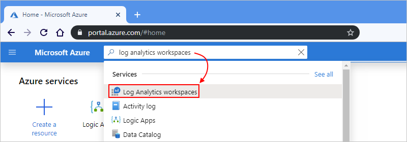

1. Under **Log Analytics workspaces**, select your workspace.

   

1. On the Overview pane, under **Get started with Log Analytics** > **Configure monitoring solutions**, select **View solutions**.

   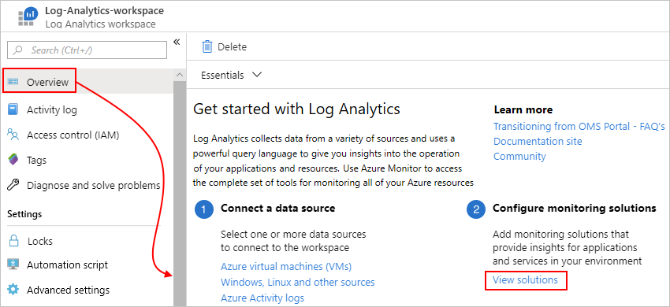

1. On the Overview pane, select **Add**.

   

1. After the **Marketplace** opens, in the search box, enter `logic apps b2b`, and select **Logic Apps B2B**.

   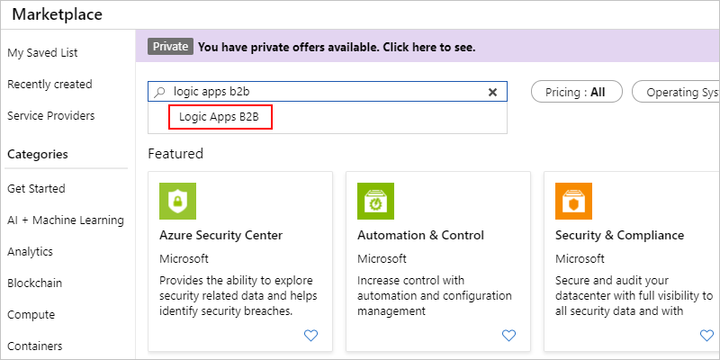

1. On the solution description pane, select **Create**.

   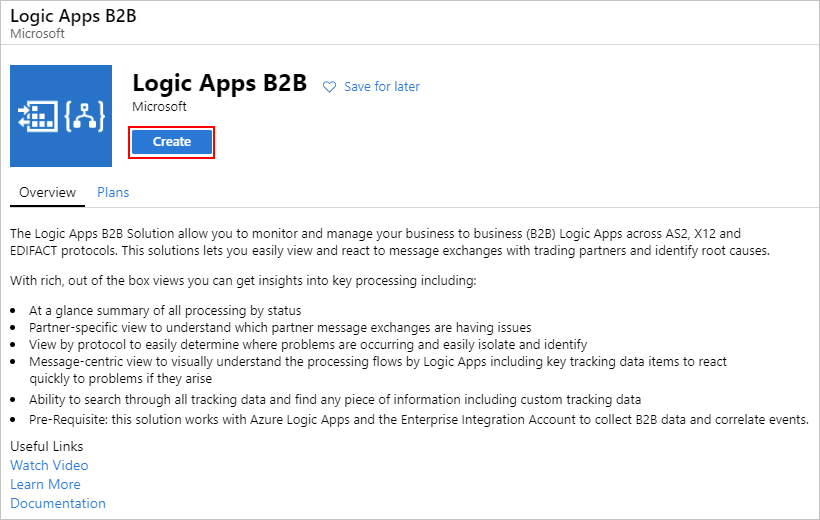

1. Review and confirm the Log Analytics workspace where you want to install the solution, and select **Create** again.

   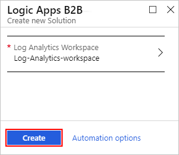

   After Azure deploys the solution to the Azure resource group that contains your Log Analytics workspace, the solution appears on your workspace's summary pane. When B2B messages are processed, the message count on this pane is updated.

   

## Set up Azure Monitor logs

You can enable Azure Monitor logging directly from your integration account.

1. In the [Azure portal](https://portal.azure.com), find and select your integration account.

   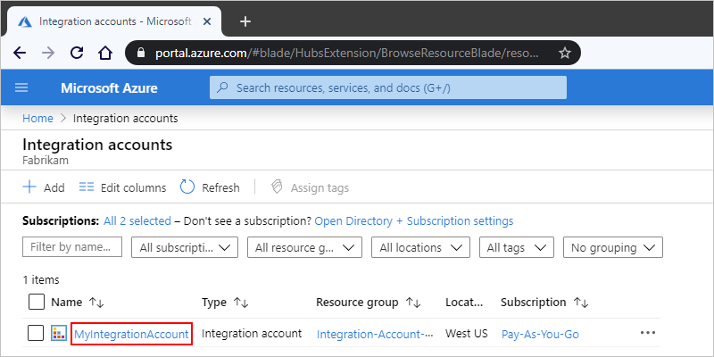

1. On your integration account's menu, under **Monitoring**, select **Diagnostic settings**. Select **Add diagnostic setting**.

   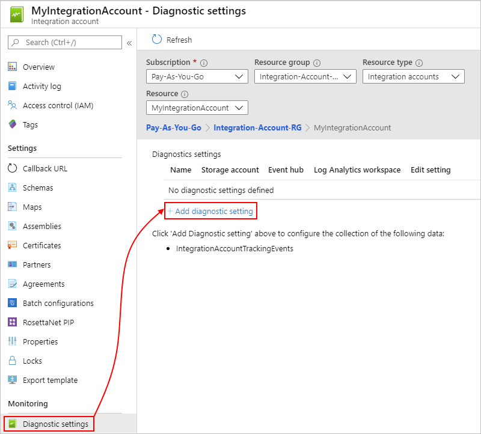

1. To create the setting, follow these steps:

   1. Provide a name for the setting.

   1. Select **Send to Log Analytics**.

   1. For **Subscription**, select the Azure subscription that's associated with your Log Analytics workspace.

   1. For **Log Analytics Workspace**, select the workspace that you want to use.

   1. Under **log**, select the **IntegrationAccountTrackingEvents** category, which specifies the event category that you want to record.

   1. When you're done, select **Save**.

   For example: 

   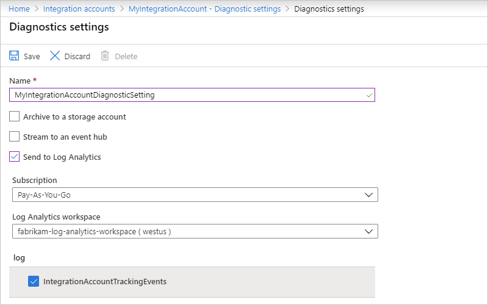

## View message status

After your logic app runs, you can view the status and data about those messages in your Log Analytics workspace.

1. In the [Azure portal](https://portal.azure.com) search box, find and open your Log Analytics workspace.

1. On your workspace's menu, select **Workspace summary** > **Logic Apps B2B**.

   

   > [!NOTE]
   > If the Logic Apps B2B tile doesn't immediately show results after a run, 
   > try selecting **Refresh** or wait for a short time before trying again.

   By default, the **Logic Apps B2B** tile shows data based on a single day. To change the data scope to a different interval, select the scope control at the top of the page:

   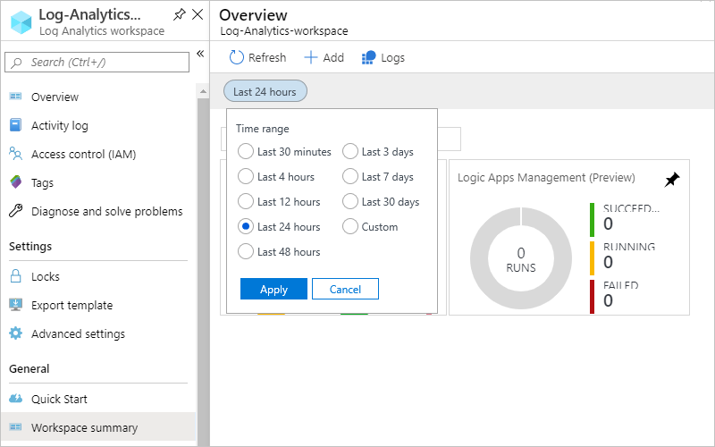

1. After the message status dashboard appears, you can view more details for a specific message type, which shows data based on a single day. Select the tile for **AS2**, **X12**, or **EDIFACT**.

   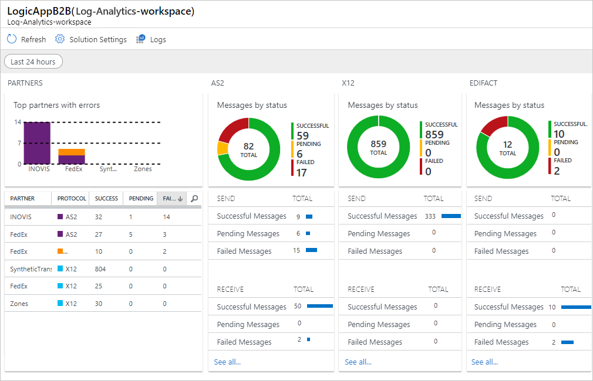

   A list of messages appears for your chosen tile. For example, here's what an AS2 message list might look like:

   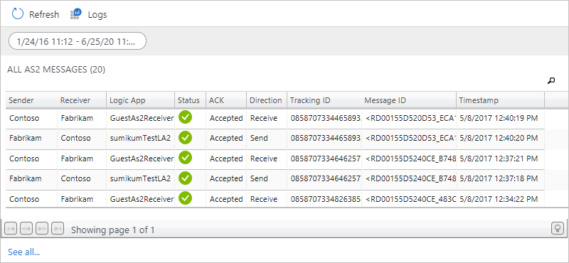

   To learn more about the properties for each message type, see these message property descriptions:

   * [AS2 message properties](#as2-message-properties)
   * [X12 message properties](#x12-message-properties)
   * [EDIFACT message properties](#EDIFACT-message-properties)

<!--
1. To view or export the inputs and outputs for specific messages, select those messages, and select **Download**. When you're prompted, save the .zip file to your local computer, and then extract that file.

   The extracted folder includes a folder for each selected message. If you set up acknowledgements, the message folder also includes files with acknowledgement details. Each message folder has at least these files:
   
   * Human-readable files with the input payload and output payload details
   * Encoded files with the inputs and outputs

   For each message type, you can find the folder and file name formats here:

   * [AS2 folder and file name formats](#as2-folder-file-names)
   * [X12 folder and file name formats](#x12-folder-file-names)
   * [EDIFACT folder and file name formats](#edifact-folder-file-names)

   

-->

<!-->
1. To view all actions that have the same run ID, on the **Log Search** page, select a message from the message list.

   You can sort these actions by column, or search for specific results.

   * To search results with prebuilt queries, select **Favorites**.

   * Learn [how to build queries by adding filters](logic-apps-track-b2b-messages-omsportal-query-filter-control-number.md). Or learn more about [how to find data with log searches in Azure Monitor logs](../log-analytics/log-analytics-log-searches.md).

   * To change query in the search box, update the query with the columns and values that you want to use as filters.
-->

## Supported tracking schemas

Azure supports these tracking schema types, which all have fixed schemas except the Custom type.

* [AS2 tracking schema](../logic-apps/logic-apps-track-integration-account-as2-tracking-schemas.md)
* [X12 tracking schema](../logic-apps/logic-apps-track-integration-account-x12-tracking-schema.md)
* [Custom tracking schema](../logic-apps/logic-apps-track-integration-account-custom-tracking-schema.md)

## Property descriptions and name formats for AS2, X12, and EDIFACT messages

For each message type, here are the property descriptions and name formats for downloaded message files.

### AS2 message property descriptions

Here are the property descriptions for each AS2 message.

| Property | Description |
|----------|-------------|
| **Sender** | The guest partner specified in **Receive Settings**, or the host partner specified in **Send Settings** for an AS2 agreement |
| **Receiver** | The host partner specified in **Receive Settings**, or the guest partner specified in **Send Settings** for an AS2 agreement |
| **Logic App** | The logic app where the AS2 actions are set up |
| **Status** | The AS2 message status  Success = Received or sent a valid AS2 message. No MDN is set up.  Success = Received or sent a valid AS2 message. MDN is set up and received, or MDN is sent.  Failed = Received an invalid AS2 message. No MDN is set up.  Pending = Received or sent a valid AS2 message. MDN is set up, and MDN is expected. |
| **ACK** | The MDN message status  Accepted = Received or sent a positive MDN.  Pending = Waiting to receive or send an MDN.  Rejected = Received or sent a negative MDN.  Not Required = MDN is not set up in the agreement. |
| **Direction** | The AS2 message direction |
| **Tracking ID** | The ID that correlates all the triggers and actions in a logic app |
| **Message ID** | The AS2 message ID from the AS2 message headers |
| **Timestamp** | The time when the AS2 action processed the message |
|||

<!--

### AS2 name formats for downloaded message files

Here are the name formats for each downloaded AS2 message folder and files.

| Folder or file | Name format |
|----------------|-------------|
| Message folder | [sender]\_[receiver]\_AS2\_[correlation-ID]\_[message-ID]\_[timestamp] |
| Input, output, and if set up, acknowledgement files | **Input payload**: [sender]\_[receiver]\_AS2\_[correlation-ID]\_input_payload.txt 
**Output payload**: [sender]\_[receiver]\_AS2\_[correlation-ID]\_output\_payload.txt 

**Inputs**: [sender]\_[receiver]\_AS2\_[correlation-ID]\_inputs.txt 

**Outputs**: [sender]\_[receiver]\_AS2\_[correlation-ID]\_outputs.txt |
|||
-->

### X12 message property descriptions

Here are the property descriptions for each X12 message.

| Property | Description |
|----------|-------------|
| **Sender** | The guest partner specified in **Receive Settings**, or the host partner specified in **Send Settings** for an X12 agreement |
| **Receiver** | The host partner specified in **Receive Settings**, or the guest partner specified in **Send Settings** for an X12 agreement |
| **Logic App** | The logic app where the X12 actions are set up |
| **Status** | The X12 message status  Success = Received or sent a valid X12 message. No functional ack is set up.  Success = Received or sent a valid X12 message. Functional ack is set up and received, or a functional ack is sent.  Failed = Received or sent an invalid X12 message.  Pending = Received or sent a valid X12 message. Functional ack is set up, and a functional ack is expected. |
| **ACK** | Functional Ack (997) status  Accepted = Received or sent a positive functional ack.  Rejected = Received or sent a negative functional ack.  Pending = Expecting a functional ack but not received.  Pending = Generated a functional ack but can't send to partner.  Not Required = Functional ack is not set up. |
| **Direction** | The X12 message direction |
| **Tracking ID** | The ID that correlates all the triggers and actions in a logic app |
| **Msg Type** | The EDI X12 message type |
| **ICN** | The Interchange Control Number for the X12 message |
| **TSCN** | The Transaction Set Control Number for the X12 message |
| **Timestamp** | The time when the X12 action processed the message |
|||

<!--

### X12 name formats for downloaded message files

Here are the name formats for each downloaded X12 message folder and files.

| Folder or file | Name format |
|----------------|-------------|
| Message folder | [sender]\_[receiver]\_X12\_[interchange-control-number]\_[global-control-number]\_[transaction-set-control-number]\_[timestamp] |
| Input, output, and if set up, acknowledgement files | **Input payload**: [sender]\_[receiver]\_X12\_[interchange-control-number]\_input_payload.txt 
**Output payload**: [sender]\_[receiver]\_X12\_[interchange-control-number]\_output\_payload.txt 

**Inputs**: [sender]\_[receiver]\_X12\_[interchange-control-number]\_inputs.txt 

**Outputs**: [sender]\_[receiver]\_X12\_[interchange-control-number]\_outputs.txt |
|||
-->

### EDIFACT message property descriptions

Here are the property descriptions for each EDIFACT message.

| Property | Description |
|----------|-------------|
| **Sender** | The guest partner specified in **Receive Settings**, or the host partner specified in **Send Settings** for an EDIFACT agreement |
| **Receiver** | The host partner specified in **Receive Settings**, or the guest partner specified in **Send Settings** for an EDIFACT agreement |
| **Logic App** | The logic app where the EDIFACT actions are set up |
| **Status** | The EDIFACT message status  Success = Received or sent a valid EDIFACT message. No functional ack is set up.  Success = Received or sent a valid EDIFACT message. Functional ack is set up and received, or a functional ack is sent.  Failed = Received or sent an invalid EDIFACT message  Pending = Received or sent a valid EDIFACT message. Functional ack is set up, and a functional ack is expected. |
| **ACK** | Functional Ack (CONTRL) status  Accepted = Received or sent a positive functional ack.  Rejected = Received or sent a negative functional ack.  Pending = Expecting a functional ack but not received.  Pending = Generated a functional ack but can't send to partner.  Not Required = Functional Ack is not set up. |
| **Direction** | The EDIFACT message direction |
| **Tracking ID** | The ID that correlates all the triggers and actions in a logic app |
| **Msg Type** | The EDIFACT message type |
| **ICN** | The Interchange Control Number for the EDIFACT message |
| **TSCN** | The Transaction Set Control Number for the EDIFACT message |
| **Timestamp** | The time when the EDIFACT action processed the message |
|||

<!--

### EDIFACT name formats for downloaded message files

Here are the name formats for each downloaded EDIFACT message folder and files.

| Folder or file | Name format |
|----------------|-------------|
| Message folder | [sender]\_[receiver]\_EDIFACT\_[interchange-control-number]\_[global-control-number]\_[transaction-set-control-number]\_[timestamp] |
| Input, output, and if set up, acknowledgement files | **Input payload**: [sender]\_[receiver]\_EDIFACT\_[interchange-control-number]\_input_payload.txt 
**Output payload**: [sender]\_[receiver]\_EDIFACT\_[interchange-control-number]\_output\_payload.txt 

**Inputs**: [sender]\_[receiver]\_EDIFACT\_[interchange-control-number]\_inputs.txt 

**Outputs**: [sender]\_[receiver]\_EDIFACT\_[interchange-control-number]\_outputs.txt |
|||
-->

## Next steps

* [Create tracking queries for B2B messages in Azure Monitor logs](../logic-apps/logic-apps-track-b2b-messages-omsportal-query-filter-control-number.md)
* [Learn more about the Enterprise Integration Pack](../logic-apps/logic-apps-enterprise-integration-overview.md)