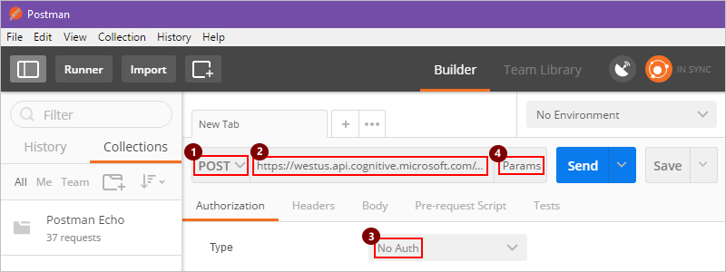
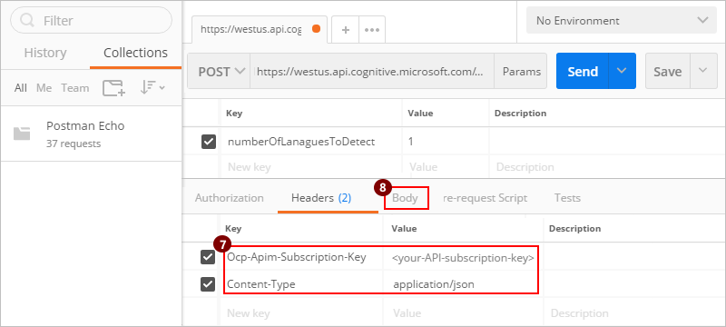
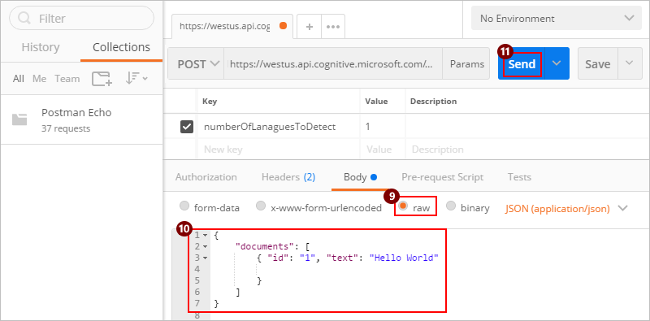

# Describe custom connectors with Postman for logic apps

[Postman](https://www.getpostman.com/) makes your API development faster and easier. 
This tutorial shows how to create a [Postman Collection](https://www.getpostman.com/docs/postman/collections/creating_collections) 
by using the Azure Cognitive Services [Text Analytics API](https://azure.microsoft.com/services/cognitive-services/text-analytics/) as our example. This API identifies the language, sentiment, and key phrases in the text that you pass to this API. You can then use your Postman collection to easily create [custom connectors](../logic-apps/logic-apps-register-custom-api-connector.md) 
for Azure Logic Apps.

## Prerequisites

* If you're new to Postman, 
[install the Postman app](https://www.getpostman.com/apps).

* A [Cogntive Services account]. Learn how to get started with 
the [Text Analytics APIs](../cognitive-services/text-analytics/quick-start.md).

## Create a Postman Collection

Postman collections help you organize and group related requests.

1. In the Postman app, [create an HTTP request for your API endpoint](https://www.getpostman.com/docs/postman/sending_api_requests/requests). 

   When you create this request, you can set the HTTP verb, 
   the request URL, query or path parameters, headers, and the body. 
   For more information, see the Postman documentation for [Requests](https://www.getpostman.com/docs/postman/sending_api_requests/requests).

   For example, to enter the endpoint for the Detect Language API, set these values:

   

   |Parameter|Value| 
   |:--------|:----| 
   |**HTTP verb**|POST| 
   |**Request URL**| https://westus.api.cognitive.microsoft.com/text/analytics/v2.0/languages| | 
   |**Authorization**|"No Auth"| | 
   ||| 

   

   |Parameter|Value| 
   |:--------|:----| 
   |**Params**|**Key**: "numberOfLanguagesToDetect" </br>**Value**: "1"| 
   ||| 

   

   |Parameter|Value| 
   |:--------|:----|    
   |**Headers**|**Key**: "Ocp-Apim-Subscription-Key", **Value**: *your-API-subscription-key*, which you can find in your Cognitive Services account </br>**Key**: "Content-Type", **Value**: "application/json"| 
   ||| 

   

   |Parameter|Value| 
   |:--------|:----|    
   |**Body**|```{"documents": [{ "id": "1", "text": "Hello World"}]}```| | 
   ||| 

2. To make the request and get the response back, choose **Send**.

3. To save the request to a Postman Collection, choose **Save**.

4. In the **Save Request** box, provide a **Request Name** 
and **Request description**. Later, you use these values for your custom connector.

5. 

