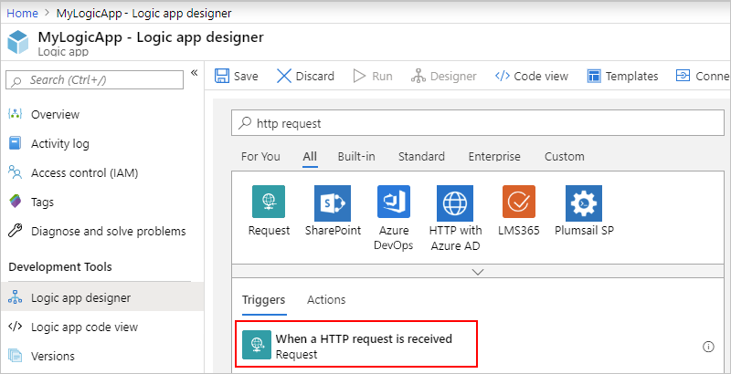
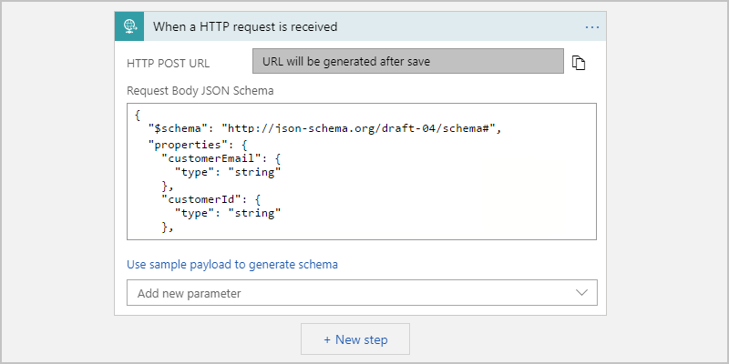
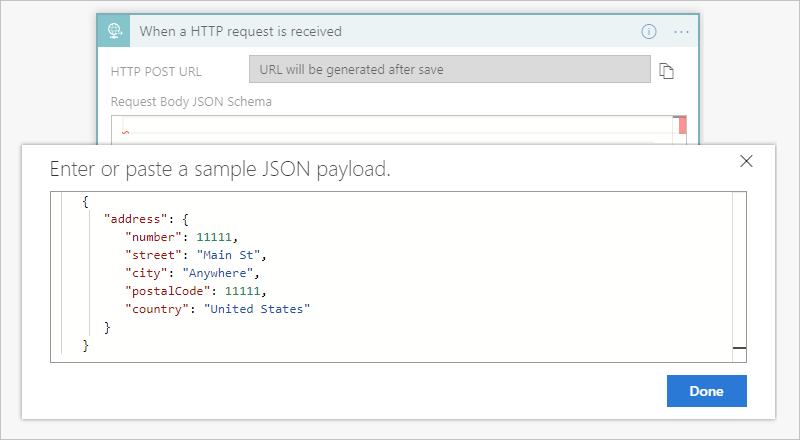
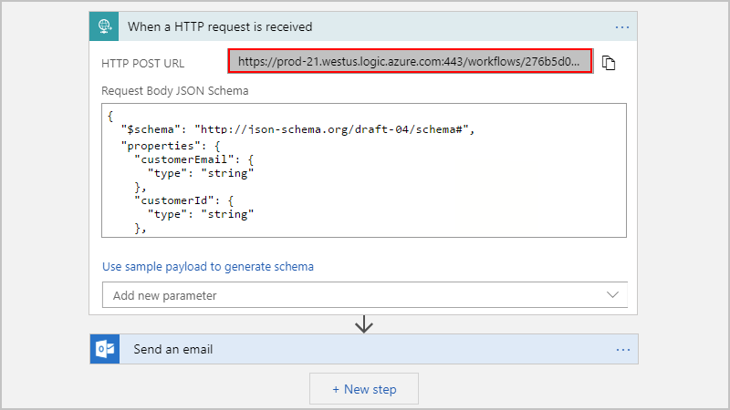
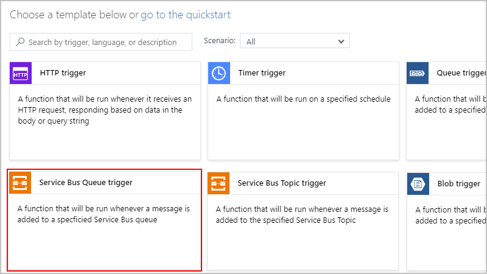
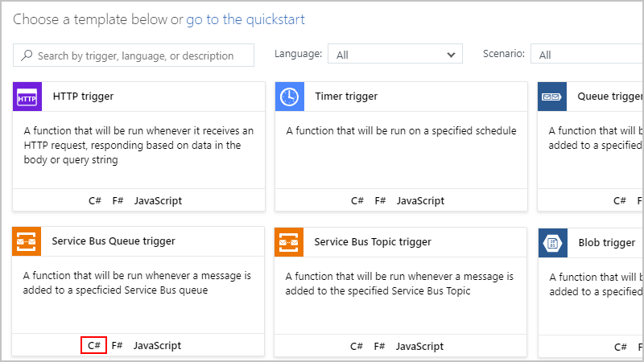

# Call or trigger logic apps by using Azure Functions and Azure Service Bus

You can use Azure Functions to trigger a logic app when you need to deploy a long-running listener or task. For example, you can create a function that listens in on a queue and immediately fires a logic app as a push trigger.

## Prerequisites

* An Azure subscription. If you don't have an Azure subscription, [sign up for a free Azure account](https://azure.microsoft.com/free/).

* An Azure function app, which is a container for Azure functions. If you don't have a function app, [create your function app first](../azure-functions/functions-create-first-azure-function.md), and make sure that you select .NET as the runtime stack.

* Basic knowledge about [how to create logic apps](../logic-apps/quickstart-create-first-logic-app-workflow.md)

## Create logic app

For this scenario, you have a function running each logic app that you want to trigger. First, create a logic app that starts with an HTTP request trigger. The function calls that endpoint whenever a queue message is received.  

1. Sign in to the [Azure portal](https://portal.azure.com), and create blank logic app.

   If you're new to logic apps, review [Quickstart: Create your first logic app](../logic-apps/quickstart-create-first-logic-app-workflow.md).

1. In the search box, enter "http request". From the triggers list, select this trigger: **When a HTTP request is received**

   

   With the Request trigger, you can optionally enter a JSON schema to use with the queue message. JSON schemas help the Logic App Designer understand the structure for the input data and makes outputs easier for you to select throughout the workflow.

1. To specify a schema, enter the schema in the **Request Body JSON Schema** box, for example:

   

   If you don't have a schema, but you have a sample payload in JSON format, you can generate a schema from that payload.

   1. In the Request trigger, choose **Use sample payload to generate schema**.

   1. Under **Enter or paste a sample JSON payload**, enter your sample payload, and then choose **Done**.

      

   This sample payload generates this schema that appears in the trigger:

   ```json
   {
      "type": "object",
      "properties": {
         "address": {
            "type": "object",
            "properties": {
               "number": {
                  "type": "integer"
               },
               "street": {
                  "type": "string"
               },
               "city": {
                  "type": "string"
               },
               "postalCode": {
                  "type": "integer"
               },
               "country": {
                  "type": "string"
               }
            }
         }
      }
   }
   ```

1. Add any other actions that you want to run after receiving the queue message.

   For example, you can send an email with the Office 365 Outlook connector.

1. Save your logic app, which generates the callback URL for the trigger in this logic app.

   The callback URL appears in the **HTTP POST URL** property.

   

## Create Azure function

Next, create the function that acts as the trigger and listens to the queue.

1. In the Azure portal, open and expand your function app, if not already open. 

1. Under your function app name, expand **Functions**. On the **Functions** pane, choose **New function**.

   

1. Select this template based on whether you created a new function app where you selected .NET as the runtime stack, or you're using an existing function app.

   * For new function apps, select this template: **Service Bus Queue trigger**

     

   * For an existing function app, select this template: **Service Bus Queue trigger - C#**

     

1. Provide a name for your trigger. Under **Azure Service Bus trigger**, configure the **Service Bus connection** for the Service Bus queue, which uses the Azure Service Bus SDK `OnMessageReceive()` listener, and choose **Create**.

1. Write a basic function to call the previously created logic app endpoint by using the queue message as a trigger. This example uses the `application/json` message content type, but you can change this type as necessary. If possible, reuse the instance of HTTP clients. For more information, see [Manage connections in Azure Functions](../azure-functions/manage-connections.md).

   ```CSharp
   using System;
   using System.Threading.Tasks;
   using System.Net.Http;
   using System.Text;

   private static string logicAppUri = @"https://prod-05.westus.logic.azure.com:443/.........";

   // Reuse the instance of HTTP clients if possible
   private static HttpClient httpClient = new HttpClient();

   public static void Run(string myQueueItem, TraceWriter log)
   {
       log.Info($"C# ServiceBus queue trigger function processed message: {myQueueItem}");

       var response = httpClient.PostAsync(logicAppUri, new StringContent(myQueueItem, Encoding.UTF8, "application/json")).Result;
   }
   ```

1. To test the function, add a queue message by using a tool such as the [Service Bus Explorer](https://github.com/paolosalvatori/ServiceBusExplorer).

   The logic app triggers immediately after the function receives the message.

## Next steps

[Call, trigger, or nest workflows by using HTTP endpoints](../logic-apps/logic-apps-http-endpoint.md)