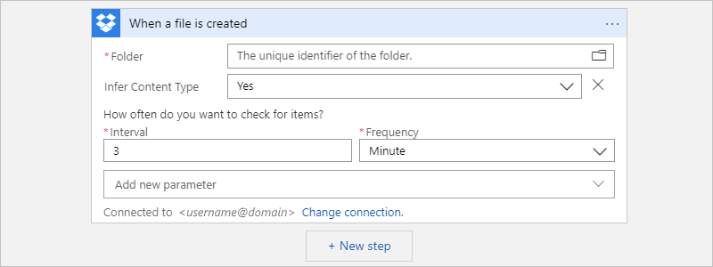
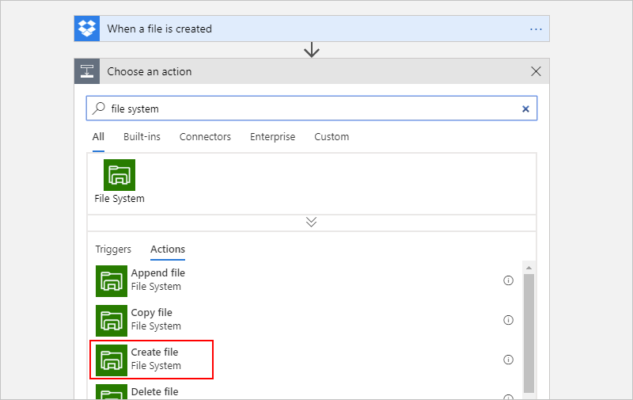
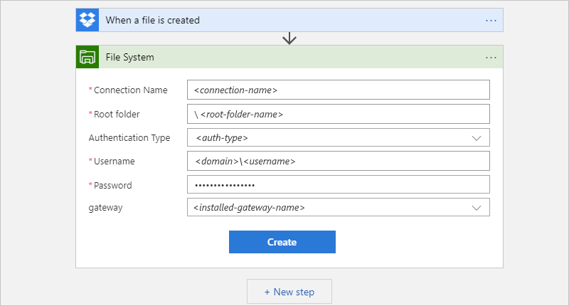
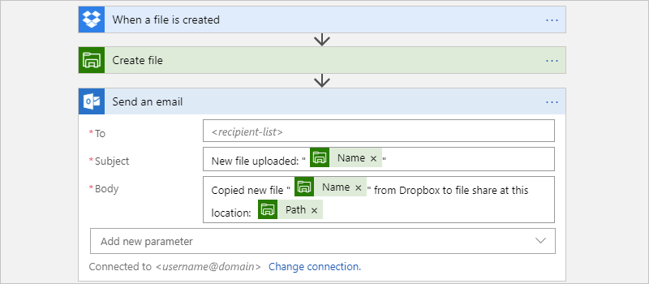

# Connect to on-premises file systems with Azure Logic Apps

With Azure Logic Apps and the File System connector, you can create automated tasks and workflows that create and manage files on an on-premises file share, for example:

- Create, get, append, update, and delete files.
- List files in folders or root folders.
- Get file content and metadata.

  > [!IMPORTANT]
  > The File System connector currently supports only Windows file system on a Windows machine.  

This article shows how you can connect to an on-premises file system as described by this example scenario: copy a file that's uploaded to Dropbox to a file share, and then send an email. To securely connect and access on-premises systems, logic apps use the [on-premises data gateway](../logic-apps/logic-apps-gateway-connection.md). If you're new to logic apps, review [What is Azure Logic Apps?](../logic-apps/logic-apps-overview.md). For connector-specific technical information, see the [File System connector reference](/connectors/filesystem/).

## Prerequisites

* An Azure subscription. If you don't have an Azure subscription, [sign up for a free Azure account](https://azure.microsoft.com/free/).

* Before you can connect logic apps to on-premises systems such as your file system server, you need to [install and set up an on-premises data gateway](../logic-apps/logic-apps-gateway-install.md). That way, you can specify to use your gateway installation when you create the file system connection from your logic app.

* A [Dropbox account](https://www.dropbox.com/), which you can sign up for free. Your account credentials are necessary for creating a connection between your logic app and your Dropbox account.

* Access to the computer that has the file system you want to use. For example, if you install the data gateway on the same computer as your file system, you need the account credentials for that computer.

* An email account from a provider that's supported by Logic Apps, such as Office 365 Outlook, Outlook.com, or Gmail. For other providers, [review the connectors list here](/connectors/). This logic app uses a work or school account. If you use another email account, the overall steps are the same, but your UI might slightly differ.

  > [!IMPORTANT]
  > If you want to use the Gmail connector, only G-Suite business accounts can use this connector without restriction in logic apps. 
  > If you have a Gmail consumer account, you can use this connector with only specific Google-approved services, or you can 
  > [create a Google client app to use for authentication with your Gmail connector](/connectors/gmail/#authentication-and-bring-your-own-application). 
  > For more information, see [Data security and privacy policies for Google connectors in Azure Logic Apps](../connectors/connectors-google-data-security-privacy-policy.md).

* Basic knowledge about [how to create logic apps](../logic-apps/quickstart-create-first-logic-app-workflow.md). For this example, you need a blank logic app.

## Add trigger

[!INCLUDE [Create connection general intro](../../includes/connectors-create-connection-general-intro.md)]

1. Sign in to the [Azure portal](https://portal.azure.com), and open your logic app in Logic App Designer, if not open already.

1. In the search box, enter "dropbox" as your filter. From the triggers list, select this trigger: **When a file is created**

   

1. Sign in with your Dropbox account credentials, and authorize access to your Dropbox data for Azure Logic Apps.

1. Provide the required information for your trigger.

   

## Add actions

1. Under the trigger, choose **Next step**. In the search box, enter "file system" as your filter. From the actions list, select this action: **Create file**

   

1. If you don't already have a connection to your file system, you're prompted to create a connection.

   

   | Property | Required | Value | Description |
   | -------- | -------- | ----- | ----------- |
   | **Connection Name** | Yes | <*connection-name*> | The name you want for your connection |
   | **Root folder** | Yes | <*root-folder-name*> | The root folder for your file system, for example, if you installed your on-premises data gateway  such as a local folder on the computer where the on-premises data gateway is installed, or the folder for a network share that the computer can access. 
For example: `\\PublicShare\\DropboxFiles` 
The root folder is the main parent folder, which is used for relative paths for all file-related actions. |
   | **Authentication Type** | No | <*auth-type*> | The type of authentication that your file system uses: **Windows** |
   | **Username** | Yes | <*domain*>\\<*username*> 
-or- 
<*local-computer*>\\<*username*> | The username for the computer where you have your file system folder. 
If your file system folder is on the same computer as the on-premises data gateway, you can use <*local-computer*>\\<*username*>. |
   | **Password** | Yes | <*your-password*> | The password for the computer where you have your file system |
   | **gateway** | Yes | <*installed-gateway-name*> | The name for your previously installed gateway |
   |||||

1. When you're done, choose **Create**.

   Logic Apps configures and tests your connection, making sure that the connection works properly. If the connection is set up correctly, options appear for the action that you previously selected.

1. In the **Create file** action, provide the details for copying files from Dropbox to the root folder in your on-premises file share. To add outputs from previous steps, click inside the boxes, and select from available fields when the dynamic content list appears.

   

1. Now, add an Outlook action that sends an email so the appropriate users know about the new file. Enter the recipients, title, and body of the email. For testing, you can use your own email address.

   

1. Save your logic app. Test your app by uploading a file to Dropbox.

   Your logic app should copy the file to your on-premises file share, and send the recipients an email about the copied file.

## Connector reference

For more technical details about this connector, such as triggers, actions, and limits as described by the connector's Swagger file, see the [connector's reference page](/connectors/fileconnector/).

> [!NOTE]
> For logic apps in an [integration service environment (ISE)](../logic-apps/connect-virtual-network-vnet-isolated-environment-overview.md), 
> this connector's ISE-labeled version uses the [ISE message limits](../logic-apps/logic-apps-limits-and-config.md#message-size-limits) instead.

## Next steps

* Learn how to [connect to on-premises data](../logic-apps/logic-apps-gateway-connection.md) 
* Learn about other [Logic Apps connectors](../connectors/apis-list.md)
