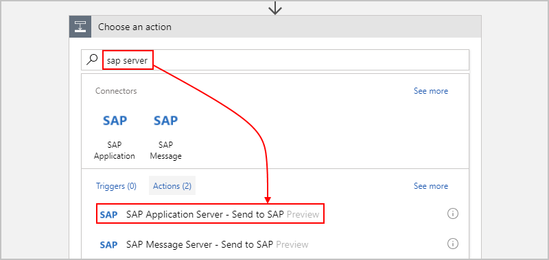
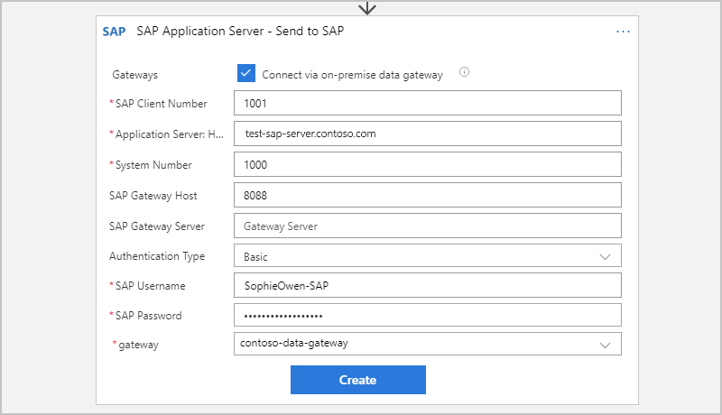

---
# required metadata
title: Connect to SAP systems - Azure Logic Apps | Microsoft Docs
description: Learn how you can access SAP data and resources by creating automated workflows with Azure Logic Apps
author: divyaswarnkar
manager: cfowler
ms.author: divswa
ms.date: 05/27/2018
ms.topic: article
ms.service: logic-apps
services: logic-apps

# optional metadata
ms.reviewer: klam, daviburg, LADocs
ms.suite: integration
tags: connectors
---

# Manage data and resources in SAP on-premises systems by automating workflows in Azure Logic Apps

This article shows how you can access data and resources 
in on-premises SAP systems from inside a logic app by using 
the connectors for SAP Application Server and SAP Message Server. 
That way, you can create logic apps that automate tasks and 
workflows for managing data and resources in your SAP systems. 

This example connects to an SAP server from a logic app, 
sends an HTTP request for an Intermediate Document (IDOC), 
and returns an HTTP response to the server. The SAP connectors 
have actions, but not triggers. So, this example uses an HTTP 
request trigger as the first step in the logic app's workflow. 
For connector-specific technical information, see these articles: 

* <a href="https://docs.microsoft.com/connectors/sapapplicationserver/" target="blank">SAP Application Server connector reference</a>
* <a href="https://docs.microsoft.com/connectors/sapmessageserver/" target="blank">SAP Message Server connector reference</a>

If you don't have an Azure subscription yet, 
<a href="https://azure.microsoft.com/free/" target="_blank">sign up for a free Azure account</a>. 

## Prerequisites

* The logic app where you want to access your SAP system 
and a trigger that starts your logic app's workflow. 
Currently, the SAP connectors provide only actions. 

  If you're new to logic apps, review 
  [What is Azure Logic Apps](../logic-apps/logic-apps-overview.md) and 
  [Quickstart: Create your first logic app](../logic-apps/quickstart-create-first-logic-app-workflow.md).

* Your <a href="https://wiki.scn.sap.com/wiki/display/ABAP/ABAP+Application+Server" target="_blank">SAP Application Server</a> 
or <a href="https://help.sap.com/saphelp_nw70/helpdata/en/40/c235c15ab7468bb31599cc759179ef/frameset.htm" target="_blank">SAP Message Server</a>

* Download and install the latest 
[on-premises data gateway](https://www.microsoft.com/download/details.aspx?id=53127) 
on any on-premises computer. You must also set up your gateway in the 
Azure portal before you can continue. 

  The gateway helps you securely access data and 
  resources are on premises. For more information, see 
  [Install on-premises data gateway for Azure Logic Apps](../logic-apps/logic-apps/logic-apps-gateway-install.md).

* Download and install the latest SAP client library, which is currently 
<a href="https://softwaredownloads.sap.com/file/0020000000086282018" target="_blank">SAP Connector (NCo) 3.0.20.0 for Microsoft .NET Framework 4.0 and Windows 64bit (x64)</a>. 
Install this SAP NCo on the same computer where you installed the on-premises data gateway. 

  * Make sure you install at least SAP NCo 3.0.20.0. 
  Earlier SAP NCo versions can become deadlocked when 
  more than one IDoc messages are sent at the same time. 
  This condition blocks all later messages that are sent 
  to the SAP destination, causing the messages to time out.

  * Make sure you select the SAP NCo for Windows 64-bit. 
  The on-premises data gateway runs only on 64-bit systems. 
  Otherwise, you get an "bad image" error because the data 
  gateway host service doesn't support 32-bit assemblies.

  * Make sure you select the SAP NCo for .NET Framework 4.0. 
  Both the data gateway host service and the Microsoft SAP 
  adapter use .NET Framework 4.5. 
  
    The SAP NCo for .NET Framework 4.0 works with processes 
    that use .NET runtime 4.0 to 4.7.1, while the SAP 
    NCo for .NET Framework 2.0 works with processes 
    that use .NET runtime 2.0 to 3.5 and no longer 
    works with the latest on-premises data gateway.

## Add HTTP request trigger

In Azure Logic Apps, every logic app must start with a 
[trigger](../logic-apps/logic-apps-overview.md#logic-app-concepts), 
which fires when a specific event happens or when a 
specific condition is met. Each time the trigger fires, 
the Logic Apps engine creates a logic app instance 
and starts running your app's workflow.

In this example, you create a logic app with an endpoint in 
Azure so that you can send *POST requests* to your logic app. 
When your logic app receives these HTTP requests, 
the trigger fires and runs the next step in your workflow.

1. In the Azure portal or Visual Studio, 
open your logic app in Logic App Designer. 
This example uses the Azure portal.

2. In the search box, enter "HTTP request" as your filter. 
From the triggers list, select this trigger: 
**Request - When a HTTP request is received**

   

3. Now save your logic app so you can generate a HTTP POST URL for your endpoint.
On the designer toolbar, choose **Save**. 

   The URL now appears in your trigger, for example:

   

## Add SAP action

In Azure Logic Apps, an [action](../logic-apps/logic-apps-overview.md#logic-app-concepts) 
is a step in your workflow that follows a trigger or another action. 
If you haven't added a trigger to your logic app yet and want to follow 
this example, [add the trigger described in this section](#add-trigger).

1. In the Azure portal or Visual Studio, 
open your logic app in Logic App Designer. 
This example uses the Azure portal.

2. In the Logic App Designer, under the trigger, 
choose **New step** > **Add an action**.

    

   To add an action between existing steps, 
   move your mouse over the connecting arrow. 
   Choose the plus sign (**+**) that appears, 
   and then choose **Add an action**.

3. In the search box, enter "sap server" as your filter. 
From the actions list, select the action for your SAP server: 

   * **SAP Application Server - Send to SAP**
   * **SAP Message Server - Send to SAP**

   This example uses this action: 
   **SAP Application Server - Send to SAP**

   

4. If you're prompted for connection details, 
create your SAP connection now. 
Otherwise, if your connection already exists, 
continue with the next step so you can provide 
the necessary information for your SAP action. 

   **Create on-premises SAP connection**

   1. For **Gateways**, select **Connect via on-premise data gateway** 
   so that the on-premises connection properties appear.

   2. Provide the connection information for your SAP server:

      **SAP Application Server**

      | Property | Required | Value | Description | 
      |----------|----------|-------|-------------| 
      | SAP Client Number | Yes | | | 
      | Application Server Host Address | Yes | | | 
      | System Number | Yes | | | 
      | SAP Gateway Host| No | | | 
      | SAP Gateway Server | No | | | 
      | Authentication Type | Yes | Basic | The authentication type that your server uses, which defaults to Basic | 
      | SAP Username | Yes | | | 
      | SAP Password | Yes | | | 
      | gateway | Yes | <*data-gateway*> | Select the gateway you created in the Azure portal. | 
      ||||| 

        

      **SAP Message Server**

      | Property | Required | Value | Description | 
      |----------|----------|-------|-------------| 
      | SAP Client Number | Yes | | | 
      | Host Address | Yes | | | 
      | R3 System Name | Yes | | | 
      | Message Server Group | No | | | 
      | Message Server Service | No | | | 
      | Authentication Type | Yes | Basic | The authentication type that your server uses, which defaults to Basic | 
      | SAP Username | Yes | | | 
      | SAP Password | Yes | | | 
      | gateway | Yes | <*data-gateway*> | Select the gateway you created in the Azure portal. | 
      ||||| 

       

   2. When you're done, choose **Create**.

      Logic Apps sets up and tests your connection, 
      making sure that the connection works properly.

5. Now add the action that sends the request for an IDOC to your SAP server: 

   1. In the **SAP action** box, choose the folder icon. 
   From the folder list, select **IDOC** so you can find 
   and select the IDOC. 

      

      The file list might not show all available fields. 
      If this scenario happens, you can manually enter a path, 
      for example:

      

   2. In the **Input Message** box, select the HTTP request **Body** field. 

      

      This step sends the message output from the 
      HTTP request trigger to your SAP server.

6. Save your logic app. On the designer toolbar, choose **Save**.

## Add HTTP response action

Now add an action so that your logic app resonds with the IDOC 
that you requested. 

1. Under the SAP action, add an action that sends an HTTP 
response that includes the **Body** output from the SAP action.

2. Save your logic app. 

3. To test your logic app, send an HTTP POST request to the URL 
that you created in the HTTP request trigger. 

After you send the IDOC, wait for a response from your logic app.

> [!NOTE]
> Your logic app might time out if all the steps 
> required for the response don't finish within the 
> [request timeout limit](./logic-apps-limits-and-config.md). 
> If this condition happens, requests might get blocked. 
> 
> To help you diagnose problems, learn how you can 
> [check and monitor your logic apps](../logic-apps/logic-apps-monitor-your-logic-apps.md).

Congratulations, you've now created a logic app that communicates 
and retrieves data from your SAP server. Now that you've set up 
an SAP connection for your logic app, you can explore other 
available file paths, such as BAPI, RFC, and TRFC.

## Connector reference

For technical details about the connector 
as described by the connectors' Swagger files, 
see these reference pages: 

* [SAP Application Server](/connectors/sapapplicationserver/)
* [SAP Message Server](/connectors/sapmessageserver/)

## Get support

* For questions, visit the [Azure Logic Apps forum](https://social.msdn.microsoft.com/Forums/en-US/home?forum=azurelogicapps).
* To submit or vote on feature ideas, visit the [Logic Apps user feedback site](http://aka.ms/logicapps-wish).

## Next steps

- Learn how to validate, transform, and other BizTalk-like functions in the [Enterprise Integration Pack](../logic-apps/logic-apps-enterprise-integration-overview.md). 
- 

## Next steps

* [Connect to on-premises systems](../logic-apps/logic-apps-gateway-connection.md) from logic apps
* Learn about other [Logic Apps connectors](../connectors/apis-list.md)
