# Connect to SAP systems from Azure Logic Apps

This article shows how you can access your on-premises SAP resources from inside a logic app by using the SAP connector. The connector works with SAP's classic releases such as R/3 and ECC systems on-premises. The connector also enables integration with SAP's newer HANA-based SAP systems, such as S/4 HANA, whether they're hosted on-premises or in the cloud. The SAP connector supports message or data integration to and from SAP NetWeaver-based systems through Intermediate Document (IDoc), Business Application Programming Interface (BAPI), or Remote Function Call (RFC).

The SAP connector uses the [SAP .NET Connector (NCo) library](https://support.sap.com/en/product/connectors/msnet.html) and provides these operations or actions:

* **Send to SAP**: Send IDoc over tRFC, call BAPI functions over RFC, or call RFC/tRFC in SAP systems.
* **Receive from SAP**: Receive IDoc over tRFC, call BAPI functions over tRFC, or call RFC/tRFC in SAP systems.
* **Generate schemas**: Generate schemas for the SAP artifacts for IDoc, BAPI, or RFC.

For these operations, the SAP connector supports basic authentication through usernames and passwords. The connector also supports [Secure Network Communications (SNC)](https://help.sap.com/doc/saphelp_nw70/7.0.31/e6/56f466e99a11d1a5b00000e835363f/content.htm?no_cache=true). SNC can be used for SAP NetWeaver single sign-on (SSO) or for additional security capabilities provided by an external security product.

The SAP connector integrates with on-premises SAP systems through the [on-premises data gateway](../logic-apps/logic-apps-gateway-connection.md). In send scenarios, for example, when a message is sent from a logic app to an SAP system, the data gateway acts as an RFC client and forwards the requests received from the logic app to SAP. Likewise, in receive scenarios, the data gateway acts as an RFC server that receives requests from SAP and forwards them to the logic app.

This article shows how to create example logic apps that integrate with SAP while covering the previously described integration scenarios.

<a name="pre-reqs"></a>

## Prerequisites

To follow along with this article, you need these items:

* An Azure subscription. If you don't have an Azure subscription yet, [sign up for a free Azure account](https://azure.microsoft.com/free/).

* The logic app from where you want to access your SAP system and a trigger that starts your logic app's workflow. If you're new to logic apps, see [What is Azure Logic Apps?](../logic-apps/logic-apps-overview.md) and [Quickstart: Create your first logic app](../logic-apps/quickstart-create-first-logic-app-workflow.md).

* Your [SAP application server](https://wiki.scn.sap.com/wiki/display/ABAP/ABAP+Application+Server) or [SAP message server](https://help.sap.com/saphelp_nw70/helpdata/en/40/c235c15ab7468bb31599cc759179ef/frameset.htm).

* Download and install the latest [on-premises data gateway](https://www.microsoft.com/download/details.aspx?id=53127) on any on-premises computer. Make sure you set up your gateway in the Azure portal before you continue. The gateway helps you securely access on-premises data and resources. For more information, see [Install an on-premises data gateway for Azure Logic Apps](../logic-apps/logic-apps-gateway-install.md).

* If you use SNC with SSO, make sure the gateway is running as a user that's mapped against the SAP user. To change the default account, select **Change account**, and enter the user credentials.

  

* If you enable SNC with an external security product, copy the SNC library or files on the same machine where the gateway is installed. Some examples of SNC products include [sapseculib](https://help.sap.com/saphelp_nw74/helpdata/en/7a/0755dc6ef84f76890a77ad6eb13b13/frameset.htm), Kerberos, and NTLM.

* Download and install the latest SAP client library, which is currently [SAP Connector (NCo 3.0) for Microsoft .NET 3.0.22.0 compiled with .NET Framework 4.0  - Windows 64-bit (x64)](https://softwaredownloads.sap.com/file/0020000001000932019), on the same computer as the on-premises data gateway. Install this version or later for these reasons:

  * Earlier SAP NCo versions might become deadlocked when more than one IDoc message is sent at the same time. This condition blocks all later messages that are sent to the SAP destination, which causes the messages to time out.
  
  * The on-premises data gateway runs only on 64-bit systems. Otherwise, you get a "bad image" error because the data gateway host service doesn't support 32-bit assemblies.
  
  * Both the data gateway host service and the Microsoft SAP Adapter use .NET Framework 4.5. The SAP NCo for .NET Framework 4.0 works with processes that use .NET runtime 4.0 to 4.7.1. The SAP NCo for .NET Framework 2.0 works with processes that use .NET runtime 2.0 to 3.5, but no longer works with the latest on-premises data gateway.

* Message content you can send to your SAP server, such as a sample IDoc file, must be in XML format and include the namespace for the SAP action you want to use.

<a name="add-trigger"></a>

## Send to SAP

This example uses a logic app that you can trigger with an HTTP request. The logic app sends an IDoc to an SAP server and returns a response to the requestor that called the logic app. 

### Add an HTTP Request trigger

In Azure Logic Apps, every logic app must start with a [trigger](../logic-apps/logic-apps-overview.md#logic-app-concepts), which fires when a specific event happens or when a specific condition is met. Each time the trigger fires, the Logic Apps engine creates a logic app instance and starts running your app's workflow.

In this example, you create a logic app with an endpoint in Azure so that you can send *HTTP POST requests* to your logic app. When your logic app receives these HTTP requests, the trigger fires and runs the next step in your workflow.

1. In the [Azure portal](https://portal.azure.com), create a blank logic app, which opens the Logic App Designer.

1. In the search box, enter "http request" as your filter. From the **Triggers** list, select **When a HTTP request is received**.

   

1. Now save your logic app so that you can generate an endpoint URL for your logic app. On the designer toolbar, select **Save**.

   The endpoint URL now appears in your trigger, for example:

   

<a name="add-action"></a>

### Add an SAP action

In Azure Logic Apps, an [action](../logic-apps/logic-apps-overview.md#logic-app-concepts) is a step in your workflow that follows a trigger or another action. If you haven't added a trigger to your logic app yet and want to follow this example, [add the trigger described in this section](#add-trigger).

1. In the Logic App Designer, under the trigger, select **New step**.

   

1. In the search box, enter "sap" as your filter. From the **Actions** list, select **Send message to SAP**.
  
   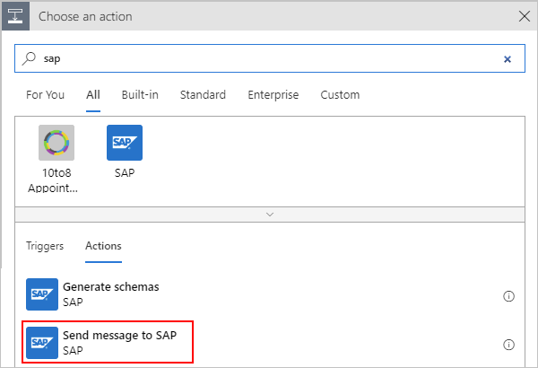

   Or instead of searching, choose the **Enterprise** tab, and select the SAP action.

   

1. If you're prompted for connection details, create your SAP connection now. Otherwise, if your connection already exists, continue with the next step so that you can set up your SAP action.

   **Create an on-premises SAP connection**

    1. Provide the connection information for your SAP server. For the **Data Gateway** property, select the data gateway you created in the Azure portal for your gateway installation.

         - If the **Logon Type** property is set to **Application Server**, these properties, which usually appear optional, are required:

            

         - If the **Logon Type** property is set to **Group**, these properties, which usually appear optional, are required:

            

           By default, strong typing is used to check for invalid values by performing XML validation against the schema. This behavior can help you detect issues earlier. The **Safe Typing** option is available for backward compatibility and only checks the string length. Learn more about the [Safe Typing option](#safe-typing).

    1. When you're finished, select **Create**.

       Logic Apps sets up and tests your connection to make sure that the connection works properly.

1. Now find and select an action from your SAP server.

    1. In the **SAP Action** box, select the folder icon. From the file list, find and select the SAP message you want to use. To navigate the list, use the arrows.

       This example selects an IDoc with the **Orders** type.

       

       If you can't find the action you want, you can manually enter a path, for example:

       

       > [!TIP]
       > Provide the value for **SAP Action** through the expression editor. 
       > That way, you can use the same action for different message types.

       For more information about IDoc operations, see [Message schemas for IDOC operations](https://docs.microsoft.com/biztalk/adapters-and-accelerators/adapter-sap/message-schemas-for-idoc-operations).

    1. Click inside the **Input Message** box so that the dynamic content list appears. From that list, under **When a HTTP request is received**, select the **Body** field.

       This step includes the body content from your HTTP Request trigger and sends that output to your SAP server.

       

       When you're finished, your SAP action looks like this example:

       

1. Save your logic app. On the designer toolbar, select **Save**.

<a name="add-response"></a>

### Add an HTTP response action

Now add a response action to your logic app's workflow and include the output from the SAP action. That way, your logic app returns the results from your SAP server to the original requestor.

1. In the Logic App Designer, under the SAP action, select **New step**.

1. In the search box, enter "response" as your filter. From the **Actions** list, select **Response**.

1. Click inside the **Body** box so that the dynamic content list appears. From that list, under **Send message to SAP**, select the **Body** field.

   

1. Save your logic app.

### Test your logic app

1. If your logic app isn't already enabled, on your logic app menu, select **Overview**. On the toolbar, select **Enable**.

1. On the designer toolbar, select **Run**. This step manually starts your logic app.

1. Trigger your logic app by sending an HTTP POST request to the URL in your HTTP Request trigger.
Include your message content with your request. To the send the request, you can use a tool such as [Postman](https://www.getpostman.com/apps).

   For this article, the request sends an IDoc file, which must be in XML format and include the namespace for the SAP action you're using, for example:

   ``` xml
   <?xml version="1.0" encoding="UTF-8" ?>
   <Send xmlns="http://Microsoft.LobServices.Sap/2007/03/Idoc/2/ORDERS05//720/Send">
      <idocData>
         <...>
      </idocData>
   </Send>
   ```

1. After you send your HTTP request, wait for the response from your logic app.

   > [!NOTE]
   > Your logic app might time out if all the steps 
   > required for the response don't finish within the 
   > [request timeout limit](./logic-apps-limits-and-config.md). 
   > If this condition happens, requests might get blocked. 
   > To help you diagnose problems, learn how you can 
   > [check and monitor your logic apps](../logic-apps/logic-apps-monitor-your-logic-apps.md).

You've now created a logic app that can communicate with your SAP server. Now that you've set up an SAP connection for your logic app, you can explore other available SAP actions, such as BAPI and RFC.

## Receive from SAP

This example uses a logic app that triggers when the app receives a message from an SAP system.

### Add an SAP trigger

1. In the Azure portal, create a blank logic app, which opens the Logic App Designer.

1. In the search box, enter "sap" as your filter. From the **Triggers** list, select **When a message is received from SAP**.

   

   Or, you can go to the **Enterprise** tab, and select the trigger:

   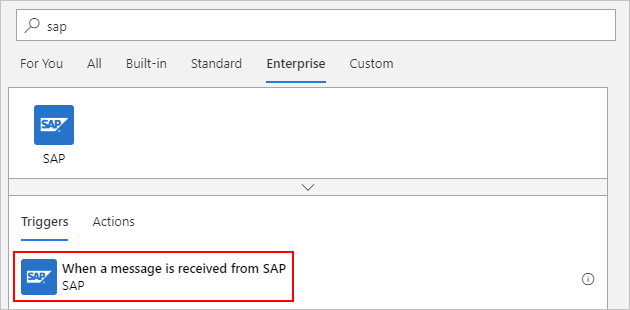

1. If you're prompted for connection details, create your SAP connection now. If your connection already exists, continue with the next step so you can set up your SAP action.

   **Create an on-premises SAP connection**

   - Provide the connection information for your SAP server. For the **Data Gateway** property, select the data gateway you created in the Azure portal for your gateway installation.

      - If the **Logon Type** property is set to **Application Server**, these properties, which usually appear optional, are required:

         

      - If the **Logon Type** property is set to **Group**, these properties, which usually appear optional, are required:

            

      By default, strong typing is used to check for invalid values by performing XML validation against the schema. This behavior can help you detect issues earlier. The **Safe Typing** option is available for backward compatibility and only checks the string length. Learn more about the [Safe Typing option](#safe-typing).

1. Provide the required parameters based on your SAP system configuration.

   You can optionally provide one or more SAP actions. This list of actions specifies the messages that the trigger receives from your SAP server through the data gateway. An empty list specifies that the trigger receives all messages. If the list has more than one message, the trigger receives only the messages specified in the list. Any other messages sent from your SAP server are rejected by the gateway.

   You can select an SAP action from the file picker:

     

   Or you can manually specify an action:

    

   Here's an example that shows how the action appears when you set up the trigger to receive more than one message.

   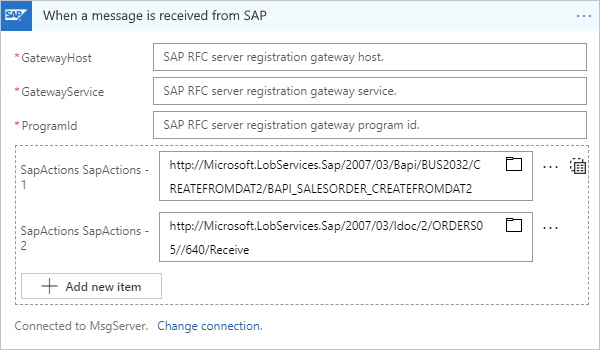  

   For more information about the SAP action, see [Message schemas for IDOC operations](https://docs.microsoft.com/biztalk/adapters-and-accelerators/adapter-sap/message-schemas-for-idoc-operations)

1. Now save your logic app so you can start receiving messages from your SAP system.
On the designer toolbar, select **Save**.

Your logic app is now ready to receive messages from your SAP system.

> [!NOTE]
> The SAP trigger isn't a polling trigger 
> but is a webhook-based trigger instead. 
> The trigger is called from the gateway 
> only when a message exists, so no polling is necessary.

### Test your logic app

1. To trigger your logic app, send a message from your SAP system.

1. On the logic app menu, select **Overview**. Review the **Runs history** for any new runs for your logic app.

1. Open the most recent run, which shows the message sent from your SAP system in the trigger outputs section.

## Receive packet of IDOCs from SAP
SAP can be configured to <a href="https://help.sap.com/viewer/8f3819b0c24149b5959ab31070b64058/7.4.16/en-US/4ab38886549a6d8ce10000000a42189c.html"> send IDOCs in packets </a>, which is a batch or group of IDOCs. SAP connector and specifically trigger does not require any extra configuration to receive IDOC packets. However, once the trigger receives them, to process each item in the IDOC packet, some additional steps are required to split them into individual IDOCs. In the below example, we are using [xpath function](./workflow-definition-language-functions-reference.md#xpath) to extract the individual IDOCs from the packet. 

1. Before you start, you need a Logic App with SAP trigger. If you do not have it already, follow the steps mentioned earlier in this document to set up [Logic App with SAP trigger.](./logic-apps-using-sap-connector.md#receive-from-sap). Here's an example of Logic App with SAP trigger

   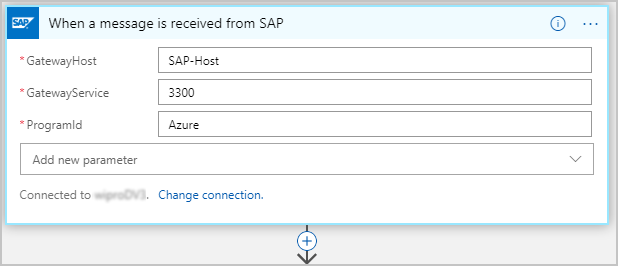


2. Capture the root namespace from the XML IDOC received from SAP. We are going to use xpath expression to extract the value from XML document and store it in a local variable.

   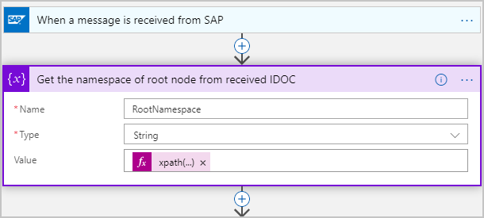

   Here is the xpath expression used in the above step

   ```
   xpath(xml(triggerBody()?['Content']), 'namespace-uri(/*)')
   ```

3. In this step, we use another xpath expression to extract individual IDOC and store the collection in an array.

   

   Here is the xpath expression used in the above step

   ```
   xpath(xml(triggerBody()?['Content']), '/*[local-name()="Receive"]/*[local-name()="idocData"]')
   ``` 

4. Each IDOC is now available in the array variable and can be processed individually by enumerating over the collection. In this case, for example, each IDOC is transferred to the SFTP server. 

   

   Each IDOC item needs to be updated to include root namespace. This is why the file content is wrapped in *Receive* element along with root namespace before sending the IDOC to the downstream application, SFTP server in this case.

5. We have also published template for this pattern, which can be chosen from Logic Apps designer when you create a new Logic App. 

   

## Generate schemas for artifacts in SAP

This example uses a logic app that you can trigger with an HTTP request. The SAP action sends a request to an SAP system to generate the schemas for specified IDoc and BAPI. Schemas that return in the response are uploaded to an integration account by using the Azure Resource Manager connector.

### Add an HTTP Request trigger

1. In the Azure portal, create a blank logic app, which opens the Logic App Designer.

1. In the search box, enter "http request" as your filter. From the **Triggers** list, select **When a HTTP request is received**.

   

1. Now save your logic app so you can generate an endpoint URL for your logic app.
On the designer toolbar, select **Save**.

   The endpoint URL now appears in your trigger, for example:

   

### Add an SAP action to generate schemas

1. In the Logic App Designer, under the trigger, select **New step**.

   

1. In the search box, enter "sap" as your filter. From the **Actions** list, select **Generate schemas**.
  
   

   Or, you also can choose the **Enterprise** tab, and select the SAP action.

   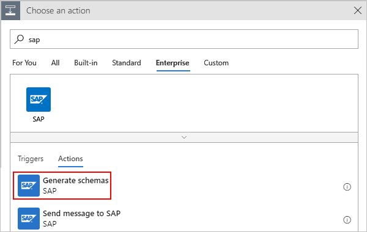

1. If you're prompted for connection details, create your SAP connection now. If your connection already exists, continue with the next step so you can set up your SAP action.

   **Create an on-premises SAP connection**

   1. Provide the connection information for your SAP server. For the **Data Gateway** property, select the data gateway you created in the Azure portal for your gateway installation.

      - If the **Logon Type** property is set to **Application Server**, these properties, which usually appear optional, are required:

        

      - If the **Logon Type** property is set to **Group**, these properties, which usually appear optional, are required:

        

      By default, strong typing is used to check for invalid values by performing XML validation against the schema. This behavior can help you detect issues earlier. The **Safe Typing** option is available for backward compatibility and only checks the string length. Learn more about the [Safe Typing option](#safe-typing).

   1. When you're finished, select **Create**. 
   
      Logic Apps sets up and tests your connection to make sure that the connection works properly.

1. Provide the path to the artifact for which you want to generate the schema.

   You can select the SAP action from the file picker:

   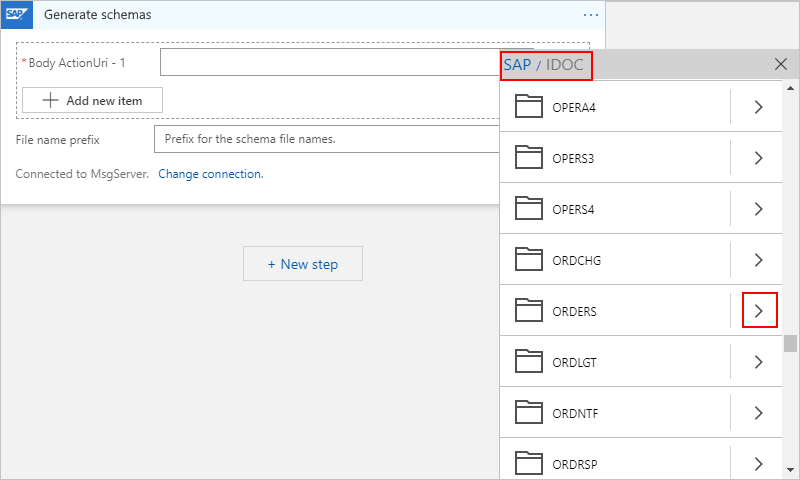  

   Or, you can manually enter the action:

   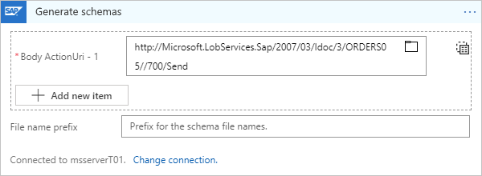

   To generate schemas for more than one artifact, provide the SAP action details for each artifact, for example:

   

   

   For more information about the SAP action, see [Message schemas for IDOC operations](https://docs.microsoft.com/biztalk/adapters-and-accelerators/adapter-sap/message-schemas-for-idoc-operations).

1. Save your logic app. On the designer toolbar, select **Save**.

### Test your logic app

1. On the designer toolbar, select **Run** to trigger a run for your logic app.

1. Open the run, and check the outputs for the **Generate schemas** action.

   The outputs show the generated schemas for the specified list of messages.

### Upload schemas to an integration account

Optionally, you can download or store the generated schemas in repositories, such as a blob, storage, or integration account. Integration accounts provide a first-class experience with other XML actions, so this example shows how to upload schemas to an integration account for the same logic app by using the Azure Resource Manager connector.

1. In the Logic App Designer, under the trigger, select **New step**.

1. In the search box, enter "Resource Manager" as your filter. Select **Create or update a resource**.

   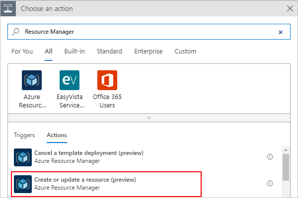

1. Enter the details for the action, including your Azure subscription, Azure resource group, and integration account. To add SAP tokens to the fields, click inside the boxes for those fields, and select from the dynamic content list that appears.

   1. Open the **Add new parameter** list, and select the **Location** and **Properties** fields.

   1. Provide details for these new fields as shown in this example.

      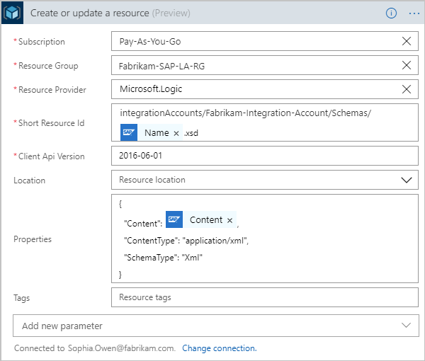

   The SAP **Generate schemas** action generates schemas as a collection, so the designer automatically adds a **For each** loop to the action. Here's an example that shows how this action appears:

   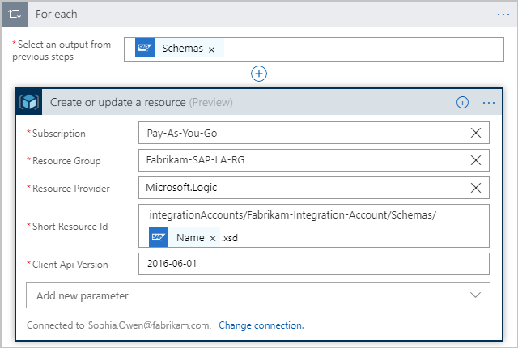  
   > [!NOTE]
   > The schemas use base64-encoded format. 
   > To upload the schemas to an integration account, 
   > they must be decoded by using the `base64ToString()` function. 
   > Here's an example that shows the code for the `"properties"` element:
   >
   > ```json
   > "properties": {
   >    "Content": "@base64ToString(items('For_each')?['Content'])",
   >    "ContentType": "application/xml",
   >    "SchemaType": "Xml"
   > }
   > ```

1. Save your logic app. On the designer toolbar, select **Save**.

### Test your logic app

1. On the designer toolbar, select **Run** to manually trigger your logic app.

1. After a successful run, go to the integration account, and check that the generated schemas exist.

## Enable Secure Network Communications

Before you start, make sure that you met the previously listed [prerequisites](#pre-reqs):

* The on-premises data gateway is installed on a machine that's in the same network as your SAP system.
* For SSO, the gateway is running as a user that's mapped to an SAP user.
* The SNC library that provides the additional security functions is installed on the same machine as the data gateway. Some examples include [sapseculib](https://help.sap.com/saphelp_nw74/helpdata/en/7a/0755dc6ef84f76890a77ad6eb13b13/frameset.htm), Kerberos, and NTLM.

   To enable SNC for your requests to or from the SAP system, select the **Use SNC** check box in the SAP connection and provide these properties:

   

   | Property | Description |
   |----------| ------------|
   | **SNC Library Path** | The SNC library name or path relative to NCo installation location or absolute path. Examples are `sapsnc.dll` or `.\security\sapsnc.dll` or `c:\security\sapsnc.dll`. |
   | **SNC SSO** | When you connect through SNC, the SNC identity is typically used for authenticating the caller. Another option is to override so that user and password information can be used for authenticating the caller, but the line is still encrypted. |
   | **SNC My Name** | In most cases, this property can be omitted. The installed SNC solution usually knows its own SNC name. Only for solutions that support multiple identities, you might need to specify the identity to be used for this particular destination or server. |
   | **SNC Partner Name** | The name for the back-end SNC. |
   | **SNC Quality of Protection** | The quality of service to be used for SNC communication of this particular destination or server. The default value is defined by the back-end system. The maximum value is defined by the security product used for SNC. |
   |||

   > [!NOTE]
   > Don't set the environment variables SNC_LIB and SNC_LIB_64 on the machine where you have the data gateway and the SNC library. If set, they take precedence over the SNC library value passed through the connector.

<a name="safe-typing"></a>

## Safe typing

By default, when you create your SAP connection, strong typing is used to check for invalid values by performing XML validation against the schema. This behavior can help you detect issues earlier. The **Safe Typing** option is available for backward compatibility and only checks the string length. If you choose **Safe Typing**, the DATS type and TIMS type in SAP are treated as strings rather than as their XML equivalents, `xs:date` and `xs:time`, where `xmlns:xs="http://www.w3.org/2001/XMLSchema"`. Safe typing affects the behavior for all schema generation, the send message for both the "been sent" payload and the "been received" response, and the trigger. 

When strong typing is used (**Safe Typing** isn't enabled), the schema maps the DATS and TIMS types to more straightforward XML types:

```xml
<xs:element minOccurs="0" maxOccurs="1" name="UPDDAT" nillable="true" type="xs:date"/>
<xs:element minOccurs="0" maxOccurs="1" name="UPDTIM" nillable="true" type="xs:time"/>
```

When you send messages using strong typing, the DATS and TIMS response complies to the matching XML type format:

```xml
<DATE>9999-12-31</DATE>
<TIME>23:59:59</TIME>
```

When **Safe Typing** is enabled, the schema maps the DATS and TIMS types to XML string fields with length restrictions only, for example:

```xml
<xs:element minOccurs="0" maxOccurs="1" name="UPDDAT" nillable="true">
  <xs:simpleType>
    <xs:restriction base="xs:string">
      <xs:maxLength value="8" />
    </xs:restriction>
  </xs:simpleType>
</xs:element>
<xs:element minOccurs="0" maxOccurs="1" name="UPDTIM" nillable="true">
  <xs:simpleType>
    <xs:restriction base="xs:string">
      <xs:maxLength value="6" />
    </xs:restriction>
  </xs:simpleType>
</xs:element>
```

When messages are sent with **Safe Typing** enabled, the DATS and TIMS response looks like this example:

```xml
<DATE>99991231</DATE>
<TIME>235959</TIME>
```

## Known issues and limitations

Here are the currently known issues and limitations for the SAP connector:

* The SAP trigger doesn't support data gateway clusters. In some failover cases, the data gateway node that communicates with the SAP system might differ from the active node, which results in unexpected behavior. For send scenarios, data gateway clusters are supported.

* The SAP connector currently doesn't support SAP router strings. The on-premises data gateway must exist on the same LAN as the SAP system you want to connect.

## Connector reference

For technical details about triggers, actions, and limits, which are described by the connector's OpenAPI (formerly Swagger) description, review the [connector's reference page](/connectors/sap/).

## Next steps

* [Connect to on-premises systems](../logic-apps/logic-apps-gateway-connection.md) from Azure Logic Apps.
* Learn how to validate, transform, and use other message operations with the [Enterprise Integration Pack](../logic-apps/logic-apps-enterprise-integration-overview.md).
* Learn about other [Logic Apps connectors](../connectors/apis-list.md).
