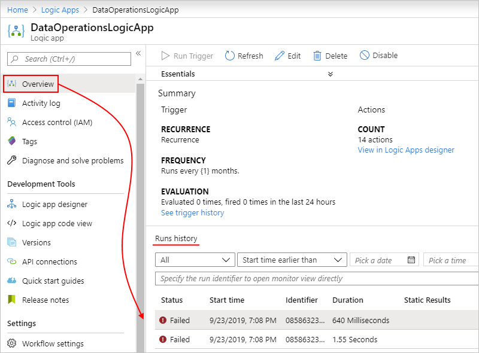
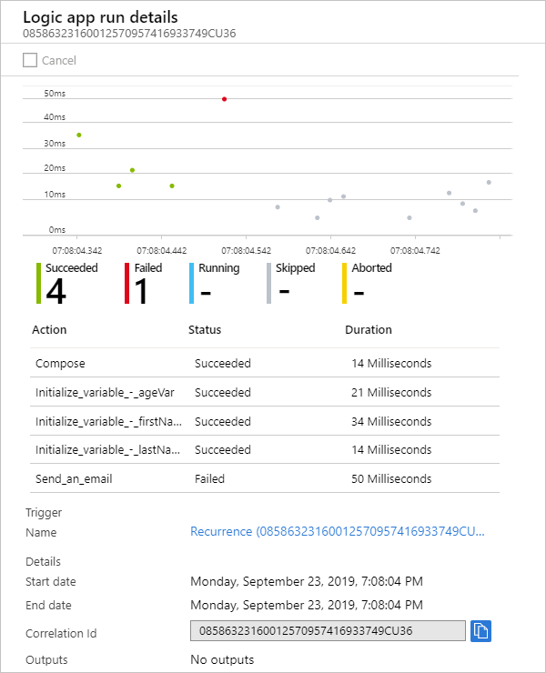
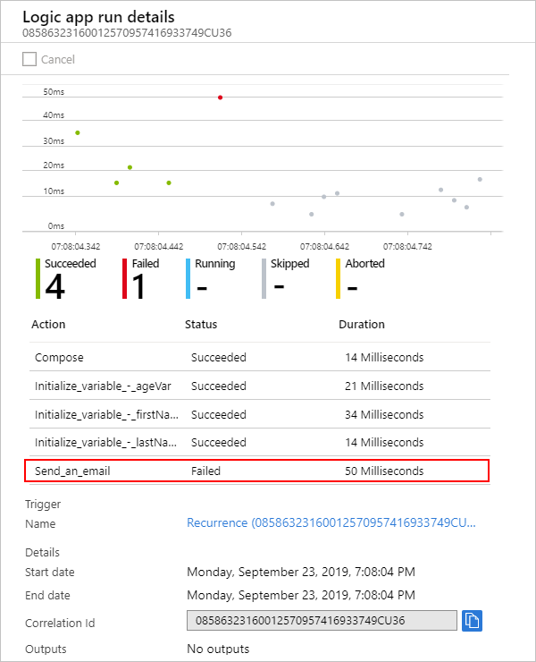
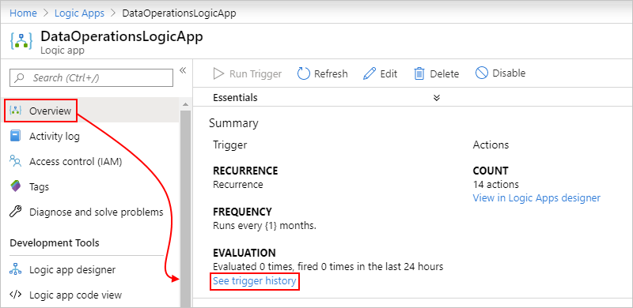
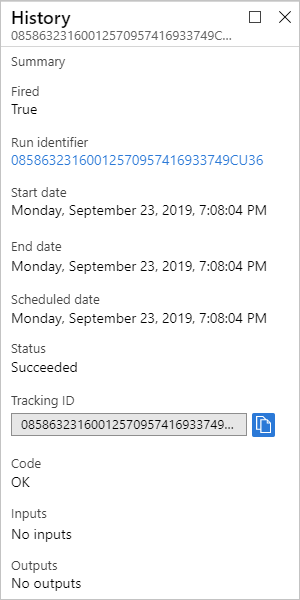
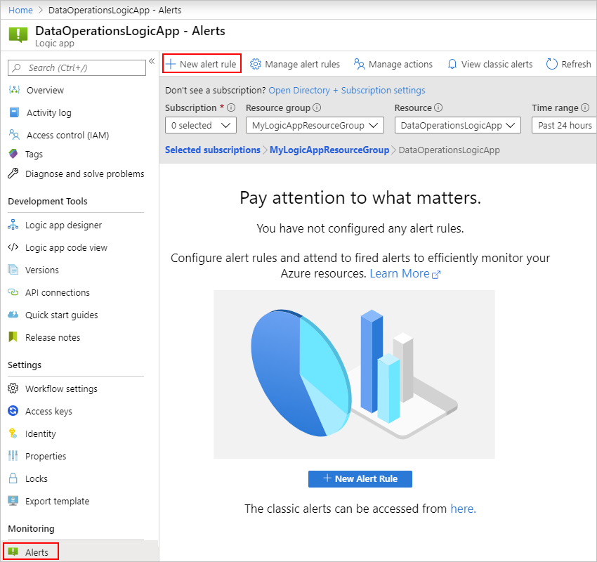
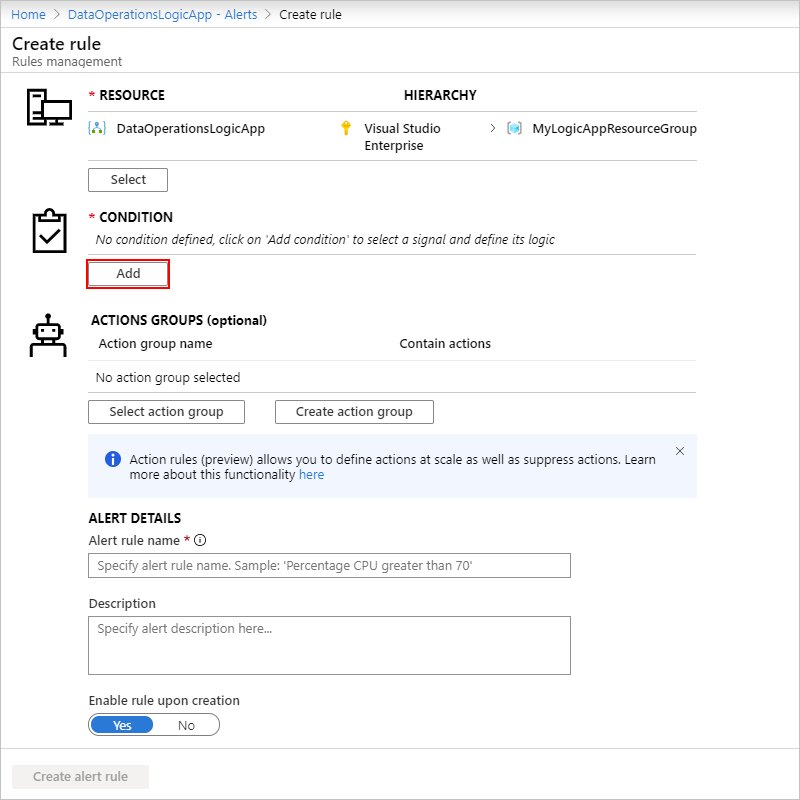
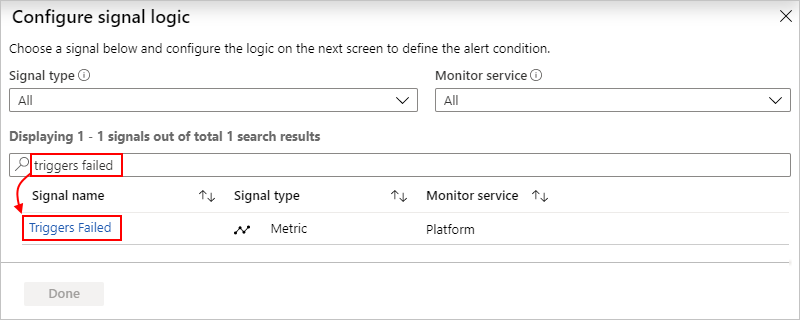
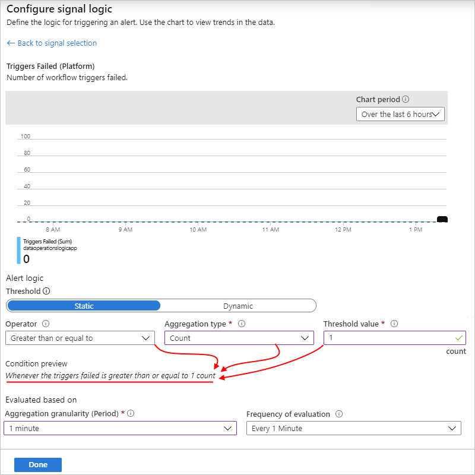

# Monitor run status, review trigger history, and set up alerts for Azure Logic Apps

After you [create and run a logic app](../logic-apps/quickstart-create-first-logic-app-workflow.md), you can check that logic app's run status, [runs history](#review-runs-history), [trigger history](#review-trigger-history), and performance. To get notifications about failures or other possible problems, set up [alerts](#add-azure-alerts). For example, you can create an alert that detects "when more than five runs fail in an hour."

For real-time event monitoring and richer debugging, set up diagnostics logging for your logic app by using [Azure Monitor logs](../azure-monitor/overview.md). This Azure service helps you monitor your cloud and on-premises environments so that you can more easily maintain their availability and performance. You can then find and view events, such as trigger events, run events, and action events. By storing this information in [Azure Monitor logs](../azure-monitor/platform/data-platform-logs.md), you can create [log queries](../azure-monitor/log-query/log-query-overview.md) that help you find and analyze this information. You can also use this diagnostic data with other Azure services, such as Azure Storage and Azure Event Hubs. For more information, see [Monitor logic apps by using Azure Monitor](../logic-apps/monitor-logic-apps-log-analytics.md).

[!INCLUDE [azure-monitor-log-analytics-rebrand](../../includes/azure-monitor-log-analytics-rebrand.md)]

## Review runs history

Each time that the trigger fires for an item or event, the Logic Apps engine creates and runs a separate workflow instance for each item or event. By default, each workflow instance runs in parallel so that no workflow has to wait before starting a run. You can review what happened during that run, including the status for each step in the workflow plus the inputs and outputs for each step.

1. In the [Azure portal](https://portal.azure.com), find and open your logic app in the Logic App Designer.

   To find your logic app , in the main Azure search box, enter `logic apps`, and then select **Logic Apps**.

   

   The Azure portal shows all the logic apps that are associated with your Azure subscriptions. You can filter this list based on name, subscription, resource group, location, and so on.

   

1. Select your logic app, and then select **Overview**.

   On the overview pane, under **Runs history**, all the past, current, and any waiting runs for your logic app appear. If the list shows many runs, and you can't find the entry that you want, try filtering the list. If you don't find the data that you expect, try selecting **Refresh** on the toolbar.

   

   Here are the possible statuses for a logic app run:

   | Status | Description |
   |--------|-------------|
   | **Cancelled** | The workflow was running but received a cancel request. |
   | **Failed** | At least one action failed, and no later actions in the workflow were set up to handle the failure. |
   | **Running** | The workflow is currently running. 
This status can also appear for throttled workflows or due to the current pricing plan. For more information, see the [action limits on the pricing page](https://azure.microsoft.com/pricing/details/logic-apps/). If you set up [diagnostics logging](../logic-apps/monitor-logic-apps.md), you can get information about any throttle events that happen. |
   | **Succeeded** | All actions succeeded. 
**Note**: If any failures happened in a specific action, a later action in the workflow handled that failure. |
   | **Waiting** | The workflow hasn't started or is paused, for example, due to an earlier workflow that's still running. |
   |||

1. To review the steps and other information for a specific run, under **Runs history**, select that run.

   

   The **Logic app run** pane shows each step in the selected run, each step's run status, and the time taken for each step to run, for example:

   

   To view this information in list form, on the **Logic app run** toolbar, select **Run Details**.

   

   The Run Details view shows each step, their status, and other information.

   

   For example, you can get the run's **Correlation ID** property, which you might need when you use the [REST API for Logic Apps](https://docs.microsoft.com/rest/api/logic).

1. To get more information about a specific step, select either option:

   * In the **Logic app run** pane select the step so that the shape expands. You can now view information such as inputs, outputs, and any errors that happened in that step, for example:

     

   * In the **Logic app run details** pane, select the step that you want.

     

     You can now view information such as inputs and outputs for that step, for example:

   > [!NOTE]
   > All runtime details and events are encrypted within the Logic Apps service. 
   > They are decrypted only when a user requests to view that data. 
   > You can [hide inputs and outputs in run history](../logic-apps/logic-apps-securing-a-logic-app.md#obfuscate) 
   > or control user access to this information by using 
   > [Azure Role-Based Access Control (RBAC)](../role-based-access-control/overview.md).

## Review trigger history

Each logic app run starts with a trigger. The trigger history lists all the trigger attempts that your logic app made and information about the inputs and outputs for each trigger attempt.

1. In the [Azure portal](https://portal.azure.com), find and open your logic app in the Logic App Designer.

   To find your logic app , in the main Azure search box, enter `logic apps`, and then select **Logic Apps**.

   

   The Azure portal shows all the logic apps that are associated with your Azure subscriptions. You can filter this list based on name, subscription, resource group, location, and so on.

   

1. Select your logic app, and then select **Overview**.

1. On your logic app's menu, select **Overview**. In the **Summary** section, under **Evaluation**, select **See trigger history**.

   

   The trigger history pane shows all the trigger attempts that your logic app has made. Each time that the trigger fires for an item or event, the Logic Apps engine creates a separate logic app instance that runs the workflow. By default, each instance runs in parallel so that no workflow has to wait before starting a run. So if your logic app triggers on multiple items at the same time, a trigger entry with the same date and time appears for each item.

   

   Here are the possible statuses for a trigger attempt:

   | Status | Description |
   |--------|-------------|
   | **Failed** | An error occurred. To review any generated error messages for a failed trigger, select that trigger attempt and choose **Outputs**. For example, you might find inputs that aren't valid. |
   | **Skipped** | The trigger checked the endpoint but found no data. |
   | **Succeeded** | The trigger checked the endpoint and found available data. Usually, a "Fired" status also appears alongside this status. If not, the trigger definition might have a condition or `SplitOn` command that wasn't met. 
This status can apply to a manual trigger, recurrence trigger, or polling trigger. A trigger can run successfully, but the run itself might still fail when the actions generate unhandled errors. |
   |||

   > [!TIP]
   > You can recheck the trigger without waiting for the next recurrence. On the overview toolbar, 
   > select **Run trigger**, and select the trigger, which forces a check. Or, select **Run** on 
   > Logic Apps Designer toolbar.

1. To view information about a specific trigger attempt, on the trigger pane, select that trigger event. If the list shows many trigger attempts, and you can't find the entry that you want, try filtering the list. If you don't find the data that you expect, try selecting **Refresh** on the toolbar.

   

   You can now review information about the selected trigger event, for example:

   

## Set up monitoring alerts

To get alerts based on specific metrics or exceeded thresholds for your logic app, set up [alerts in Azure Monitor](../azure-monitor/platform/alerts-overview.md). Learn about [metrics in Azure](../monitoring-and-diagnostics/monitoring-overview-metrics.md). To set up alerts without using [Azure Monitor](../log-analytics/log-analytics-overview.md), follow these steps.

1. On your logic app menu, under **Monitoring**, select **Alerts** > **New alert rule**.

   

1. On the **Create rule** pane, follow these steps:

   1. Under **Resource**, select your logic app, if not already selected. Under **Condition**, select **Add** so that you can define the condition that triggers the alert.

      

   1. On the **Configure signal logic** pane, find and select the signal for to get an alert. You can use the search box, or to sort the signals alphabetically, select the **Signal name** column header.

      For example, if you want to send an alert when a trigger fails, follow these steps:

      1. In the **Signal name** column, find and select the **Triggers Failed** signal.

         

      1. On the information pane that opens for the selected signal, under **Alert logic**, set up your condition, for example:

         1. For **Operator**, select **Greater than or equal to**.

         1. For **Aggregation type**, select **Count**.

         1. For **Threshold value**, enter `1`.

         1. Under **Condition preview**, confirm that your condition appears correct.

         1. Under **Evaluated based on**, set up the interval and frequency for running the alert rule. For **Aggregation granularity (Period)**, select the period for grouping the data. For **Frequency of evaluation**, select how often you want to check the condition.

         1. When you're ready, select **Done**.

         Here's the finished condition:

         

      The **Create rule** page now shows the condition that you created and the cost for running that alert.

      

   1. Specify a name, optional description, and severity level for your alert. Either leave the **Enable rule upon creation** setting turned on, or turn off until you're ready to enable the rule.

   1. When you're done, select **Create alert rule**.

> [!TIP]
> To run a logic app from an alert, you can include the 
> [request trigger](../connectors/connectors-native-reqres.md) in your workflow, 
> which lets you perform tasks like these examples:
> 
> * [Post to Slack](https://github.com/Azure/azure-quickstart-templates/tree/master/201-alert-to-slack-with-logic-app)
> * [Send a text](https://github.com/Azure/azure-quickstart-templates/tree/master/201-alert-to-text-message-with-logic-app)
> * [Add a message to a queue](https://github.com/Azure/azure-quickstart-templates/tree/master/201-alert-to-queue-with-logic-app)

## Next steps

* [Monitor logic apps by using Azure Monitor](../logic-apps/monitor-logic-apps-log-analytics.md)