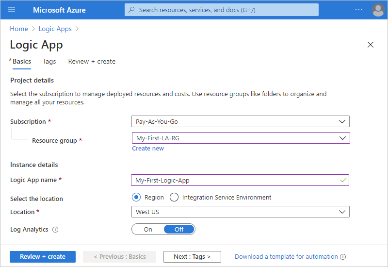
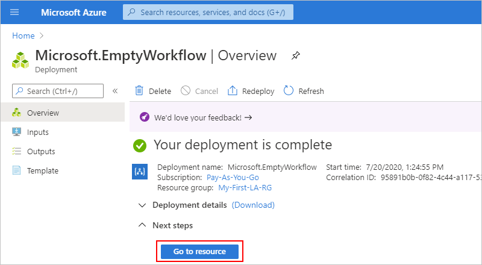
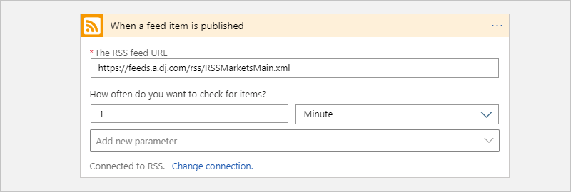
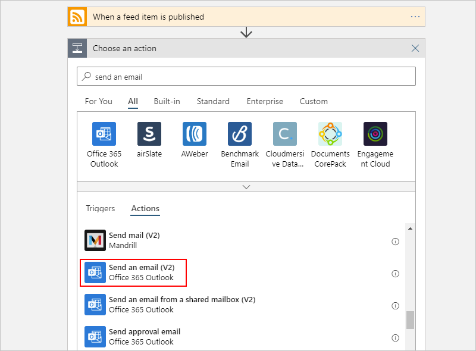
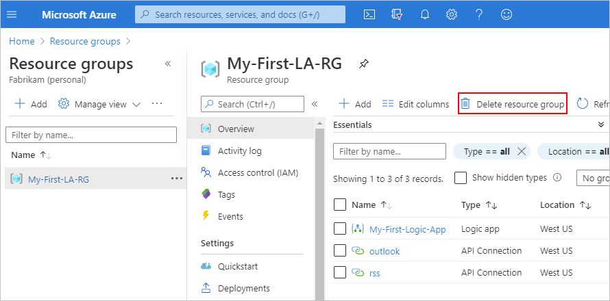
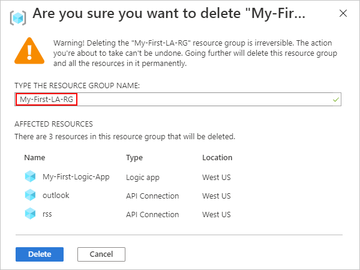

# Quickstart: Create your first automated workflow with Azure Logic Apps - Azure portal

This quickstart introduces how to build your first automated workflow with [Azure Logic Apps](../logic-apps/logic-apps-overview.md). In this article, you create a logic app that regularly checks a website's RSS feed for new items. If new items exist, the logic app sends an email for each item. When you're done, your logic app looks like this workflow at a high level:

To follow this quickstart, you need an email account from a provider that's supported by logic apps, such as Office 365 Outlook, Outlook.com, or Gmail. For other providers, [review the connectors list here](https://docs.microsoft.com/connectors/). This logic app uses an Office 365 Outlook account. If you use another email account, the overall steps are the same, but your user interface might slightly differ.

Also, if you don't have an Azure subscription, [sign up for a free Azure account](https://azure.microsoft.com/free/).

## Sign in to the Azure portal

Sign in to the [Azure portal](https://portal.azure.com) with your Azure account credentials.

## Create your logic app

1. From the Azure home page, in the search box, find and select **Logic Apps**.

   

1. On the **Logic Apps** page, select **Add**.

   

1. Under **Create logic app**, provide details about your logic app as shown below. After you’re done, select **Create**.

   

   | Property | Value | Description |
   |----------|-------|-------------|
   | **Name** | <*logic-app-name*> | Your logic app name, which can contain only letters, numbers, hyphens (`-`), underscores (`_`), parentheses (`(`, `)`), and periods (`.`). This example uses "My-First-Logic-App". |
   | **Subscription** | <*Azure-subscription-name*> | Your Azure subscription name |
   | **Resource group** | <*Azure-resource-group-name*> | The name for the [Azure resource group](../azure-resource-manager/resource-group-overview.md) used to organize related resources. This example uses "My-First-LA-RG". |
   | **Location** | <*Azure-region*> | The region where to store your logic app information. This example uses "West US". |
   | **Log Analytics** | Off | Keep the **Off** setting for diagnostic logging. |
   ||||

1. After Azure deploys your app, on the Azure toolbar, select **Notifications** > **Go to resource** for your deployed logic app.

   

   Or, you can find and select your logic app by typing the name in the search box.

   The logic apps Designer opens and shows a page with an introduction video and commonly used triggers. Under **Templates**, select **Blank logic app**.

   

Next, add a [trigger](../logic-apps/logic-apps-overview.md#logic-app-concepts) that fires when a new RSS feed item appears. Every logic app must start with a trigger, which fires when a specific event happens or when a specific condition is met. Each time the trigger fires, the logic apps engine creates a logic app instance that starts and runs your workflow.

## Check RSS feed with a trigger

1. In The **Logic app Designer**, under the search box, select **All**.

1. In the search box, enter `rss`. From the triggers list, select this trigger: **When a feed item is published**

   

1. Provide this information for your trigger as shown and described here:

   

   | Property | Value | Description |
   |----------|-------|-------------|
   | **The RSS feed URL** | `http://feeds.reuters.com/reuters/topNews` | The link for the RSS feed that you want to monitor |
   | **Interval** | 1 | The number of intervals to wait between checks |
   | **Frequency** | Minute | The unit of time for each interval between checks  |
   ||||

   Together, the interval and frequency define the schedule for your logic app's trigger. This logic app checks the feed every minute.

1. To hide the trigger details, for now, click inside the trigger's title bar.

   

1. Save your logic app. On the designer toolbar, select **Save**.

Your logic app is now live but doesn't do anything other than check the RSS feed. So, add an action that responds when the trigger fires.

## Send email with an action

Now add an [action](../logic-apps/logic-apps-overview.md#logic-app-concepts) that sends an email when a new item appears in the RSS feed.

1. Under the **When a feed item is published** trigger, select **New step**.

   

1. Under **Choose an action** and the search box, select **All**.

1. In the search box, enter `send an email`. From the actions list, select the "send an email" action for the email provider that you want.

   

   To filter the actions list to a specific app or service, you can select that app or service first:

   * For Azure work or school accounts, select Office 365 Outlook.
   * For personal Microsoft accounts, select Outlook.com.

1. If asked for credentials, sign in to your email account so that logic apps creates a connection to your email account.

1. In the **Send an email** action, specify the data that you want the email to include.

   1. In the **To** box, enter the recipient's email address. For testing purposes, you can use your email address.

      For now, ignore the **Add dynamic content** list that appears. When you click inside some edit boxes, this list appears and shows any available parameters from the previous step that you can include as inputs in your workflow.

   1. In the **Subject** box, enter this text with a trailing blank space: `New RSS item: `

      

   1. From the **Add dynamic content** list, select **Feed title** to include the RSS item title.

      

      When you're done, the email subject looks like this example:

      

      If a "For each" loop appears on the designer, then you selected a token for an array, for example, the **categories-Item** token. For these kinds of tokens, the designer automatically adds this loop around the action that references that token. That way, your logic app performs the same action on each array item. To remove the loop, select the **ellipses** (**...**) on the loop's title bar, then select **Delete**.

   1. In the **Body** box, enter this text, and select these tokens for the email body. To add blank lines in an edit box, press Shift + Enter.

      

      | Property | Description |
      |----------|-------------|
      | **Feed title** | The item's title |
      | **Feed published on** | The item's publishing date and time |
      | **Primary feed link** | The URL for the item |
      |||

1. Save your logic app.

Next, test your logic app.

## Run your logic app

To manually start your logic app, on the designer toolbar bar, select **Run**. Or, wait for your logic app to check the RSS feed based on your specified schedule (every minute). If the RSS feed has new items, your logic app sends an email for each new item. Otherwise, your logic app waits until the next interval before checking again. If you don't get any emails, check your junk email folder.

For example, here is a sample email that this logic app sends.

Technically, when the trigger checks the RSS feed and finds new items, the trigger fires, and the logic apps engine creates an instance of your logic app workflow that runs the actions in the workflow. If the trigger doesn't find new items, the trigger doesn't fire and "skips" instantiating the workflow.

Congratulations, you've now successfully built and run your first logic app with the Azure portal.

## Clean up resources

When you no longer need this sample, delete the resource group that contains your logic app and related resources.

1. On the main Azure menu, select **Resource groups**, and then select your logic app's resource group. On the **Overview** pane, select **Delete resource group**.

   

1. When the confirmation pane appears, enter the resource group name, and select **Delete**.

   

> [!NOTE]
> When you delete a logic app, no new runs are instantiated. 
> All in-progress and pending runs are canceled. 
> If you have thousands of runs, cancellation might 
> take significant time to complete.

## Next steps

In this quickstart, you created your first logic app that checks for RSS updates based your specified schedule (every minute), and takes action (sends email) when updates exist. To learn more, continue with this tutorial that creates more advanced schedule-based workflows:

> [!div class="nextstepaction"]
> [Check traffic with a scheduled-based logic app](../logic-apps/tutorial-build-schedule-recurring-logic-app-workflow.md)
