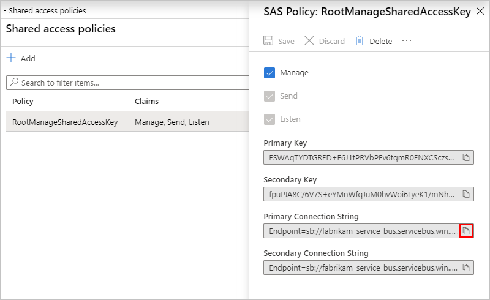
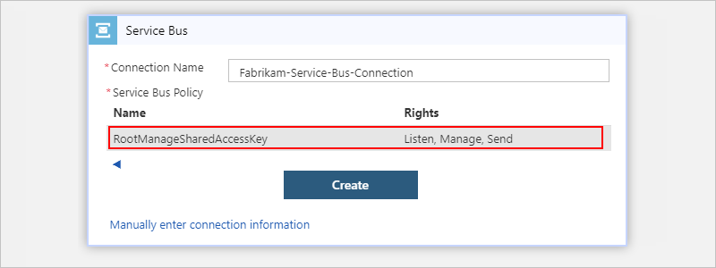
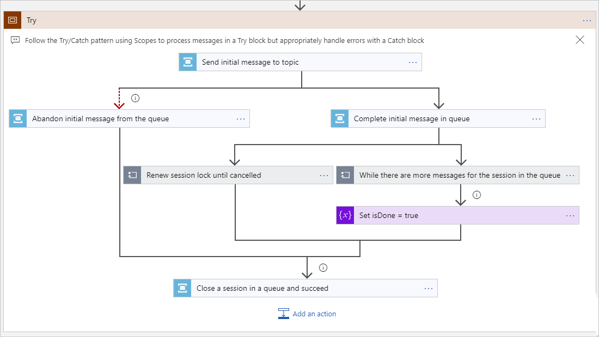

# Send related messages in order by using a sequential convoy in Azure Logic Apps with Azure Service Bus

When you need to send correlated messages in a specific order, you can follow the [*sequential convoy* pattern](https://docs.microsoft.com/azure/architecture/patterns/sequential-convoy) when using [Azure Logic Apps](../logic-apps/logic-apps-overview.md) by using the [Azure Service Bus connector](../connectors/connectors-create-api-servicebus.md). Correlated messages have a property that defines the relationship between those messages, such as the session ID in Service Bus. For example, suppose that you have 20 messages for a session named "S1", and you have 10 messages for a session named "S2". You can create a logic app that processes session S1 with one trigger run and session S2 in another trigger run.

For a more concrete example, suppose that you have an online company that receives new orders from direct clients and from dealers throughout the day. All orders received before 2:00 PM must go to the warehouse in a single batch, which must preserve the arrival sequence for those orders. That way, earlier orders get priority in case any items are low in stock at the warehouse. To build this batch order, you put all the orders for the day into a single file that has batch header information. At 2:00 PM, the day's orders go to the warehouse for processing. All orders received after 2:00 PM go into a new batch for processing the next day.

This article shows how to create a logic app that implements this pattern by using the **Correlated in-order delivery using service bus sessions** template. This template defines a logic app workflow that starts with the Service Bus connector's **When a message is received in a queue (peek-lock)** trigger, which receives messages from a Service Bus queue. Here are the high-level steps that this logic app performs:

* Initialize a session based on a message that the trigger reads from the Service Bus queue.
* Save the session that's initialized in the previous step.
* Process all the messages that associated with the session by the current trigger instance.

To review this template's JSON file, see [GitHub: service-bus-sessions.json](https://github.com/Azure/logicapps/blob/master/templates/service-bus-sessions.json).

For more information about the sequential convoy pattern, see these articles:

* [Sequential convoys - BizTalk Server](https://docs.microsoft.com/biztalk/core/sequential-convoys)
* [Sequential convoy pattern - Azure Architecture Cloud Design Patterns](https://docs.microsoft.com/azure/architecture/patterns/sequential-convoy)

## Prerequisites

* An Azure subscription. If you don't have a subscription, [sign up for a free Azure account](https://azure.microsoft.com/free/).

* A Service Bus namespace and a Service Bus queue, which is a messaging entity. These items and your logic app need to use the same Azure subscription. If you don't have these items, learn [how to create your Service Bus namespace and a queue](../service-bus-messaging/service-bus-create-namespace-portal.md).

  [!INCLUDE [Warning about creating infinite loops](../../includes/connectors-infinite-loops.md)]

* Basic knowledge about how to create logic apps. If you're new to Azure Logic Apps, try the quickstart, [Create your first automated workflow](../logic-apps/quickstart-first-logic-app-workflow.md).

## Check access to Service Bus namespace

If you're not sure whether your logic app has permissions to access your Service Bus namespace, confirm those permissions.

1. Sign in to the [Azure portal](https://portal.azure.com). Find and select your Service Bus *namespace*.

1. On the namespace menu, under **Settings**, select **Shared access policies**. Under **Claims**, check that you have **Manage** permissions for that namespace.

   

1. Now get the connection string for your Service Bus namespace. You can use this string later when you create a connection to the namespace from your logic app.

   1. On the **Shared access policies** pane, under **Policy**, select **RootManageSharedAccessKey**.
   
   1. Next to your primary connection string, select the copy button. Save the connection string for later use.

      

   > [!TIP]
   > To confirm whether your connection string is associated with 
   > your Service Bus namespace or a messaging entity, such as a queue, 
   > search the connection string for the `EntityPath` parameter. 
   > If you find this parameter, the connection string is for a specific entity, 
   > and isn't the correct string to use with your logic app.

## Connect to Service Bus namespace

1. In the [Azure portal](https://portal.azure.com), create a blank logic app. From the Azure home page, select **Create a resource** > **Integration** > **Logic App**.

1. After the template gallery appears, scroll past the video and the common triggers sections. From the **Templates** section, select the template, **Correlated in-order delivery using service bus sessions**.

   

1. When the confirmation box appears, select **Use this template**.

1. On the Logic App Designer, in the **Service Bus** shape, select **Continue**, and then select the plus sign (**+**) that appears in the shape.

   

1. Now create a Service Bus connection by choosing either option:

   * To use the connection string that you copied earlier from your Service Bus namespace, follow these steps:

     1. Select **Manually enter connection information**.

     1. For **Connection Name**, provide a name for your connection. For **Connection String**, paste your namespace connection string, and select **Create**, for example:

        

        > [!TIP]
        > If you don't have this connection string, learn how to 
        > [find and copy the Service Bus namespace connection string](#permissions-connection-string).

   * To select a Service Bus namespace from your current Azure subscription, follow these steps:

     1. For **Connection Name**, provide a name for your connection. For **Service Bus Namespace**, select your Service Bus namespace, for example:

        

     1. When the next pane appears, select your Service Bus policy, and select **Create**.

        

1. When you're done, select **Continue**.

   The Logic App Designer now shows the **Correlated in-order delivery using service bus sessions** template, which contains a pre-populated workflow with a trigger and actions, including two scopes that implement error handling that follow the `Try-Catch` pattern.

Now you can either learn more about the trigger and actions in the template, or jump ahead to [provide the values for the logic app template](#fill-template).

## Review the template

Here is the top-level workflow in the **Correlated in-order delivery using service bus sessions** template when the details are collapsed:

| Name | Description |
|------|-------------|
| **When a message is received in a queue (peek-lock)** | Based on the specified recurrence, this Service Bus trigger checks the specified Service Bus queue for any messages. If a message exists in the queue, the trigger fires, which creates and runs a workflow instance. 

The term *peek-lock* means that the trigger sends a request to retrieve a message from the queue. If a message exists, the trigger retrieves and locks the message so that no other processing happens on that message until the lock period expires. For more trigger information, see [Service Bus - When a message is received in a queue (peek-lock)](https://docs.microsoft.com/connectors/servicebus/#when-a-message-is-received-in-a-queue-(peek-lock)). |
| **`Init isDone`** | This **Initialize variable** action creates a variable that tracks whether the next Service Bus action finishes reading messages in the queue. By default, the variable's Boolean value is set to `false`. |
| **`Try`** | This **Scope** action contains the actions that run to process a message. If a problem happens in the `Try` scope, the subsequent `Catch` **Scope** action handles that problem. For more information, see ["Try" scope](#try-scope). |
| **`Catch`**| This **Scope** action contains the actions that run if a problem happens in the preceding `Try` scope. For more information, see ["Catch" scope](#catch-scope). |
|||

### "Try" scope

Here is the top-level flow in the `Try` scope action when the details are collapsed:

| Name | Description |
|------|-------------|
| `Send initial message to topic` | This Service Bus **Send message** action sends the message to the queue specified by the session ID that's output from the trigger along with other information about the message. |
| (parallel branch) | This action creates two paths: 

- Branch #1: Continue processing the message. 

- Branch #2: Abandon the message if anything goes wrong, and release for pickup by another trigger run. 

Both paths join up later in the **Close session in a queue** action. |
|||

### Branch #1: Continue processing messages

| Name | Description |
|------|-------------|
| `Complete initial message in queue` | This Service Bus **Complete the message in a queue** action marks a successfully retrieved message as complete and removes the message from the queue to prevent reprocessing. |
| `While there are more messages for the session in the queue` | This **Until** loop runs these actions: 

- Continue to get messages from the queue while messages exist or until one hour passes. To change the loop's time limit, edit the loop's **Timeout** property. By default, the maximum number of messages is set to `175`. However, this limit is affected by the message size and maximum message size property for the service bus, currently 256K for Standard and 1MB for Premium. 
- Check the number of messages returned. If this number is 0, set the `isDone` value to `True` because no messages remain. Otherwise, process the message. |
| `Renew session lock until cancelled` | This **Until** loop makes sure that the session lock is held by this logic app while messages exist or for 1 hour. To change the loop's time limit, edit the loop's **Timeout** property. |
| `Close a session in a queue and succeed` | Complete the session for the queue and return |
|||

  * **** action
  * **Until** loop that contains:
    * **Receive next message in session** action
    * **Send message to topic** action
    * **Complete the message in a queue** action

### "Catch" scope

| Name | Description |
|------|-------------|
| `Close a session in a queue and fail` | |
| **Find failure msg from `Try` block** action | |
| **Select error details** action ||
| **Terminate** action ||
|||

## Complete the template

To provide the values for the trigger and actions in the **Correlated in-order delivery using service bus sessions** template, follow these steps. You have to provide all the required values, which are marked by an asterisk (**\***), before you can save your work.

1. For the **When a message is received in a queue (peek-lock)** trigger, provide this information so that the template can initialize a session by using the **Session id** property, for example:

   

   | Property | Required for this scenario | Value | Description |
   |----------|----------------------------|-------|-------------|
   | **Queue name** | Yes | <*queue-name*> | The name for your previously created Service Bus queue. This example uses "Fabrikam-Service-Bus-Queue". |
   | **Queue type** | Yes | **Main** | Your primary Service Bus queue |
   | **Session id** | Yes | **Next available** | This option creates a new session for each trigger run based on the session ID from the message that arrives in the Service Bus queue. Each trigger run gets a new session from the queue. The workflow's subsequent actions process all the messages that are associated with that session as described later. |
   | **Interval** | Yes | | The number of time units between recurrences before checking for a message |
   | **Frequency** | Yes | | The unit of time for the recurrence to use when checking for a message |
   |||||

   More information about the other **Session id** options:

   * **None**: The default option, which results in no sessions and can't be used for implementing the sequential convoy pattern.

   * **Enter custom value**: Use this option when you know the session ID that you want to use, and you always want to run the trigger for that session ID.

   For more trigger information, see [Service Bus - When a message is received in a queue (peek-lock)](https://docs.microsoft.com/connectors/servicebus/#when-a-message-is-received-in-a-queue-(peek-lock)). The trigger outputs a [ServiceBusMessage](https://docs.microsoft.com/connectors/servicebus/#servicebusmessage).

   After initializing the session, the workflow uses the **Initialize variable** action to create a variable that tracks whether the next Service Bus action finishes reading messages in the queue and set the variable's Boolean value is set to `false`.

   

   In the **Try** section, the workflow instance performs these actions on the first message that's read.

   The **Send initial message to topic** action sends the message to a topic that's specified by the **SessionId** property. That way, all the messages that are associated with a specific session go to the same topic.

   

1. In the **Complete the message in a queue** action, provide this information.

   open the *Add new parameter** list, and select **SessionId**. 

