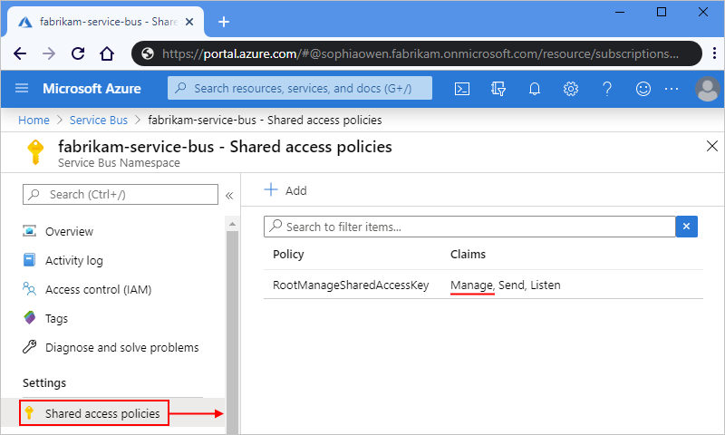
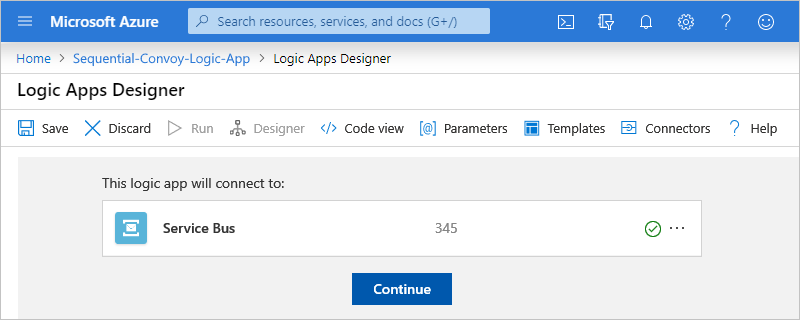

# Send related messages in order by using a sequential convoy in Azure Logic Apps with Azure Service Bus

When you need to send correlated messages in a specific order, you can follow the [*sequential convoy* pattern](https://docs.microsoft.com/azure/architecture/patterns/sequential-convoy) when using [Azure Logic Apps](../logic-apps/logic-apps-overview.md) by using the [Azure Service Bus connector](../connectors/connectors-create-api-servicebus.md). Correlated messages have a property that defines the relationship between those messages, such as the session ID in Service Bus. For example, suppose that you have 20 messages for a session named "S1", and you have 10 messages for a session named "S2". You can create a logic app that processes session S1 with one trigger run and session S2 in another trigger run.

For a more concrete example, suppose that you have an online company that receives new orders from direct clients and from dealers throughout the day. All orders received before 2:00 PM must go to the warehouse in a single batch, which must preserve the arrival sequence for those orders. That way, earlier orders get priority in case any items are low in stock at the warehouse. To build this batch order, you put all the orders for the day into a single file that has batch header information. At 2:00 PM, the day's orders go to the warehouse for processing. All orders received after 2:00 PM go into a new batch for processing the next day.

This article shows how to create a logic app that implements this pattern by using the **Correlated in-order delivery using service bus sessions** template. This template defines a logic app workflow that starts with the Service Bus connector's **When a message is received in a queue (peek-lock)** trigger, which receives messages from a Service Bus queue. Here are the high-level steps that this logic app performs:

* Initialize a session based on a message that the trigger reads from the Service Bus queue.
* Save the session that's initialized in the previous step.
* Process all the messages that associated with the session by the current trigger instance.

For more information about the sequential convoy pattern, see these articles:

* [Sequential convoys - BizTalk Server](https://docs.microsoft.com/biztalk/core/sequential-convoys)
* [Sequential convoy pattern - Azure Architecture Cloud Design Patterns](https://docs.microsoft.com/azure/architecture/patterns/sequential-convoy)

## Prerequisites

* An Azure subscription. If you don't have a subscription, [sign up for a free Azure account](https://azure.microsoft.com/free/).

* A Service Bus namespace and messaging entity, such as a queue. These items and your logic app need to use the same Azure subscription. If you don't have these items, learn [how to create your Service Bus namespace and a queue](../service-bus-messaging/service-bus-create-namespace-portal.md).

  [!INCLUDE [Warning about creating infinite loops](../../includes/connectors-infinite-loops.md)]

* Basic knowledge about how to create logic apps. If you're new to Azure Logic Apps, try the quickstart, [Create your first automated workflow](../logic-apps/quickstart-first-logic-app-workflow.md).

## Check access to Service Bus namespace

If you're not sure whether your logic app has permissions to access your Service Bus namespace, confirm those permissions.

1. Sign in to the [Azure portal](https://portal.azure.com). Find and select your Service Bus *namespace*.

1. On the namespace menu, under **Settings**, select **Shared access policies**. Under **Claims**, check that you have **Manage** permissions for that namespace.

   

1. Now get the connection string for your Service Bus namespace. You can use this string later when you create a connection to the namespace from your logic app.

   1. On the **Shared access policies** pane, under **Policy**, select **RootManageSharedAccessKey**.
   
   1. Next to your primary connection string, select the copy button. Save the connection string for later use.

      

   > [!TIP]
   > To confirm whether your connection string is associated with 
   > your Service Bus namespace or a messaging entity, such as a queue, 
   > search the connection string for the `EntityPath` parameter. 
   > If you find this parameter, the connection string is for a specific entity, 
   > and isn't the correct string to use with your logic app.

## Connect to Service Bus namespace

1. In the [Azure portal](https://portal.azure.com), create a blank logic app. From the Azure home page, select **Create a resource** > **Integration** > **Logic App**.

1. After the template gallery appears, scroll past the video and the common triggers sections. From the **Templates** section, select the template, **Correlated in-order delivery using service bus sessions**.

   

1. When the confirmation box appears, select **Use this template**.

1. On the Logic App Designer, in the **Service Bus** shape, select **Continue**, and then select the plus sign (**+**) that appears in the shape.

   

1. Now create a Service Bus connection by choosing either option:

   * To use the connection string that you copied earlier from your Service Bus namespace, follow these steps:

     1. Select **Manually enter connection information**.

     1. For **Connection Name**, provide a name for your connection. For **Connection String**, paste your namespace connection string, and select **Create**, for example:

        

        > [!TIP]
        > If you don't have this connection string, learn how to 
        > [find and copy the Service Bus namespace connection string](#permissions-connection-string).

   * To select a Service Bus namespace from your current Azure subscription, follow these steps:

     1. For **Connection Name**, provide a name for your connection. For **Service Bus Namespace**, select your Service Bus namespace, for example:

        

     1. When the next pane appears, select your Service Bus policy, and select **Create**.

        

1. When you're done, select **Continue**.

   The Logic App Designer now shows your selected template, which contains a workflow that is prepopulated with a trigger and actions, including two scopes for implementing error handling by following the `Try-Catch` pattern.

   * A **When a message is received in a queue (peek-lock)** trigger
   * An **Initialize variable** action named `Init isDone`
   * Two scope actions named `Try` and `Catch` that implement error handling
   * The `Try` scope contains these actions:
     * A **Send initial message to topic** action
     * A parallel branch action, which 

Now provide the values for the trigger and actions in your logic app's workflow.

## Build the logic app

After you connect your logic app to your Service Bus namespace, the 

