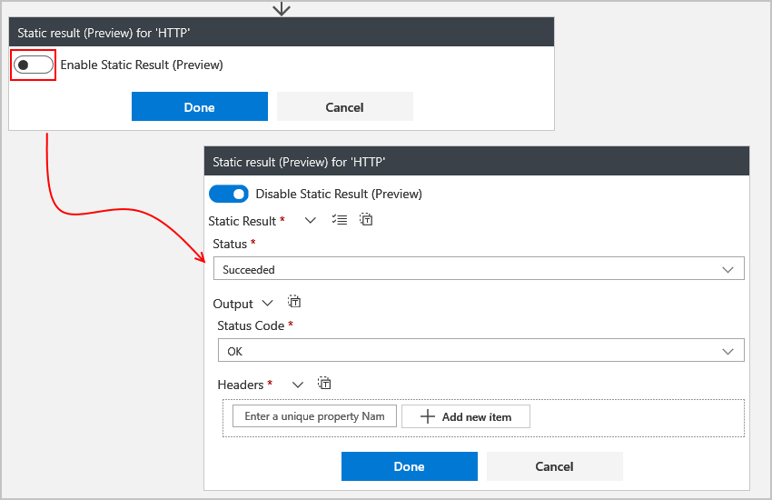
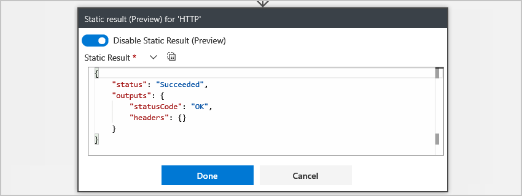

# Test logic apps with mock data by setting up static results

When testing your logic apps, you might not be ready to actually 
call or access apps, services, and systems for various reasons. 
Usually in these cases, you might have to run different condition 
paths, force errors, provide specific message response bodies, 
or even try skipping some steps. Instead, you can mock output 
data from your logic app's actions by setting up static results 
when running these kinds of test scenarios. To learn more about 
mocking in general, see [Mock API responses](../api-management/mock-api-responses.md).

Enabling static results on an action doesn't run the action, 
but returns the mock data instead. For example, if you set 
up static results for the Outlook 365 send mail action, 
the Logic Apps engine just returns the mock data you specified 
in static results, rather than call Outlook and send an email. 

## Prerequisites

* An Azure subscription. If you don't have an Azure subscription, 
<a href="https://azure.microsoft.com/free/" target="_blank">sign up for a free Azure account</a>.

* Basic knowledge about 
[how to create logic apps](../logic-apps/quickstart-create-first-logic-app-workflow.md)

* The logic app where you want to set up static results

## Set up static results

1. If you haven't already, in the [Azure portal](https://portal.azure.com), 
open your logic app in the Logic Apps Designer.

1. On the action where you want to set up static outputs, 
follow these steps: 

   1. In the action's upper-right corner, 
   choose the ellipses (*...*) button, 
   and elect **Static result**, for example:

      

   1. Choose **Enable Static Result**. For the required (*) properties, 
   specify the mock output values you want to return for the action's response.

      | Property | Description |
      |----------|-------------|
      | **Status** | The action's status to return |
      | **Status Code** | The specific status code to return |
      | **Headers** | The header content to return |
      |||

      

      To enter the mock data in JavaScript Object Notation (JSON) format, 
      choose **Switch to JSON Mode** ().

   1. For optional properties, open the **Select optional fields** list, 
   and select the properties that you want to mock.

      

1. When you're ready to save, choose **Done**.

   In the action's upper-right corner, 
   the title bar now shows a test beaker icon, 
   which indicates that you've enabled static results. 

## Reuse sample outputs

If your logic app has a previous run with outputs you 
can reuse as your static results, you can copy and 
paste those outputs from that run. 

1. If you haven't already, in the [Azure portal](https://portal.azure.com), 
open your logic app in the Logic Apps Designer.

1. On your logic app's main menu, select **Overview**. 

1. In the **Runs history** section, 
select the logic app run you want.

1. In your logic app's workflow, find and expand 
the action that has the outputs you want.

1. Choose the **Show raw outputs** link.

1. Copy either the complete JavaScript Object Notation 
(JSON) object or the specific subsection you want to use, 
for example, the outputs section, or even just the headers section.

1. Follow the steps for opening the **Static result** 
box for your action in [Set up static results](#set-up-static-results).

1. After the **Static result** box opens, choose either step:

   * To paste a complete JSON object, choose **Switch to JSON Mode** 
   ():

     

   * To paste just a JSON section, next to that section's label, 
   choose **Switch to JSON Mode** for that section, for example:

     

1. In the JSON editor, paste your previously copied JSON.

   

1. When you're done, choose **Switch Editor Mode** ().

## Disable static results

Turning off static results doesn't throw away the 
values from your last setup. So, when you turn on 
static results the next time, you can continue using 
your previous values.

1. Find the action where you want to disable static outputs. 
In the action's upper-right corner, choose the test beaker icon.

1. Choose **Disable Static Result**.

## Get support

* For questions, visit the 
[Azure Logic Apps forum](https://social.msdn.microsoft.com/Forums/en-US/home?forum=azurelogicapps).

* To submit or vote on feature ideas, visit the [Logic Apps user feedback site](https://aka.ms/logicapps-wish).

## Next steps

* Learn more about [Azure Logic Apps](../logic-apps/logic-apps-overview.md)
