# Check traffic on a schedule with Azure Logic Apps

Azure Logic Apps helps you automate workflows that run on a schedule. This tutorial shows how you can build a [logic app](../logic-apps/logic-apps-overview.md) with a scheduler trigger that runs every weekday morning and checks the travel time, including traffic, between two places. If the time exceeds a specific limit, the logic app sends email with the travel time and the extra time necessary for your destination.

In this tutorial, you learn how to:

> [!div class="checklist"]
> * Create a blank logic app. 
> * Add a trigger that works as a scheduler for your logic app.
> * Add an action that gets the travel time for a route.
> * Add an action that creates a variable, 
> converts the travel time from seconds to minutes, 
> and saves that result in the variable.
> * Add a condition that compares the travel time against a specified limit.
> * Add an action that sends email if the travel time exceeds the limit.

When you're done, your logic app looks like this workflow at a high level:

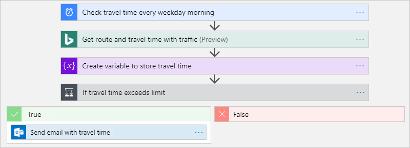

## Prerequisites

* An Azure subscription. If you don't have a subscription, [sign up for a free Azure account](https://azure.microsoft.com/free/) before you begin.

* An email account from an email provider supported by Logic Apps, such as Office 365 Outlook, Outlook.com, or Gmail. For other providers, [review the connectors list here](https://docs.microsoft.com/connectors/). This quickstart uses an Outlook.com account. If you use a different email account, the general steps stay the same, but your UI might appear slightly different.

* To get the travel time for a route, you need an access key for the Bing Maps API. To get this key, follow the steps for [how to get a Bing Maps key](https://docs.microsoft.com/bingmaps/getting-started/bing-maps-dev-center-help/getting-a-bing-maps-key).

## Sign in to the Azure portal

Sign in to the [Azure portal](https://portal.azure.com) with your Azure account credentials.

## Create your logic app

1. From the main Azure menu, select **Create a resource** > **Integration** > **Logic App**.

   

1. Under **Create logic app**, provide this information about your logic app as shown and described. When you're done, select **Create**.

   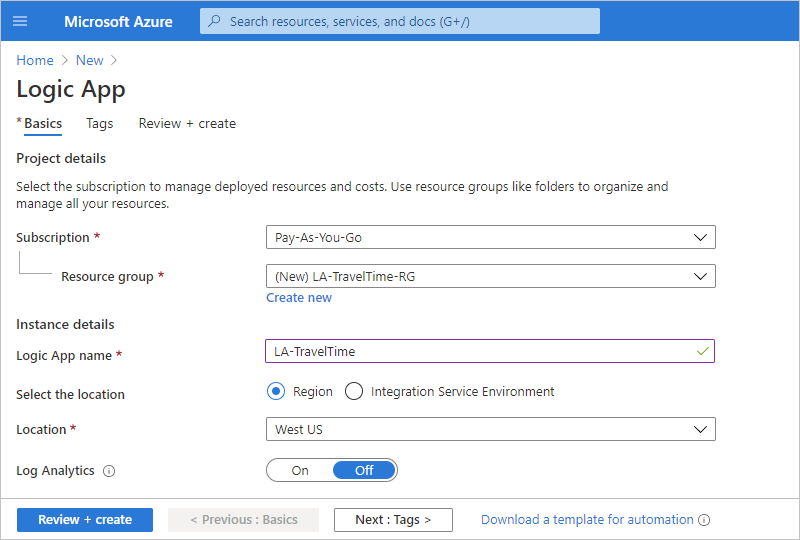

   | Property | Value | Description |
   |----------|-------|-------------|
   | **Name** | LA-TravelTime | Your logic app's name, which can contain only letters, numbers, hyphens (`-`), underscores (`_`), parentheses (`(`, `)`), and periods (`.`). This example uses "LA-TravelTime". |
   | **Subscription** | <*your-Azure-subscription-name*> | Your Azure subscription name |
   | **Resource group** | LA-TravelTime-RG | The name for the [Azure resource group](../azure-resource-manager/resource-group-overview.md), which is used to organize related resources. This example uses "LA-TravelTime-RG". |
   | **Location** | West US | TThe region where to store your logic app information. This example uses "West US". |
   | **Log Analytics** | Off | Keep the **Off** setting for diagnostic logging. |
   ||||

1. After Azure deploys your app, on the Azure toolbar, select **Notifications** > **Go to resource** for your deployed logic app.

   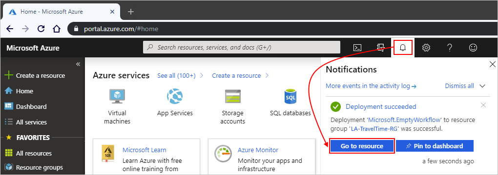

   Or, you can find and select your logic app by typing the name in the search box.

   The Logic Apps Designer opens and shows a page with an introduction video and commonly used triggers and logic app patterns. Under **Templates**, select **Blank Logic App**.

   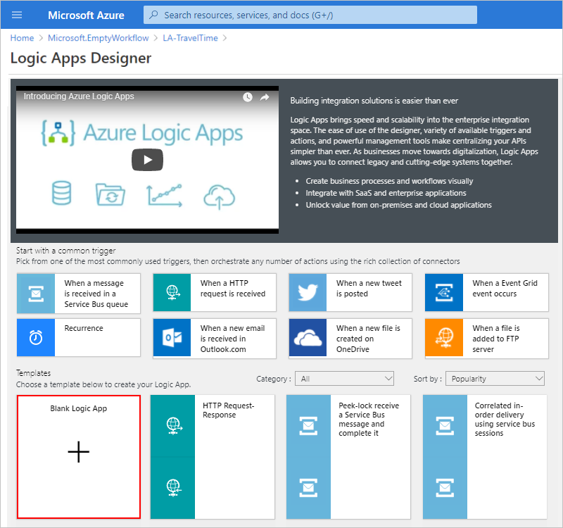

Next, add the Recurrence [trigger](../logic-apps/logic-apps-overview.md#logic-app-concepts), which fires based on a specified schedule. Every logic app must start with a trigger, which fires when a specific event happens or when new data meets a specific condition. For more information, see [Create your first logic app](../logic-apps/quickstart-create-first-logic-app-workflow.md).

## Add Recurrence trigger

1. On the Logic App Designer, in the search box, enter "recurrence" as your filter. From the **Triggers** list, select the **Recurrence** trigger.

   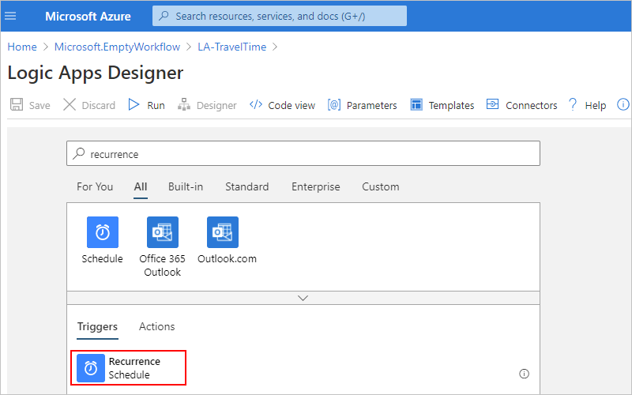

1. On the **Recurrence** shape, select the **ellipses** (**...**) button, and then select **Rename**. Rename the trigger with this more descriptive name: `Check travel time every weekday morning`

   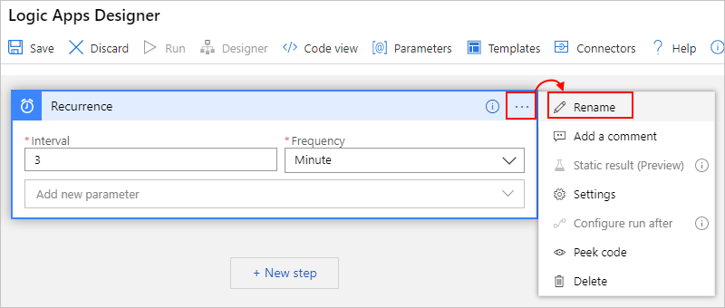

1. Inside the trigger, change these properties.

   

   | Property | Required | Value | Description |
   |----------|----------|-------|-------------|
   | **Interval** | Yes | 1 | The number of intervals to wait between checks |
   | **Frequency** | Yes | Week | The unit of time to use for the recurrence |
   |||||

1. Under **Interval** and **Frequency**, open the **Add new parameter** list, and select these properties to add to the trigger.

   * **On these days**
   * **At these hours**
   * **At these minutes**

   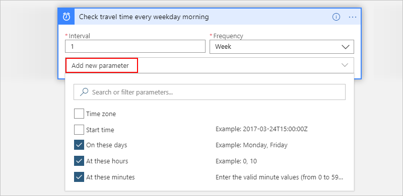

1. Now set the values for the additional properties as shown and described here.

   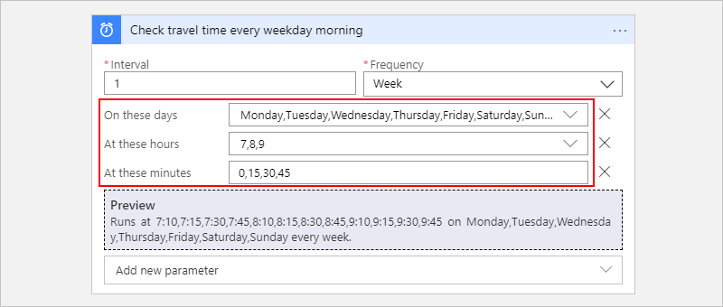

   | Property | Value | Description |
   |----------|-------|-------------|
   | **On these days** | Monday,Tuesday,Wednesday,Thursday,Friday | Available only when **Frequency** is set to "Week" |
   | **At these hours** | 7,8,9 | Available only when **Frequency** is set to "Week" or "Day". Select the hours of the day to run this recurrence. This example runs at the 7, 8, and 9-hour marks. |
   | **At these minutes** | 0,15,30,45 | Available only when **Frequency** is set to "Week" or "Day". Select the minutes of the day to run this recurrence. This example runs every 15 minutes starting at the zero-hour mark. |
   ||||

   This trigger fires every weekday, every 15 minutes, starting at 7:00 AM and ending at 9:45 AM. The **Preview** box shows the recurrence schedule. For more information, see [Schedule tasks and workflows](../connectors/connectors-native-recurrence.md) and [Workflow actions and triggers](../logic-apps/logic-apps-workflow-actions-triggers.md#recurrence-trigger).

1. To hide the trigger's details for now, click inside the shape's title bar.

   

1. Save your logic app. On the designer toolbar, select **Save**.

Your logic app is now live but doesn't do anything other recur. So, add an action that responds when the trigger fires.

## Get the travel time for a route

Now that you have a trigger, add an [action](../logic-apps/logic-apps-overview.md#logic-app-concepts) that gets the travel time between two places. Logic Apps provides a connector for the Bing Maps API so that you can easily get this information. Before you start this task, make sure that you have a Bing Maps API key as described in this tutorial's prerequisites.

1. In the Logic App Designer, under your trigger, select **New step**.

1. Under **Choose an action**, search for "bing maps", and select the **Get route** action.

1. If you don't have a Bing Maps connection, you're asked to create a connection. Provide these connection details, and select **Create**.

   

   | Property | Required | Value | Description |
   |----------|----------|-------|-------------|
   | **Connection Name** | Yes | BingMapsConnection | Provide a name for your connection. This example uses "BingMapsConnection". |
   | **API Key** | Yes | <*your-Bing-Maps-key*> | Enter the Bing Maps key that you previously received. If you don't have a Bing Maps key, learn [how to get a key](https://msdn.microsoft.com/library/ff428642.aspx). |
   |||||

1. Rename the action with this more descriptive name: `Get route and travel time with traffic`

1. Inside the action, open the **Add new parameter list**, and select these properties to add to the action.

   * **Optimize**
   * **Distance unit**
   * **Travel mode**

   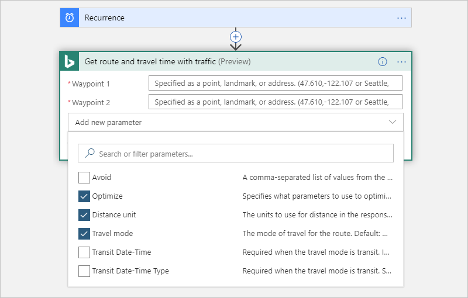 

1. Now set the values for the action's properties as shown and described here.

   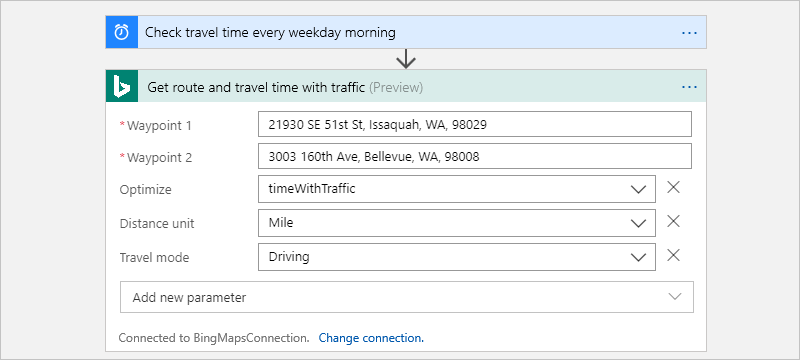 

   | Property | Required | Value | Description |
   |----------|----------|-------|-------------|
   | **Waypoint 1** | Yes | <*start-location*> | Your route's origin |
   | **Waypoint 2** | Yes | <*end-location*> | Your route's destination |
   | **Optimize** | No | timeWithTraffic | A parameter to optimize your route, such as distance, travel time with current traffic, and so on. Select the "timeWithTraffic" parameter. |
   | **Distance unit** | No | <*your-preference*> | The unit of distance for your route. This example uses "Mile" as the unit. |
   | **Travel mode** | No | Driving | The travel mode for your route. Select "Driving" mode. |
   ||||

   For more information about these parameters, see [Calculate a route](https://docs.microsoft.com/bingmaps/rest-services/routes/calculate-a-route).

1. Save your logic app.

Next, create a variable so that you can convert and store the current travel time as minutes, rather than seconds. That way, you can avoid repeating the conversion and use the value more easily in later steps. 

## Create variable to store travel time

Sometimes, you might want to perform operations on data in your workflow, and then use the results in later actions. To save these results so that you can easily reuse or reference them, you can create variables to store those results after processing them. You can create variables only at the top level in your logic app.

By default, the previous **Get route** action returns the current travel time with traffic in seconds through the **Travel Duration Traffic** field. By converting and storing this value as minutes instead, you make the value easier to reuse later without converting again.

1. Under the **Get route** action, select **New step**.

1. Under **Choose an action**, search for "variables", and select the **Initialize variable** action.

   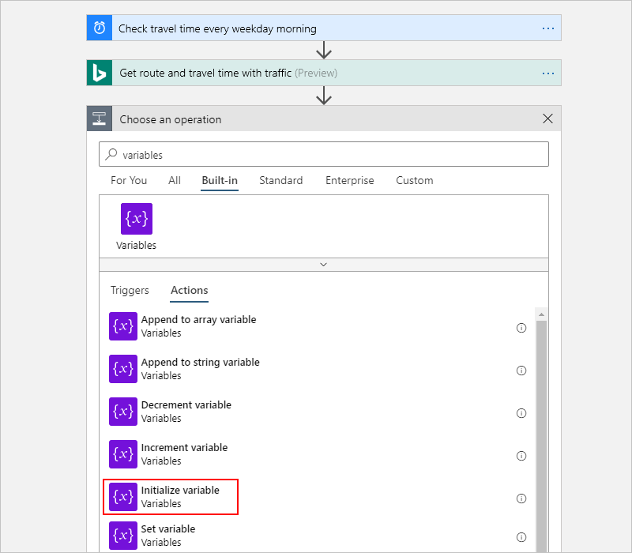

3. Rename this action with this description: ```Create variable to store travel time```

4. Provide the details for your variable as described here:

   | Setting | Value | Description |
   | ------- | ----- | ----------- |
   | **Name** | travelTime | The name for your variable |
   | **Type** | Integer | The data type for your variable |
   | **Value** | An expression that converts the current travel time from seconds to minutes (see steps under this table). | The initial value for your variable |
   ||||

   1. To create the expression for the **Value** field, click inside the field so that the dynamic content list appears. If necessary, widen your browser until the list appears. In the dynamic content list, select **Expression**. 

      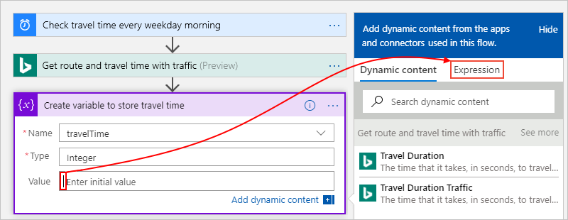

      When you click inside some edit boxes, either a dynamic content list or an inline parameter list appears. This list shows any parameters from previous actions that you can use as inputs in your workflow. The dynamic content list has an expression editor where you can select functions for performing operations. 
      This expression editor appears only in the dynamic content list.

      Your browser width determines which list appears. If your browser is wide, the dynamic content list appears. If your browser is narrow, a parameter list appears 
      inline under the edit box that currently has focus.

   2. In the expression editor, enter this expression: ```div(,60)```

      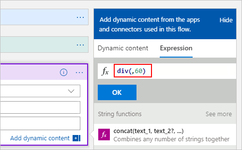

   3. Put your cursor inside the expression between the left parenthesis (**(**) and the comma (**,**). 
   select **Dynamic content**.

      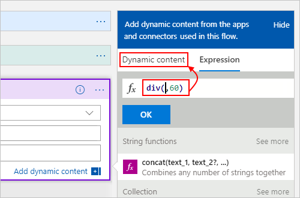

   4. In the dynamic content list, select **Travel Duration Traffic**.

      

   5. After the field resolves inside the expression, select **OK**.

      

      The **Value** field now appears as shown here:

      

5. Save your logic app.

Next, add a condition that checks whether the current travel time is greater than a specific limit.

## Compare travel time with limit

1. Under the previous action, select **+ New step** > **Add a condition**.

2. Rename the condition with this description: ```If travel time exceeds limit```

3. Build a condition that checks whether **travelTime** exceeds your specified limit as described and shown here:

   1. Inside the condition, click inside the **Choose a value** box, which is on the left (wide browser view) or on top (narrow browser view).

   2. From either the dynamic content list or the parameter list, select the **travelTime** field under **Variables**.

   3. In the comparison box, select this operator: **is greater than**

   4. In the **Choose a value** box on the right (wide view) or bottom (narrow view), enter this limit: ```15```

   For example, if you're working in narrow view, here is how you build this condition:

   

4. Save your logic app.

Next, add the action to perform when the travel time exceeds your limit.

## Send email when limit exceeded

Now, add an action that emails you when the travel time exceeds your limit. This email includes the current travel time and the extra time necessary to travel the specified route.

1. In the condition's **If true** branch, select **Add an action**.

2. Search for "send email", and select the email connector and the "send email action" that you want to use.

   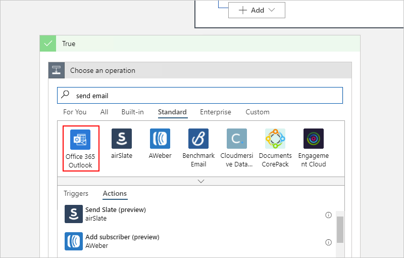

   * For personal Microsoft accounts, select **Outlook.com**.
   * For Azure work or school accounts, select **Office 365 Outlook**.

3. If you don't already have a connection, you're asked to sign in to your email account.

   Logic Apps creates a connection to your email account.

4. Rename the action with this description: ```Send email with travel time```

5. In the **To** box, enter the recipient's email address. For testing purposes, use your email address.

6. In the **Subject** box, specify the email's subject, and include the **travelTime** variable.

   1. Enter the text ```Current travel time (minutes):``` with a trailing space. 

   2. From either the parameter list or the dynamic content list, select **travelTime** under **Variables**.

      For example, if your browser is in narrow view:

      

7. In the **Body** box, specify the content for the email body.

   1. Enter the text ```Add extra travel time (minutes):``` with a trailing space.

   2. If necessary, widen your browser until the dynamic content list appears. In the dynamic content list, select **Expression**.

      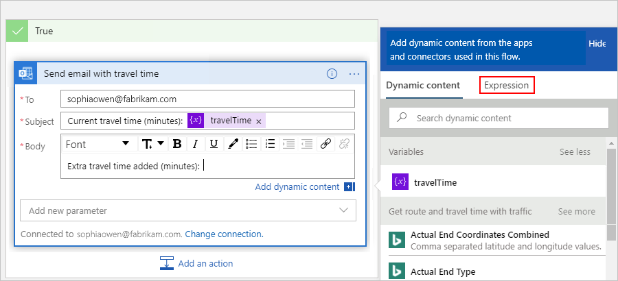

   3. In the expression editor, enter this expression so that you can calculate the number of minutes that exceed your limit: ```sub(,15)```

      

   4. Put your cursor inside the expression between the left parenthesis (**(**) and the comma (**,**). Select **Dynamic content**.

      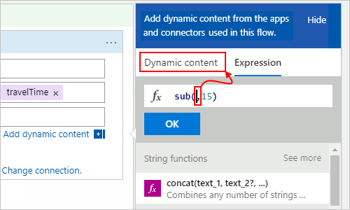

   5. Under **Variables**, select **travelTime**.

      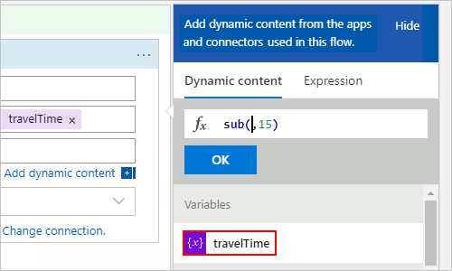

   6. After the field resolves inside the expression, select **OK**.

      

      The **Body** field now appears as shown here:

      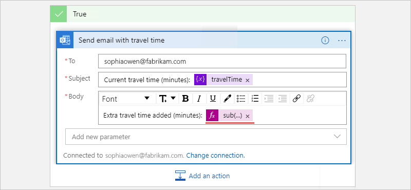

8. Save your logic app.

Next, test your logic app, which now looks similar to this example:

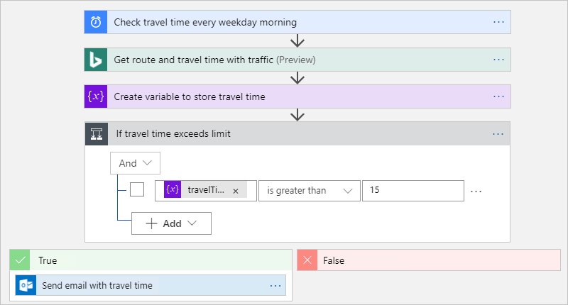

## Run your logic app

To manually start your logic app, on the designer toolbar bar, select **Run**. If the current travel time stays under your limit, your logic app does nothing else and waits or the next interval before checking again. But if the current travel time exceeds your limit, you get an email with the current travel time and the number of minutes above your limit. Here is an example email that your logic app sends:


If you don't get any emails, check your email's junk folder. Your email junk filter might redirect these kinds of mails. Otherwise, if you're unsure that your logic app ran correctly, see [Troubleshoot your logic app](../logic-apps/logic-apps-diagnosing-failures.md).

Congratulations, you've now created and run a schedule-based recurring logic app. 

To create other logic apps that use the **Schedule - Recurrence** trigger, check out these templates, which available after you create a logic app:

* Get daily reminders sent to you.
* Delete older Azure blobs.
* Add a message to an Azure Storage queue.

## Clean up resources

When no longer needed, delete the resource group that contains your logic app and related resources. On the main Azure menu, go to **Resource groups**, and select the resource group for your logic app. Select **Delete resource group**. Enter the resource group name as confirmation, and select **Delete**.

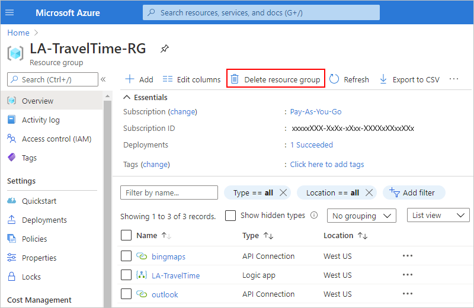

## Next steps

In this tutorial, you created a logic app that checks traffic based on a specified schedule (on weekday mornings), and takes action (sends email) when the travel time exceeds a specified limit. Now, learn how to build a logic app that sends mailing list requests for approval by integrating Azure services, Microsoft services, and other SaaS apps.

> [!div class="nextstepaction"]
> [Manage mailing list requests](../logic-apps/tutorial-process-mailing-list-subscriptions-workflow.md)
