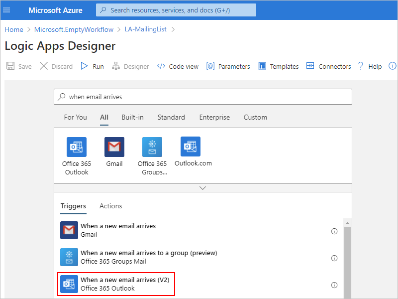
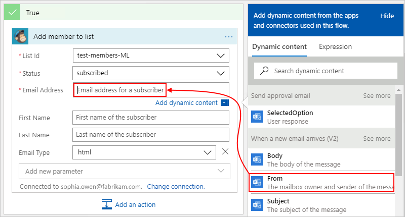
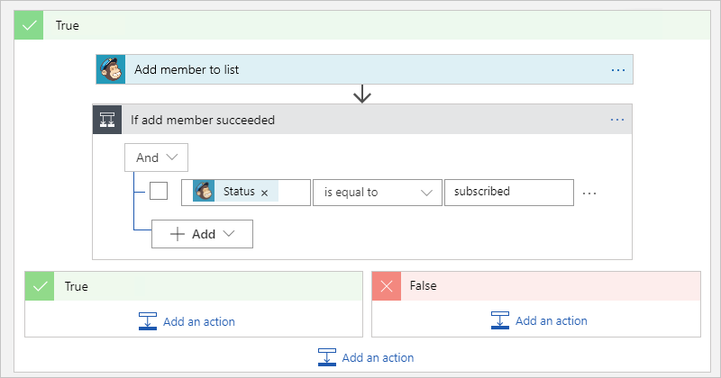
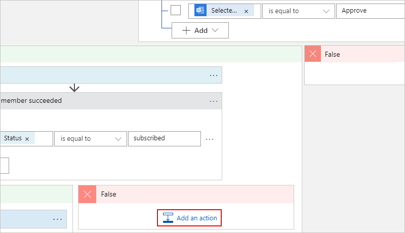
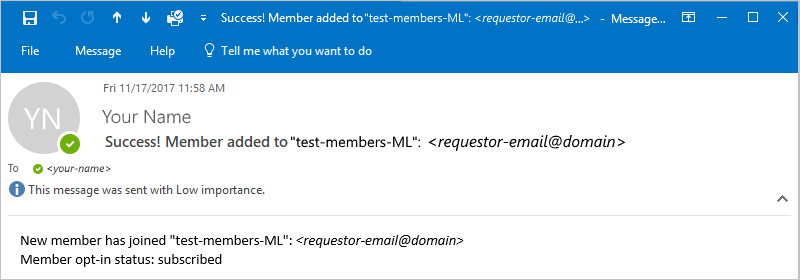

# Manage mailing list requests with Azure Logic Apps

Azure Logic Apps helps you automate workflows and integrate data
across Azure services, Microsoft services, 
other software-as-a-service (SaaS) apps, and on-premises systems. 
This tutorial shows how you can build a 
[logic app](../logic-apps/logic-apps-overview.md) 
that processes subscription requests for a mailing 
list managed by the [MailChimp](https://mailchimp.com/) service.
This logic app monitors an email account for these requests, 
sends these requests for approval, and adds approved members to the mailing list.

In this tutorial, you learn how to:

> [!div class="checklist"]
> * Create a blank logic app.
> * Add a trigger that monitors emails for subscription requests.
> * Add an action that sends emails for approving or rejecting these requests.
> * Add a condition that checks the approval response.
> * Add an action that adds approved members to the mailing list.
> * Add a condition that checks whether these members successfully joined the list.
> * Add an action that sends emails confirming whether these members successfully joined the list.

When you're done, your logic app looks like this workflow at a high level:


If you don't have an Azure subscription, 
<a href="https://azure.microsoft.com/free/" target="_blank">sign up for a free Azure account</a> 
before you begin.

## Prerequisites

* A MailChimp account. Create a list named "test-members-ML" 
where your logic app can add email addresses for approved members. 
If you don't have an account, [sign up for a free account](https://login.mailchimp.com/signup/) 
and learn [how to create  a list](https://us17.admin.mailchimp.com/lists/#). 

* An email account with Office 365 Outlook or Outlook.com, 
which support approval workflows. This article uses Office 365 Outlook. 
If you use a different email account, the general steps stay the same, 
but your UI might appear slightly different.

## Sign in to the Azure portal

Sign in to the <a href="https://portal.azure.com" target="_blank">Azure portal</a> 
with your Azure account credentials.

## Create your logic app

1. From the main Azure menu, 
choose **Create a resource** > **Enterprise Integration** > **Logic App**.

   

2. Under **Create logic app**, provide this information 
about your logic app as shown and described. 
When you're done, choose **Pin to dashboard** > **Create**.

   

   | Setting | Value | Description | 
   | ------- | ----- | ----------- | 
   | **Name** | LA-MailingList | The name for your logic app | 
   | **Subscription** | <*your-Azure-subscription-name*> | The name for your Azure subscription | 
   | **Resource group** | LA-MailingList-RG | The name for the [Azure resource group](../azure-resource-manager/resource-group-overview.md) used to organize related resources | 
   | **Location** | East US 2 | The region where to store information about your logic app | 
   | **Log Analytics** | Off | Keep the **Off** setting for diagnostic logging. | 
   |||| 

3. After Azure deploys your app, the Logic Apps Designer opens and shows a page 
with an introduction video and templates for common logic app patterns. 
Under **Templates**, choose **Blank Logic App**.

   

Next, add a [trigger](../logic-apps/logic-apps-overview.md#logic-app-concepts) 
that listens for incoming emails with subscription requests.
Every logic app must start with a trigger, 
which fires when a specific event happens or when new data meets 
a specific condition. For more information, see 
[Create your first logic app](../logic-apps/quickstart-create-first-logic-app-workflow.md).

## Add trigger to monitor emails

1. On the designer, enter "when email arrives" in the search box. 
Select the trigger for your email provider: 
**<*your-email-provider*> - When a new email arrives**
   
   

   * For Azure work or school accounts, select Office 365 Outlook.
   * For personal Microsoft accounts, select Outlook.com.

2. If you're asked for credentials, sign in to your email account 
so that Logic Apps can create a connection to your email account.

3. Now specify the criteria that the trigger checks in all new email.

   1. Specify the folder, interval, and frequency for checking emails.

      

      | Setting | Value | Description | 
      | ------- | ----- | ----------- | 
      | **Folder** | Inbox | The email folder to monitor | 
      | **Interval** | 1 | The number of intervals to wait between checks | 
      | **Frequency** | Hour | The unit of time for each interval between checks  | 
      |  |  |  | 

   2. Choose **Show advanced options**. In the **Subject Filter** box, 
   enter this text for the trigger to find in the email subject: ```subscribe-test-members-ML```

      

4. To hide the trigger's details for now, 
click the trigger's title bar.

   

5. Save your logic app. On the designer toolbar, choose **Save**.

   Your logic app is now live but doesn't do 
   anything other than check your incoming email. 
   So, add an action that responds when the trigger fires.

## Send approval email

Now that you have a trigger, add an 
[action](../logic-apps/logic-apps-overview.md#logic-app-concepts) 
that sends an email to approve or reject the request. 

1. Under the trigger, choose **+ New step** > **Add an action**. 
Search for "approval", and select this action: 
**<*your-email-provider*> - Send approval email**

   

2. Provide information for this action as shown and described: 

   

   | Setting | Value | Description | 
   | ------- | ----- | ----------- | 
   | **To** | <*approver-email-address*> | The approver's email address. For testing purposes, you can use your own address. | 
   | **User Options** | Approve, Reject | The response options that the approver can choose. By default, the approver can choose either "Approve" or "Reject" as their response. | 
   | **Subject** | Approve member request for test-members-ML | A descriptive email subject | 
   |  |  |  | 

   For now, ignore the dynamic content list or inline parameter 
   list that appears when you click inside specific edit boxes. 
   This list lets you select parameters from previous actions 
   that you can use as inputs in your workflow. 
   Your browser width determines which list appears. 
 
4. Save your logic app.

Next, add a condition to check the approver's chosen response.

## Check approval response

1. Under the **Send approval email** action, 
choose **+ New step** > **Add a condition**.

   The condition shape appears, along with any available 
   parameters that you can include as input to your workflow. 

2. Rename the condition with a better description.

   1. On the condition's title bar, 
   choose **ellipses** (**...**) button > **Rename**.

      For example, if your browser is in narrow view:

      

      If your browser is in wide view, 
      and the dynamic content list blocks access to the ellipses button, 
      close the list by choosing **Add dynamic content** inside the condition.

   2. Rename your condition with this description: ```If request approved```

3. Build a condition that checks whether the approver selected **Approve**:

   1. Inside the condition, click inside the **Choose a value** box, 
   which is on the left (wide browser view) or on top (narrow browser view).
   From either the parameter list or the dynamic content list, 
   select the **SelectedOption** field under **Send approval email**.

      For example, if you're working in wide view, 
      your condition looks like this example:

      

   2. In the comparison operator box, 
   select this operator: **is equal to**

   3. In the right (wide view) or bottom (narrow view) **Choose a value** box, 
   enter this value: ```Approve```

      When you're done, your condition looks like this example:

      

4. Save your logic app.

Next, specify the action that your logic app performs 
when the reviewer approves the request. 

## Add member to MailChimp list

Now, add an action that adds the approved member to your mailing list.

1. Inside the condition's **If true** branch, choose **Add an action**.
Search for "mailchimp", and select this action: **MailChimp - Add member to list**

   

3. If you're asked to sign in to your MailChimp account, 
sign in with your MailChimp credentials.

4. Provide information for this action as shown and described here:

   

   | Setting | Value | Description | 
   | ------- | ----- | ----------- | 
   | **List Id** | test-members-ML | The name for your MailChimp mailing list | 
   | **Status** | subscribed | The subscription status for the new member. For more information, see <a href="https://developer.mailchimp.com/documentation/mailchimp/guides/manage-subscribers-with-the-mailchimp-api/" target="_blank">Manage subscribers with the MailChimp API</a>. | 
   | **Email Address** | <*new-member-email-address*> | From either the parameter list or dynamic content list, select **From** under **When a new mail arrives**, which passes in the email address for the new member. 
   |  |  |  | 

5. Save your logic app.

Next, add a condition so that you can check whether 
the new member successfully joined your mailing list. 
That way, your logic app notifies you whether this 
operation succeeds or fails.

## Check for success or failure

1. In the **If true** branch, under the **Add member to list** action, 
choose **More...** > **Add a condition**.

2. Rename the condition with this description: ```If add member succeeded```

3. Build a condition that checks whether the approved 
member succeeds or fails in joining your mailing list:

   1. Inside the condition, click inside the **Choose a value** box, 
   which is on the left (wide browser view) or on top (narrow browser view).
   From either the parameter list or the dynamic content list, 
   select the **Status** field under **Add member to list**.

      For example, if you're working in wide view, 
      your condition looks like this example:

      

   2. In the comparison operator box, 
   select this operator: **is equal to**

   3. In the right (wide view) or bottom (narrow view) **Choose a value** box, 
   enter this value: ```subscribed```

   When you're done, your condition looks like this example:

   

Next, set up the emails to send when the approved 
member succeeds or fails in joining your mailing list.

## Send email if member added

1. In the **If true** branch for the condition **If add member succeeded**, 
choose **Add an action**.

   

2. Search for "outlook send email", 
and select this action: **<*your-email-provider*> - Send an email**

   

3. Rename the action with this description: ```Send email on success```

4. Provide information for this action as shown and described:

   

   | Setting | Value | Description | 
   | ------- | ----- | ----------- | 
   | **To** | <*your-email-address*> | The email address for where to send the success email. For testing purposes, you can use your own email address. | 
   | **Subject** | <*subject-for-success-email*> | The subject for the success email. For this tutorial, enter this text and select the specified field under **Add member to list** from the parameter list or dynamic content list: <p>"Success! Member added to 'test-members-ML': **Email Address**" | 
   | **Body** | <*body-for-success-email*> | The body content for the success email. For this tutorial, enter this text and select the specified fields under **Add member to list** from the parameter list or dynamic content list:  <p>"New member has joined 'test-members-ML': **Email Address**"</br>"Member opt-in status: **Status**" | 
   | | | | 

5. Save your logic app.

## Send email if member not added

1. In the **If false** branch for the condition **If add member succeeded**, 
choose **Add an action**.

   

2. Search for "outlook send email", 
and select this action: **<*your-email-provider*> - Send an email**

   

3. Rename the action with this description: ```Send email on failure```

4. Provide information for this action as shown and described here:

   

   | Setting | Value | Description | 
   | ------- | ----- | ----------- | 
   | **To** | <*your-email-address*> | The email address for where to send the failure email. For testing purposes, you can use your own email address. | 
   | **Subject** | <*subject-for-failure-email*> | The subject for the failure email. For this tutorial, enter this text and select the specified field under **Add member to list** from the parameter list or dynamic content list: <p>"Failed, member not added to 'test-members-ML': **Email Address**" | 
   | **Body** | <*body-for-failure-email*> | The body content for the failure email. For this tutorial, enter this text: <p>"Member might already exist. Check your MailChimp account." | 
   | | | | 

5. Save your logic app. 

Next, test your logic app, which now looks similar to this example:

 

## Run your logic app

1. Send yourself an email request to join your mailing list.
Wait for the request to appear in your inbox.

3. To manually start your logic app, 
on the designer toolbar bar, choose **Run**. 

   If your email has a subject that matches the trigger's subject filter, 
   your logic app sends you email to approve the subscription request.

4. In the approval email, choose **Approve**.

5. If the subscriber's email address doesn't exist on your mailing list, 
your logic app adds that person's email address and sends you an email 
like this example:

   

   If your logic app can't add the subscriber, 
   you get an email like this example:

   

   If you don't get any emails, check your email's junk folder. 
   Your email junk filter might redirect these kinds of mails. 
   Otherwise, if you're unsure that your logic app ran correctly, 
   see [Troubleshoot your logic app](../logic-apps/logic-apps-diagnosing-failures.md).

Congratulations, you've now created and run a logic app that 
integrates information across Azure, Microsoft services, and other SaaS apps.

## Clean up resources

When no longer needed, delete the resource group that contains your logic app and related resources. 
On the main Azure menu, go to **Resource groups**, and select the resource group for your logic app. 
Choose **Delete resource group**. Enter the resource group name as confirmation, and choose **Delete**.


## Get support

* For questions, visit the [Azure Logic Apps forum](https://social.msdn.microsoft.com/Forums/en-US/home?forum=azurelogicapps).
* To submit or vote on feature ideas, visit the [Logic Apps user feedback site](https://aka.ms/logicapps-wish).

## Next steps

In this tutorial, you created a logic app that manages approvals for mailing list requests. 
Now, learn how to build a logic app that processes and stores email attachments by 
integrating Azure services, such as Azure Storage and Azure Functions.

> [!div class="nextstepaction"]
> [Process email attachments](../logic-apps/tutorial-process-email-attachments-workflow.md)
