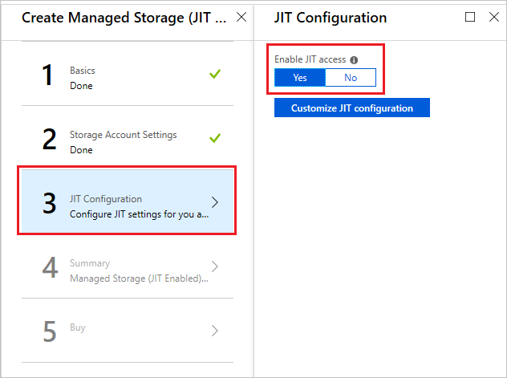
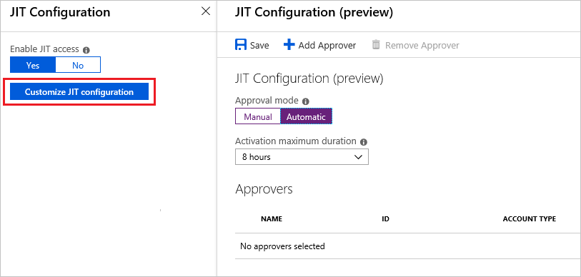
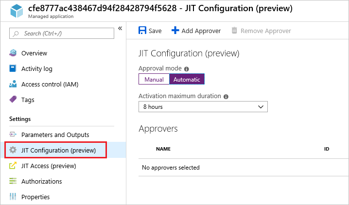
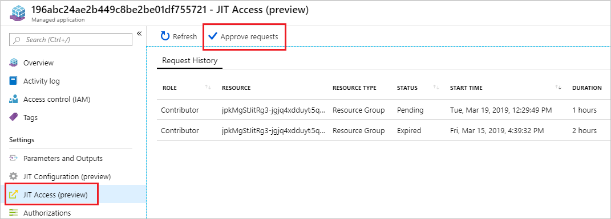

# Approve just-in-time access for Azure Managed Applications

Note: Customers looking to make use of the JIT feature on managed applications should have Azure Active Directory P2 license. For more information, please check here: https://docs.microsoft.com/en-us/azure/active-directory/privileged-identity-management/subscription-requirements

Login as customer on the Azure portal – https://portal.azure.com
Configure JIT access during deployment
Select a marketplace entry for a managed application offer with JIT capability and click ‘Create’.
During the create experience, the 'JIT Configuration' step allows you to enable and disable JIT access for the Managed Application. Managed Applications with the JIT access capability will have JIT access enabled by default. Select ‘Yes’ for the 'Enable JIT Access' option to enable JIT access on the managed application enabled by default)

JIT Access for a Managed Application can only be enabled at deployment and cannot be changed later. Configuration for your Managed Application’s JIT access once it is enabled may be changed any time.
 

If you want to customize the JIT configuration settings, click on ‘Customize JIT Configuration’ button.

Approval Mode: Automatic will notify approvers that a request was received and approved automatically. Manual will notify approvers that a request was received and that it is waiting for them to approve it.
Activation maximum duration: The maximum amount of time a service provider can request to have elevated access to the Managed Application’s resources. 
Approvers: Azure Active Directory users that can approve of JIT Access requests sent by a Managed Application’s service provider.
After updating the configuration, click on ‘Save’ button to save the settings.
If you do not click on the Customize JIT Configuration’ button, the default configuration will be as follows:
	JIT request approval mode – Auto Approval
	Maximum access duration – 8 hours
	Approvers – None

Configure JIT access after deployment
 
On the manage application blade:
•	Open the 'JIT Configuration' menu item to configure JIT settings

 
Approving a JIT request from a service provider
NOTE: Customers looking to make use of the JIT feature on managed applications should have Azure Active Directory P2 license. For more information, please check here: https://docs.microsoft.com/en-us/azure/active-directory/privileged-identity-management/subscription-requirements
JIT Access Requests can be approved either directly on each Managed Application, or across all Managed Applications inside of the Azure AD Privileged Identity Management service.

Approve a JIT Request directly on the Managed Application
Open the ‘JIT Access’ menu item on the Managed Application you want to approve JIT Access Requests for.

 
Click on the ‘Approve Requests’ button on the top. It will open a new blade with title ‘Privileged Identity Management – Approve requests’.

 
Select the request to be approved (based on the name of the managed application), and in the new form that opens, provide the reason for the approval and click on ‘Approve’ button.

Approve JIT Requests in Azure AD Privileged Identity Management
Navigate to the ‘Azure AD Privileged Identity Management’ service by viewing all services in Azure.

 

Click on the 'Approve Request' menu item and in the newly opened blade, click on the ‘Azure managed applications’ menu item

## Known issues
 
•	The JIT requestor’s principal Id in the ISV tenants should explicitly be part of the application package. It is not enough for this user to be part of a security group. This is a temporary limitation that will be fixed in the future releases of this feature.

## Next steps

