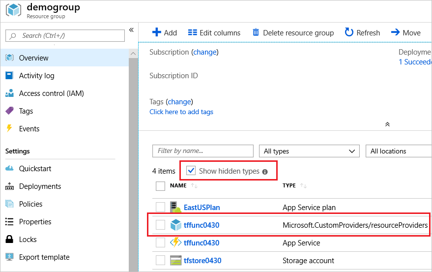

# Tutorial: Create custom provider and deploy custom resources

In this tutorial, you create your own resource provider and deploy custom resource types from that resource provider. For more information about creating custom providers, see [Azure Custom Providers Preview overview](custom-providers-overview.md).

## Deploy custom provider

Deploy to your Azure subscription an [example solution](https://github.com/raosuhas/managedapps-intro/blob/master/CustomRPWithFunction/azuredeploy.json). The template sets up your environment for the custom provider.

After deploying the template, your subscription has:

* Function App with the operations for resources and actions.
* Storage Account for storing users that are created through the custom provider.
* Custom Provider that defines the custom resource types and actions. It uses the function app endpoint for sending requests.
* Custom resource.

To deploy the custom provider with PowerShell, use:

```azurepowershell-interactive
$rgName = <resource-group-name>
$funcName = <function-app-name>


New-AzResourceGroup -Name $rgName -Location eastus
New-AzResourceGroupDeployment -ResourceGroupName $rgName -TemplateUri https://raw.githubusercontent.com/raosuhas/managedapps-intro/master/CustomRPWithFunction/azuredeploy.json -funcname $funcName
```

Or, you can deploy the solution with the following button:

<a href="https://portal.azure.com/#create/Microsoft.Template/uri/https%3A%2F%2Fraw.githubusercontent.com%2Fraosuhas%2Fmanagedapps-intro%2Fmaster%2FCustomRPWithFunction%2Fazuredeploy.json" target="_blank">
    
</a>

## View custom provider

The custom provider is a hidden Azure resource type. To confirm that the resource provider has been deployed, check the box that says **Show hidden types** in the Azure portal.



To see the custom resource type that you deployed, use the GET operation on your resource provider.

With ARMClient, use:

```powershell
$subID = (Get-AzContext).Subscription.Id
$requestURI = "https://management.azure.com/subscriptions/$subID/resourceGroups/$rgName/providers/Microsoft.CustomProviders/resourceProviders/$funcName/users?api-version=2018-09-01-preview"

armclient get $requestURI
```

You receive the response:

```json
{
  "value": [
    {
      "properties": {
        "provisioningState": "Succeeded",
        "FullName": "Santa Claus",
        "Location": "NorthPole"
      },
      "id": "/subscriptions/<sub-id>/resourceGroups/<rg-name>/providers/Microsoft.CustomProviders/resourceProviders/<provider-name>/users/santa",
      "name": "santa",
      "type": "Microsoft.CustomProviders/resourceProviders/users"
    }
  ]
}
```

## Call action

The code that enables this process is all implemented as part of the function app that is deployed with the template. The ping action replies with a greeting.

To make a ping request using our new Custom Provider, we'll make a POST call with armclient to our Custom Provider instance:

```powershell
$pingURI = "https://management.azure.com/subscriptions/$subID/resourceGroups/$rgName/providers/Microsoft.CustomProviders/resourceProviders/$funcName/ping?api-version=2018-09-01-preview"

 armclient post $pingURI
```

You receive the response:

```json
{
  "pingcontent": {
    "source": "<function-name>.azurewebsites.net"
  },
  "message": "hello <function-name>.azurewebsites.net"
}
```


## Create resource type

To make a new User request using the Custom Provider, we make a PUT call with armclient to our Custom Provider, passing the parameters for a new user in the body:

```powershell
 $addURI = "https://management.azure.com/subscriptions/$subID/resourceGroups/$rgName/providers/Microsoft.CustomProviders/resourceProviders/$funcName/users/testuser?api-version=2018-09-01-preview"
$requestBody = "{'properties':{'FullName': 'Test User', 'Location': 'Earth'}}"

armclient put $addURI $requestBody
```

You receive the response:

```json
{
  "properties": {
    "provisioningState": "Succeeded",
    "FullName": "Test User",
    "Location": "Earth"
  },
  "id": "/subscriptions/<sub-ID>/resourceGroups/<rg-name>/providers/Microsoft.CustomProviders/resourceProviders/<provider-name>/users/testuser",
  "name": "testuser",
  "type": "Microsoft.CustomProviders/resourceProviders/users"
}
```

Our Custom Provider will make a PUT call on its declared endpoint, the function we deployed in our template, which will add a new user to the storage account we created. 
 
## Next steps

* For an introduction to managed applications, see [Managed application overview](overview.md).
* For information about publishing a Service Catalog managed application, see [Create and publish a Service Catalog managed application](publish-service-catalog-app.md).