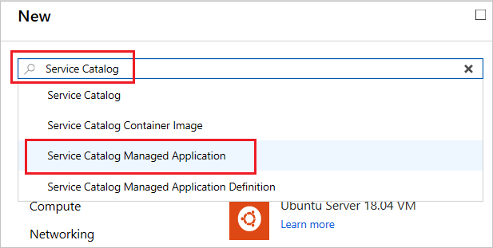
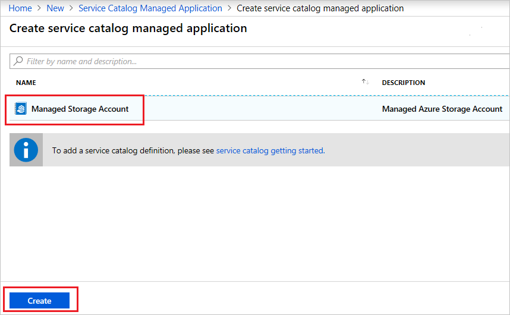
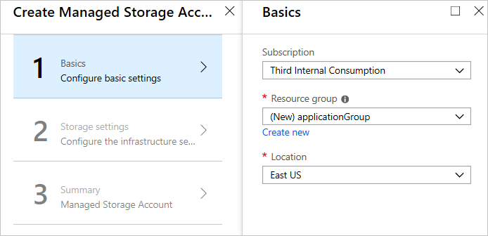
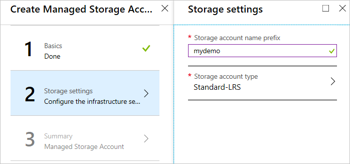
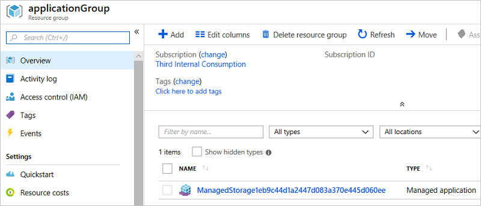

# Deploy service catalog app through Azure portal

After your organization has published managed application definitions, you can deploy those service catalog apps through the Azure portal. 

## Prerequisites

You need a published managed application definition. If your organization hasn't published one, see [Publish an Azure managed application definition](publish-managed-app-definition-quickstart.md).

## Create service catalog app

1. In the portal, select **Create a resource**.

   

1. Search for **Service Catalog Managed Application**.

   

1. Select **Create**.

   

1. From the available service catalog apps, select the one you want to deploy. Select **Create**.

   

1. Provide values for the **Basics** tab. Create a new resource group named **applicationGroup**. When finished, select **OK**.

   

1. Provide values for the storage account. When finished, select **OK**.

   

1. Review the summary. After validation succeeds, select OK to begin deployment.

   

## View results

After the service catalog app has been deployed, you have two new resource groups.

1. View the resource group named **applicationGroup** to see the managed application instance.

   

1. View the resource group named **applicationGroup{hash-characters}** to see the resources for the managed application.

   

## Next steps

* To learn how to create the definition files for a managed application, see [Create and publish a managed application definition](publish-service-catalog-app.md).
* For Azure CLI, see [Deploy service catalog app with Azure CLI](./scripts/managed-application-cli-sample-create-application.md).
* For PowerShell, see [Deploy service catalog app with PowerShell](./scripts/managed-application-poweshell-sample-create-application.md).