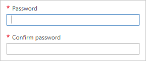
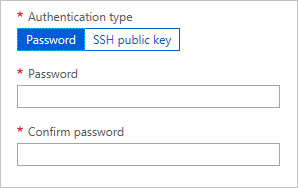
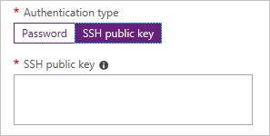

# Microsoft.Compute.CredentialsCombo UI element
A group of controls with built-in validation for Windows and Linux passwords and SSH public keys.

## UI sample

For Windows, users see:



For Linux with password selected, users see:



For Linux with SSH public key selected, users see:



## Schema
For Windows, use the following schema:

```json
{
  "name": "element1",
  "type": "Microsoft.Compute.CredentialsCombo",
  "label": {
    "password": "Password",
    "confirmPassword": "Confirm password"
  },
  "toolTip": {
    "password": ""
  },
  "constraints": {
    "required": true,
    "customPasswordRegex": "^(?=.*[A-Za-z])(?=.*\\d)[A-Za-z\\d]{12,}$",
    "customValidationMessage": "The password must contain at least 12 characters, with at least 1 letter and 1 number."
  },
  "options": {
    "hideConfirmation": false
  },
  "osPlatform": "Windows",
  "visible": true
}
```

For **Linux**, use the following schema:

```json
{
  "name": "element1",
  "type": "Microsoft.Compute.CredentialsCombo",
  "label": {
    "authenticationType": "Authentication type",
    "password": "Password",
    "confirmPassword": "Confirm password",
    "sshPublicKey": "SSH public key"
  },
  "toolTip": {
    "authenticationType": "",
    "password": "",
    "sshPublicKey": ""
  },
  "constraints": {
    "required": true,
    "customPasswordRegex": "^(?=.*[A-Za-z])(?=.*\\d)[A-Za-z\\d]{12,}$",
    "customValidationMessage": "The password must contain at least 12 characters, with at least 1 letter and 1 number."
  },
  "options": {
    "hideConfirmation": false,
    "hidePassword": false
  },
  "osPlatform": "Linux",
  "visible": true
}
```

## Remarks
- `osPlatform` must be specified, and can be either **Windows** or **Linux**.
- If `constraints.required` is set to **true**, then the password or SSH public key text boxes must have values to validate successfully. The default value is **true**.
- If `options.hideConfirmation` is set to **true**, then the second text box for confirming the user's password is hidden. The default value is **false**.
- If `options.hidePassword` is set to **true**, then the option to use password authentication is hidden. It can be used only when `osPlatform` is **Linux**. The default value is **false**.
- Additional constraints on the allowed passwords can be implemented by using the `customPasswordRegex` property. The string in `customValidationMessage` is displayed when a password fails custom validation. The default value for both properties is **null**.

## Sample output
If `osPlatform` is **Windows**, or `osPlatform` is **Linux** and the user provided a password instead of an SSH public key, the control returns the following output:

```json
{
  "authenticationType": "password",
  "password": "p4ssw0rd!dem0",
}
```

If `osPlatform` is **Linux** and the user provided an SSH public key, the control returns the following output:

```json
{
  "authenticationType": "sshPublicKey",
  "sshPublicKey": "AAAAB3NzaC1yc2EAAAABIwAAAIEA1on8gxCGJJWSRT4uOrR13mUaUk0hRf4RzxSZ1zRbYYFw8pfGesIFoEuVth4HKyF8k1y4mRUnYHP1XNMNMJl1JcEArC2asV8sHf6zSPVffozZ5TT4SfsUu/iKy9lUcCfXzwre4WWZSXXcPff+EHtWshahu3WzBdnGxm5Xoi89zcE=",
}
```

## Next steps
* For an introduction to creating UI definitions, see [Getting started with CreateUiDefinition](create-uidefinition-overview.md).
* For a description of common properties in UI elements, see [CreateUiDefinition elements](create-uidefinition-elements.md).
