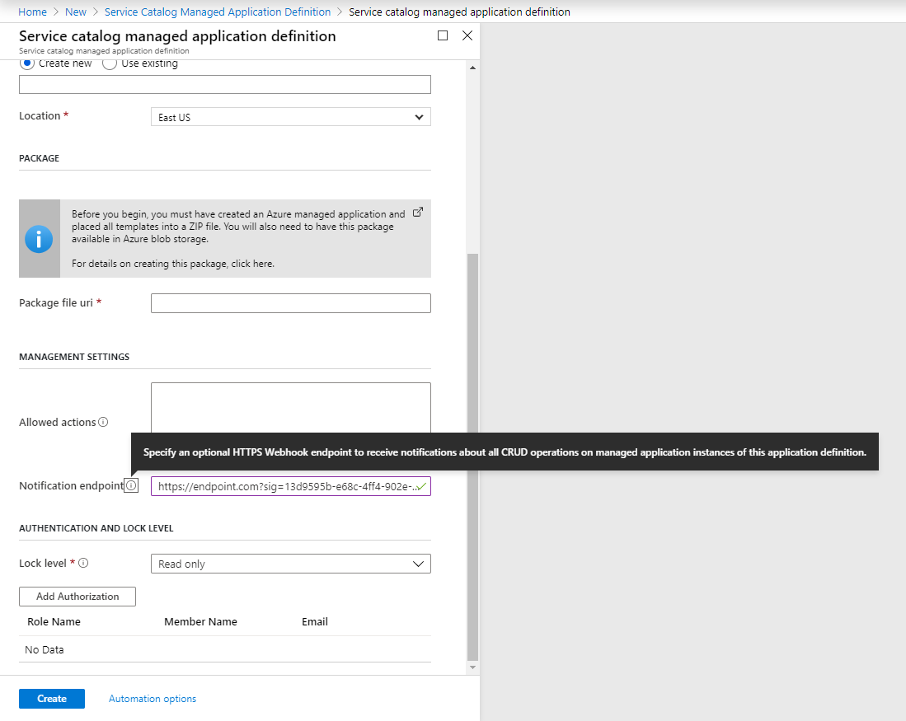
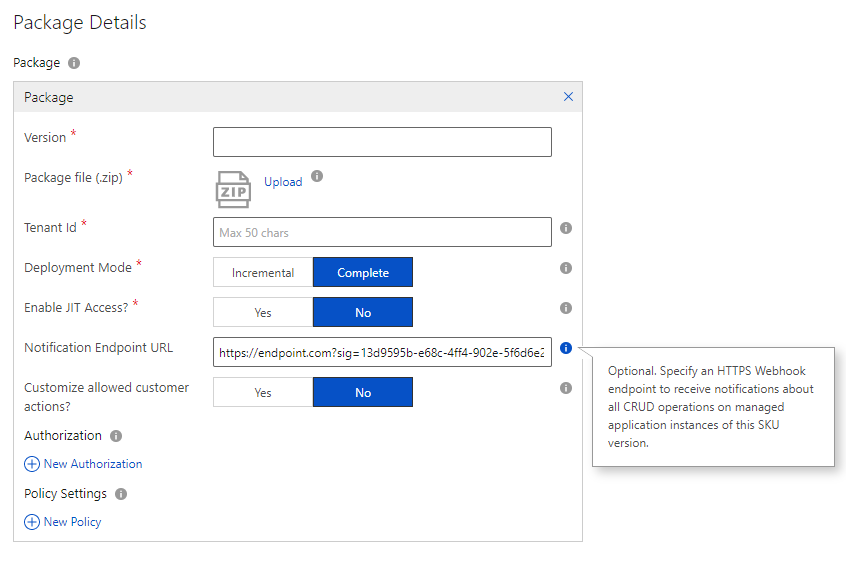

# Azure Managed Application with Notifications

Azure managed application notifications allow publisher to automate actions based on lifecycle events of the managed application instances. Publishers can specify custom notification webhook endpoints to receive event notifications about new and existing managed application instances. It allows the publisher to set up custom workflows at the time of application provisioning, updates, and deletion.

## Getting Started
To start receiving managed applications, spin up a public HTTPS endpoint and specify it when publishing the Service Catalog application definition or the Marketplace offer.

Here are the recommended series of steps to get up and running quickly:
- Spin up a public HTTPS endpoint that logs the incoming POST requests and returns `200 OK`.
- Add the endpoint to service catalog application definition or marketplace offer as explained below.
- Create a managed application instance that references the application definition or the marketplace offer.
- Validate that the notifications are being received successfully.
- Enable authorization as explained in the **Endpoint Authentication** section below.
- Follow the **Notification Schema** documentation below to parse the notification requests and implement your business logic based on the notification.

## Adding Service Catalog Application Definition Notifications
#### Azure portal
Please read [Publish a service catalog application through Azure portal](./publish-portal.md) to get started.


#### REST API

> [!NOTE]
> Currently only one endpoint is supported as part of the **notificationEndpoints** in the application definition properties

``` JSON
    {
      "properties": {
        "isEnabled": true,
        "lockLevel": "ReadOnly",
        "displayName": "Sample Application Definition",
        "description": "Notification-enabled application definition.",
        "notificationPolicy": {
            "notificationEndpoints": [
                {
                    "uri": "https://isv.azurewebsites.net:1214?sig=unique_token"
                }
            ]
        },
        "authorizations": [
          {
            "principalId": "d6b7fbd3-4d99-43fe-8a7a-f13aef11dc18",
            "roleDefinitionId": "8e3af657-a8ff-443c-a75c-2fe8c4bcb635"
          },
        ...

```
## Adding Marketplace Managed Application Notifications
For more information please see [Create an Azure application offer](../marketplace/cloud-partner-portal/azure-applications/cpp-create-offer.md).


## Event Triggers
The following table describes all the possible combinations of EventType + ProvisioningState and their triggers:

EventType | ProvisioningState | Trigger for notification
---|---|---
PUT | Accepted | Managed resource group has been created and projected successfully after application PUT. (Before the deployment inside the managed RG is kicked off.)
PUT | Succeeded | Full provisioning of the managed application succeeded after a PUT.
PUT | Failed | Failure of PUT of application instance provisioning at any point.
PATCH | Succeeded | After successful PATCH on managed application instance to update tags, jit access policy, or managed identity.
DELETE | Deleting | As soon as the user initiates a DELETE of a managed app instance.
DELETE | Deleted | After the full and successful deletion of the managed application.
DELETE | Failed | After any error during the deprovisioning process that blocks the deletion.
## Notification Schema
When you spin up your webhook endpoint to handle notifications, you'll need to parse the payload to get important properties to then act upon the notification. Both Service Catalog and Marketplace managed application notifications provide many of the same properties  with the small difference outlined below.

#### Service Catalog Application Notification Schema
Here's a sample service catalog notification after a successful provisioning of a managed application instance.
``` HTTP
POST https://{your_endpoint_URI}/resource?{optional_parameter}={optional_parameter_value} HTTP/1.1

{
    "eventType": "PUT",
    "applicationId": "subscriptions/<subId>/resourceGroups/<rgName>/providers/Microsoft.Solutions/applications/<applicationName>",
    "eventTime": "2019-08-14T19:20:08.1707163Z",
    "provisioningState": "Succeeded",
    "applicationDefinitionId": "subscriptions/<subId>/resourceGroups/<rgName>/providers/Microsoft.Solutions/applicationDefinitions/<appDefName>"    
}

```

If the provisioning fails, a notification with the error details will be sent to the specified endpoint.

``` HTTP
POST https://{your_endpoint_URI}/resource?{optional_parameter}={optional_parameter_value} HTTP/1.1

{
    "eventType": "PUT",
    "applicationId": "subscriptions/<subId>/resourceGroups/<rgName>/providers/Microsoft.Solutions/applications/<applicationName>",
    "eventTime": "2019-08-14T19:20:08.1707163Z",
    "provisioningState": "Failed",
    "applicationDefinitionId": "subscriptions/<subId>/resourceGroups/<rgName>/providers/Microsoft.Solutions/applicationDefinitions/<appDefName>",
    "error": {
        "code": "ErrorCode",
        "message": "error message",
        "details": [
            {
                "code": "DetailedErrorCode",
                "message": "error message"
            }
        ]
    }
}

```

#### Marketplace Application Notification Schema

Here's a sample service catalog notification after a successful provisioning of a managed application instance.
``` HTTP
POST https://{your_endpoint_URI}/resource?{optional_parameter}={optional_parameter_value} HTTP/1.1

{
    "eventType": "PUT",
    "applicationId": "subscriptions/<subId>/resourceGroups/<rgName>/providers/Microsoft.Solutions/applications/<applicationName>",
    "eventTime": "2019-08-14T19:20:08.1707163Z",
    "provisioningState": "Succeeded",
    "plan": {
        "publisher": "publisherId",
        "product": "offer",
        "name": "skuName",
        "version": "1.0.1"
    }
}

```

If the provisioning fails, a notification with the error details will be sent to the specified endpoint.

``` HTTP
POST https://{your_endpoint_URI}/resource?{optional_parameter}={optional_parameter_value} HTTP/1.1

{
    "eventType": "PUT",
    "applicationId": "subscriptions/<subId>/resourceGroups/<rgName>/providers/Microsoft.Solutions/applications/<applicationName>",
    "eventTime": "2019-08-14T19:20:08.1707163Z",
    "provisioningState": "Failed",
    "plan": {
        "publisher": "publisherId",
        "product": "offer",
        "name": "skuName",
        "version": "1.0.1"
    },
    "error": {
        "code": "ErrorCode",
        "message": "error message",
        "details": [
            {
                "code": "DetailedErrorCode",
                "message": "error message"
            }
        ]
    }
}

```

Parameter | Description
---|---
eventType | The type of event that triggered the notification. (e.g. "PUT", "PATCH", "DELETE")
applicationId | The fully qualified resource identifier of the managed application for which the notification was triggered. 
eventTime | The timestamp of the event that triggered the notification. (Date and time in UTC ISO 8601 format.)
provisioningState | The provisioning state of the managed application instance. (e.g. "Succeeded", "Failed", "Deleting", "Deleted")
error | *Only specified when the provisioningState is Failed*. Contains the error code, message, and details of the issue that caused the failure.
applicationDefinitionId | *Only specified for Service Catalog managed applications*. Represents the fully qualified resource identifier of the application definition for which the managed application instance was provisioned.
plan | *Only specified for Marketplace managed applications*. Represents the publisher, offer, sku, and version of the managed application instance.

## Endpoint Authentication
To secure the webhook endpoint and ensure the authenticity of the notification:
- Provide a query parameter on top of the webhook URI like https://your-endpoint.com?sig=Guid. With each notification, do a quick check that the query parameter `sig` has the expected value `Guid`.
- Issue a GET on the managed application instance with applicationId. Validate that the provisioningState matches the provisioningState of the notification to ensure consistency.

## Notification Retries

The Managed Application Notification service expects a `200 OK` response from the webhook endpoint to the notification. The notification service will retry if the webhook endpoint returns an HTTP error code >=500, 429 or if the endpoint is temporarily unreachable. If the webhook endpoint doesn't become available within 10 hours, the notification message will be dropped and the retries will stop.

