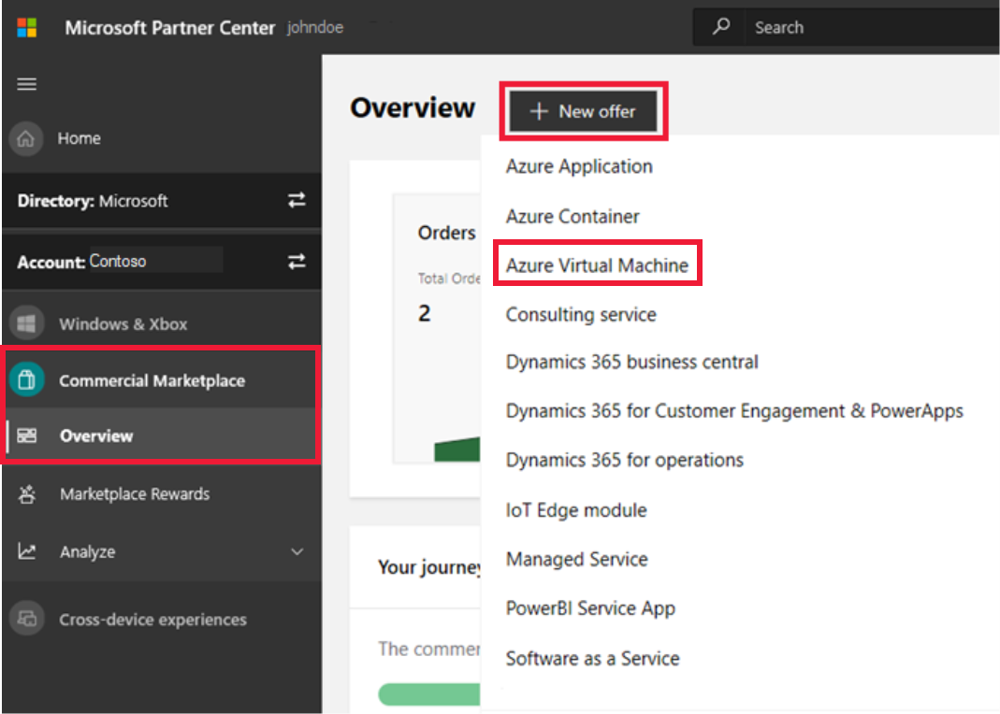

# Create a virtual machine offer on Azure Marketplace

This article describes how to create and publish an Azure virtual machine offer to [Azure Marketplace](https://azuremarketplace.microsoft.com/). It addresses both Windows-based and Linux-based virtual machines that contain an operating system, a virtual hard disk (VHD), and up to 16 data disks.

Before you start, [Create a commercial marketplace account in Partner Center](create-account.md). Ensure that your account is enrolled in the commercial marketplace program.

## Before you begin

If you haven't done so yet, review [Plan a virtual machine offer](marketplace-virtual-machines.md). It will explain the technical requirements for your virtual machine and list the information and assets you’ll need when you create your offer. Also review this Azure virtual machine material:

- Quickstart guides
  - [Azure quickstart templates](https://azure.microsoft.com/resources/templates/)
  - [GitHub Azure quickstart templates](https://github.com/azure/azure-quickstart-templates)
- Tutorials
  - [Linux VMs](../virtual-machines/linux/tutorial-manage-vm.md)
  - [Windows VMs](../virtual-machines/windows/tutorial-manage-vm.md)
- Samples
  - [Azure CLI samples for Linux VMs](../virtual-machines/linux/cli-samples.md)
  - [Azure PowerShell for Linux VMs](../virtual-machines/linux/powershell-samples.md)
  - [Azure CLI samples for Windows VMs](../virtual-machines/windows/cli-samples.md)
  - [Azure PowerShell for Windows VMs](../virtual-machines/scripts/virtual-machines-windows-powershell-sample-create-vm-quick.md)

## Fundamentals in technical knowledge

The process of designing, building, and testing offers takes time and requires expertise in both the Azure platform and the technologies that are used to build your offer.

Your engineering team should have a basic understanding and working knowledge of the following Microsoft technologies:

- [Azure services](https://azure.microsoft.com/services/)
- [Design and architecture of Azure applications](https://azure.microsoft.com/solutions/architecture/)
- [Azure Virtual Machines](https://azure.microsoft.com/services/virtual-machines/), [Azure Storage](https://azure.microsoft.com/services/?filter=storage#storage), and [Azure Networking](https://azure.microsoft.com/services/?filter=networking#networking)

## Create a new offer

1. Sign in to [Partner Center](https://partner.microsoft.com/dashboard/home).
2. On the left pane, select **Commercial Marketplace** > **Overview**.
3. On the **Overview** page, select **New offer** > **Azure Virtual Machine**.

    

> [!NOTE]
> After your offer is published, any edits you make to it in Partner Center appear on Azure Marketplace only after you republish the offer. Be sure to always republish an offer after making changes to it.

Enter an **Offer ID**. This is a unique identifier for each offer in your account.

- This ID is visible to customers in the web address for the Azure Marketplace offer and in Azure PowerShell and the Azure CLI, if applicable.
- Use only lowercase letters and numbers. The ID can include hyphens and underscores, but no spaces, and is limited to 50 characters. For example, if you enter **test-offer-1**, the offer web address will be `https://azuremarketplace.microsoft.com/marketplace/../test-offer-1`.
- The Offer ID can't be changed after you select **Create**.

Enter an **Offer alias**. The offer alias is the name that's used for the offer in Partner Center.

- This name isn't used on Azure Marketplace. It is different from the offer name and other values that are shown to customers.

## Test Drive

A *Test Drive* is a demonstration that showcases your offer to potential customers. It gives them the option to "try before you buy" for a fixed period of time, which can help increase your conversions and generate highly qualified leads.

To enable a Test Drive, select the **Enable a test drive** check box on the **Offer setup** pane. To remove the Test Drive from your offer, clear the check box.

Additional Test Drive resources:

- [Marketing best practices](what-is-test-drive.md)
- [Technical best practices](https://github.com/Azure/AzureTestDrive/wiki/Test-Drive-Best-Practices)
- [Test drive overview](https://assetsprod.microsoft.com/mpn/azure-marketplace-appsource-test-drives.pdf) PDF file (make sure that your pop-up blocker is turned off)

## Configure lead management

When you're publishing your offer to the commercial marketplace with Partner Center, connect it to your Customer Relationship Management (CRM) system. This lets you receive customer contact information as soon as someone expresses interest in or uses your product. Connecting to a CRM is required if you want to enable a Test Drive (see the preceding section). Otherwise, connecting to a CRM is optional.

1. Select a lead destination where you want us to send customer leads. Partner Center supports the following CRM systems:
    - [Dynamics 365](partner-center-portal/commercial-marketplace-lead-management-instructions-dynamics.md) for customer engagement
    - [Marketo](partner-center-portal/commercial-marketplace-lead-management-instructions-marketo.md)
    - [Salesforce](partner-center-portal/commercial-marketplace-lead-management-instructions-salesforce.md)

    > [!NOTE]
    > If your CRM system isn't listed here, use [Azure Table storage](partner-center-portal/commercial-marketplace-lead-management-instructions-azure-table.md) or an [HTTPS endpoint](partner-center-portal/commercial-marketplace-lead-management-instructions-https.md) to store your customer lead data. Then export the data to your CRM system.

1. Connect your offer to the lead destination when you're publishing in Partner Center.
1. Confirm that the connection to the lead destination is configured properly. After you publish it in Partner Center, Microsoft validates the connection and sends you a test lead. While you're previewing the offer before it goes live, you can also test your lead connection by trying to deploy the offer yourself in the preview environment.
1. Ensure that the connection to the lead destination stays updated so that you don't lose any leads.

## Resell through CSPs

Expand the reach of your offer by making it available to partners in the [Cloud Solution Provider (CSP)](https://azure.microsoft.com/offers/ms-azr-0145p/) program. All Bring-your-own-license (BYOL) plans are automatically opted in to the program. You can also choose to opt in your non-BYOL plans.

Select **Create** to generate the offer and continue.

## Next steps

- [Configure VM offer properties](azure-vm-create-properties.md)