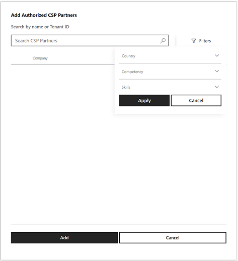
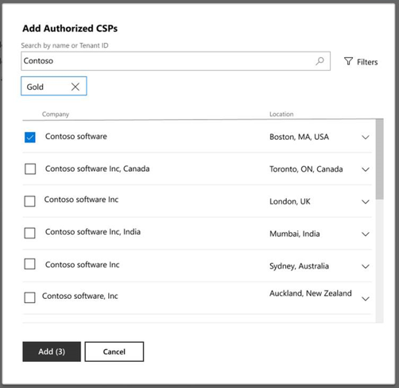

# Cloud Solution Provider program

This article explains how to configure your offer to be available to the Cloud Solution Provider (CSP) program. In addition to publishing your offers through [commercial marketplace web storefronts](comparing-appsource-azure-marketplace.md), you can also sell through the CSP program to reach millions of qualified Microsoft customers that the program serves.

You can configure new or existing offers for availability in the CSP program on an opt-in basis, which allows CSP partners sell your products and create bundled solutions for customers.

Publishers are responsible for providing break-fix support to end customers and for providing a mechanism for partners in the CSP program and/or customers to contact you for support. It is a best practice to provide partners in the CSP program with user documentation, training, and service health/outage notifications (as applicable) so that partners in the CSP program are equipped to handle tier 1 support requests from customers.  

The following offers are eligible to be opted in to be sold by partners in the CSP program:

- Software-as-a-Service (SaaS) transact offers
- Virtual Machines (VMs)
- Solution templates
- Managed applications

> [!NOTE]
> Containers and Bring Your Own License (BYOL) VM SKUs are opted in to be sold by partners in the CSP program by default.

## How to configure an offering

The CSP program opt-in setting is configured in the Partner Center or Cloud Partner Portal offer creation experience. [Learn more about the changing publisher experience](https://www.microsoftpartnercommunity.com/t5/Azure-Marketplace-and-AppSource/Cloud-Marketplace-In-Partner-Center/m-p/9738#M293).

### Partner Center opt-in

In Partner Center, you'll find the opt-in experience under the CSP Reseller audience module.

In the CSP Reseller audience module, you have three options to choose from:

- Option one: Any partner in the CSP program
- Option two: Specific partners in the CSP program I select
- Option three: No partners in the CSP program

#### Option one: Any partner in the CSP program

 By choosing this option, all partners in the CSP program are eligible to resell your offer to their customers.

#### Option two: Specific partners in the CSP program I select

By choosing this option, you authorize which partners in the CSP program are eligible to resell your offer.

To authorize partners, click **Select CSP Partners** and a menu appears that lets you search by partner name or CSP Azure Active Directory (AAD) tenant ID.

You can apply search filters, such as **Country**, **Competency**, or **Skill**.

Once you've chosen the list of partners, select **Add**.

A table showing the list of partners you selected appears on the CSP Reseller audience page.

Select **Save draft** to register your changes.

If this offer is unpublished, you'll need to publish your offer to make it available to your selected partners.

>[!NOTE]
>If you authorize a partner in the CSP program in a given region, they can sell the offer to any customer that belongs to that particular region. See [Cloud Solution Provider program regional markets and currency](https://docs.microsoft.com/partner-center/regional-authorization-overview) for more information on how CSP offers are classified under regions.

If you're updating the CSP list of an already published offer, add the additional partners and select **Sync CSP audience**.

If you have an offer that already has a list of authorized partners and you'd like to use the same list for another offer, use **Import/Export**. Navigate to the offer that has the CSP list and select **Export CSPs**. The function develops a .csv file that can be imported into another offer.

#### Option three: No partners in the CSP program

By choosing this option, you're opting your offer out of the CSP program. You can change this selection at any time.

### Cloud Partner Portal opt-in

In Cloud Partner Portal, the opt-in is set on the Marketplace or Storefront tab. The ability to choose specific partners in the CSP program is only available in Partner Center.

## Deauthorize Partners in the CSP program

If you've authorized a partner in the CSP program and that partner has already resold the product to their customers, you won't be allowed to deauthorize that partner.

If a partner in the CSP program has not sold your product to their customers and you'd like to remove the CSP after your offer has been published, use the following instructions:

1. Go to the [Support request page](https://aka.ms/marketplacepublishersupport). The first few dropdown menus are automatically filled in for you.

   > [!NOTE]
   > Don't change the pre-populated dropdown menu selections.

2. For **Select the product version**, select **Live offer management**.
3. For **Select a category that best describe the issue**, choose the category that refers to your offer.
4. For **Select a problem that best describes the issue**, select **Update existing offer**.
5. Select **Next** to be directed to the **Issue details page** to enter more details about your issue.
6. Use **Deauthorize CSP** as the issue title and fill out the rest of the required sections.

## Navigate between options

Use this section to navigate between the three CSP reseller options.

### Navigate from Option one: Any partner in the CSP program

If your offer is currently **Option 1: Any partner in the CSP program** and you'd like to navigate to either of the other two options, use the following instructions to create a request:

1. Go to the [Support request page](https://aka.ms/marketplacepublishersupport). The first few dropdown menus are automatically filled in for you.

   > [!NOTE]
   > Don't change the pre-populated dropdown menu selections.

2. For **Select the product version**, select **Live offer management**.
3. For **Select a category that best describe the issue**, choose the category that refers to your offer.
4. For **Select a problem that best describes the issue**, select **Update existing offer**.
5. Select **Next** to be directed to the **Issue details page** to enter more details about your issue.
6. Use **Deauthorize CSP** as the issue title and fill out the rest of the required sections.

> [!NOTE]
> If you're trying to navigate to Option two and a partner in the CSP program has already resold the offer to their customers, that partner is by default already in your list of authorized partners.  

### Navigate from Option two: Specific partners in the CSP program I select

If your offer is currently **Option 2: Specific partners in the CSP program I select** and you'd like to navigate to **Option one: Any partner in the CSP program**, use the following instructions to create a request:

1. Go to the [Support request page](https://aka.ms/marketplacepublishersupport). The first few dropdown menus are automatically filled in for you.

   > [!NOTE]
   > Don't change the pre-populated dropdown menu selections.

2. For **Select the product version**, select **Live offer management**.
3. For **Select a category that best describe the issue**, choose the category that refers to your offer.
4. For **Select a problem that best describes the issue**, select **Update existing offer**.
5. Select **Next** to be directed to the **Issue details page** to enter more details about your issue.
6. Use **Deauthorize CSP** as the issue title and fill out the rest of the required sections.

 If your offer is currently **Option 2: Specific partners in the CSP program I select** and you'd like to navigate to **Option 3: No partners in the CSP program**, you'll only be able to navigate to that option if the partners in the CSP program you'd previously authorized have not resold your offer to end customers. Please use the following instructions to create a request:

1. Go to the [Support request page](https://aka.ms/marketplacepublishersupport). The first few dropdown menus are automatically filled in for you.

   > [!NOTE]
   > Don't change the pre-populated dropdown menu selections.

2. For **Select the product version**, select **Live offer management**.
3. For **Select a category that best describe the issue**, choose the category that refers to your offer.
4. For **Select a problem that best describes the issue**, select **Update existing offer**.
5. Select **Next** to be directed to the **Issue details page** to enter more details about your issue.
6. Use **Deauthorize CSP** as the issue title and fill out the rest of the required sections.

### Navigate from Option 3: No partners in the CSP program

If your offer is currently **Option 3: No partners in the CSP program**, you can navigate to either of the other two options at any time.

## Sharing sales and support materials with partners in the CSP program

To help partners in the Cloud Solution Provider program most effectively represent your offering and engage with your organization, you must submit sales and support materials that will be available to the resellers. These resources will not be exposed to customers in the marketplace storefronts.

### Partner Center CSP channel

If you've opted into the CSP channel in Partner Center, publishers must enter a URL that hosts relevant marketing materials and channel contact information to the CSP channel under the offer listing module:

### Cloud Partner Portal CSP channel

If you have opted into the CSP channel in Cloud Partner Portal, publishers must enter a URL that hosts relevant marketing materials and channel contact information to the CSP channel:

## Next steps

Visit the [Azure Marketplace and AppSource Publisher Guide](marketplace-publishers-guide.md).

To learn more about marketplace GTM services, see [Go-to-market services](https://partner.microsoft.com/reach-customers/gtm).

Sign in to [Partner Center](https://partner.microsoft.com/dashboard/account/v3/enrollment/introduction/partnership) to create and configure your offer.
