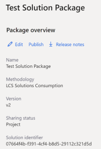
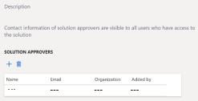
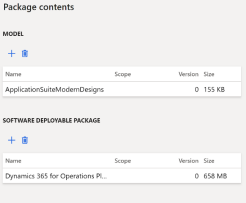
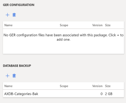
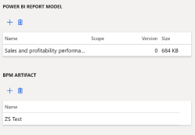
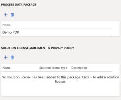
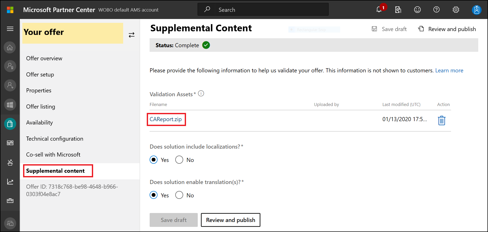

# AppSource Dynamics 365 Finance and Operations functional validation

To complete a first publish in [Partner Center](https://partner.microsoft.com/dashboard/home), offers for Dynamics 365 Finance and Operations require two functional validations:

- Upload a demonstration video of the Dynamics 365 environment that shows basic functionality.
- Present screenshots that demonstrate the solution's [Lifecycle Services](https://lcs.dynamics.com/) (LCS) environment.

> [!NOTE]
> Subsequent recertification publishes do not require demonstration. To learn more, see the [AppSource Policy document](https://docs.microsoft.com/legal/marketplace/certification-policies#1440-dynamics-365-finance-ops).

## How to validate

There are two options for functional validation:

- Hold a 30-minute conference call with us during Pacific Standard time (PST) business hours to demonstrate and record the [LCS](https://lcs.dynamics.com/) environment and solution, or
- In Partner Center, go to [Commercial Marketplace](https://partner.microsoft.com/dashboard/commercial-marketplace/overview) > **Overview** and upload a demo video URL and LCS screenshots on the offer's Supplemental Content tab.

The Microsoft certification team reviews the video and files, then either approves the solution or emails you about next steps.

### Option 1: 30-minute conference call

To schedule a final review call, contact [appsourceCRM@microsoft.com](mailto:appsourceCRM@microsoft.com) with the name of your offer and some potential time slots between 8 a.m. and 5 p.m. Pacific Time.

### Option 2: Upload a demo video and LCS screenshots

1. Record a video and upload the address to the hosting site of your choice. Follow these guidelines:

    - Viewable by the Microsoft certification team.
    - Less than 20 minutes long.
    - Includes up to three core functionality highlights of your solution in the Dynamics 365 environment.

    > [!NOTE]
    > It is acceptable to use an existing marketing video if it meets the guidelines.

2. Take the following screenshots of the [LCS](https://lcs.dynamics.com/) environment that match the offer or solution you want to publish. They must be clear enough for the certification team to read the text. Save the screenshots as JPG files. You may provide [appSourceCRM@microsoft.com](mailto:appSourceCRM@microsoft.com) permission to your LCS environment so we can verify the setup in lieu of providing screenshots.

    1. Go to **LCS** > **Business Process Modeler** > **Project library**. Take screenshots of all the Process steps. Include the **Diagrams** and **Reviewed** columns, as shown here:

       :::image type="content" source="media/dynamics-365-finance-operations/project-library.png" alt-text="Shows the project library window.":::

      2. Go to **LCS** > **Solution Management** > **Test Solution Package**. Take screenshots that include the package overview and contents shown in these examples:

    | Field | Image |
    | --- | --- |
    | Package overview |  |
    | <ul><li>Solution approvers</li></ul> |  |
    | Package contents<ul><li>Model</li><li>Software deployable package</li></ul> |  |
    | <ul><li>GER configuration</li><li>Database backup</li></ul> Artifacts are not required in the **GER configuration** section. |  |
    | <ul><li>Power BI report model</li><li>BPM artifact</li></ul> Artifacts are not required in the **Power BI** section. |  |
    | <ul><li>Process data package</li><li>Solution license agreement and privacy policy</li></ul> The **GER configuration** and **Power BI report model** sections are optional to include for Finance and Operations offers. |  |

    To learn more about each section of the LCS portal, see the [LCS User Guide](https://docs.microsoft.com/dynamics365/fin-ops-core/dev-itpro/lifecycle-services/lcs-user-guide).

3. Upload to Partner Center.

    1. Create a text document that includes the demo video address and screenshots, or save the screenshots as separate JPG files.
    2. Add the text and any JPG files to a .zip file in the [Commercial Marketplace](https://partner.microsoft.com/dashboard/commercial-marketplace/overview) in Partner Center on your Finance and Operations offer's **Supplemental Content** tab.

    

## Next steps

- To learn about creating an offer, see: [Create a Dynamics 365 for Operations offer](https://docs.microsoft.com/azure/marketplace/partner-center-portal/create-new-operations-offer).
