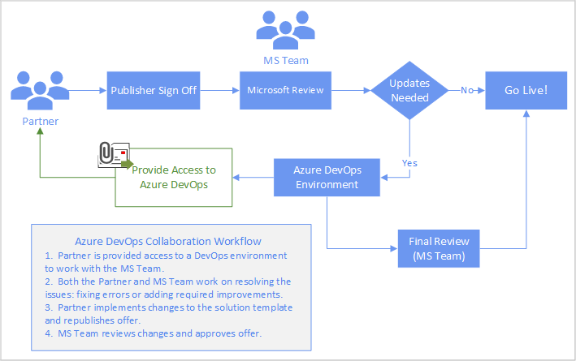
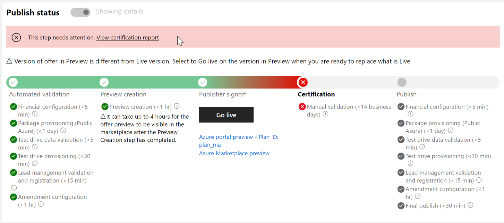
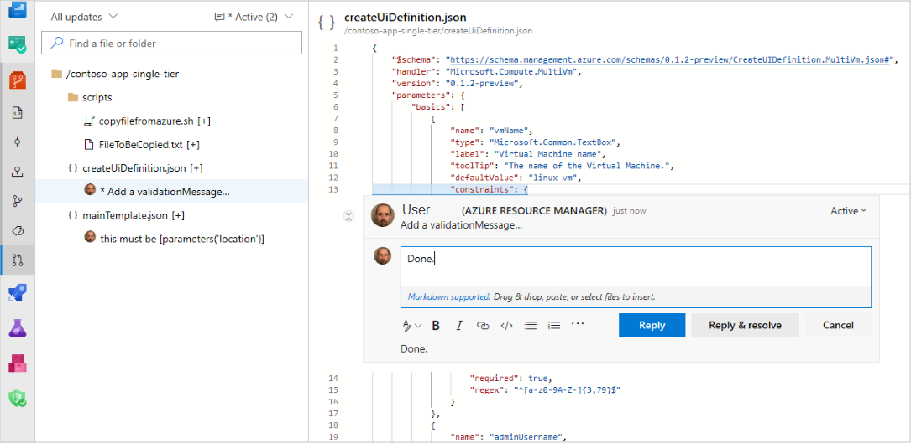

# Handling review feedback for Azure application offers

This article explains how to access feedback from the Microsoft Azure Marketplace review team in [Azure DevOps](https://azure.microsoft.com/services/devops/). If critical issues are found in your Azure application offer during the **Microsoft review** step, you can sign into this system to view detailed information about these issues (review feedback). After you fix all issues, you must resubmit your offer to continue to publish it on Azure Marketplace. The following diagram illustrates how this feedback process relates to the publishing process.

Typically, review issues are referenced as a pull request (PR). Each PR is linked to an online Azure DevOps item, which contains details about the issue. The following image displays an example of the Partner Center experience if issues are found during reviews. 

The PR that contains specific details about the submission will be mentioned in the “View Certification Report” link. For complex situations, the review and support teams may also email you.

## Azure DevOps access

All users with access to the “developer” role in Partner Center will have access to view the PR items referenced in review feedback.

## Reviewing the pull request

Use the following procedure to review issues documented in the pull request.

1. In the **Microsoft review** sections of Publishing steps form, select a PR link to launch your browser and navigate to the **Overview** (home) page for this PR. The following image depicts an example of the critical issue home page for the Contoso sample app offer. This page contains useful summary information about the review issues found in the Azure app.

    
      *Click on this image to expand.*

1. (Optional) On the right side of the window, in the section **Policies**, select the issue message (in this example: **Policy Validation failed**) to investigate the low-level details of the issue, including the associated log files. Errors are typically displayed at the bottom of the log files.

1. In the menu on the left-side of the home page, select **Files** to display the list files that comprise the technical assets for this offer. The Microsoft reviewers should have added comments describing the discovered critical issues. In the following example, two issues have been discovered.

    
      *Click on this image to expand.*

1. Select each comment node in the left tree to navigate to the comment in context of the surrounding code. Fix your source code in your team's project to correct the issue described by the comment.

>[!Note]
>You cannot edit your offer's technical assets within the review team's Azure DevOps environment. For publishers, this is a read-only environment for the contained source code. However, you can leave replies to the comments for the benefit of the Microsoft review team.

   In the following example, the publisher has reviewed, corrected, and replied to the first issue.

   

## Next steps

After you correct the critical issues documented in the review PR(s), you must [republish your Azure app offer](./create-new-azure-apps-offer.md).
