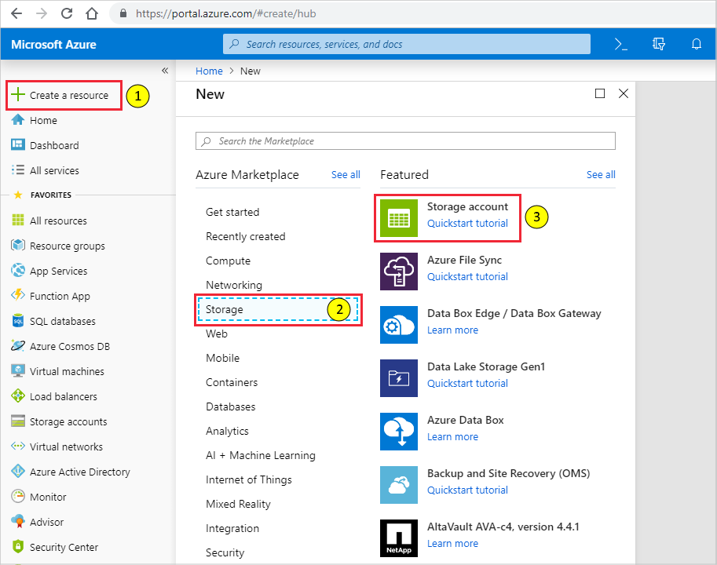
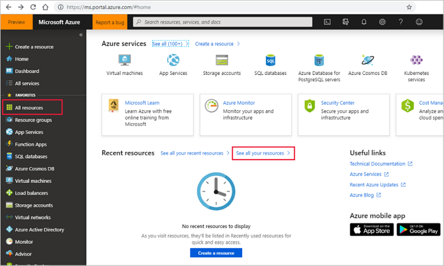
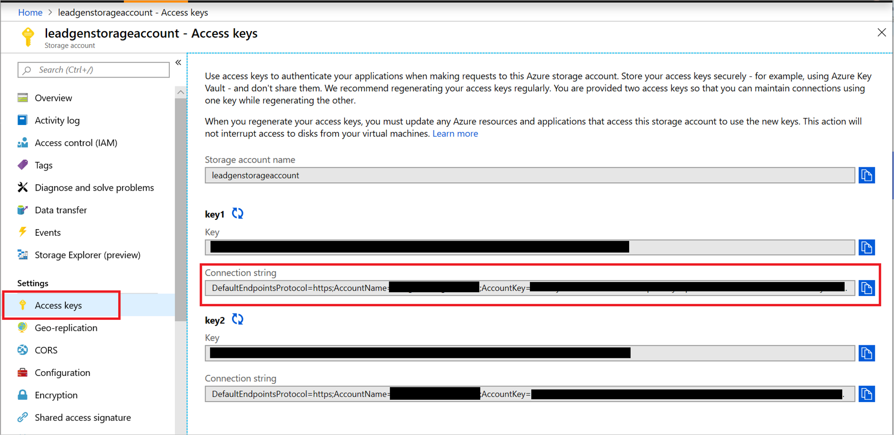
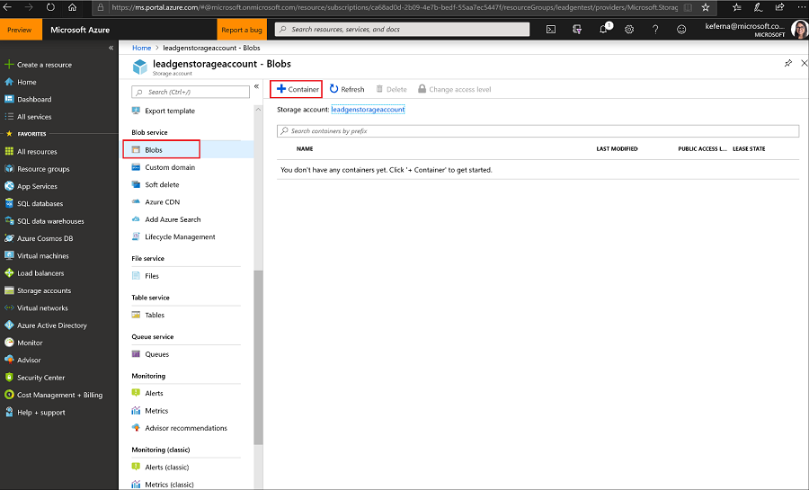
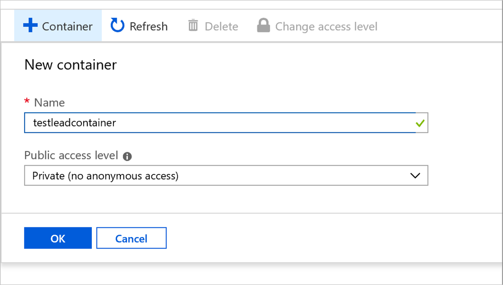
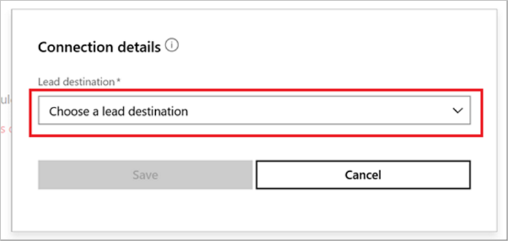
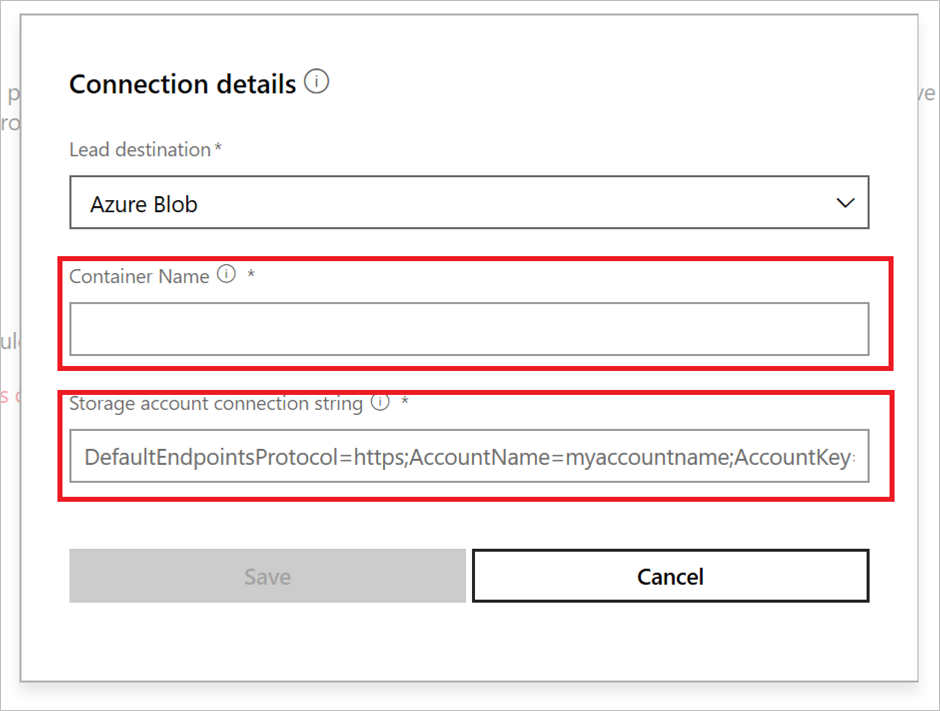

# Use Azure Blob storage to manage commercial marketplace leads

>[!Caution]
>Commercial marketplace support for Azure Blob storage has been deprecated and is no longer an option to process leads from your offer. If you currently have a commercial marketplace offer with lead management configured for Azure Blob, you will no longer receive customer leads. Please update your lead management configuration to any of the other lead management options. Learn about the other options on the [lead management landing page](./commercial-marketplace-get-customer-leads.md)."

 If your Customer Relationship Management (CRM) system is not explicitly supported in Partner Center for receiving Microsoft AppSource and Azure Marketplace leads, you can use Azure Blob storage. You can then choose to export the data and import it into your CRM system. The instructions in this article will give you through the process of creating an Azure Storage account, and a blob under that account. In addition, you can create a new flow using Power Automate to send an email notification when your offer receives a lead.

>[!NOTE]
>The Power Automate connector used in these instructions requires a paid subscription to Power Automate. Make sure you account for this before you follow the instructions in this article.

## Configure Azure Blob storage

1. If you don't have an Azure account, you can [create a free trial account](https://azure.microsoft.com/pricing/free-trial/).

2. After your Azure account is active, sign in to the [Azure portal](https://portal.azure.com).

3. In the Azure portal, create a storage account using the following procedure.  
    1. Select **+Create a resource** in the left menu bar.  The **New** pane (blade) will be displayed to the right.
    2. Select **Storage** in the **New** pane.  A **Featured** list is displayed to the right.
    3. Select the **Storage Account** to begin account creation.  Follow the instructions in the article [Create a storage account](../../storage/common/storage-quickstart-create-account.md?tabs=azure-portal).

    

    For more information about storage accounts, select [Quickstart tutorial](../../storage/.md).  For more information about storage pricing, see [storage pricing](https://azure.microsoft.com/pricing/details/storage/).

4. Wait until your storage account is provisioned, a process that typically takes a few minutes.  Then access your storage account from the **Home** page of the Azure portal by selecting **See all your resources** or by selecting **All resources** from the left navigation menubar of the Azure portal.

    

5. From your storage account pane, select **Access keys** and copy the *Connection string* value for the key. Save this value as this is the *Storage Account Connection String* value that you will need to provide in the publishing portal to receive leads for your marketplace offer.

     An example of a connection sting is:

     ```sql
     DefaultEndpointsProtocol=https;AccountName=myAccountName;AccountKey=myAccountKey;EndpointSuffix=core.windows.net
     ```

    

6. From your storage account page, select **Blobs**.

   

7. Once on the blobs page, select the **+ Container** button.

8. Type a **name** for your new container. The container name must be lowercase, must start with a letter or number, and can include only letters, numbers, and the dash (-) character. For more information about container and blob names, see [Naming and referencing containers, blobs, and metadata](https://docs.microsoft.com/rest/api/storageservices/naming-and-referencing-containers--blobs--and-metadata).

    Save this value as this is the *Container Name* value that you need to provide in the publishing portal to receive leads for your marketplace offer.

9. Set the level of public access to the container as **Private (no anonymous access)**.

10. Select **OK** to create the container.

    

## Configure your offer to send leads to Azure Blob storage

When you are ready to configure the lead management information for your offer in the publishing portal, follow the below steps:

1. Navigate to the **Offer setup** page for your offer.
2. Under the **Customer leads** section, select **Connect**.

    :::image type="content" source="./media/commercial-marketplace-lead-management-instructions-azure-blob/customer-leads.png" alt-text="Customer leads":::

3. On the Connection details pop-up window, select **Azure Blob** for the Lead Destination.

     

4. Provide the **Container name** and **Storage Account Connection string** you got from following these instructions.

    * Container name example: `marketplaceleadcontainer`
    * Storage Account Connection string example: `DefaultEndpointsProtocol=https;AccountName=myAccountName;AccountKey=myAccountKey;EndpointSuffix=core.windows.net`
         

5. Select **Save**.

    > [!NOTE]
    > You must finish configuring the rest of the offer and publish it before you can receive leads for the offer.


