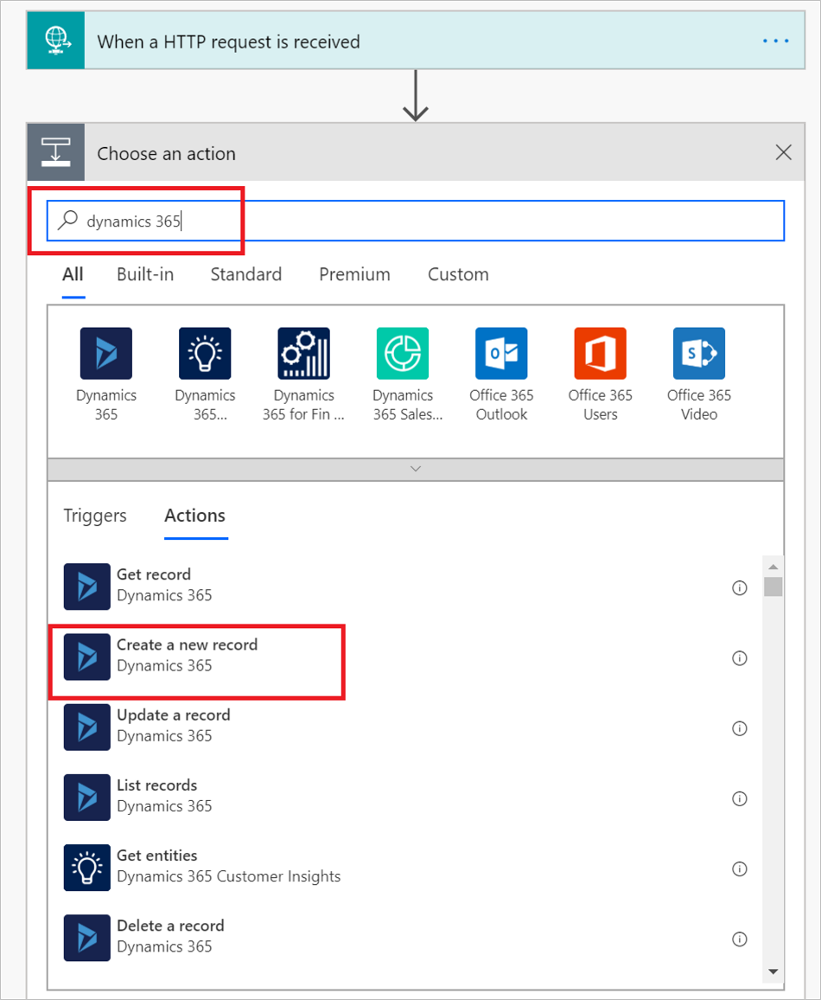
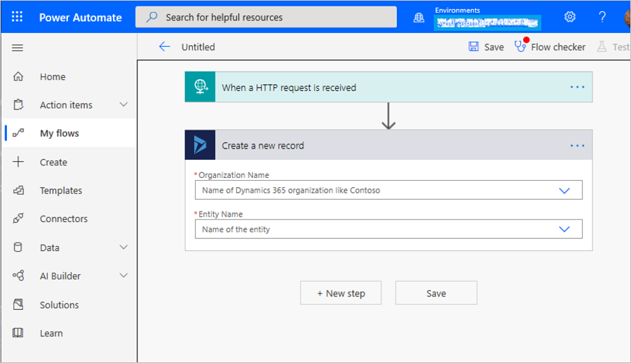
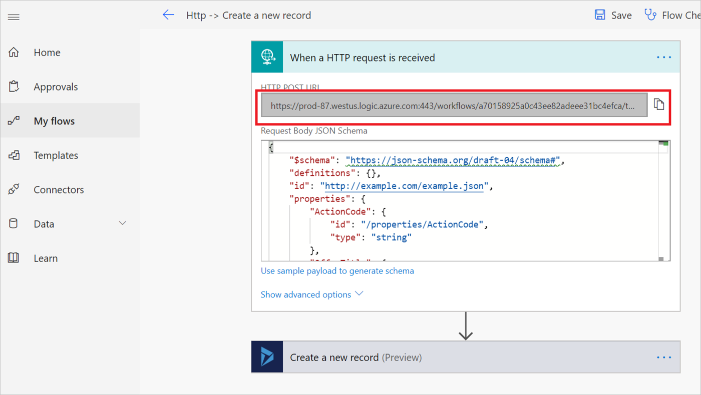
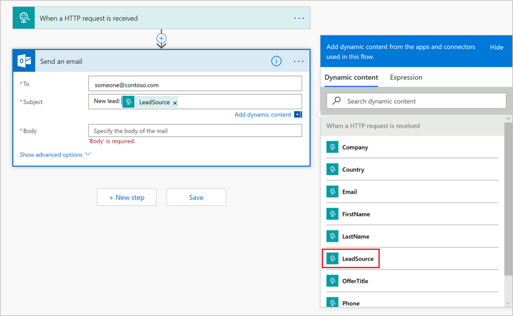
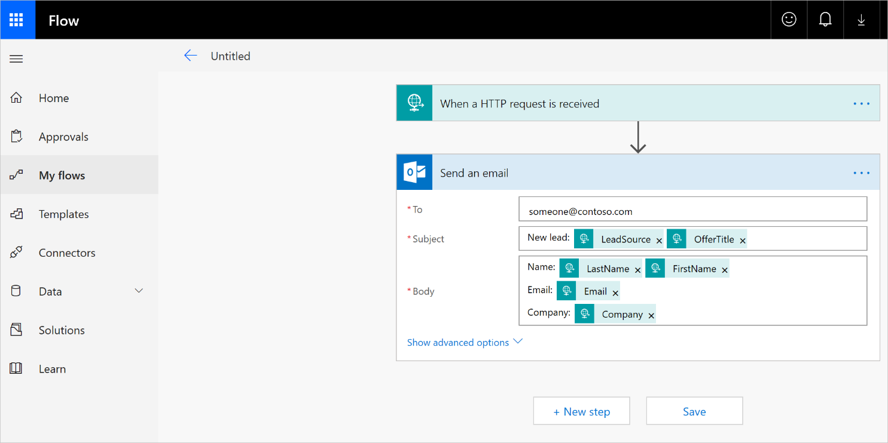
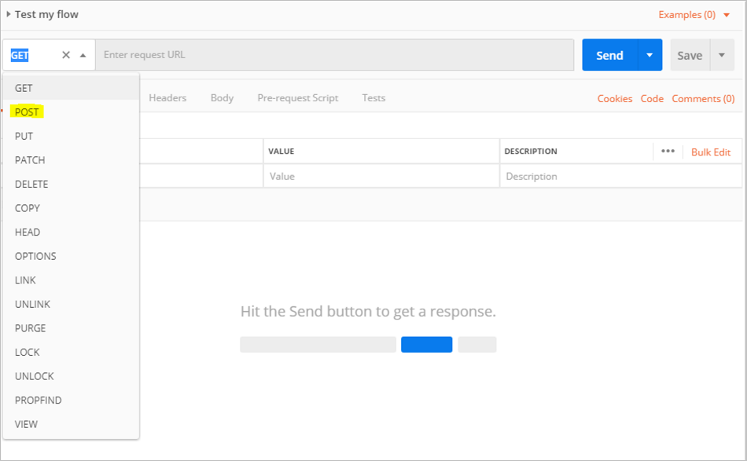
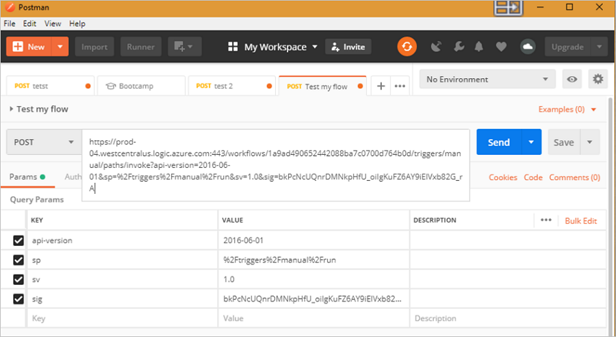
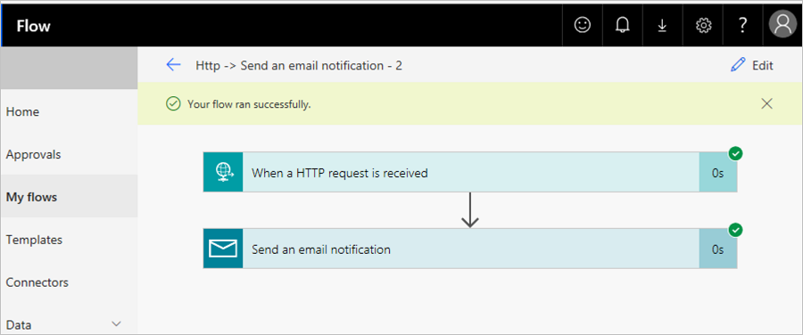
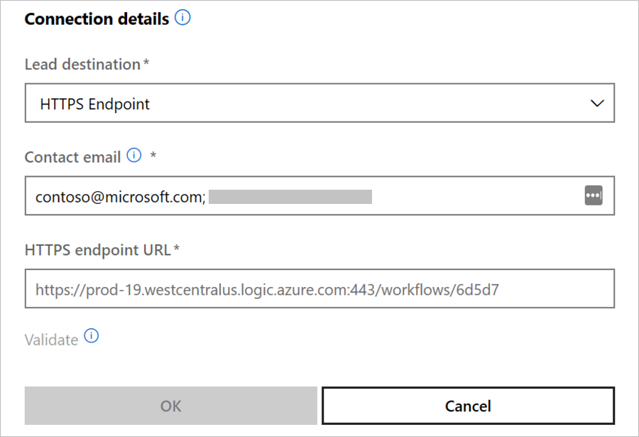

# Configure lead management by using an HTTPS endpoint

>[!NOTE]
>The Power Automate connector used in these instructions requires a paid subscription to Power Automate. Make sure you account for this before you follow the instructions in this article.

If your customer relationship management (CRM) system isn't explicitly supported in Partner Center to receive Azure Marketplace and AppSource leads, you can use an HTTPS endpoint in Power Automate to handle these leads. With an HTTPS endpoint, these leads can be sent out as an email notification or they can be written to a CRM system supported by Power Automate. The instructions in this article walk you through the basic process to create a new flow by using Power Automate, which generates the HTTP POST URL that you'll enter into the publishing portal for the **Lead Management** > **HTTPS Endpoint URL** field. Also included are instructions on how you can test your flow with the help of a tool called [Postman](https://www.getpostman.com/downloads/) which can be found online.

## Create a flow by using Power Automate

1. Open the [Power Automate](https://flow.microsoft.com/) webpage. Select **Sign in**. If you don't already have an account, select **Sign up free** to create a free Power Automate account.

2. Sign in, and select **My flows** in the menu.

3. Select **+ Automated--from blank**.

    

4. In the Build an automated flow window, select **Skip**. 

    

5. In the **Search connectors and triggers** field, enter **request** to find the Request connector.
6. Under **Triggers**, select **When a HTTP request is received**. 

    

7. In the When a HTTP request is received window, copy and paste the following JSON schema into the **Request Body JSON Schema** text box. This schema is used by Microsoft to contain your lead data.

    

    **JSON schema**

    ```JSON
    {
      "$schema": "https://json-schema.org/draft-04/schema#",
      "definitions": {},
      "id": "http://example.com/example.json",
      "properties": {
        "ActionCode": {
          "id": "/properties/ActionCode",
          "type": "string"
        },
        "OfferTitle": {
          "id": "/properties/OfferTitle",
          "type": "string"
        },
        "LeadSource": {
          "id": "/properties/LeadSource",
          "type": "string"
        },
        "UserDetails": {
          "id": "/properties/UserDetails",
          "properties": {
            "Company": {
              "id": "/properties/UserDetails/properties/Company",
              "type": "string"
            },
            "Country": {
              "id": "/properties/UserDetails/properties/Country",
              "type": "string"
            },
            "Email": {
              "id": "/properties/UserDetails/properties/Email",
              "type": "string"
            },
            "FirstName": {
              "id": "/properties/UserDetails/properties/FirstName",
              "type": "string"
            },
            "LastName": {
              "id": "/properties/UserDetails/properties/LastName",
              "type": "string"
            },
            "Phone": {
              "id": "/properties/UserDetails/properties/Phone",
              "type": "string"
            },
            "Title": {
              "id": "/properties/UserDetails/properties/Title",
              "type": "string"
            }
          },
          "type": "object"
        }
      },
      "type": "object"
    }
    ```

>[!NOTE]
>At this point in the configuration, you can select to either connect to a CRM system or configure an email notification. Follow the remaining instructions based on your choice.

### To connect to a CRM system

1. Select **+ New step**.
2. Choose the CRM system of your choice by searching for it where it says **Search connectors and actions**, and select it under the **Actions** section with the action to create a new record. The following screen shows **Create a new record (Dynamics 365)** as an example.

    

3. Provide the **Organization Name** associated with the CRM system. Select **Leads** from the **Entity Name** drop-down list.

    

4. Power Automate shows a form for providing lead information. You can map items from the input request by choosing to add dynamic Content. The following screen shows **OfferTitle** as an example.

    

5. Map the fields you want, and then select **Save** to save your flow. An HTTP POST URL is created and is accessible in the When an HTTP request is received window. Copy this URL by using the copy control, which is located to the right of the HTTP POST URL. Using the copy control is important so that you don't miss any part of the entire URL. Save this URL because you'll need it when you configure lead management in the publishing portal.

    

### To set up email notification

1. Now that you've finished the JSON schema, select **+ New step**.
2. Under **Choose an action**, select **Actions**.
3. Under **Actions**, select **Send an email (Office 365 Outlook)**.

    >[!NOTE]
    >If you want to use a different email provider, search for and select **Send an email notification (Mail)** as the action instead.

    

4. In the Send an email window, configure the following required fields:

   - **To**: Enter at least one valid email address where the leads will be sent.
   - **Subject**: Power Automate gives you the option of adding dynamic content, like **LeadSource** shown in the following screen. Start by entering a field name followed. Then select the Dynamic Content pick list from the pop-up window. 

        >[!NOTE] 
        > When you add field names, you can follow each name with a colon ":" and then select **Enter** to create a new row. After you have your field names added, you can then add each associated parameter from the dynamic pick list.

        

   - **Body**: From the dynamic content pick list, add the information you want in the body of the email. For example, use LastName, FirstName, Email, and Company. <br> <br> When you're finished setting up the email notification, it looks like the example in the following screen.


       

5. Select **Save** to finish your flow. An HTTP POST URL is created and is accessible in the When an HTTP request is received window. Copy this URL by using the copy control, which is located to the right of the HTTP POST URL. Using this control is important so that you don't miss any part of the entire URL. Save this URL because you'll need it when you configure lead management in the publishing portal.

   

### Testing

You can test that everything works as expected by using a tool called [Postman](https://app.getpostman.com/app/download/win64), which can be downloaded online. This tool is available for Windows. 

1. Start Postman, and select **New** > **Request** to set up your test tool. 

   

2. Fill in the **Save Request** form, and then save to the folder you created.

   

3. Select **POST** from the drop-down list. 

   

4. Paste the HTTP POST URL from the flow you created in Power Automate where it says **Enter request URL**.

   

5. Go back to [Power Automate](https://flow.microsoft.com/). Find the flow you created to send leads by going to **My Flows** from the Power Automate menu bar. Select the ellipsis next to the flow name, and select **Edit**.

   

6. Select **Test** in the upper-right corner, select **I'll perform the trigger action**, and then select **Test**. You'll see an indication at the top of the screen that the test has started.

   

7. Go back to your Postman app, and select **Send**.

   

8. Go back to your flow and check the result. If everything works as expected, you'll see a message indicating it was successful.

   

9. You should have also received an email. Check your email inbox. 

    >[!NOTE] 
    >If you don't see an email from the test, check your spam and junk folders. In the following screen, you'll notice just the field labels you added when you configured the email notification. If this were an actual lead generated from your offer, you would also see the actual information from the Lead Contact in the body and in the Subject line.

   

## Configure your offer to send leads to the HTTPS endpoint

When you're ready to configure the lead management information for your offer in the publishing portal, follow these steps.

1. Go to the **Offer setup** page for your offer.
2. Select **Connect** under the **Lead Management** section.
3. In the Connection details pop-up window, select **HTTPS Endpoint** for the **Lead Destination** and paste in the HTTP POST URL from the flow you created by following earlier steps into the **HTTPS endpoint URL** field.
4. **Contact email** - Provide emails for people in your company who should receive email notifications when a new lead is received. You can provide multiple emails by separating them with a semicolon.
5. Select **OK**.

To make sure you have successfully connected to a lead destination, select the **Validate** button. If successful, you'll have a test lead in the lead destination.

>[!NOTE] 
>You must finish configuring the rest of the offer and publish it before you can receive leads for the offer.

When leads are generated, Microsoft sends leads to the flow. The leads get routed to the CRM system or email address you configured.




