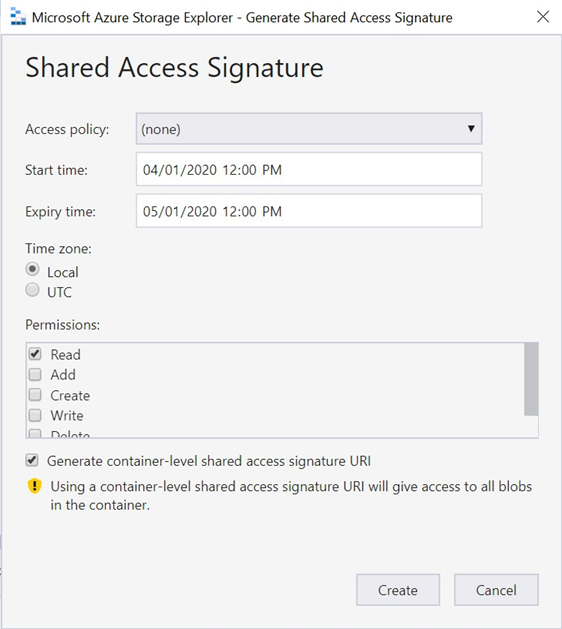

# Get SAS URI for your VM image

During the publishing process, you must provide a URI for each VHD associated with your plans (previously called SKUs). Microsoft needs access to these VHDs during the certification process. You’ll enter this URI on the **Plans** tab in Partner Center.

Generating SAS URIs for your VHDs has these requirements:

- They only support unmanaged VHDs.
- Only List and Read permissions are required. Don’t provide Write or Delete access.
- The duration for access (expiry date) should be a minimum of three weeks from when the SAS URI is created.
- To protect against UTC time changes, set the start date to one day before the current date. For example, if the current date is June 16, 2020, select 6/15/2020.

## Generate the SAS address

There are two common tools used to create an SAS address (URL):

1. **Microsoft Storage Explorer** – Graphical tool available for Windows, macOS, and Linux.
2. **Microsoft Azure CLI** – Recommended for non-Windows operating systems and automated or continuous integration environments.

### Using Tool 1: Microsoft Storage Explorer

1. Download and install [Microsoft Azure Storage Explorer](https://azure.microsoft.com/features/storage-explorer/).
2. Open the explorer and in the left menu, select **Add Account**.
3. In the **Connect to Azure Storage** dialog box, select **Add an Azure Account** and sign in to your Azure account.
4. In the left-Explorer pane, expand the **Storage Accounts** node.
5. Right-click your VHD and select **Get Share Access Signature**.
6. In the **Shared Access Signature** dialog box, complete the following fields:

    1. Start time – Permission start date for VHD access. Provide a date that is one day before the current date.
    2. Expiry time – Permission expiration date for VHD access. Provide a date at least three weeks beyond the current date.
    3. Permissions – Select the Read and List permissions.
    4. Container-level – Check the Generate container-level shared access signature URI check box.

    

7. To create the associated SAS URI for this VHD, select **Create**. The dialog box refreshes and shows details about this operation.

8. Copy the URI and save it to a text file in a secure location.

    

This generated SAS URI is for container-level access. To make it specific, edit the text file to add the VHD name:

9. Insert your VHD name after the vhds string in the SAS URI (include a forward slash). The final SAS URI should look like this:

    `<blob-service-endpoint-url> + /vhds/ + <vhd-name>? + <sas-connection-string>`

1. Repeat these steps for each VHD in the plans you will publish.

### Using Tool 2: Azure CLI

1. Download and install [Microsoft Azure CL](https://azure.microsoft.com/documentation/articles/xplat-cli-install/)I. Versions are available for Windows, macOS, and various distros of Linux.
2. Create a PowerShell file (.ps1 file extension), copy in the following code, then save it locally.

```JSON
az storage container generate-sas --connection-string ‘DefaultEndpointsProtocol=https;AccountName=<account-name>;AccountKey=<account-key>;EndpointSuffix=core.windows.net’ --name <vhd-name> --permissions rl --start ‘<start-date>’ --expiry ‘<expiry-date>’
```

3. Edit the file to use the following parameter values. Provide dates in UTC datetime format, such as 2020-04-01T00:00:00Z.

    - account-name – Your Azure storage account name.
    - account-key – Your Azure storage account key.
    - vhd-name – Your VHD name.
    - start-date – Permission start date for VHD access. Provide a date one day before the current date.
    - expiry-date – Permission expiration date for VHD access. Provide a date at least three weeks after the current date.

    Here's an example of proper parameter values (at the time of this writing):

    `az storage container generate-sas --connection-string ‘DefaultEndpointsProtocol=https;AccountName=st00009;AccountKey=6L7OWFrlabs7Jn23OaR3rvY5RykpLCNHJhxsbn9ON c+bkCq9z/VNUPNYZRKoEV1FXSrvhqq3aMIDI7N3bSSvPg==;EndpointSuffix=core.windows.net’ --name vhds -- permissions rl --start ‘2020-04-01T00:00:00Z’ --expiry ‘2021-04-01T00:00:00Z’`

1. Save the changes.
2. Using one of the following methods, run this script with administrative privileges to create a SAS connection string for container-level access:

    - Run the script from the console. In Windows, right-click the script and select **Run as administrator**.
    - Run the script from a PowerShell script editor such as [Windows PowerShell ISE](https://docs.microsoft.com/en-us/powershell/scripting/components/ise/introducing-the-windows-powershell-ise). This screen shows the creation of a SAS connection string within this editor:

    [](media/vm/create-sas-uri-power-shell-ise.png#lightbox)

6. Copy the SAS connection string and save it to a text file in a secure location. Edit this string to add the VHD location information to create the final SAS URI.
7. In the Azure portal, go to the blob storage that includes the VHD associated with the new URI.
8. Copy the URL of thebBlob service endpoint:

    

9. Edit the text file with the SAS connection string from step 6. Create the complete SAS URI using this format:

    `<blob-service-endpoint-url> + /vhds/ + <vhd-name>? + <sas-connection-string>`

## Verify the SAS URI

Check the SAS URI before publishing it on Partner Center to avoid any issues related to SAS URI post submission of the request. This process is optional but recommended.

- The URI includes your VHD image filename, including the filename extension `.vhd`.
- `Sp=rl` appears near the middle of your URI. This string shows Read and List access is specified.
- When `sr=c` appears, this means that container-level access is specified.
- Copy and paste the URI into a browser to test-download the blob (you can cancel the operation before the download completes).
