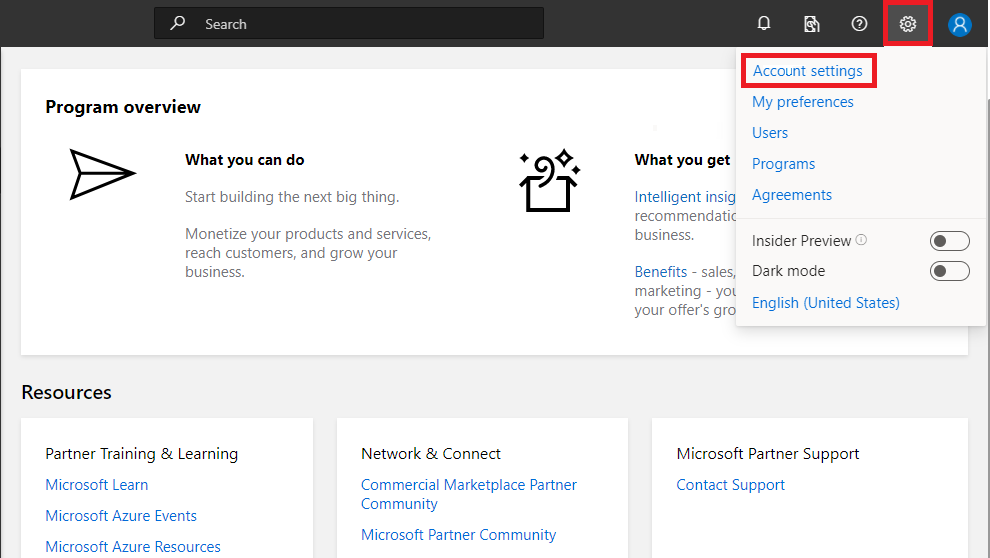

# How to manage your Commercial Marketplace account in Partner Center 

Once you've created your [Commercial Marketplace account in Partner Center](https://partner.microsoft.com/dashboard/commercial-marketplace), using your work email plus your business information, there are a variety of roles and permissions settings that can help you with adding or managing customers, selling subscriptions, working with billing and invoicing, creating business profiles, managing referrals, working with incentives programs, and providing support. 

In this article, we'll dive into how to manage your Partner Center account, including how to: 

- Access your account settings
- Manage your account users
-  
- 

## Account settings

If you have not already done so,  you (or your organization's administrator) will need to:
- set up your company’s profile including support details, tax exemptions if appropriate, and primary contact information
- create user accounts for anyone who will use your business account in Partner Center

### Open developer settings

Account settings is located at the upper right corner of your [Commercial Marketplace dashboard in Partner Center](https://partner.microsoft.com/dashboard/commercial-marketplace). Select the gear icon (near the upper right corner of the dashboard) and then select **Developer settings**. 

Inside **Account settings**, you will be able to view your:
- **Account details**: Account type and Account status
- **Publisher IDs**: Seller ID, User ID, Publisher ID, Azure AD tenants, etc.
- **Contact info**: Publisher display name, Seller contact name, email, phone, and address
- **Financial details**: Payout account, Tax profile, and Payout hold status
- **Devices**: Any testing devices associated with your account
- **Tracking GUIDs**: Any tracking GUIDs associate with your account

### Manage users

To manage your account users, you must sign in with your associated Azure AD credentials. 

Partner Center leverages [Azure Active Directory](https://docs.microsoft.com/azure/active-directory/fundamentals/active-directory-whatis) (Azure AD) for multi-user account access and management. Once your Partner Center account has been associated with your organization’s Azure Active Directory, you can:

•	add, remove, and manage user accounts;
•	define the role or custom permissions that each user should have; 
•	assign a role to a group of users, or to an AAD application.

If your organization already uses Office 365 or other business services from Microsoft, you already have Azure AD. Otherwise, you can [create a new Azure AD tenant](https://docs.microsoft.com/azure/active-directory/fundamentals/active-directory-access-create-new-tenant) from within Partner Center at no additional charge.

