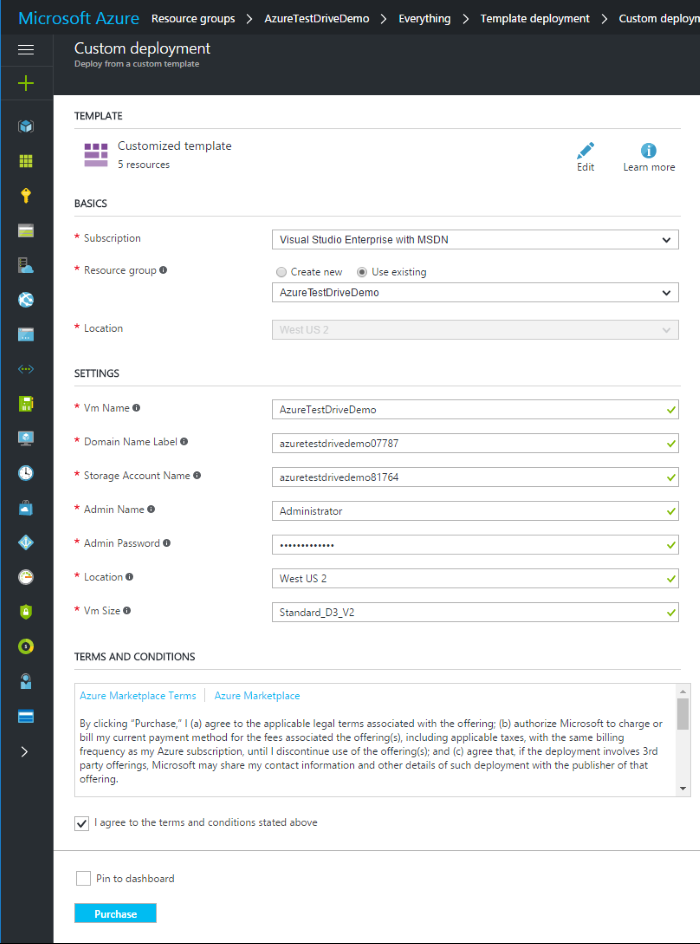
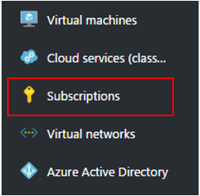
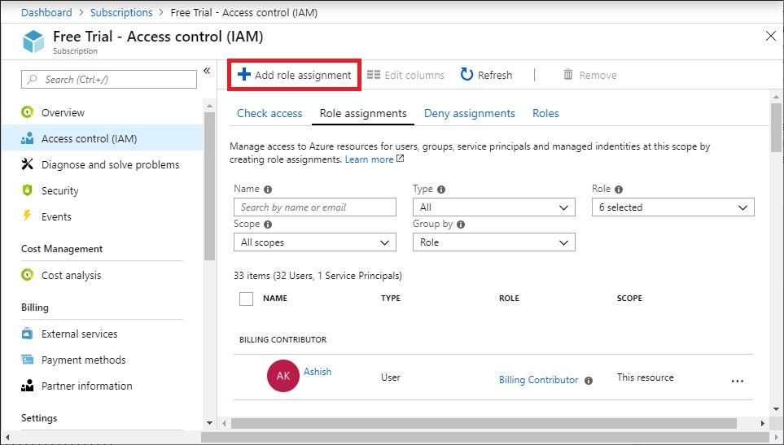
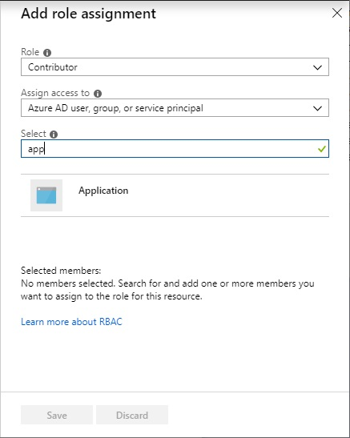
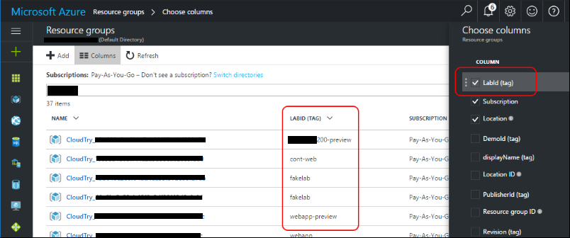

# Types of test drives

This article describes the three different types of test drives available on the Microsoft commercial marketplace: logic app, hosted test drive, and Azure Resource Manager (ARM). When you are ready to publish a test drive, see [Configure a test drive](test-drive.md).

## Logic app test drive

If you have an offer on AppSource, build your test drive to connect with a Dynamics AX/CRM instance or any other resource beyond just Azure. GitHub contains documentation for Logic App test drives for
[Operations](https://github.com/Microsoft/AppSource/blob/master/Setup-your-Azure-subscription-for-Dynamics365-Operations-Test-Drives.md) and [Customer Engagement](https://github.com/Microsoft/AppSource/wiki/Setting-up-Test-Drives-for-Dynamics-365-app).

## Hosted test drive

A hosted test drive removes the complexity of setup by letting Microsoft host and maintain the service that performs the test drive user provisioning and de-provisioning. Use this type for AppSource offers to connect with a Dynamics 365 for Customer Engagement, Dynamics 365 for Finance and Operations, or Dynamics 365 Business Central instance.

## Azure Resource Manager test drive

Use this type if you have an offer on the Azure Marketplace or AppSource but want to build a test drive with only Azure resources. An Azure Resource Manager (ARM) template is a coded container of Azure resources that you design to best represent your solution. Test drive takes the provided ARM template and deploys all the resources it requires to a resource group.

If you are unfamiliar with what an ARM template is, read [What is Azure Resource Manager?](https://docs.microsoft.com/azure/azure-resource-manager/resource-group-overview) and [Understand the structure and syntax of ARM templates](https://docs.microsoft.com/azure/azure-resource-manager/resource-group-authoring-templates) to better understand how to build and test your own templates.

The remainder of this topic describes how to build an Azure Resource Manager (ARM) test drive.

### How to build an Azure Resource Manager test drive

Follow these steps to build an Azure Resource Manager test drive: <!-- WHAT ARE THESE STEPS FOR? ARE THEY SUPPOSED TO DEFINE THE UPCOMING SECTIONS? (THEY DON'T) SUGGEST DELETING -->

1. Design what you want your customers to do in a flow diagram.
1. Define what experiences you want your customers to build.
1. Based on the above definitions, decide what pieces and resources are needed for customers to accomplish such experience: for example, D365 instance or a website with a database.
1. Build the design locally and test the experience.
1. Package the experience in an ARM template deployment, then:
    1. Define what parts of the resources are input parameters.
    1. Define what the variables are.
    1. Define what outputs are given to the customer experience.
1. Publish, test, and go live.

The most important part about building an Azure Resource Manager test drive is to define what scenario(s) you want your customers to experience. Are you a firewall product and you want to demo how well you handle script injection attacks? Are you a storage product and you want to demo how fast and easy your solution compresses files? Spend time evaluating the best ways to show off your product, including the required resources you would need, as this will make packaging the Resource Manager template easier.

To continue with our firewall example, the architecture may require a public IP URL for your service and another public IP URL for the website your firewall is protecting. Each IP is deployed on a virtual machine and connected with a network security group and network interface.

### 1. Write the ARM test drive template

Once you have designed the desired package of resources, write and build the test drive ARM template. Because test drive runs deployments in a fully automated mode, test drive templates have some restrictions:

#### Parameters

Most templates have a set of parameters that define resource names, resources sizes (such as types of storage accounts or virtual machine sizes), user names and passwords, DNS names, and so on. When you deploy solutions using Azure portal, you can manually populate all these parameters, pick available DNS names or storage account names, and so on.



However, test drive works automatically, without human interaction, so it only supports a limited set of parameter categories. If a parameter in the test drive ARM template doesn't fall into one of the supported categories, you must replace this parameter with a variable or constant value.

You can use any valid name for your parameters; test drive recognizes parameter category by using a metadata-type value. Specify metadata-type for every template parameter, otherwise your template will not pass validation:

```JSON
"parameters": {
  ...
  "username": {
    "type": "string",
    "metadata": {
      "type": "username"
    }
  },
  ...
}
```

> [!NOTE]
> All parameters are optional, so if you don't want to use any, you don't have to.

#### Accepted Parameter Metadata Types

| Metadata Type   | Parameter Type  | Description     | Sample Value    |
|---|---|---|---|
| **baseuri**     | string          | Base URI of your deployment package| https:\//\<\..\>.blob.core.windows.net/\<\..\> |
| **username**    | string          | New random user name.| admin68876      |
| **password**    | secure string    | New random password | Lp!ACS\^2kh     |
| **session id**   | string          | Unique test drive session ID (GUID)    | b8c8693e-5673-449c-badd-257a405a6dee |

##### baseuri

Test drive initializes this parameter with a **Base Uri** of your deployment package so you can use this parameter to construct a Uri of any file included in your package.

```JSON
"parameters": {
  ...
  "baseuri": {
    "type": "string",
    "metadata": {
      "type": "baseuri",
      "description": "Base Uri of the deployment package."
    }
  },
  ...
}
```

Use this parameter inside your template to construct a Uri of any file from your test drive deployment package. The following example shows how to construct a Uri of the linked template:

```JSON
"templateLink": {
  "uri": "[concat(parameters('baseuri'),'templates/solution.json')]",
  "contentVersion": "1.0.0.0"
}
```

##### username

Test drive initializes this parameter with a new random user name:

```JSON
"parameters": {
  ...
  "username": {
    "type": "string",
    "metadata": {
      "type": "username",
      "description": "Solution admin name."
    }
  },
  ...
}
```

Sample value:

    admin68876

You can use either random or constant usernames for your solution.

##### password

Test drive initializes this parameter with a new random password:

```JSON
"parameters": {
  ...
  "password": {
    "type": "securestring",
    "metadata": {
      "type": "password",
      "description": "Solution admin password."
    }
  },
  ...
}
```

Sample value:

    Lp!ACS^2kh

You can use either random or constant passwords for your solution.

##### session ID

Test drive initialize this parameter with a unique GUID representing Test drive session ID:

```JSON
"parameters": {
  ...
  "sessionid": {
    "type": "string",
    "metadata": {
      "type": "sessionid",
      "description": "Unique test drive session id."
    }
  },
  ...
}
```

Sample value:

    b8c8693e-5673-449c-badd-257a405a6dee

You can use this parameter to uniquely identify the test drive session, if it's necessary.

#### Unique Names

Some Azure resources, like storage accounts or DNS names, requires globally unique names. This means that every time test drive deploys the ARM template, it creates a new resource group with a unique name for all its resources. Therefore, you must use the [uniquestring](https://docs.microsoft.com/azure/azure-resource-manager/resource-group-template-functions#uniquestring) function concatenated with your variable names on resource group IDs to generate random unique values:

```JSON
"variables": {
  ...
  "domainNameLabel": "[concat('contosovm',uniquestring(resourceGroup().id))]",
  "storageAccountName": "[concat('contosodisk',uniquestring(resourceGroup().id))]",
  ...
}
```

Ensure you concatenate your parameter/variable strings (`contosovm`) with a unique string output (`resourceGroup().id`), because this guarantees the uniqueness and reliability of each variable.

For example, most resource names cannot start with a digit, but unique string function can return a string, which starts with a digit. So, if you use raw unique string output, your deployments will fail.

You can find additional information about resource naming rules and
restrictions in [this article](/azure/cloud-adoption-framework/ready/azure-best-practices/naming-and-tagging).

#### Deployment Location

You can make you test drive available in different Azure regions. The idea is to allow a user to pick the closest region, to provide with the beast user experience.

When test drive creates an instance of the Lab, it always creates a resource group in the region chose by a user, and then executes your deployment template in this group context. So, your template should pick the deployment location from resource group:

```JSON
"variables": {
  ...
  "location": "[resourceGroup().location]",
  ...
}
```

And then use this location for every resource for a specific Lab instance:

```JSON
"resources": [
  {
    "type": "Microsoft.Storage/storageAccounts",
    "location": "[variables('location')]",
    ...
  },
  {
    "type": "Microsoft.Network/publicIPAddresses",
    "location": "[variables('location')]",
    ...
  },
  {
    "type": "Microsoft.Network/virtualNetworks",
    "location": "[variables('location')]",
    ...
  },
  {
    "type": "Microsoft.Network/networkInterfaces",
    "location": "[variables('location')]",
    ...
  },
  {
    "type": "Microsoft.Compute/virtualMachines",
    "location": "[variables('location')]",
    ...
  }
]
```

Ensure your subscription is allowed to deploy all the resources you want in each of the regions you select. Also ensure your virtual machine images are available in all the regions you will enable, otherwise your deployment template will not work for some regions.

#### Outputs

Normally with resource manager templates you can deploy without producing any output. This is because you know all the values you use to populate template parameters and you can always manually inspect properties of any resource.

For test drive resource manager templates, however, it's important to return to test drive all the information, which is required to get access to the lab (Website URIs, Virtual Machine host names, user names, and passwords). Ensure all your output names are readable because these variables are presented to the customer.

There are no any restrictions related to template outputs. Test drive converts all output values into strings, so if you send an object to the output, a user will see JSON string.

Example:

```JSON
"outputs": {
  "Host Name": {
    "type": "string",
    "value": "[reference(variables('pubIpId')).dnsSettings.fqdn]"
  },
  "User Name": {
    "type": "string",
    "value": "[parameters('adminName')]"
  },
  "Password": {
    "type": "string",
    "value": "[parameters('adminPassword')]"
  }
}
```

#### Subscription Limits

Don't forget about subscription and service limits. For example, if you want to deploy up to ten 4-core virtual machines, you need to ensure the subscription you use for your lab allows you to use 40 cores. For more information about Azure subscription and service limits, see [Azure subscription and service limits, quotas, and constraints](https://docs.microsoft.com/azure/azure-resource-manager/management/azure-subscription-service-limits). As multiple test drives can be taken at the same time, verify that your subscription can handle the number of cores multiplied by the total number of concurrent test drives that can be taken.

#### What to upload

The test drive ARM template is uploaded as a zip file, which can include various deployment artifacts, but must have one file named `main-template.json`. This is the ARM deployment template which test drive uses to instantiate a lab. If you have additional resources beyond this file, you can reference them as external resources inside the template or include them in the zip file.

During the publishing certification, test drive unzips your deployment package and puts its content into an internal test drive blob container. The container structure reflects the structure of your deployment package:

| package.zip                       | Test drive blob container         |
|---|---|
| `main-template.json`                | `https:\//\<\...\>.blob.core.windows.net/\<\...\>/main-template.json`  |
| `templates/solution.json`           | `https:\//\<\...\>.blob.core.windows.net/\<\...\>/templates/solution.json` |
| `scripts/warmup.ps1`                | `https:\//\<\...\>.blob.core.windows.net/\<\...\>/scripts/warmup.ps1`  |
|||

We call a Uri of this blob container Base Uri. Because every revision of your lab has its own blob container, every revision of your lab has its own Base Uri. Test drive can pass a Base Uri of your unzipped deployment package into your template through template parameters.

#### Transform template examples for test drive

The process of turning an architecture of resources into a test drive resource manager template can be daunting. For help, see these examples of how to best [transform current deployment templates](transforming-examples-for-test-drive.md).

### 2. Test drive deployment subscription details

The final section to complete is to be able to deploy the test drives automatically by connecting your Azure Subscription and Azure Active Directory (AD).


1. Obtain an **Azure Subscription ID**. This grants access to Azure services and the Azure portal. The subscription is where resource usage is reported and services are billed. If you do not already have a separate Azure subscription for test drives only, make one. You can find Azure Subscription IDs (such as `1a83645ac-1234-5ab6-6789-1h234g764ghty1`) by signing in to Azure portal and selecting **Subscriptions** from the left-nav menu.

    

2. Obtain an **Azure AD Tenant ID**. If you already have a Tenant ID available you can find it in **Azure Active Directory** > **Properties** > **Directory ID**. <!-- DESCRIBE WHAT'S HAPPENING IN THESE SCREENS -->

    

    If you don't have a tenant ID, create a new tenant in Azure Active Directory: <!-- need larger, more specific image -->

    

    

    

3. **Azure AD App ID** – Create and register a new application <!-- Azure AD App ID? -->. We will use this application to perform operations on your test drive instance.

      1. Navigate to the newly created directory or already existing directory and select Azure Active directory in the filter pane.
      2. Search **App registrations** and select **Add**.
      3. Provide an application name.
      4. Select the **Type** of **Web app / API**.
      5. Provide any value in the Sign-on URL, this field isn't used.
      6. Select **Create**.
      7. After the application has been created, select **Properties** > **Set the application as multi-tenant** and then **Save**.

4. Select **Save**. <!-- AGAIN? -->

5. Copy the Application ID for this registered app and paste it in the test drive field.

    

6. Since we are using the application to deploy to the subscription, we need to add the application as a contributor on the subscription:

    1. Select the type of **Subscription** you are using for the test drive.<!-- SHOW? -->
    1. Select **Access control (IAM)**.<!-- SHOW? -->
    1. Select the **Role assignments** tab, then **Add role assignment**.<br>
    
    1. Set **Role** and **Assign access to** as shown. In the **Select** field, enter the name of the Azure AD application. Select the application to assign the **Contributor** role to.<br>
    
    1. Select **Save**.

7. Generate an **Azure AD App** authentication key. Under **Keys**, add a **Key Description**, set the duration to **Never expires** (an expired key will break your test drive in production), then select **Save**. Copy and paste this value into your required test drive field.


### 3. Republish

Now that all your test drive fields are complete, **Republish** your offer. Once your test drive has passed certification, test the customer experience in the preview of your offer:

1. Start a test drive in the UI.
1. Open your Azure subscription inside the Azure portal.
1. Verify that your test drive is deploying correctly. <!-- HOW DO WE GET TO THIS SCREEN -->

    

Don't delete any test drive instances provisioned for your customers; the test drive service will automatically clean up these Resource Groups after a customer is finished with it.

Once you are comfortable with your Preview offering, it's time to **go live**! There is a final review process to double-check the entire end-to-end experience. If we reject the offer, we will email the engineering contact for your offer explaining what needs to be fixed.

## Next steps

- For best practices, FAQs, or to make your test drive more successful, see [Test drive marketing and best practices](marketing-and-best-practices.md).
