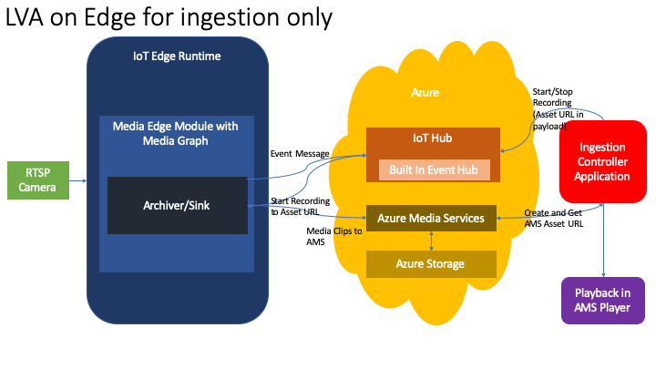

---
# Mandatory fields. See more on aka.ms/skyeye/meta.
title: Manage Azure Media Services on IoT Edge for ingestion - Azure
titleSuffix: Azure Media Services
description:  
services: media-services
documentationcenter: ''
author: Juliako
manager: femila
editor: ''

ms.service: media-services
ms.workload: 
ms.topic: article
ms.date: 02/10/2020
ms.author: juliako

---

# Tutorial: manage Azure Media Services on IoT Edge for ingestion

This tutorial shows how to use a local linux IoT Edge device to manage media graphs within an Azure IoT Edge runtime and monitor events, start and stop recording of video, using a console application from any other connected device capable of running .NET Core.

Specifically, the objective is to ingest media from an RTSP stream (a simulator is used in this example), send a start or stop recording messages to the Edge, archive the clip containing of video into a storage container as an independent blob, and access the media for on-demand viewing

A .NET Core console application is used to trigger and monitor the events. Notice that the console app is the one controlling the archiving/recording of the video. The edge device is not the one controlling the timing of the recording.

The following image shows the flow described in this topic.



## Prerequisites

This topic requires completion of the setup of required components for Edge - [How-to: Initial setup for Live Video Analytics on IoT Edge](edge-setup.md)

## Setting up the Azure Media Services on the IoT Edge module

### Get source files

If you have not already copied the src files to your target device, in the LVA Preview Team site, goto the General channel, Files, and look for the `PrivatePreviewAssets` folder, and the `src.zip` file inside. Download the file to your target device to a location such as the `/home/<user>` folder on the IoT Edge device. This contains all the manifest and source code files in use by Media Services on IoT Edge.

### Modify the archive manifest to update the camera values

Update the `src\edge\module-deployment-files\deployment.archive.json` file to specify your camera connection information.

1. Replace the `<RTSP_URL>` with the correct URL for your camera. Note, some cameras require a specific url string for RTSP access (e.g. `rtsp://<IP ADDRESS>:<PORT>/axis-media/media.amp`). Please consult your camera documentation.
2. Replace the `<CAMERA_USERNAME>` with the correct username
3. Replace the `<CAMERA_PASSWORD>` with the correct password.

Deploy module with a module manifest file.

```azurecli
az iot edge set-modules --hub-name <iot hub name> --device-id <device name> --content deployment.archive.json
```

## See the module running

## Verify the module is running

To check that the IoT Edge module is sending messages to IoT Hub, use the following command to see various events being emitted.

```bash
sudo iotedge logs mediaEdge --tail 100
```
<!--
## TODO - Add info to look at archived files
-->
## Clean up resources when finished

After you are done using the product, generally you should clean up everything except objects that you are planning to reuse. If you want your account to be clean after experimenting, you should delete the resources that you do not plan to reuse.

- To delete a single resource, follow the instructions for [az resource delete](https://docs.microsoft.com/cli/azure/resource?view=azure-cli-latest#az-resource-delete)
- If you no longer need any of the resources in your resource group, including the Media Services and storage accounts you created for this tutorial, delete the resource group you created earlier. Execute the following CLI command:

    ```azurecli
    az group delete --name amsResourceGroup
    ```

## Troubleshooting

- On MacOS an `Unable to load the service index for source` error may appear when performing `dotnet restore`.

    Please remove the section in `NuGet.Config` called `<packageSources></packageSources>` before performing `dotnet restore`.

- For more regarding IoT Edge troubleshooting, please see [Common issues and resolutions for Azure IoT Edge](https://docs.microsoft.com/azure/iot-edge/troubleshoot).

## See also

- [How-to: Initial setup for Live Video Analytics on IoT Edge](edge-setup.md)
- [FAQ: Media Graph](faqs.md)

## Next steps

- To set up **Edge ingest with motion detection**, follow [Tutorial: Manage Azure Media Services on IoT Edge for ingestion and motion detection](media-graph-edge-ingestion-motion-detection-tutorial.md)
- To set up **Cloud ingest**, follow [Tutorial: Manage Media Graphs in the Cloud for an RTSP ingest](media-graph-cloud-tutorial.md)
