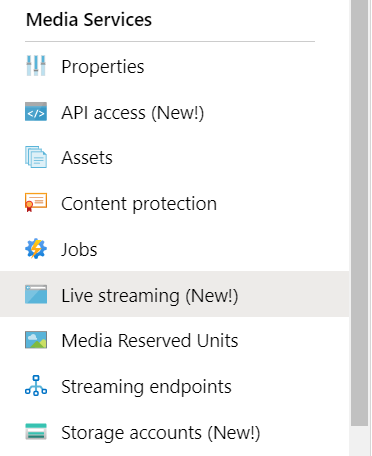
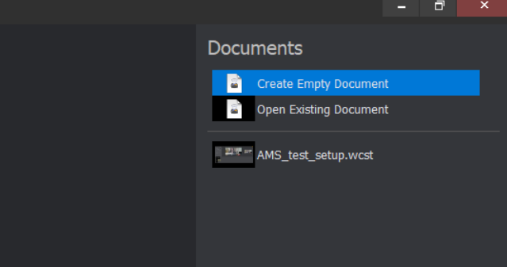
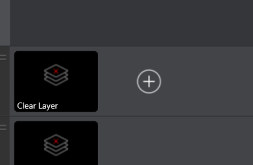
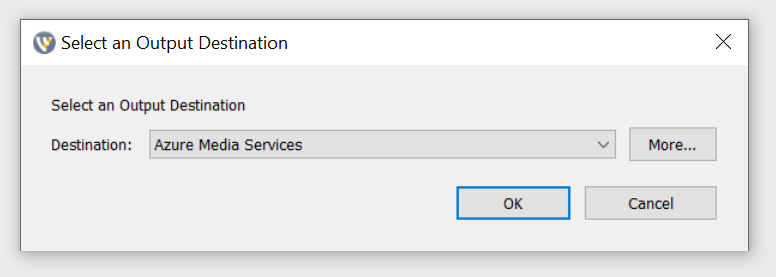
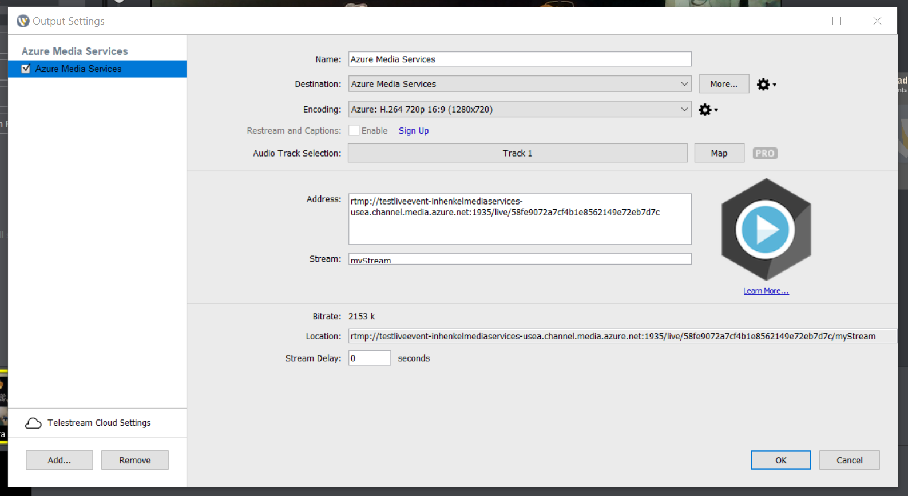
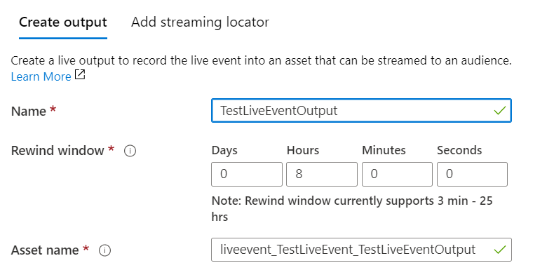
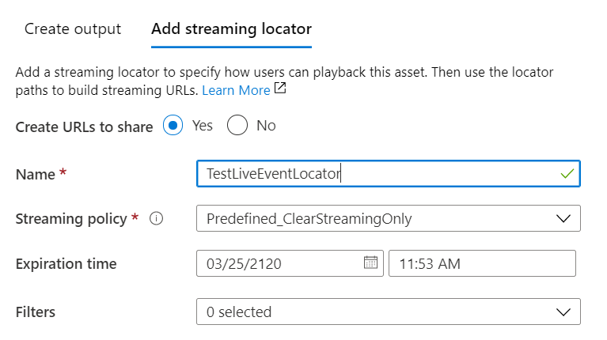
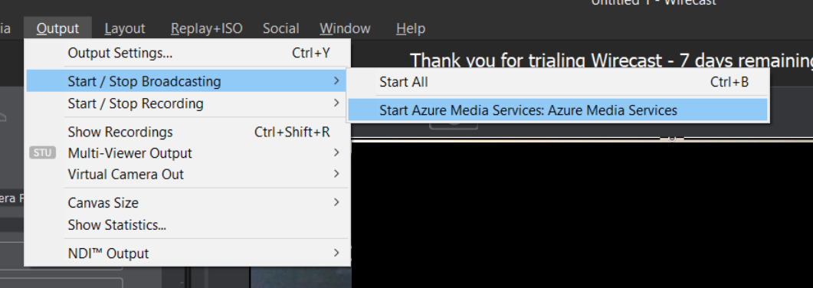
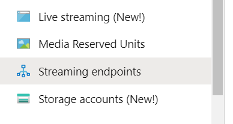

# Create a Azure Media Services Live stream with the portal and Wirecast

This Getting Started Guide assumes that you have an Azure subscription and have created an Azure Media Services account.

If you don't have an Azure subscription, create a [free](https://azure.microsoft.com/free/) account before you begin.

## Log in to the Azure portal

Open your web browser, and navigate to the [Microsoft Azure portal](https://portal.azure.com/). Enter your credentials to sign in to the portal. The default view is your service dashboard.

In this quickstart, we will cover:

- Setting up an on-premises encoder with a free trial of Telestream Wirecast
- Setting up a live stream
- Setting up live stream outputs
- Running a default streaming endpoint
- Using the Azure Media Player to view the live stream and on-demand output

To keep things simple, we will use an encoding preset for Azure Media Services in Wirecast, pass-through cloud encoding, and RTMP.

## Setting up an on-premises encoder with Wirecast

1. Download and install Wirecast for your operating system at https://www.telestream.net
1. Start the application and use your favorite email address to register the product.  Keep the application open.
1. You will receive an email asking you to verify your email address, then then the application will start the free trial.
1. RECOMMENDED: Watch the video tutorial in the opening application screen.

## Setting up an Azure Media Services live stream

1. Once you have navigated to the Azure Media Services account within the portal, select **Live streaming** from the Media Services listing. 
 
1. Click on **Add live event** to create a new live streaming event. 
 
1. Enter a name for your new event such as *TestLiveEvent* in the Live event **Name** field. 
 
1. Enter an optional description of the event in the **Description** field.
1. Select the **Pass-through – no cloud encoding** radio button. 

1. Select the **RTMP** radio button.
1. Make sure that the **No** radio button is selected for Start live event, to prevent being billed for the live event before it is ready.  (Billing will begin once the live event is started.)
 
1. Click the **Review + create** button to review the settings.
1. Click the **Create** button to create the live event. You will then be returned to the live event listing view.
1. Click on the **link to the live event** you just created. Notice that your event is stopped.
1. Keep this page open in your browser.  We will come back to it later.

## Setting up a live stream with Wirecast Studio

1. Assuming that you still have the Wirecast application open, select **Create Empty Document** from the main menu, then click **Continue**.

1. Hover over the first layer in the Wirecast layers area.  Click the **Add** icon that appears and select the video input you want to stream.  The Master Layer 1 dialogue box will open. 

1. Select **Video capture** from the menu and then select the camera that you want to use. If selecting a camera, the view from the camera will appear in the Preview area.

1. Hover over the second layer in the Wirecast layers area. Click the **Add** icon that appears and select the audio input you want to stream.  The Master Layer 2 dialogue box will open.
1. Select **Audio capture** from the menu and then select the audio input that you want to use.

1. From the main menu, select **Output settings**.  The Output dialog box will appear.
1. Select **Azure Media Services** from the output dropdown.  The output setting for Azure Media Services will auto populate *most* of the output settings. 

1. In the next section, you will go back to Azure Media Services in your browser to copy the *Input URL* to enter into the output settings.

### Copy and paste the input URL

1. Back in the Azure Media Services page of the portal, click **Start** to start the live stream event. (Billing starts now.) 

2. Click on the **Secure/Not secure** toggle to set it to **Not secure**.  This will set the protocol to RTMP instead of RTMPS.
3. Copy the **Input URL** to your clipboard.

4. Switch to the Wirecast application and paste the **Input URL** into the **Address** field in the Output settings. 

5. Click **Okay**.

## Setting up outputs

This part will set up your outputs and enable you to save a recording of your live stream.  

> [!NOTE]
> In order to stream this output, the streaming endpoint must be running.  See Running the default streaming endpoint section below.

1. Click on the **Create outputs** link below the Outputs video viewer.
1. If you like, edit the name of the output in the **Name** field to something more user friendly so it is easy to find later.

1. Leave all the rest of the fields alone for now.
1. Click **Next** add streaming locator.
1. Change the name of the locator to something more user friendly, if wanted.

1. Leave everything else on this screen alone for now.
1. Click **Create**.

## Starting the broadcast

1. In Wirecast, select **Output > Start / Stop broadcasting > Start Azure Media Services : Azure Media Services** from the main menu.  When the stream has been sent to the live event, the Live window in Wirecast will be show up in the live event video player on the live event page in Azure Media Services.

1. Click the **Go** button under the preview window to start broadcasting the video and audio you selected for the Wirecast layers.

> [!TIP]
> If there is an error, try reloading the player by clicking the Reload player link above the player.

## Running the default streaming endpoint

1. Make sure your streaming endpoint is running by selecting **Streaming endpoints** in the Media Services listing. You will be taken to the streaming endpoints page. 

1. If the default streaming endpoint status is stopped, click on the **default** streaming endpoint. This will take you to the page for that endpoint.
1. Click **Start**.  This will start the streaming endpoint. 

## Play the output broadcast with Azure Media Player

1. Copy the **Streaming URL** under the Output video player.
1. In a web browser, open the demo Azure Media Player https://ampdemo.azureedge.net/azuremediaplayer.html
1. Paste the **Streaming URL** into the URL field of the Azure Media Player.
1. Click the **Update Player** button.
1. Click the **play** icon on the video to see your live stream.

## Stopping the broadcast

When you think you have streamed enough content, stop the broadcast.

1. In Wirecast, click on the **broadcast** button.  This will stop the broadcast from Wirecast.
1. In the portal, click on **Stop**. You will get a warning message that the live stream stop but the output will now become an on-demand asset.
1. Click on **Stop** in the warning message. The Azure Media Player will also now show an error as the live stream is no longer available.

## Play the on-demand output with the Azure Media Player

The output you created is now available for on-demand streaming as long as your streaming endpoint is running.

1. Navigate to the Media Services listing and select **Assets**.
1. Find the event output you created earlier and click on the **link to the asset**. The asset output page will open.
1. Copy the **Streaming URL** under the video player for the asset.
1. Return to the Azure Media Player in the browser and paste the **Streaming URL** into the URL field of the Azure Media Player.
1. Click **Update Player**.
1. Click the **play** icon on the video to view the on-demand asset.

## Clean up resources

  > [!IMPORTANT]
  > Stop the services! Once you have completed the steps in this quickstart, be certain to stop the live event and the streaming endpoint or you will continue to be billed for the time they remain running. To stop the live event, see the Stopping the broadcast, steps 2 and 3 above.

### Stopping the streaming endpoint

1. From the Media Services listing, select **Streaming endpoints**.
2. Click on the **default** streaming endpoint you started earlier. This will open the endpoint's page.
3. Click on **Stop**.  This will stop the streaming endpoint.

>[!TIP]
>If you don't want to keep the assets from this event, be sure to delete them in order to prevent being billed for storage.

## Next steps
> [!div class="nextstepaction"]
> [What article is next in sequence](./live-events-outputs-concept.md)
