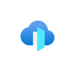
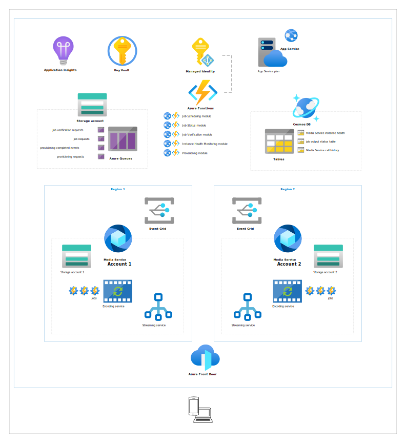

# High availability with Media Services and Video on Demand (VOD)

This article explains the deployment of Media Services and other Azure services to maintain a high-availability architecture with failover and ensure optimal availability for your Video on Demand (VOD) application.

## High availability for Azure

There is a high availability design pattern called [Geodes](https://docs.microsoft.com/azure/architecture/patterns/geodes) in the Azure Architecture documentation.  It explains the design pattern and when it would be used.

## High availability for VOD

You can use Azure services to create an architecture that covers many high availability design considerations such as redundancy, health monitoring, load balancing, and data backup and recovery. Each service is described as well as how it can be used to create a high availability architecture for your VOD application. High availability architectures typically have services duplicated across multiple regions.

## Overview of services

The services used in this example architecture include:

| Icon | Name | Description |
| :--: | ---- | ----------- |
|| Media services account | **Description:** A Media Services account is the starting point for managing, encrypting, encoding, analyzing, and streaming media content in Azure. It is associated with an Azure Storage account resource. The account and all associated storage must be in the same Azure subscription.  **VOD use:** These are the services you use to encode and deliver your video and audio assets.  For high availability, you would set up at least two Media Services accounts, each in a different region. [Learn more about Azure Media Services](media-services-overview.md). |
|| Storage account | **Description:** An Azure storage account contains all your Azure Storage data objects: blobs, files, queues, tables, and disks. Data is accessible from anywhere in the world over HTTP or HTTPS.  Each Media Services account, in each region would have a storage account in the same region.  **VOD use:** Azure storage can be used to host queues and tables. Queues can be used to send and receive messages to coordinate activities among different modules.  Tables can be used to store job output status records and to track health state of each Media Services instance.  You can also store input and output data for VOD processing. [Learn more about Azure Storage](https://docs.microsoft.com/azure/storage/common/storage-introduction). |
|| Azure Queue | **Description:** Azure Queue storage is a service for storing large numbers of messages that can be accessed from anywhere in the world via authenticated calls using HTTP or HTTPS.  **VOD use:** Queues can be used to send and receive messages to coordinate activities among different modules. [Learn more about Azure Queue](https://docs.microsoft.com/azure/storage/queues/storage-queues-introduction). |
|| Azure Cosmos DB  | **Description:** Azure Cosmos DB is Microsoft's globally distributed, multi-model database service that independently scales throughput and storage across any number of Azure regions worldwide.  **VOD use:** Tables can be used to store job output status records and to track health state of each Media Services instance. You can also track/recod the status of each call to the Media Services API. [Learn more about Azure Cosmos DB](https://docs.microsoft.com/azure/cosmos-db/introduction).  |
|| Managed Identity | **Description:** Managed identity is a feature of Azure AD that provides an automatically managed identity in Azure AD. It can be used to authenticate to any service that supports Azure AD authentication, including Key Vault, without storing credentials in code.  **VOD use:** Azure Functions can use Managed Identity to authenticate to Media Services instances. [Learn more about Managed Identity](https://docs.microsoft.com/azure/active-directory/managed-identities-azure-resources/overview). |
|| Key Vault | **Description:** Azure Key Vault can be used to Securely store and tightly control access to tokens, passwords, certificates, API keys, and other secrets. It can also be used as a Key Management solution. Azure Key Vault makes it easy to create and control the encryption keys used to encrypt your data. It can easily provision, manage, and deploy public and private Transport Layer Security/Secure Sockets Layer (TLS/SSL) certificates for use with Azure and internal connected resources. Secrets and keys can be protected either by software or FIPS 140-2 Level 2 validated HSMs.  **VOD use:** Key Vault can be used to set up access policies for the service principal for your application.  It can be used to store connection string to storage accounts. [Learn more about Key Vault](https://docs.microsoft.com/azure/key-vault/general/overview). |
|| Azure Functions | **Description:** Run small pieces of code (called "functions") without worrying about application infrastructure with Azure Functions.  **VOD use:** Azure Functions can be used to store host the modules of your VOD application.  Modules for a VOD application could include:  **Job Scheduling Module** The job scheduling module would be for submitting new jobs to a Media Services cluster (two or more instances in different regions). It would track the health status of each Media Services instance and would submit a new job to the next healthy instance.  **Job Status Module** The job status module would be listening to job output status events coming from Azure Event Grid service. It would store events to event store to minimize the number of calls to Media Services APIs by rest of the modules.  **Instance Health Module** This module would track submitted jobs and determine the health status for each Media Services instance. It would track finished jobs, failed jobs and jobs that never finished.  **Provisioning Module** This module would provision processed assets. It would copy asset data to all Media Services instances and set up Azure Front Door service to ensure that assets could be streamed even when some Media Services instances weren’t available. It would also set up streaming locators.  **Job Verification Module** This module would track each submitted job, resubmit failed jobs and perform job data clean up once a job is successfully finished. [Learn more about Azure Functions](https://docs.microsoft.com/azure/azure-functions/functions-overview).  |
|| App Service (and plan)  | **Description:** Azure App Service is an HTTP-based service for hosting web applications, REST APIs, and mobile back ends. It supports .NET, .NET Core, Java, Ruby, Node.js, PHP, or Python. Applications run and scale on both Windows and Linux-based environments.  **VOD use:** Each module would be hosted by an App Service. [Learn more about App Service](https://docs.microsoft.com/azure/app-service/overview). |
|| Azure Front Door | **Description:** Azure Front Door is used to define, manage, and monitor the global routing of web traffic by optimizing for best performance and quick global failover for high availability.  **VOD use:** Azure Front Door could be used to route traffic to streaming endpoints. [Learn more about Azure Front Door](https://docs.microsoft.com/azure/frontdoor/front-door-overview).  |
|| Azure Event Grid | **Description:** Created for event-based architectures, Event Grid has built-in support for events coming from Azure services, like storage blobs and resource groups. It also has support for custom topic events. Filters can be used to route specific events to different endpoints, multicast to multiple endpoints, and to make sure events are reliably delivered. It maximizes availability by natively spreading across multiple fault domains in every region, and across availability zones.  **VOD use:** Event Grid can be used to track all application events and store them to persist job status. [Learn more about Azure Event Grid](https://docs.microsoft.com/azure/event-grid/overview). |
|| Application Insights | **Description:**  Application Insights, a feature of Azure Monitor, is an extensible Application Performance Management (APM) service for developers and DevOps professionals. It is used to monitor live applications. It detects performance anomalies, and includes analytics tools to diagnose issues and to understand what users do with an app. It's designed to help you continuously improve performance and usability.  **VOD use:** All logs can be sent to Application Insights. It would be possible to see what instance processed each job by searching for successfully created job messages. It could contain all submitted job metadata including the unique identifier and instance name information. [Learn more about Application Insights](https://docs.microsoft.com/azure/azure-monitor/app/app-insights-overview). |
## Architecture

This high-level diagram shows the architecture of the sample provided to get you started with high availability and media services.

## Sample

There is a sample available for you to use to become familiar with high availability with Media Services and Video on Demand (VOD).  It is not intended for production but will give you concrete practice with the services.  It also goes into more detail about how the services are used for a VOD scenario. Check out the code on GitHub. <link to sample>

## Best practices

### Multiple regions

* Create two (or more) Azure Media Services accounts. The two accounts need to be in different regions. For more info, see regions in which the Azure Media Services service is deployed.
* Upload your media to the same region from which you are planning to submit the job.
* If you then need to resubmit the job to another region, you can use `JobInputHttp` or use `Copy-Blob` to copy the data from the source Asset container to an Asset container in the alternate region.

### Use Azure Event Grid

* Subscribe for `JobStateChange` messages in each account via Azure Event Grid. For more information, see:
    * Audio Analytics sample that shows how to monitor a job with Azure Event Grid including adding a fallback in case the Azure Event Grid messages are delayed for some reason.
    * Azure Event Grid schemas for Media Services events
    * Register for events via the Azure portal or the CLI (you can also do it with the Event Grid Management SDK)
    * Microsoft.Azure.EventGrid SDK (which supports Media Services events natively).
* You can also consume Event Grid events via Azure Functions. When you create a job:
    * Randomly select an account from the list of currently used accounts (this list will normally contain both accounts but if issues are detected it may only contain one account). If the list is empty, raise an alert so an operator can investigate.
    * General guidance is you need one media reserved unit per `JobOutput` (unless you are using `VideoAnalyzerPreset` where three media reserved units per `JobOutput` is recommended).
    * Get the count of media reserved units (MRUs) for the chosen account. If the current media reserved units count isn't already at the maximum value, add the number of the MRUs needed by the job and update the service. If your job submission rate is high and you are frequently querying the MRUs to find you are at the maximum, use a distributed cache for the value with a reasonable timeout.
    * Keep a count of the number of inflight jobs.
* When your `JobStateChange` handler gets a notification that a job has reached the scheduled state, record the time it enters the schedule state and the region/account used.
* When your `JobStateChange` handler gets a notification that a job has reached the processing state, mark the record for the job as processing.
* When your `JobStateChange` handler gets a notification that a job has reached the Finished/Errored/Canceled state, mark the record for the job as final and decrement the inflight job count. Get the number of media reserved units for the chosen account and compare the current MRU number against your inflight job count. If your inflight count is less than the MRU count, then decrement it and update the service.

### Monitoring

Have a separate process that periodically looks at your records of the jobs.

* If you have jobs in the scheduled state that haven't advanced to the processing state in a reasonable amount of time for a given region, remove that region from your list of currently used accounts. Depending on your business requirements, you could decide to cancel those jobs right away and resubmit them to the other region. Alternatively, you could give them some more time to move to the next state.
* Depending on the number of Media Reserved Units configured on the account and the submission rate, there also may be jobs in the queued state the system has not picked up for processing yet. If the list of jobs in the queued state grows beyond an acceptable limit in a region, those jobs can be canceled and submitted to the other region. However, this may be a symptom of not having enough Media Reserved Units configured on the account for the current load. You can request a higher Media Reserved Unit quota through Azure Support if necessary.
* If a region was removed from the account list, monitor it for recovery before adding it back to the list. The regional health can be monitored via the existing jobs on the region (if they weren't canceled and resubmitted), by adding the account back to the list after a period of time, and by operators monitoring Azure communications about outages that may be affecting Azure Media Services.
* If you find the MRU count is thrashing up and down a lot, move the decrement logic to the periodic task. Have the pre-job submit logic compare inflight count to the current MRU count to see if it needs to update the MRUs.

## Next steps

* [Build video-on-demand cross region streaming](media-services-high-availability-streaming.md)
* Check out [code samples](https://docs.microsoft.com/samples/browse/?products=azure-media-services)
