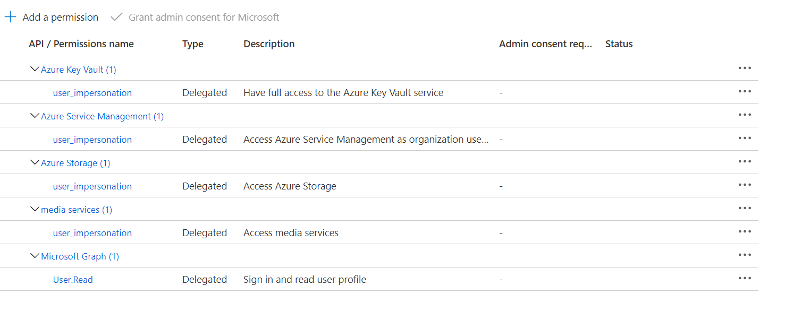

# Tutorial: Use customer-managed keys or bring your own key (BYOK) with Media Services

With the 2020-05-01 API, you can use a customer managed RSA key with a Media Services account that has a system managed identity.  This tutorial includes a Postman collection and environment to send REST requests to Azure services.  Services used:

- Azure Active Directory application registration for Postman
- Microsoft Graph API
- Azure storage
- Azure Key Vault
- Media Services

In this tutorial, you'll learn to use Postman to:

> [!div class="checklist"]
> * Get tokens for use with Azure services.
> * Create a resource group, and a storage account.
> * Create a Media Services account with a system managed identity
> * Create a Key Vault for storing an RSA (customer managed) key for use with the storage account.
> * Update the Media Services account to use the RSA key with the storage account.
> * Use variables in Postman.

If you don't have an Azure subscription, [create a free trial account](https://azure.microsoft.com/free/).

## Prerequisites

- Register a service principal with the appropriate permissions.
- Install [Postman](https://www.postman.com).
- Download the Postman collection for this tutorial at [Azure Samples: media-services-customer-managed-keys-byok](https://github.com/Azure-Samples/media-services-customer-managed-keys-byok)

### Register a service principal with the needed permissions

[Create a service principal](https://docs.microsoft.com/azure/active-directory/develop/howto-create-service-principal-portal).  See [Option Two](https://docs.microsoft.com/azure/active-directory/develop/howto-create-service-principal-portal#authentication-two-options) for getting the service principal secret.  Note the secret somewhere, as once you leave the secret page in the portal, it will be inaccessible.

The service principal needs the following permissions to perform the tasks in this tutorial.

### Install Postman

If you haven't already installed Postman for use with Azure, you can get it at [postman.com](https://www.postman.com/).

### Download and import the collection

Download the Postman collection for this tutorial at [Azure Samples: media-services-customer-managed-keys-byok](https://github.com/Azure-Samples/media-services-customer-managed-keys-byok)

## Installation of collection and environment

1. Run Postman.
1. Select **Import**.
1. Select **Upload files**.
1. Navigate to where you have saved the collection and environment files.
1. Select the collection and environment file.
1. Select **Open**.  (You will see a warning that the files will not be imported as an API, but as collections.  This is fine.  It is what you want.)
1. This collection will now show up in your Collections as BYOK.
1. The environment variables will now appear in your Environments.

### Understand the REST API requests in the collection

The collection provides the following REST API requests. The requests must be sent in the sequence provided as most of them have test scripts that dynamically create global variables for the next (or subsequent) request in the sequence. It is not necessary to manually create the global variables.

In Postman, you'll see these variables contained within `{{ }}` brackets.  For example, `{{bearerToken}}`.

1. Get AAD token - the test sets the global variable *bearerToken*
2. Get Graph token - the test sets the global variable *graphToken*
3. Get Service Principal Details - the test sets the global variable *servicePrincipalObjectId*
4. Create a storage account - the test sets the global variable *storageAccountId*
5. Create a Media Services Account with a System Managed Identity -  the test sets the global variable *principalId*
6. Create a Key Vault, granting access to the service principal - the test sets the global variable *keyVaultId*
7. Get a Key Vault token - the test sets global variable *keyVaultToken*
8. Create RSA key in the key vault - the test sets global variable *keyId*
9. Update the Media Services account to use the key with the storage account - there isn't a test script for this request.

## Define environment variables

1. Switch to the environment you downloaded by selecting the environments dropdown list.
1. Establish your environment variables in Postman. They are also used as variables contained within `{{ }}` brackets.  For example, `{{tenantId}}`.

    * *tenantId* = your tenant ID
    * *servicePrincipalId* = the ID of the service principal you establish with your favorite method: portal, CLI, and so on.
    * *servicePrincipalSecret* = the secret created for the service principal
    * *subscription* = your subscription ID
    * *storageName* = the name you want to give to your storage
    * *accountName* = the Media Service account name you want to use
    * *keyVaultName* = the Key Vault name you want to use
    * *resourceLocation* = centralus (Or where ever you want to put your resources.  This collection has only been tested with centralus.)
    * *resourceGroup* = the resource group name

    The following variables are standard for working with Azure resources so there's no need to change them.

    * *armResource* = `https://management.core.windows.net`
    * *graphResource* = `https://graph.windows.net/`
    * *keyVaultResource* = `https://vault.azure.net`
    * *armEndpoint* = `management.azure.com`
    * *graphEndpoint* = `graph.windows.net`
    * *aadEndpoint* = `login.microsoftonline.com`
    * *keyVaultDomainSuffix* = `vault.azure.net`

## Send the requests

Once your environment variables have been defined, you can either run the requests one at a time in the above sequence, or use Postman's runner to run the collection.

## Change the key

Media services will automatically detect when the key has been changed.  To test this, create another key version for the same key. Media Services should detect this key in less than 15 minutes.

## Clean up resources

If you're not going to continue to use the resources that you created and **you don't want to continue to be billed**, delete them.

## Next steps

Advance to the next article to learn how to...
> [!div class="nextstepaction"]
> [Encode a remote file based on URL and stream the video with REST](stream-files-tutorial-with-rest.md)
