# Tutorial: Store Azure Media Services events in Azure Log Analytics

## Azure Media Services Events

Azure Media Services v3 emits events on [Azure Event Grid](media-services-event-schemas.md). You can subscribe to events in many ways and store them in data stores. In this tutorial, you will subscribe to Media Services events using a [Log App Flow](https://azure.microsoft.com/services/logic-apps/). The Logic App will be triggered for each event and store the body of the event in Azure Log Analytics. Once the events are in Azure Log Analytics, you can use other Azure services to create a dashboard, monitor, and alert on these events, though we won't be covering that in this tutorial.

> [!NOTE]
> It would be helpful if you are already familiar with using FFmpeg as your on-premises encoder.  If not, that's okay. The command line and instructions for streaming a video is included below.

You will learn how to:

> [!div class="checklist"]
> * Create a no code Logic App Flow
> * Subscribe to Azure Media Services event topics
> * Parse events and store to Azure Log Analytics
> * Query events from Azure Log Analytics

If you don’t have an Azure subscription, create a [free account](https://azure.microsoft.com/free/?WT.mc_id=A261C142F) before you begin.

## Prerequisites

> * An [Azure subscription](how-to-set-azure-subscription.md)
> * A [Media Services](create-account-howto.md) account and resource group.
> * An installation of [FFmpeg](https://ffmpeg.org/download.html) for your OS.
> * A [Log Analytics](https://docs.microsoft.com/azure/azure-monitor/learn/quick-create-workspace) workspace

## Subscribe to a Media Services event with Logic App

1. In the Azure portal, if you haven't done so already, create a [Log Analytics](https://docs.microsoft.com/azure/azure-monitor/learn/quick-create-workspace) workspace. You'll need the Workspace ID and one of the keys, so keep that browser window open. Then, open the portal in another tab or window.

1. Navigate to your Azure Media Services account and select **Events**. This will show all the methods for subscribing to Azure Media Services events.
    > [!div class="mx-imgBorder"]
    > 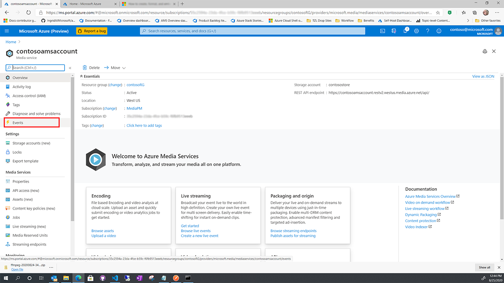

1. Select the **Logic Apps icon** to create a Logic App. This will open the Logic App Designer where you can create the flow to capture the events and push them to Log Analytics. 
    > [!div class="mx-imgBorder"]
    > 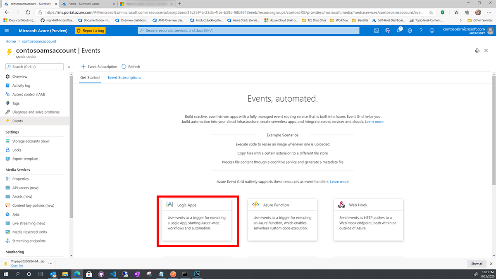

1. Select the **+ icon**, select the tenant you want to use, then select Sign in. You will see a Microsoft sign-in prompt.
    > [!div class="mx-imgBorder"]
    > 
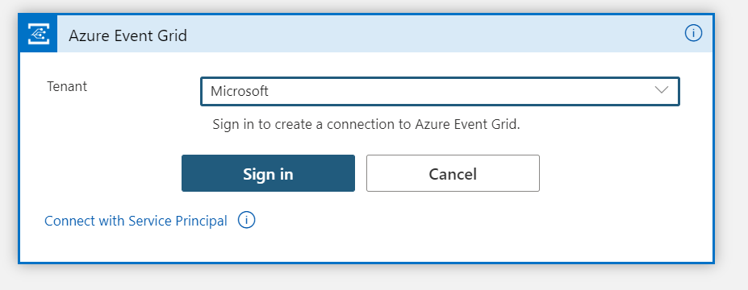

1. Select **Continue** to subscribe to the Media Services Events.
    > [!div class="mx-imgBorder"]
    > 

1. In the **Resource Type** list, locate "Microsoft.Media.MediaServices".
    > [!div class="mx-imgBorder"]
    >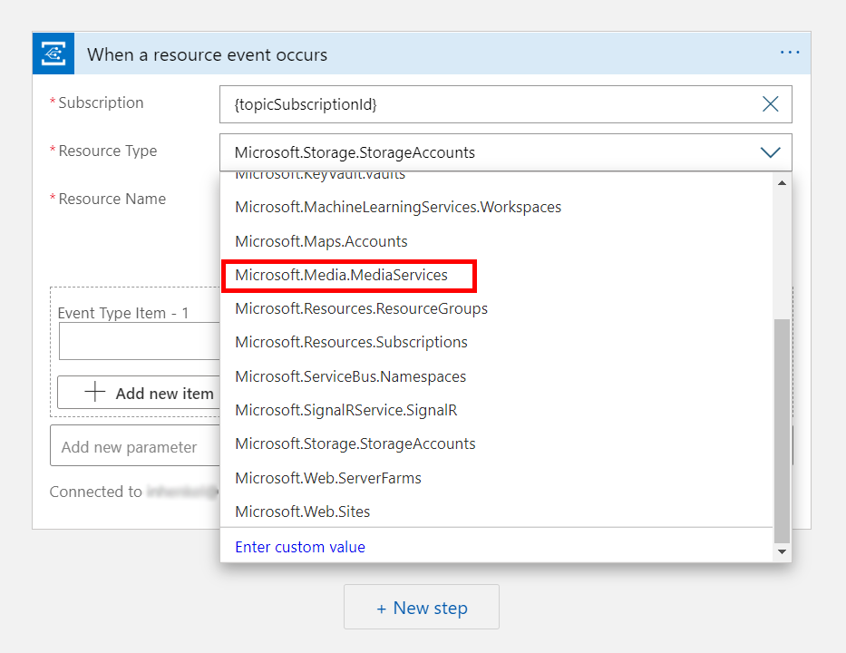

1. Select the **Event Type item**. There will be a list of all the events Azure Media Services emits. You can select the events you would like to track. You can add multiple event types. (Later, you will make a small change to the Logic App flow to store each event type in a separate Log Analytics Log and propagate the Event Type name to the Log Analytics Log name dynamically.)
    > [!div class="mx-imgBorder"]
    > 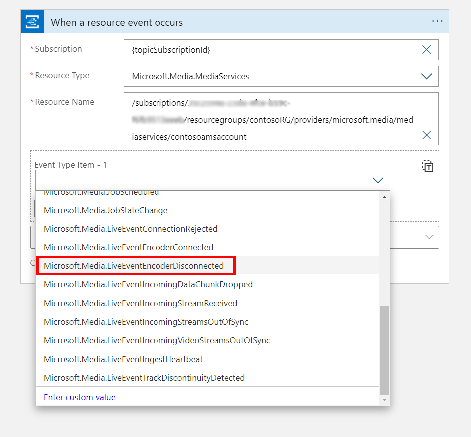

1. Select **Save As**.

1. Give your Logic App a name.  The resource group is selected by default. Leave the other settings the way they are, then select **Create**.  You will be returned to the Azure home screen.
    > [!div class="mx-imgBorder"]
    > 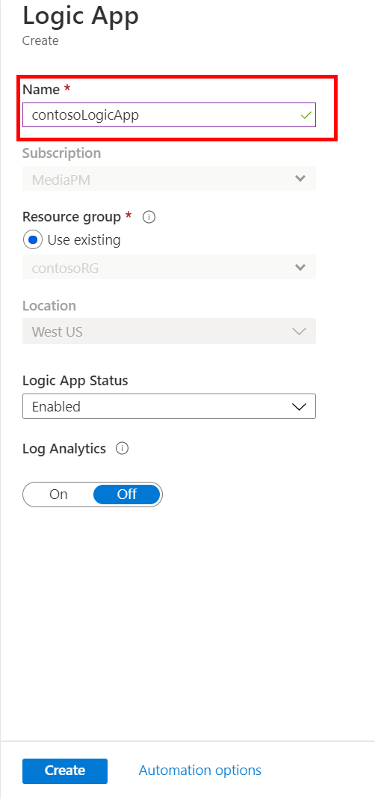

## Create an action

Now that you are subscribed to the event(s), create an action.

1. If the portal has taken you back to the home screen, navigate back to the Logic App you just created by searching All resources for the app name.

1. Select your app, then select **Logic app designer**. The designer pane will open.

1. Select **+ New Step**.

1. Since you want to push the events to the Azure Log Analytics service, search for "Azure Log Analytics" and select the "Azure Log Analytics Data Collector".
    > [!div class="mx-imgBorder"]
    > 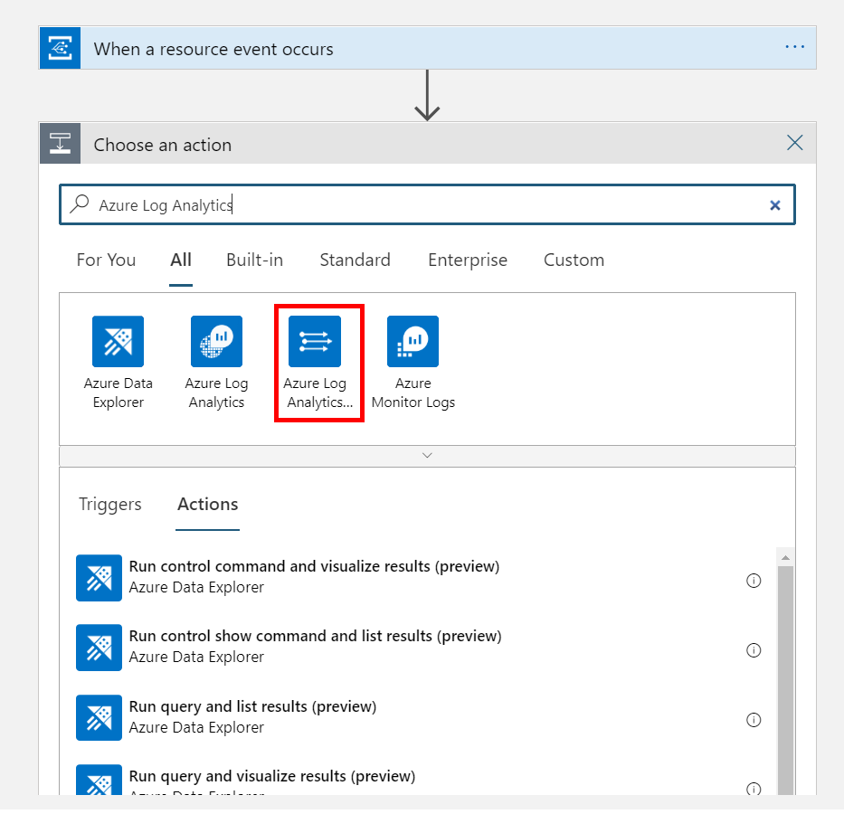

1. To connect to the Log Analytics Workspace, you need the Workspace ID and an Agent Key. Open the Azure portal in a new tab or window, navigate to the Log Analytics Workspace you created before the start of this tutorial.
    > [!div class="mx-imgBorder"]
    > 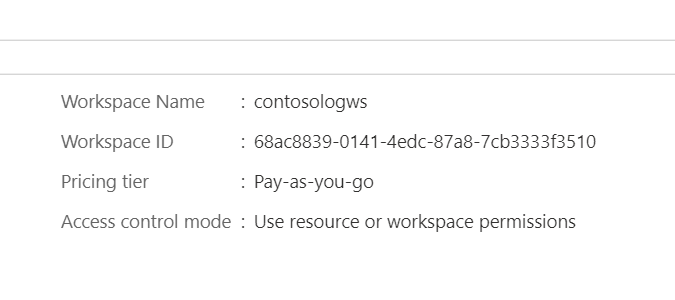

1. On the left menu, locate **Agents Management** and select it. This will show you the agent keys that have been generated.
    > [!div class="mx-imgBorder"]
    > 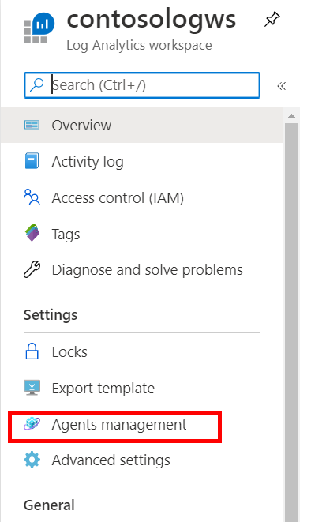

1. Copy the *Workspace ID*.
    > [!div class="mx-imgBorder"]
    > 

1. In the other browser tab or window, under the Azure Log Analytics Data Collector select **Send Data**, give your connection a name, then paste the *Workspace ID* in the **Workspace ID** field.

1. Return to the Workspace browser tab or window and copy the *Workspace Key*.
    > [!div class="mx-imgBorder"]
    > 

1. In the other browser tab or window, paste the *Workspace Key* in the **Workspace Key** field.

1. Select **Create**. Now you will create the JSON request body and the Custom Log Name.

1. Select the **JSON Request body** field.  A link to **Add dynamic content** will appear.

1. Select **Add Dynamic content** and then select **Topic**.

1. Do the same for **Custom Log Name**.
    > [!div class="mx-imgBorder"]
    > 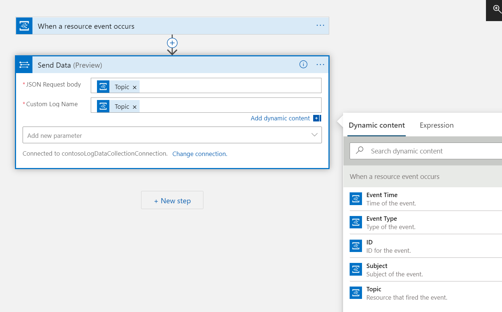

1. Select **Code View** of the Logic App. Look for the Inputs and Log-Type lines.
    > [!div class="mx-imgBorder"]
    > 

1. Change the `body` value from `"@triggerBody()?['topic']"` to `"@{triggerBody()}"`. This is for parsing the entire message to Log Analytics.

1. Change the `Log-Type` from `"@triggerBody()?['topic']"` to `"@replace(triggerBody()?['eventType'],'.','')"`. (This will replace "." as these are not allowed in Log Analytics Log Names.)
    > [!div class="mx-imgBorder"]
    > 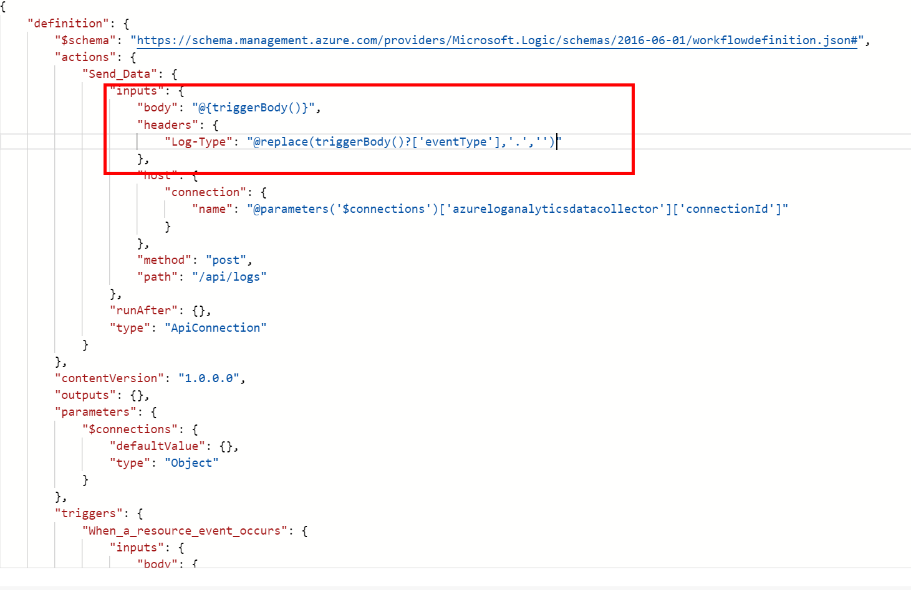

1. Select **Save**.

1. To verify, select **Logic app designer**.
    > [!div class="mx-imgBorder"]
    > 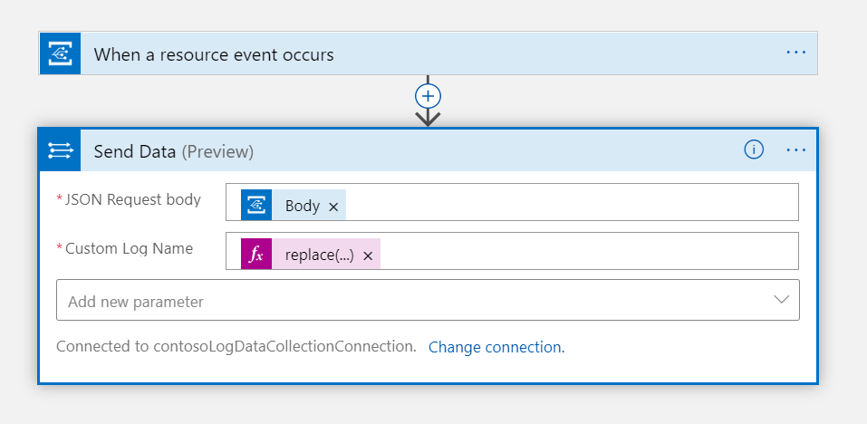

1. When you examine all the resources in the resource group, there will be a Logic App and two Logic App API connectors listed, one for the Events and one for Log Analytics. For more information about Event Grid system topics, read [Event Grid System Topics](https://docs.microsoft.com/azure/event-grid/system-topics).
    > [!div class="mx-imgBorder"]
    > 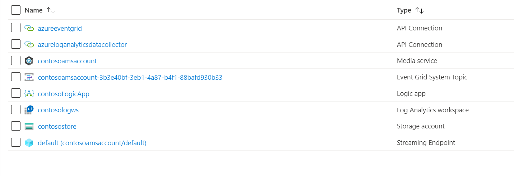

## Test

To test how it actually works, create a Live Event in Azure Media Services. Create an RTMP Live Event and use ffmpeg to push a "live" stream based on a .mp4 sample file. After the event is created, get the RTMP ingest URL.

1. From your Media Services account, select **Live streaming**.
    > [!div class="mx-imgBorder"]
    > 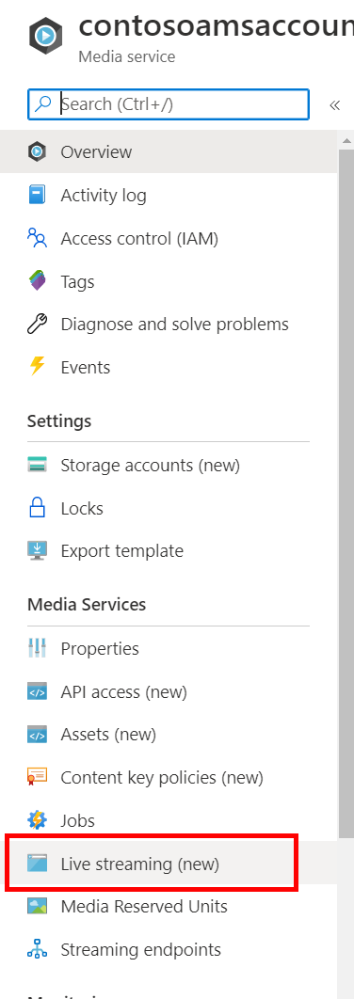

1. Select **Add live event**.

1. Enter a name into the **Live event name** field. (The **Description** field is optional.)

1. Select **Standard** cloud encoding.

1. Select **Default 720p** for the encoding preset.

1. Select **RTMP** input protocol.

1. Select **Yes** for the persistent input URL.

1. Select **Yes** to start the event when the event is created.

    > [!WARNING]
    > Billing will start if you select Yes.  If you want to wait to start the stream until *just before* you start streaming with FFmpeg, select **No** and remember to start your live event then.

    > [!div class="mx-imgBorder"]
    > 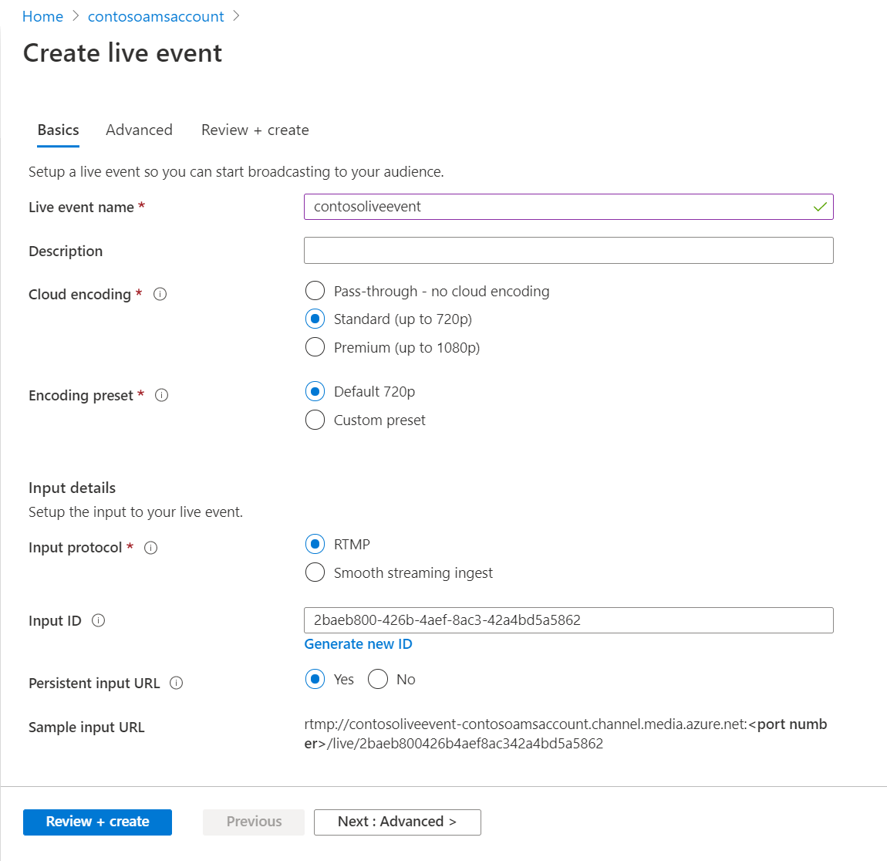

1. Select **I have all the rights to use the content/file...** checkbox.

1. Select **Review + create**.

1. Review your settings, then select **Create**.  The live event listing will appear and the live event Ingest URL will be shown.

1. Copy the **Ingest URL** to your clipboard.

1. Select the **live event** in the listing to see the Producer view.

### Stream with FFmpeg CLI

1. Use the following command line.

    ```AzureCLI
    ffmpeg -i <localpathtovideo> -map 0 -c:v libx264 -c:a copy -f flv <ingestURL>/mystream
    ```

1. Change `<ingestURL>` to the Ingest URL you copied to your clipboard.
1. Change `<localpathtovideo>` to the local path of file you want to stream from FFmpeg.
1. Add a unique name at the end, for example, `mystream`.
1. Adjust the command line to reflect your test source file and any other system variables.
1. Run the command. After a couple seconds, the "Producer view" player should start streaming. (Refresh the player if the video doesn't show up automatically.)

    > [!div class="mx-imgBorder"]
    > 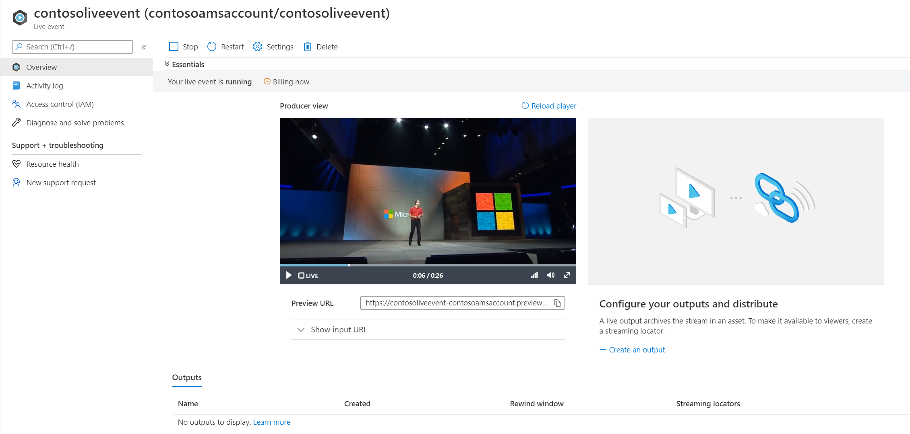

## Verify the events

With the live stream, Azure Media Services is emitting various events that are triggering the Logic App flow. To verify, navigate to the Logic App and determine if there are any triggers being fired by the events from Media Services.

1. Navigate to the Logic App Overview page, you should see "Run History" listing jobs that have completed successfully.
    > [!div class="mx-imgBorder"]
    > 

1. Select a successful job. The details of the job during runtime are shown.
1. Select **Send Data** to expand it. In this case, the `MicrosoftMediaLiveEventEncoderConnected` event shows that it was captured as well as the parsed body. This is what is pushed to the Azure Log Analytics Workspace.
    > [!div class="mx-imgBorder"]
    > 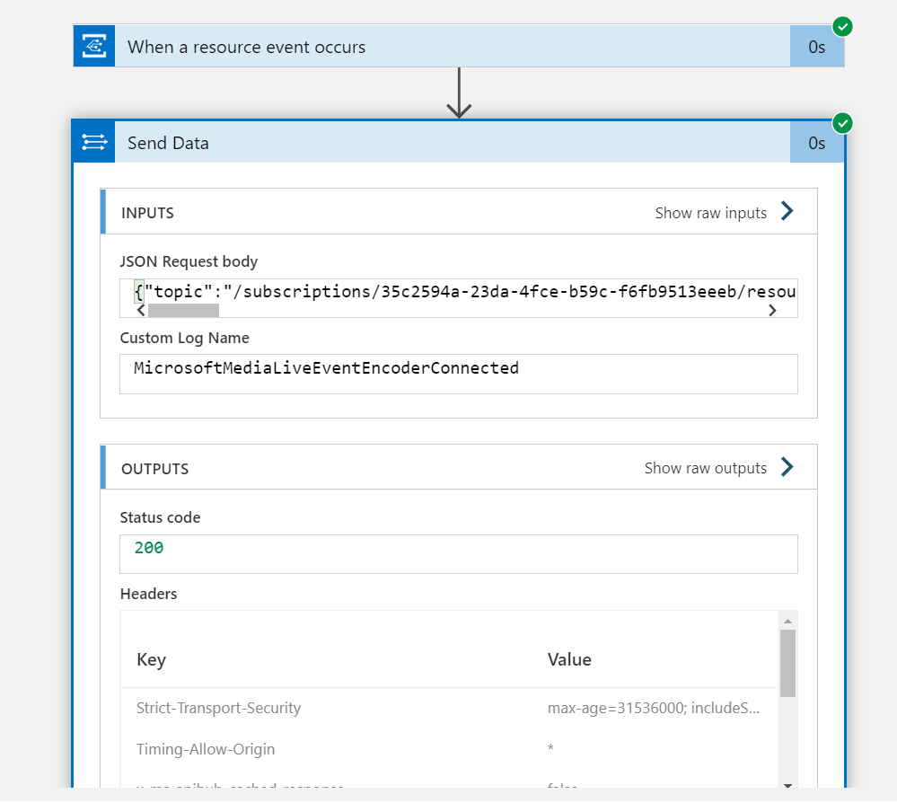

## Verify the logs

1. Navigate to Log Analytics Workspace you created earlier.

1. Select **Logs**.
1. Close the Example queries popup.
1. There will be a Custom Logs listing. Select the down arrow to expand it. There you will see the event name `MicrosoftMediaLiveEventEncoderConnected`.
1. Select the event name to expand it.
1. When you select the "eye" icon, it will show a preview of the query result.
1. Select **See in query editor** and then select the item under **TimeGenerated UTC** listing to expand it and view the raw data.

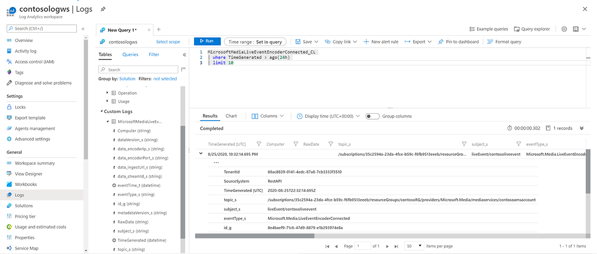

## Next steps

You can create different queries and save them. These can be added to [Azure Dashboard](https://docs.microsoft.com/azure/azure-monitor/learn/tutorial-logs-dashboards).
