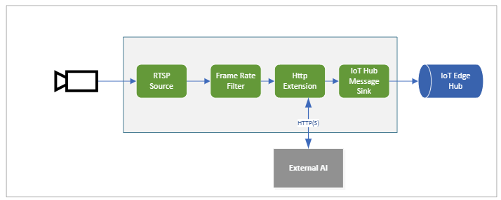
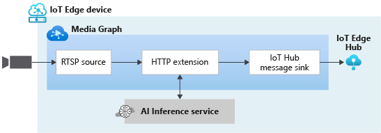

# Analyzing live video without any recording

## Suggested pre-reading 

* [Media graph concept](media-graph-concept.md)
* [Event-based video recording](event-based-video-recording-concept.md)

## Overview  

You can use a media graph to analyze live video, without recording any portions of the video to a file or an asset. The media graphs shown below are similar to the ones in [Event-based video recording](event-based-video-recording-concept.md) scenarios, but without an asset or file sink node.

### Motion detection

The media graph shown below consists of a [RTSP source](media-graph-concept.md#rtsp-source), a [motion detection processor](media-graph-concept.md#motion-detection-processor) and an [IoT Hub message sink](media-graph-concept.md#iot-hub-message-sink). This graph enables you to detect motion in the incoming live video and relays the motion events to other apps and services via the IoT Hub message sink. The events can be used trigger an alert or a notification to appropriate personnel.

### Analyzing video using custom AI

The media graph shown below enables you to analyze the video captured by the RTSP source using a custom AI packaged in a separate module. In this media graph, the frame rate filter processor samples video frames at a configured value and passes them to the [HTTP extension processor](media-graph-concept.md#http-extension-processor), which in turn scales the video frame (per configured values) and encodes it before sending the frame to the AI module using HTTP. Inference results returned by the AI module are packaged in to IoT Hub messages by the IoT Hub message sink and relayed to IoT Edge Hub. This type of media graph can be used to build solutions for a variety of scenarios such as understanding the time-series distribution of vehicles at an intersection, understanding the consumer traffic pattern in a retail store, and so on.

### Optimizing video analysis

The media graph described in the previous section can be optimized by injecting a motion detection processor before the frame rate filter processor. This results in optimal resource utilization as the frame rate filter processor only receives video when motion is detected, thus the AI module is triggered only when there is activity in the video.

## Next steps

[Continuous video recording](continuous-video-recording-concept.md)
