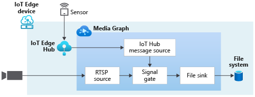
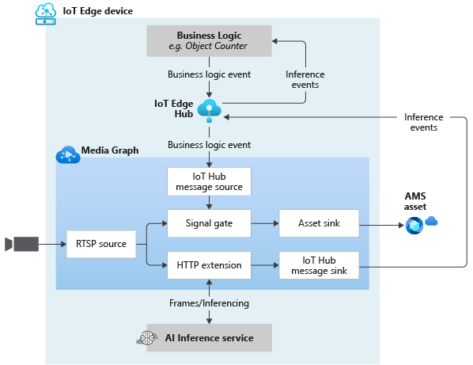

# Event-based video recording  
 
## Suggested pre-reading  

* [Continuous video recording](continuous-video-recording-concept.md)
* [Playback of recorded content](video-playback-concept.md)
* [Media graph concept](media-graph-concept.md)

## Overview 

Event-based video recording (EVR) refers to the process of recording video triggered by an event. The event in question, could originate due to processing of the video signal itself (for example, detection on motion) or could be from an independent source (for example, opening of a door). 

You can record video (triggered by an event) from a CCTV camera to a Media Services asset using a media graph consisting of an [RTSP source](media-graph-concept.md#rtsp-source), an [asset sink](media-graph-concept.md#asset-sink), and other nodes as outlined in the use cases below. You can configure the [asset sink](media-graph-concept.md#asset-sink) to generate new Assets each time an event occurs, so that the video that corresponds to each event will be in its own Asset. You can also choose to use one asset to hold the video for all events. 

An alternative to the Asset Sink is to use a [File Sink](media-graph-concept.md#file-sink) to capture short snippets of video (related to an event of interest), to a specified location on the local file system on the Edge device. 

A few use cases related to event-based video recording are described in this article.

### Video recording based on motion detection  

In this use case, you can record video clips only when there is motion detected in the video and be alerted when such a video clip is generated. This could be relevant in commercial security scenarios involving protection of assets or critical infrastructure. Generating video on motion and alerts when such motion is detected improves the efficiency of the human operator, since action is only needed when the alert is generated.

The diagram below provides a visual view of a media graph that can enable this use case. In the diagram, the RTSP Source captures the video from the camera and delivers it to a [Motion Detection Processor](media-graph-concept.md#motion-detection-processor). The output events from the Motion Detector Processor are sent to the [Signal Gate Processor](media-graph-concept.md#signal-gate-processor), as well as to the IoT Edge hub via IoT Hub Message Sink for alerting purpose. The Signal Gate Processor receives video from RTSP Source alongside the incoming events, which it evaluates over a period of time. If there is a signal from the Motion Detector in that period, it lets the media flow through to the Asset Sink. In the absence of subsequent such motion detection events the gate remains open for a configured amount of time, and this determines the length of the video clip recorded via the asset sink.

### Video recording based on events from other sources  

In this use case, signals from another IoT sensor can be used to trigger recording of video. In the diagram below, the external sensor sends events to the IoT Edge Hub. The events are then routed to the Signal Gate Processor via [IoT Hub Message Source](media-graph-concept.md#iot-hub-message-source). The behavior of the Signal Gate Processor is the same as with the previous use case (which had the Motion Detector Processor), except that here, the trigger for the signal gate is the external event. 

The output from the signal gate is shown to go to either a File Sink or an Asset Sink node. In the former case, the video will be written to the local file system on the Edge device. In the latter case, the video will be written to an Asset.

### Video recording based on an external inferencing module 

In this use case, you can record video clips based on events from an inference service that is external to the media graph. An example of such a use case could be generating a video clip only when a truck is detected in the video feed of traffic on a highway. 

The diagram below depicts a media graph that enables you to realize this scenario. In the diagram, the RTSP Source delivers the video feed on two paths, one to the [Signal Gate Processor](media-graph-concept.md#signal-gate-processor) and the other to an external truck detection inference service via the [HTTP Extension](media-graph-concept.md) node. The HTTP Extension node allows the media graph to send image frames (as JPEG, BMP, or PNG formats) to an external inference service over REST. This signal path can typically only support low frame rates (<5fps). You can use the [Frame Rate Filter Processor](media-graph-concept.md#frame-rate-filter-processor) node to lower the frame rate of the video going to the HTTP Extension node.

The results from the external inference service are retrieved by the HTTP Extension Processor, and relayed to the IoT Edge hub via IoT Hub Message Sink node, where they can be consumed by logic external to the Live Video Analytics Edge module. Such external business logic can then trigger the Signal Gate Processor via the IoT Hub Message Source to initiate recording when appropriate. The output from the signal gate is shown to go to either a File Sink or an Asset Sink node. In the former case, the video will be written to the local file system on the Edge device. In the latter case, the video will be written to an Asset.

An enhancement to the previous example is to use a Motion Detector Processor to further reduce the number of frames that are sent to an external inference engine. This node would be inserted between the RTSP Source node and the Frame Rate Filter Processor node. 

## Next steps

[Tutorial: event-based video recording](event-based-video-recording-tutorial.md)
