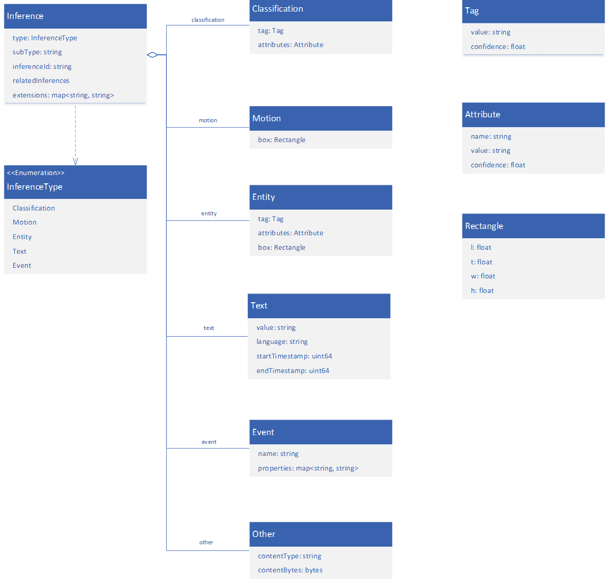

# HTTP extension data contract

In this article, you will learn about using HTTP protocol to send messages between Live Video Analytics module and your AI or CV module.

## HTTP extension contract

The HTTP contract is defined between the following two components:

* HTTP server
* Live Video Analytics on IoT Edge module acts as the HTTP client

## Request

Requests from Live Video Analytics module to your HTTP server would be as follows:

|Key|Value|
|---|---|
|POST|`https://hostname/optional-path?optional-query`|
|Accept|application/json,  */*|
|Authorization|Basic, Digest, Bearer (through custom header support)|
|Content-Type|image/jpeg<br/>image/png<br/>image/bmp<br/>image/x-raw|
|Content-Length	Body length, in bytes|
|User-Agent|Azure Media Services|
|Body|Image bytes, binary encoded in one of the supported content types.|

### Example

```
POST http://localhost:8080/inference HTTP/1.1
Host: localhost:8080
x-ms-client-request-id: d6050cd4-c9f2-42d3-9adc-53ba7e440f17
Content-Type: image/bmp
Content-Length: 519222
```

(Image Binary Content)

## Response

Responses from your module to Live Video Analytics module should be as follows:

|Key|Value|
|---|---|
|Status Codes|200 OK - Inference results found<br/>204 No Content - No content found by the AI<br/>400 Bad Request - Not expected<br/>500 Internal Server Error - Not expected<br/>503 Server Busy - AMS will back-off based on "Retry-After" header or based on a default amount of time in case header not preset.|
|Content-Type|application/json|
|Content-Length|Body length, in bytes|
|Body|JSON object with single "inferences" property.|

### Example

```
HTTP/1.1 200 OK
Content-Type: application/json
Content-Length: 468
Server: Microsoft-HTTPAPI/2.0
Date: Fri, 17 Apr 2020 04:44:01 GMT

{
  "inferences": [
    {
      "type": "entity",
      "entity": {
        "tag": { "value": "car", "confidence": 0.9048132 },
        "box": { "l": 0.42681578, "t": 0.47660735, "w": 0.019501392, "h": 0.020954132 }
      }
    },
    {
      "type": "entity",
      "entity": {
        "tag": { "value": "car", "confidence": 0.8953932 },
        "box": { "l": 0.55083525, "t": 0.4843858, "w": 0.046550274, "h": 0.046502113 }
      }
    }    
  ]
}
```

It is highly recommended that responses are returned using valid JSON documents following the pre-established schema defined below. This will better ensure interoperability with other components and possible future capabilities added to the Live Video Analytics module.

If your module returns a response where the content type is not “application/json”, Live Video Analytics will encode the message as a base 64 content and serialize it as an opaque JSON payload.

If your module returns a response with content type as “application/json” but the JSON schema doesn’t follow the inference metadata schema outlined below, the message payload will be forwarded through the pipeline, but interoperability will be reduced.

> [!NOTE]
> If your module doesn’t produce any result, it should return HTTP 204 Status Code (No Content) with an empty response body. Live Video Analytics will understand this as an empty result and won’t forward the event throughout the pipeline.

## Data contracts - class hierarchy



## Next steps

[gRPC data contract](grpc-data-contract.md)
