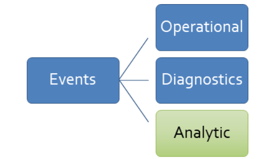

---
title: Telemetry schema - Azure
description: This article provides an overview of Live Video Analytics on IoT Edge telemetry schema.
ms.topic: reference
ms.date: 04/27/2020

---
# Telemetry schema

## Taxonomy

Live Video Analytics on IoT Edge emits events, metrics or telemetry data according to the following taxonomy.



### Events:

* **Operational**: events generated as part of actions taken by a user, or during the execution of a Media Graph<TODO: Link>

    * Volume: expected to be low (a few times a minute, or even lower rate)
    * Examples:

        * Graph Started, Graph Stopped
* **Diagnostics**: events that help with diagnosing of problems and/or performance

    * Volume: can be high (several times a minute)
    * Examples:

        * RTSP SDP Information, or gaps in the incoming video feed
* **Analytics**: events generated as part of video analysis

    * Volume: can be high (several times a minute or more often)
    * Examples:

        * Motion detected

### Metrics

* Metrics are scoped per namespace

## Schemas

Events and metrics originate on the Edge device, and are typically consumed in the cloud – hence they conform to the [streaming messaging pattern]() established by Azure IoT Hub.

## System/Header properties

### Summary

Every event will have a set of common properties as described below.

|Property|Data type|Description|
|---|---|---|
|id	|guid|	Unique event ID|
|topic	|string	|Azure Resource Manager Media Services account|
|subject|string	|Azure Resource Manager entity path + sub path|
|eventTime|	string	|Time the event was generated|
|eventType|	string|	Event Type identifier (see below)|
|data	|object|	Particular event data|
|dataVersion|	string|	{Major}.{Minor}|

### Mappings

Depending on where the event is viewed, the properties have different mappings.

|Property|	IoT Hub	|Azure Monitor|
|---|---|---|
|id	|message-id	|eventHeader.id|
|topic	|appProperties.topic|resourceId|
|subject|	appProperties.subject|	eventHeader.subject|
|eventType|	appProperties.eventType|	eventHeader.eventType|
|eventTime|	appProperties.eventTime	|Time|
|data|	body|	properties|

### Properties

#### Id

Event globally unique identifier (GUID)

#### Topic

Represents the media account associated with the graph (same topic is applied to Edge, per the account the AMS Edge module is linked to)

`/subscriptions/{subId}/resourceGroups/{rgName}/providers/Microsoft.Media/mediaServices/{accountName}`

#### Subject

Entity which is emitting the event:

```
/graphInstances/{graphInstanceName}
/graphInstances/{graphInstanceName}/sources/{sourceName}
/graphInstances/{graphInstanceName}/processors/{processorName}
/graphInstances/{graphInstanceName}/sinks/{sinkName}
```

The subject property allows for generic events to be mapped to its generating module. For instance, in case of invalid RTSP username or password the generated event would be Microsoft.Media.Graph.Diagnostics.AuthorizationError on the /graphInstances/myGraph/sources/myRtspSource module.

#### Event types

Event types are assigned to a namespace according with the following schema:

`Microsoft.Media[.Graph].{EventClass}[.{EventSubClass}].{EventType}`

#### Event classes

|Category|	Description|
|---|---|
|Analytics	|Events generated as part of content analysis
|Content	|Events that represent content
|Diagnostics|Events that aid with diagnostics of problems and performance
|Operational|Events generated as part of resource operation

##### Examples:

* Microsoft.Media.Analytics.Detection.Motion
* Microsoft.Media.Content.Image
* Microsoft.Media.Graph.Diagnostics.AuthorizationError
* Microsoft.Media.Graph.Operational.GraphInstanceStarted

Analytics and Content are not necessarily tied with MediaGraph thus they do not have MediaGraph component on their names.

#### Event time

Event time is described in ISO8601 string and it is based on this priority list:

* UTC time related with the media when media is anchored on UTC time (frame accurate)
* UTC time on the node processing the media at the time the event was generated
* UTC time on the node receiving the event from and external provider

## Next steps

You can see examples of operational and diagnostic events emitted by Live Video Analytics on IoT Edge in the following quickstarts and tutorials:

### Quickstarts

* [Get started – Detect motion and emit events](get-started-detect-motion-emit-events-quickstart.md)
* [Detect motion, record video to Media Services](detect-motion-record-video-clips-media-services-quickstart.md)
* [Detect motion and emit events](detect-motion-emit-events-quickstart.md)
* [Detect motion, record video on edge devices](detect-motion-record-video-clips-edge-devices-quickstart.md)
* [Run Live Video Analytics with your own model](use-your-model-quickstart.md)

### Tutorials

[Continuous video recording](continuous-video-recording-tutorial.md)
