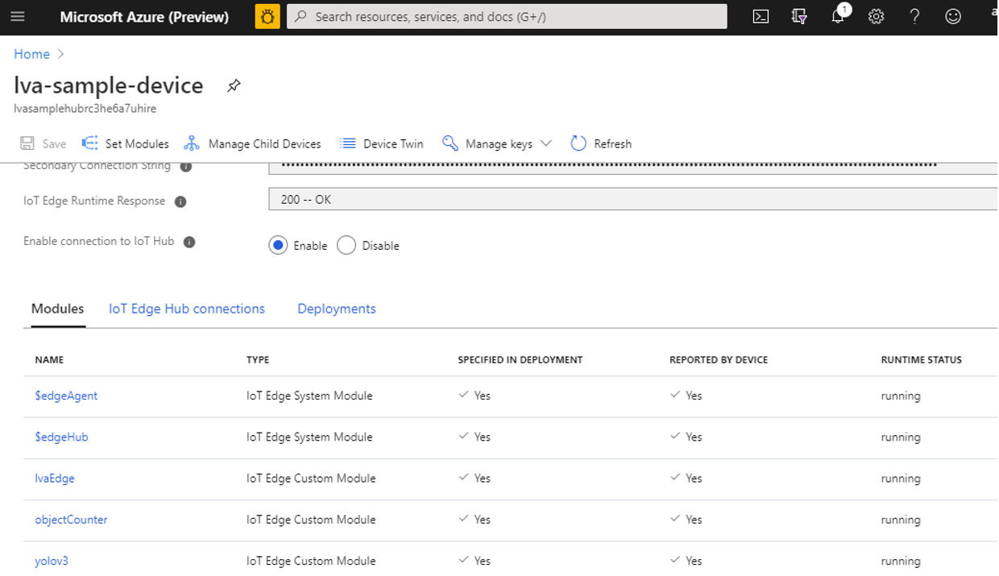
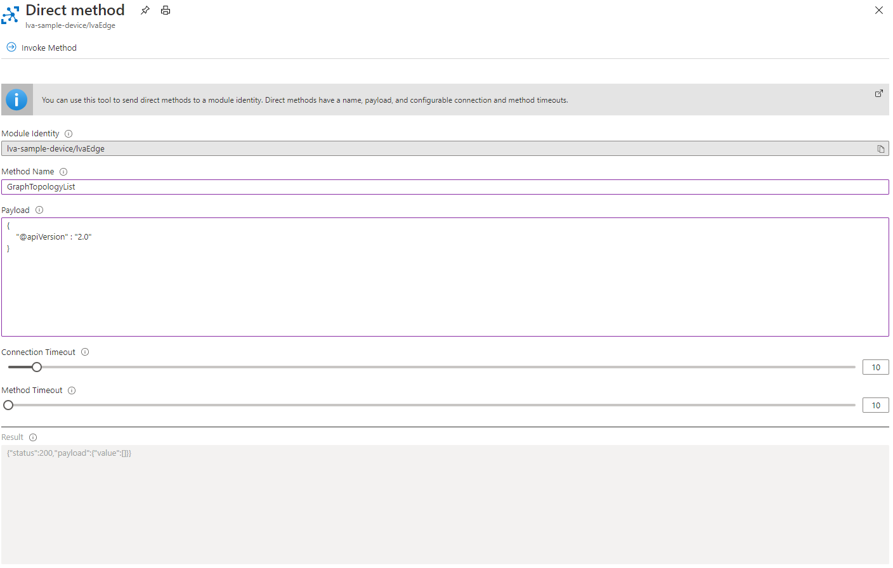
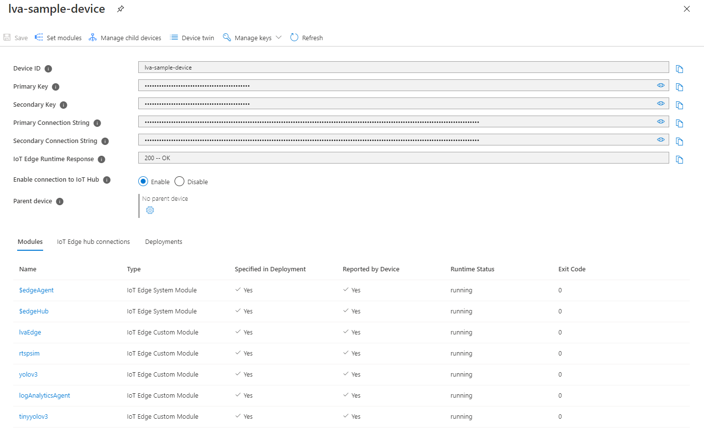
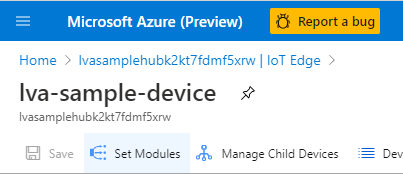

# Troubleshoot Live Video Analytics on IoT Edge

This article covers troubleshooting steps for Live Video Analytics (LVA) on Azure IoT Edge.

## Troubleshoot deployment issues

### Diagnostics

As part of your Live Video Analytics deployment, you set up Azure resources such as IoT Hub and IoT Edge devices. As a first step to diagnosing problems, always ensure that the Edge device is properly set up by following these instructions:

1. [Run the `check` command](../../iot-edge/troubleshoot.md#run-the-check-command).
1. [Check your IoT Edge version](../../iot-edge/troubleshoot.md#check-your-iot-edge-version).
1. [Check the status of the IoT Edge security manager and its logs](../../iot-edge/troubleshoot.md#check-the-status-of-the-iot-edge-security-manager-and-its-logs).
1. [View the messages that are going through the IoT Edge hub](../../iot-edge/troubleshoot.md#view-the-messages-going-through-the-iot-edge-hub).
1. [Restart containers](../../iot-edge/troubleshoot.md#restart-containers).
1. [Check your firewall and port configuration rules](../../iot-edge/troubleshoot.md#check-your-firewall-and-port-configuration-rules).

### Pre-deployment issues

If the edge infrastructure is fine, you can look for issues with the deployment manifest file. To deploy the Live Video Analytics on IoT Edge module on the IoT Edge device alongside any other IoT modules, you use a deployment manifest that contains the IoT Edge hub, IoT Edge agent, and other modules and their properties. You can use the following command to deploy the manifest file:

```
az iot edge set-modules --hub-name <iot-hub-name> --device-id lva-sample-device --content <path-to-deployment_manifest.json>
```
If the JSON code isn't well formed, you might receive the following error:   
&nbsp;&nbsp;&nbsp; **Failed to parse JSON from file: '<deployment manifest.json>' for argument 'content' with exception: "Extra data: line 101 column 1 (char 5325)"**

If you encounter this error, we recommend that you check the JSON for missing brackets or other issues with the structure of the file. To validate the file structure, you can use a client such as the [Notepad++ with JSON Viewer plug-in](https://riptutorial.com/notepadplusplus/example/18201/json-viewer) or an online tool such as the [JSON Formatter & Validator](https://jsonformatter.curiousconcept.com/).

### During deployment: Diagnose with media graph direct methods 

After the Live Video Analytics on IoT Edge module is deployed correctly on the IoT Edge device, you can create and run the media graph by invoking [direct methods](direct-methods.md).  
>[!NOTE]
>  The direct method calls should be made to the **`lvaEdge`** module only.

You can use the Azure portal to run a diagnosis of the media graph using direct methods:

1. In the Azure portal, go to the IoT hub that's connected to your IoT Edge device.

1. Look for **Automatic device management**, and then select **IoT Edge**.  

1. In the list of Edge devices, select the device that you want to diagnose.  
         
    


1. Check to see whether the response code is *200-OK*. Other response codes for the [IoT Edge runtime](../../iot-edge/iot-edge-runtime.md) include:
    * 400 - The deployment configuration is malformed or invalid.
    * 417 - The device doesn't have a deployment configuration set.
    * 412 - The schema version in the deployment configuration is invalid.
    * 406 - The IoT Edge device is offline or not sending status reports.
    * 500 - An error occurred in the IoT Edge runtime.

### Post deployment: Direct method error code
1. If you get a status `501 code`, check to ensure that the direct method name is accurate. If the method name and request payload are accurate, you should get results along with success code =200. 
1. If the request payload is inaccurate, you will get a status `400 code` and a response payload that indicates error code and message that should help with diagnosing the issue with your direct method call.
    * Checking on reported and desired properties can help you understand whether the module properties have synced with the deployment. If they haven't, you can restart your IoT Edge device. 
    * Use the [Direct methods](direct-methods.md) guide to call a few methods, especially simple ones such as GraphTopologyList. The guide also specifies expected request and response payloads and error codes. After the simple direct methods are successful, you can be assured that the Live Video Analytics IoT Edge module is functionally OK.
        
        

1. If the **Specified in deployment** and **Reported by device** columns indicate *Yes*, you can invoke direct methods on the Live Video Analytics on IoT Edge module. Select the module to go to a page where you can check the desired and reported properties and invoke direct methods. Keep in mind the following: 

### Post deployment: Diagnose logs for issues during the run 

The container logs for your IoT Edge module should contain diagnostics information to help debug your issues during module runtime. You can [check container logs for issues](../../iot-edge/troubleshoot.md#check-container-logs-for-issues) and self-diagnose the issue. 

If you've run all the preceding checks and are still encountering issues, gather logs from the IoT Edge device [with the `support bundle` command](../../iot-edge/troubleshoot.md#gather-debug-information-with-support-bundle-command) for further analysis by the Azure team. You can [contact us](https://ms.portal.azure.com/#blade/Microsoft_Azure_Support/HelpAndSupportBlade/newsupportrequest) for support and to submit the collected logs.

## Common error resolutions

Live Video Analytics is deployed as an IoT Edge module on the IoT Edge device, and it works collaboratively with the IoT Edge agent and hub modules. Some of the common errors that you'll encounter with the Live Video Analytics deployment are caused by issues with the underlying IoT infrastructure. The errors include:

* [The IoT Edge agent stops after about a minute](../../iot-edge/troubleshoot-common-errors.md#iot-edge-agent-stops-after-about-a-minute).
* [The IoT Edge agent can't access a module's image (403)](../../iot-edge/troubleshoot-common-errors.md#iot-edge-agent-cant-access-a-modules-image-403).
* [The IoT Edge agent module reports "empty config file" and no modules start on the device](../../iot-edge/troubleshoot-common-errors.md#edge-agent-module-reports-empty-config-file-and-no-modules-start-on-the-device).
* [The IoT Edge hub fails to start](../../iot-edge/troubleshoot-common-errors.md#iot-edge-hub-fails-to-start).
* [The IoT Edge security daemon fails with an invalid hostname](../../iot-edge/troubleshoot-common-errors.md#iot-edge-security-daemon-fails-with-an-invalid-hostname).
* [The Live Video Analytics or any other custom IoT Edge module fails to send a message to the edge hub with 404 error](../../iot-edge/troubleshoot-common-errors.md#iot-edge-module-fails-to-send-a-message-to-edgehub-with-404-error).
* [The IoT Edge module is deployed successfully and then disappears from the device](../../iot-edge/troubleshoot-common-errors.md#iot-edge-module-deploys-successfully-then-disappears-from-device).

### Live Video Analytics working with external modules

Live Video Analytics via the media graph extension processors can extend the media graph to send and receive data from other IoT Edge modules by using HTTP or gRPC protocols. As a [specific example](https://github.com/Azure/live-video-analytics/tree/master/MediaGraph/topologies/httpExtension), this media graph can send video frames as images to an external inference module such as Yolo v3 and receive JSON-based analytics results using HTTP protocol . In such a topology, the destination for the events is mostly the IoT hub. In situations where you don't see the inference events on the hub, check for the following:

* Check to see whether the hub that media graph is publishing to and the hub you're examining are the same. As you create multiple deployments, you might end up with multiple hubs and mistakenly check the wrong hub for events.
* In Azure portal, check to see whether the external module is deployed and running. In the example image here, rtspsim, yolov3, tinyyolov3 and logAnalyticsAgent are IoT Edge modules running external to the lvaEdge module.

    

* Check to see whether you're sending events to the correct URL endpoint. The external AI container exposes a URL and a port through which it receives and returns the data from POST requests. This URL is specified as an `endpoint: url` property for the HTTP extension processor. As seen in the [topology URL](https://github.com/Azure/live-video-analytics/blob/master/MediaGraph/topologies/httpExtension/2.0/topology.json), the endpoint is set to the inferencing URL parameter. Ensure that the default value for the parameter or the passed-in value is accurate. You can test to see whether it's working by using Client URL (cURL).  

    As an example, here is a Yolo v3 container that's running on local machine with an IP address of 172.17.0.3.  
    
    ```
    curl -X POST http://172.17.0.3/score -H "Content-Type: image/jpeg" --data-binary @<fullpath to jpg>
    ```

    Result returned:

    ```
    {"inferences": [{"type": "entity", "entity": {"tag": {"value": "car", "confidence": 0.8668569922447205}, "box": {"l": 0.3853073438008626, "t": 0.6063712999658677, "w": 0.04174524943033854, "h": 0.02989496027381675}}}]}
    ```
    > [!TIP]
    > Use **[Docker inspect command](https://docs.docker.com/engine/reference/commandline/inspect/)** to find the IP address of the machine.
    
* If you're running one or more instances of a graph that uses the media graph extension processor, you should use the `samplingOptions` field to manage the frames per second (fps) rate of the video feed. 

   * In certain situations, where the CPU or memory of the edge machine is highly utilized, you can lose certain inference events. To address this issue, set a low value for the `maximumSamplesPerSecond` property on the `samplingOptions` field. You can set it to 0.5 ("maximumSamplesPerSecond": "0.5") on each instance of the graph and then re-run the instance to check for inference events on the hub.
    
### Multiple direct methods in parallel – timeout failure 

Live Video Analytics on IoT Edge provides a direct method-based programming model that allows you to set up multiple topologies and multiple graph instances. As part of the topology and graph setup, you invoke multiple direct method calls on the IoT Edge module. If you invoke these multiple method calls in parallel, especially the ones that start and stop the graphs, you might experience a timeout failure such as the following: 

Assembly Initialization method Microsoft.Media.LiveVideoAnalytics.Test.Feature.Edge.AssemblyInitializer.InitializeAssemblyAsync threw exception. Microsoft.Azure.Devices.Common.Exceptions.IotHubException: Microsoft.Azure.Devices.Common.Exceptions.IotHubException:<br/> `{"Message":"{\"errorCode\":504101,\"trackingId\":\"55b1d7845498428593c2738d94442607-G:32-TimeStamp:05/15/2020 20:43:10-G:10-TimeStamp:05/15/2020 20:43:10\",\"message\":\"Timed out waiting for the response from device.\",\"info\":{},\"timestampUtc\":\"2020-05-15T20:43:10.3899553Z\"}","ExceptionMessage":""}. Aborting test execution. `

We recommend that you *not* call direct methods in parallel. Call them sequentially (that is, make one direct method call only after the previous one is finished).

### Collect logs for submitting a support ticket

When self-guided troubleshooting steps don't resolve your problem, go the Azure portal and [open a support ticket](../../azure-portal/supportability/how-to-create-azure-support-request.md).

> [!WARNING]
> The logs may contain personally identifiable information (PII) such as your IP address. All local copies of the logs will be deleted as soon as we complete examining them and close the support ticket.  

To gather the relevant logs that should be added to the ticket, follow the instructions below in order and upload the log files in the **Details** pane of the support request.  
1. [Configure the Live Video Analytics module to collect Verbose Logs](#Configure-Live-Video-Analytics-module-to-collect-Verbose-Logs)
1. [Turn on Debug Logs](#live-video-Analytics-debug-logs)
1. Reproduce the issue
1. Connect to the virtual machine from the **IoT Hub** page in the portal
    1. Zip all the files in the *debugLogs* folder.

       > [!NOTE]
       > These log files are not meant for self-diagnosis. They are meant for the Azure engineering team to analyze your issues.

       * In the following command, be sure to replace **$DEBUG_LOG_LOCATION_ON_EDGE_DEVICE** with the location of the debug logs on the Edge device that you set up earlier in **Step 2**.  

           ```
           sudo apt install zip unzip  
           zip -r debugLogs.zip $DEBUG_LOG_LOCATION_ON_EDGE_DEVICE 
           ```

    1. Attach the *debugLogs.zip* file to the support ticket.
1. Run the [support bundle command](#Use-the-support-bundle-command), collect the logs and attach to the support ticket.

### Configure Live Video Analytics module to collect Verbose Logs
Configure your Live Video Analytics module to collect Verbose logs by setting the `logLevel` and `logCategories` as follows:
```
"logLevel": "Verbose",
"logCategories": "Application,Events,MediaPipeline",
```

You can do this in either:
* In **Azure portal**, by updating the Module Identity Twin properties of the Live Video Analytics module
        
* Or in your **deployment manifest** file, you can add these entries in the properties node of the Live Video Analytics module
### Use the support-bundle command

When you need to gather logs from an IoT Edge device, the easiest way is to use the `support-bundle` command. This command collects:

- Module logs
- IoT Edge security manager and container engine logs
- Iotedge check JSON output
- Useful debug information

1. Run the `support-bundle` command with the *--since* flag to specify how much time you want your logs to cover. For example, 2h will get logs for the last two hours. You can change the value of this flag to include logs for different periods.

    ```
    sudo iotedge support-bundle --since 2h
    ```

   This command creates a file named *support_bundle.zip* in the directory where you ran the command. 
   
1. Attach the *support_bundle.zip* file to the support ticket.

### Live Video Analytics debug logs

To configure the Live Video Analytics on IoT Edge module to generate debug logs, do the following:

1. Sign in to the [Azure portal](https://portal.azure.com), and go to your IoT hub.
1. On the left pane, select **IoT Edge**.
1. In the list of devices, select the ID of the target device.
1. At the top of the pane, select **Set Modules**.

   

1. In the **IoT Edge Modules** section, look for and select **lvaEdge**.
1. Select **Container Create Options**.
1. In the **Binds** section, add the following command:

    `/var/local/mediaservices/logs:/var/lib/azuremediaservices/logs`

    > [!NOTE] 
    > This command binds the logs folders between the Edge device and the container. If you want to collect the logs in a different location, use the following command, replacing **$LOG_LOCATION_ON_EDGE_DEVICE** with the location you want to use:
    > `/var/$LOG_LOCATION_ON_EDGE_DEVICE:/var/lib/azuremediaservices/logs`

1. Select **Update**.
1. Select **Review + Create**. A successful validation message is posted under a green banner.
1. Select **Create**.
1. Update **Module Identity Twin** to point to the DebugLogsDirectory parameter, which points to the directory in which the logs are collected:

    a. Under the **Modules** table, select **lvaEdge**.  
    b. At the top of the pane, select **Module Identity Twin**. An editable pane opens.  
    c. Under **desired key**, add the following key/value pair:  
    `"DebugLogsDirectory": "/var/lib/azuremediaservices/logs"`

    > [!NOTE] 
    > This command binds the logs folders between the Edge device and the container. If you want to collect the logs in a different location on the device:
    > 1. Create a binding for the Debug Log location in the **Binds** section, replacing the **$DEBUG_LOG_LOCATION_ON_EDGE_DEVICE** and **$DEBUG_LOG_LOCATION** with the location you want:
    > `/var/$DEBUG_LOG_LOCATION_ON_EDGE_DEVICE:/var/$DEBUG_LOG_LOCATION`
    > 2. Use the following command, replacing **$DEBUG_LOG_LOCATION** with the location used in the previous step:  
    > `"DebugLogsDirectory": "/var/$DEBUG_LOG_LOCATION"`  
    
    d. Select **Save**.


1. You can stop log collection by setting the value in **Module Identity Twin** to *null*. Go back to the **Module Identity Twin** page and update the following parameter as:

    `"DebugLogsDirectory": ""`

## Next steps

[Tutorial: Event-based video recording to cloud and playback from cloud](event-based-video-recording-tutorial.md)
