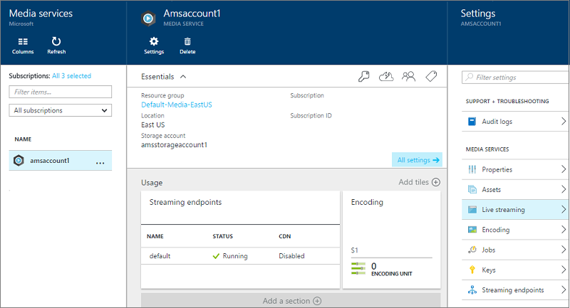
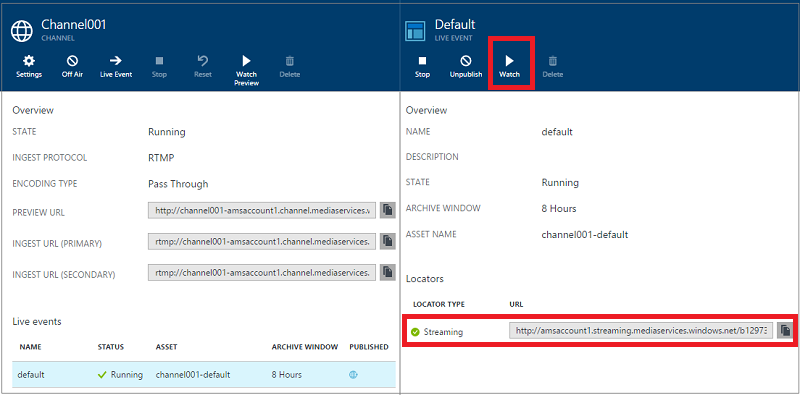
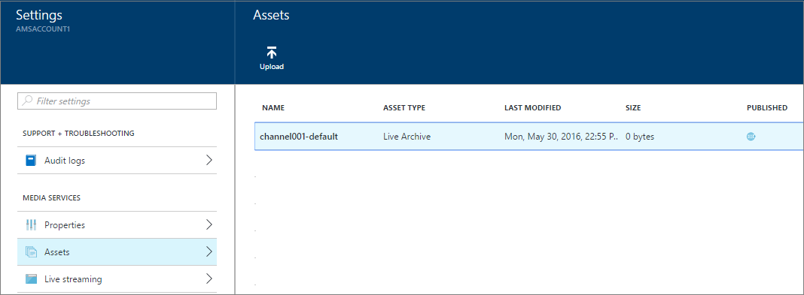

# How to perform live streaming with on-premises encoders using the Azure portal
> [!div class="op_single_selector"]
> * [Portal](media-services-portal-live-passthrough-get-started.md)
> * [.NET](media-services-dotnet-live-encode-with-onpremises-encoders.md)
> * [REST](https://docs.microsoft.com/rest/api/media/operations/channel)
> 
> 

This tutorial walks you through the steps of using the Azure portal to create a **Channel** that is configured for a pass-through delivery. 

## Prerequisites
The following are required to complete the tutorial:

* An Azure account. For details, see [Azure Free Trial](https://azure.microsoft.com/pricing/free-trial/). 
* A Media Services account. To create a Media Services account, see [How to Create a Media Services Account](media-services-portal-create-account.md).
* A webcam. For example, [Telestream Wirecast encoder](https://www.telestream.net/wirecast/overview.htm).

It is highly recommended to review the following articles:

* [Azure Media Services RTMP Support and Live Encoders](https://azure.microsoft.com/blog/2014/09/18/azure-media-services-rtmp-support-and-live-encoders/)
* [Overview of Live Steaming using Azure Media Services](media-services-manage-channels-overview.md)
* [Live streaming with on-premises encoders that create multi-bitrate streams](media-services-live-streaming-with-onprem-encoders.md)

## Common live streaming scenario

The following steps describe tasks involved in creating common live streaming applications that use channels that are configured for pass-through delivery. This tutorial shows how to create and manage a pass-through channel and live events.

> [!NOTE]
> Make sure the streaming endpoint from which you want to stream content is in the **Running** state. 
	
1. Connect a video camera to a computer.  For setup ideas, check out [Simple and portable event video gear setup]( https://link.medium.com/KNTtiN6IeT).
1. Launch and configure an on-premises live encoder that outputs a multi-bitrate RTMP or Fragmented MP4 stream. For more information, see [Azure Media Services RTMP Support and Live Encoders](https://go.microsoft.com/fwlink/?LinkId=532824). Also, check out this blog: [Live streaming production with OBS](https://link.medium.com/ttuwHpaJeT).
   
    This step could also be performed after you create your Channel.
1. Create and start a pass-through Channel.
1. Retrieve the Channel ingest URL. 
   
    The ingest URL is used by the live encoder to send the stream to the Channel.
1. Retrieve the Channel preview URL. 
   
    Use this URL to verify that your channel is properly receiving the live stream.
1. Create a live event/program. 
   
    When using the Azure portal, creating a live event also creates an asset. 

1. Start the event/program when you are ready to start streaming and archiving.
1. Optionally, the live encoder can be signaled to start an advertisement. The advertisement is inserted in the output stream.
1. Stop the event/program whenever you want to stop streaming and archiving the event.
1. Delete the event/program (and optionally delete the asset).     

> [!IMPORTANT]
> Please review [Live streaming with on-premises encoders that create multi-bitrate streams](media-services-live-streaming-with-onprem-encoders.md) to learn about concepts and considerations related to live streaming with on-premises encoders and pass-through channels.
> 
> 

## To view notifications and errors
If you want to view notifications and errors produced by the Azure portal, click on the Notification icon.

## Create and start pass-through channels and events
A channel is associated with events/programs that enable you to control the publishing and storage of segments in a live stream. Channels manage events. 

You can specify the number of hours you want to retain the recorded content for the program by setting the **Archive Window** length. This value can be set from a minimum of 5 minutes to a maximum of 25 hours. Archive window length also dictates the maximum amount of time clients can seek back in time from the current live position. Events can run over the specified amount of time, but content that falls behind the window length is continuously discarded. This value of this property also determines how long the client manifests can grow.

Each event is associated with an asset. To publish the event, you must create an OnDemand locator for the associated asset. Having this locator enables you to build a streaming URL that you can provide to your clients.

A channel supports up to three concurrently running events so you can create multiple archives of the same incoming stream. This allows you to publish and archive different parts of an event as needed. For example, your business requirement is to archive 6 hours of a program, but to broadcast only last 10 minutes. To accomplish this, you need to create two concurrently running programs. One program is set to archive 6 hours of the event but the program is not published. The other program is set to archive for 10 minutes and this program is published.

You should not reuse existing live events. Instead, create and start a new event for each event.

Start the event when you are ready to start streaming and archiving. Stop the program whenever you want to stop streaming and archiving the event. 

To delete archived content, stop and delete the event and then delete the associated asset. An asset cannot be deleted if it is used by an event; the event must be deleted first. 

Even after you stop and delete the event, the users would be able to stream your archived content as a video on demand, for as long as you do not delete the asset.

If you do want to retain the archived content, but not have it available for streaming, delete the streaming locator.

### To use the portal to create a channel
This section shows how to use the **Quick Create** option to create a pass-through channel.

For more details about pass-through channels, see [Live streaming with on-premises encoders that create multi-bitrate streams](media-services-live-streaming-with-onprem-encoders.md).

1. In the [Azure portal](https://portal.azure.com/), select your Azure Media Services account.
2. In the **Settings** window, click **Live streaming**. 
   
    
   
    The **Live streaming** window appears.
3. Click **Quick Create** to create a pass-through channel with the RTMP ingest protocol.
   
    The **CREATE A NEW CHANNEL** window appears.
4. Give the new channel a name and click **Create**. 
   
    This creates a pass-through channel with the RTMP ingest protocol.

## Create events
1. Select a channel to which you want to add an event.
2. Press **Live Event** button.

## Get ingest URLs
Once the channel is created, you can get ingest URLs that you will provide to the live encoder. The encoder uses these URLs to input a live stream.

## Watch the event
To watch the event, click **Watch** in the Azure portal or copy the streaming URL and use a player of your choice. 

Live event automatically get converted to on-demand content when stopped.

## Clean up
For more details about pass-through channels, see [Live streaming with on-premises encoders that create multi-bitrate streams](media-services-live-streaming-with-onprem-encoders.md).

* A channel can be stopped only when all events/programs on the channel have been stopped.  Once the Channel is stopped, it does not incur any charges. When you need to start it again, it will have the same ingest URL so you won't need to reconfigure your encoder.
* A channel can be deleted only when all live events on the channel have been deleted.

## View archived content
Even after you stop and delete the event, the users would be able to stream your archived content as a video on demand, for as long as you do not delete the asset. An asset cannot be deleted if it is used by an event; the event must be deleted first. 

To manage your assets, select **Setting** and click **Assets**.

## Next step
Review Media Services learning paths.

[!INCLUDE [media-services-learning-paths-include](../../../includes/media-services-learning-paths-include.md)]

## Provide feedback
[!INCLUDE [media-services-user-voice-include](../../../includes/media-services-user-voice-include.md)]

