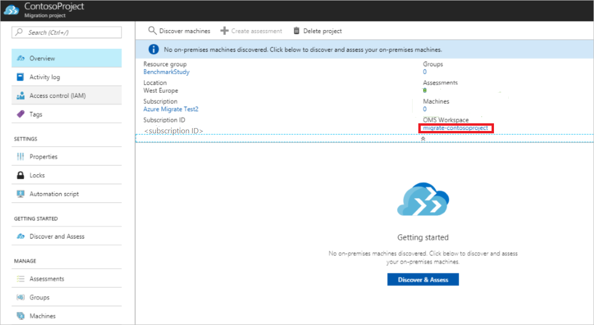

# Dependency visualization

[Azure Migrate](migrate-overview.md) assesses groups of on-premises machines for migration to Azure. To group machines together, you can use dependency visualization. This article provides information about this feature.

## Overview

Dependency visualization in Azure Migrate allows you to create groups for migration assess with increased confidence. Using dependency visualization you can view the network dependencies of specific machines, or across a group of machines. This is particularly useful when your apps and workloads run across multiple machines, to ensure that no functionality is lost, or machines forgotten, in the migration process.  

## How does it work?

Azure Migrate uses the [Service Map](../operations-management-suite/operations-management-suite-service-map.md) solution in [Operations Management Suite (OMS)](../log-analytics/log-analytics-overview.md) for dependency visualization.
- When you create an Azure Migration project, an OMS Log Analytics workspace is created in your subscription.
- The workspace name is the name you specify for the migration project, prefixed with **migrate-**, and optionally suffixed with a number. 
- Navigate to the OMS Log Analytics workspace from the **Essentials** section of the project **Overview** page.
- The created workspace is tagged with the key **MigrateProject**, and value **project name**. You can use these to search in the Azure portal.  

    

To use dependency visualization, you need to download and install agents on each on-premises machines you want to analyze.  

## Do I need to pay for it?

Yes. The OMS workspace is created by default, but it isn't used unless you use dependency visualization in Azure Migrate. If you do use dependency visualization (or use the workspace outside Azure Migrate) you are charged for workspace usage.  [Learn more](https://www.microsoft.com/cloud-platform/operations-management-suite) about Service Map solution pricing. 

## How do I manage the workspace?

You can use the OMS Log Analytics workspace outside Azure Migrate, and it's not deleted if you delete the migration project in which it was created. If you no longer need the workspace, [delete it](..log-analytics/log-analytics-manage-access.md) manually.

You shouldn't delete the workspace created by Azure Migrate, unless you delete the migration project. If you do, dependencies won't work as expected.

## Next steps

[Create a group using machine dependencies](how-to-create-group-machine-dependencies.md)
