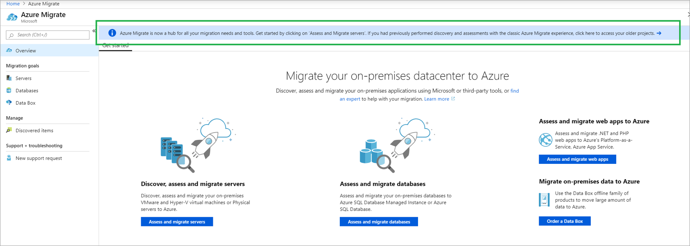

# Create and manage Azure Migrate projects

This article describes how to create, manage, and delete [Azure Migrate](migrate-services-overview.md) projects

## Create a project for the first time

The first time you set up Azure Migrate, you create a project and add an assessment or migration tool. [Follow these instructions](how-to-add-tool-first-time.md) to set up for the first time.

## Create additional projects

If you already have an Azure Migrate project and you want to create an additional project, do the following:  

1. In the [Azure portal](https://portal.azure.com), search for **Azure Migrate**.
2. On the Azure Migrate dashboard > **Servers**, select **change** in the upper-right corner.

   

3. To create a new project, select **click here**.

   

## Find a project

Find a project as follows:

1. In the [Azure portal](https://portal.azure.com), search for **Azure Migrate**.
2. In the Azure Migrate dashboard > **Servers**, select **change** in the upper-right corner.

    

3. Select the appropriate subscription and Azure Migrate project.

If you created the project in the [previous version](migrate-services-overview.md#azure-migrate-versions) of Azure Migrate, find it as follows:

1. In the [Azure portal](https://portal.azure.com), search for **Azure Migrate**.
2. In the Azure Migrate dashboard, if you've created a project in the previous version, a banner referencing older projects appears. Select the banner.

    

3. Review the list of old projects.

## Delete a project

Delete as follows:

1. Open the Azure resource group in which the project was created.
2. In the resource group page, select **Show hidden types**.
3. Select the migrate project you want to delete, and its associated resources.
    - The resource type is **Microsoft.Migrate/migrateprojects**.
    - If the resource group is exclusively used by the Azure Migrate project, you can delete the entire resource group.

Note that:

- When you delete, both the project and the metadata about discovered machines are deleted.
- If you're using the older version of Azure Migrate, open the Azure resource group in which the project was created. Select the migrate project you want to delete (the resource type is **Migration project**).
- If you're using dependency analysis with an Azure Log Analytics workspace:
    - If you've attached a Log Analytics workspace to the Server Assessment tool, the workspace isn't automatically deleted. The same Log Analytics workspace can be used for multiple scenarios.
    - If you want to delete the Log Analytics workspace, do that manually.

### Delete a workspace manually

1. Browse to the Log Analytics workspace attached to the project.

    - If you haven't deleted the Azure Migrate project, you can find the link to the workspace in **Essentials** > **Server Assessment**.
       .
       - If you've already deleted the Azure Migrate project, select **Resource Groups** in the left pane of the Azure portal and find the workspace.
       
2. [Follow the instructions](https://docs.microsoft.com/azure/azure-monitor/platform/delete-workspace) to delete the workspace.

## Next steps

Add [assessment](how-to-assess.md) or [migration](how-to-migrate.md) tools to Azure Migrate projects.