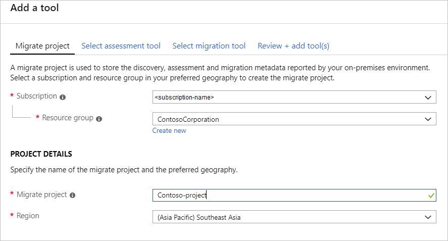

# Add an assessment/migration tool for the first time

This article describes how to add an assessment or migration tool in the [Azure Migrate](migrate-overview.md) hub for the first time. The Azure Migrate hub provides a central location to discover, assess and migrate your on-premises apps and workloads running on VMs and physical servers to Azure. The hub provides Azure Migrate tools for assessment and migration, as well as third-party independent software vendor (ISV) offerings. 

## Create a project and 

Set up a new Azure Migrate project in an Azure subscription, and add a tool. In a project you can track discovered assets, and orchestrate assessment and migration.

1. In the Azure portal > **All services**, search for **Azure Migrate**.
2. Under **Services**, select **Azure Migrate**.

    

3. In **Overview**, click **Assess and migrate servers**.
4. Under **Discover, assess and migrate servers**, click **Assess and migrate servers**.

    

1. In **Discover, assess and migrate servers**, click **Add tools**.
2. In **Migrate project**, select your Azure subscription, and create a resource group if you don't have one. Remember that a new group requires [permissions to work with the Azure Migrate service](tutorial-prepare-vmware.md#assign-role-assignment-permissions).
3. In **Project Details**, specify the project name, and geography in which you want to create the project. You can create an Azure Migrate project in the regions summarized in the table.

    - The region specified for the project is only used to store the metadata gathered from on-premises VMs.
    - You can select any target region for the actual migration.
    
        **Geography** | **Region**
        --- | ---
        Asia | Southeast Asia
        Europe | North Europe or West Europe
        United States | East US or West Central US

    

6. Click **Next**, and add an assessment or migration tool.

    > [!NOTE]
    > When you create a project you need to add at least one assessment or migration tool.
1. In **Select assessment tool**, add an assessment tool as required. If you don't need an assessment tool, select **Skip adding a migration tool for now** > **Next**. 
2. In **Select migration tool**, add a migration tool as required. If you don't need a migration tool, select **Skip adding a migration tool for now** > **Next**.
3. In **Review + add tools**, review the settings and click **Add tools**.

After creating the project you can select additional tools for assessment and migration.

## Next steps

Try out an assessment for [Hyper-V](tutorial-prepare-hyper-v.md) or [VMware](tutorial-prepare-vmware.md) VMs.
