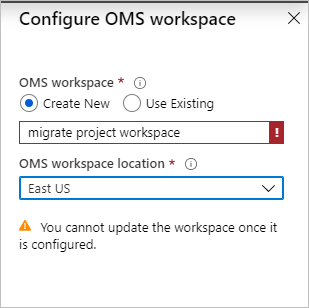
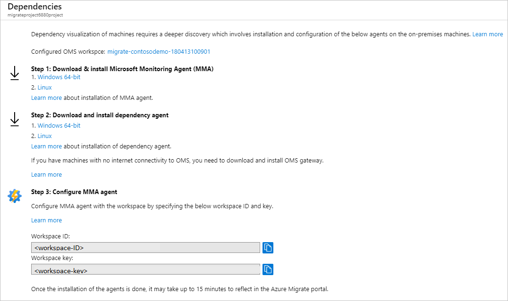

# Set up dependency visualization

This article describes how to set up agent-based dependency analysis in Azure Migrate:Server Assessment. [Dependency analysis](concepts-dependency-visualization.md) helps you to identify and understand dependencies across machines you want to assess and migrate to Azure.

## Before you start

- [Learn about](concepts-dependency-visualization.md#agent-based-analysis) agent-based dependency analysis.
- [Review](dependency-analysis-support.matrix.md#agent-based-requirements) the prerequisites and support requirements for setting up agent-based dependency visualization.
- Make sure you've [created](how-to-add-tool-first-time.md) an Azure Migrate project.
- If you've already created a project, make sure you've [added](how-to-assess.md) the Azure Migrate:Server Assessment tool.
- Make sure you've set up an [Azure Migrate appliance](migrate-appliance.md) to discover your on-premises machines. Learn how to set up an appliance for [VMware](how-to-set-up-appliance-vmware.md), [Hyper-V](how-to-set-up-appliance-hyper-v.md), or [physical servers](how-to-set-up-appliance-physical.md). The appliance discovers on-premises machines, and sends metadata, performance data to Azure Migrate:Server Assessment.
- To use dependency visualization, you associate a [Log Analytics workspace](../azure-monitor/platform/manage-access.md) with an Azure Migrate project:
    - You can attach a workspace only after setting up the Azure Migrate appliance, and discovering machines in the Azure Migrate project.
    - Make sure you have a workspace in the subscription that contains the Azure Migrate project.
    - The workspace must reside in the East US, Southeast Asia, or West Europe regions. Workspaces in other regions can't be associated with a project.
    - The workspace must be in a region in which [Service Map is supported](../azure-monitor/insights/vminsights-enable-overview.md#prerequisites).
    - You can associate a new or existing Log Analytics workspace with an Azure Migrate project.
    - You attach the workspace the first time that you set up dependency visualization for a machine. The workspace for an Azure Migrate project can't be modified after it's added.
    - In Log Analytics, the workspace associated with Azure Migrate is tagged with the Migration Project key, and the project name.

## Associate a workspace

1. After you've discovered machines for assessment, in **Servers** > **Azure Migrate: Server Assessment**, click **Overview**.  
2. In **Azure Migrate: Server Assessment**, click **Essentials**.
3. In **OMS Workspace**, click **Requires configuration**.

        

4. In **Configure OMS workspace**, specify whether you want to create a new workspace, or use an existing one.
    - You can select an existing workspace from all the workspaces in the migrate project subscription.
    - You need Reader access to the workspace to associate it.
5. If you create a new workspace, select a location for it.

    


## Download and install the VM agents

On each machine you want to analyze, install the agents.

> [!NOTE]
    > For machines monitored by System Center Operations Manager 2012 R2 or later, you don't need to install the MMA agent. Service Map integrates with Operations Manager. [Follow this](https://docs.microsoft.com/azure/azure-monitor/insights/service-map-scom#prerequisites) integration guidance.

1. In **Azure Migrate: Server Assessment**, click **Discovered servers**.
2. For each machine you want to analyze with dependency visualization, in the **Dependencies** column, click **Requires agent installation**.
3. In the **Dependencies** page, download the MMA and Dependency agent for Windows or Linux.
4. Under **Configure MMA agent**, copy the workspace ID and key. You need these when you install the MMA agent.

    


## Install the MMA

Install the MMA on each Windows or Linux machine you want to analyze.

### Install MMA on a Windows machine

To install the agent on a Windows machine:

1. Double-click the downloaded agent.
2. On the **Welcome** page, click **Next**. On the **License Terms** page, click **I Agree** to accept the license.
3. In **Destination Folder**, keep or modify the default installation folder > **Next**.
4. In **Agent Setup Options**, select **Azure Log Analytics** > **Next**.
5. Click **Add** to add a new Log Analytics workspace. Paste in the workspace ID and key that you copied from the portal. Click **Next**.

You can install the agent from the command line or using an automated method such as Configuration Manager or [Intigua](https://go.microsoft.com/fwlink/?linkid=2104196).
- [Learn more](../azure-monitor/platform/log-analytics-agent.md#installation-and-configuration) about using these methods to install the MMA agent.
- The MMA agent can also be installed using this [script](https://go.microsoft.com/fwlink/?linkid=2104394).
- [Learn more](https://docs.microsoft.com/azure/azure-monitor/platform/log-analytics-agent#supported-windows-operating-systems) about the Windows operating systems supported by MMA.

### Install MMA on a Linux machine

To install the MMA on a Linux machine:

1. Transfer the appropriate bundle (x86 or x64) to your Linux computer using scp/sftp.
2. Install the bundle by using the --install argument.

    ```sudo sh ./omsagent-<version>.universal.x64.sh --install -w <workspace id> -s <workspace key>```

[Learn more](https://docs.microsoft.com/azure/azure-monitor/platform/log-analytics-agent#supported-linux-operating-systems) about the list of Linux operating systems support by MMA. 

## Install the Dependency agent

1. To install the Dependency agent on a Windows machine, double-click the setup file and follow the wizard.
2. To install the Dependency agent on a Linux machine, install as root using the following command:

    ```sh InstallDependencyAgent-Linux64.bin```

- [Learn more](https://docs.microsoft.com/azure/azure-monitor/insights/vminsights-enable-hybrid-cloud#installation-script-examples) about how you can use scripts to install the Dependency agent.
- [Learn more](https://docs.microsoft.com/azure/azure-monitor/insights/vminsights-enable-overview#supported-operating-systems) about the operating systems supported by the Dependency agent.


## Create a group using dependency visualization

Now create a group for assessment. 


> [!NOTE]
> Groups for which you want to visualize dependencies shouldn't contain more than 10 machines. If you have more than 10 machines, split them into smaller groups.

1. In **Azure Migrate: Server Assessment**, click **Discovered servers**.
2. In the **Dependencies** column, click **View dependencies** for each machine you want to review.
3. On the dependency map, you can see the following:
    - Inbound (clients) and outbound (servers) TCP connections, to and from the machine.
    - Dependent machines that don't have the dependency agents installed are grouped by port numbers.
    - Dependent machines with dependency agents installed are shown as separate boxes.
    - Processes running inside the machine. Expand each machine box to view the processes.
    - Machine properties (including FQDN, operating system, MAC address). Click on each machine box to view the details.

4. You can look at dependencies for different time durations by clicking on the time duration in the time range label.
    - By default the range is an hour. 
    - You can modify the time range, or specify start and end dates, and duration.
    - Time range can be up to an hour. If you need a longer range, use Azure Monitor to query dependent data for a longer period.

5. After you've identified the dependent machines that you want to group together, use Ctrl+Click to select multiple machines on the map, and click **Group machines**.
6. Specify a group name.
7. Verify that the dependent machines are discovered by Azure Migrate.

    - If a dependent machine isn't discovered by Azure Migrate: Server Assessment, you can't add it to the group.
    - To add a machine, run discovery again, and verify that the machine is discovered.

8. If you want to create an assessment for this group, select the checkbox to create a new assessment for the group.
8. Click **OK** to save the group.

After creating the group, we recommend that you install agents on all the machines in the group, and then visualize dependencies for the entire group.

## Query dependency data in Azure Monitor

You can query dependency data captured by Service Map in the Log Analytics workspace associated with the Azure Migrate project. Log Analytics is used to write and run Azure Monitor log queries.

- [Learn how to](../azure-monitor/insights/service-map.md#log-analytics-records) search for Service Map data in Log Analytics.
- [Get an overview](../azure-monitor/log-query/get-started-queries.md)  of writing log queries in [Log Analytics](../azure-monitor/log-query/get-started-portal.md).

Run a query for dependency data as follows:

1. After you install the agents, go to the portal and click **Overview**.
2. In **Azure Migrate: Server Assessment**, click **Overview**. Click the down arrow to expand **Essentials**.
3. In **OMS Workspace**, click the workspace name.
3. On the Log Analytics workspace page > **General**, click **Logs**.
4. Write your query, and click **Run**.

### Sample queries

Here are a few sample queries that you can use to extract dependency data.

- You can modify the queries to extract your preferred data points.
- [Review](https://docs.microsoft.com/azure/azure-monitor/insights/service-map#log-analytics-records) a complete list of dependency data records.
- [Review](https://docs.microsoft.com/azure/azure-monitor/insights/service-map#sample-log-searches) additional sample queries.

#### Sample: Review inbound connections

Review inbound connections for a set of VMs.

- The records in the table for connection metrics (VMConnection) don't represent individual physical network connections.
- Multiple physical network connections are grouped into a logical connection.
- [Learn more](https://docs.microsoft.com/azure/azure-monitor/insights/service-map#connections) about how physical network connection data is aggregated in VMConnection.

```
// the machines of interest
let ips=materialize(ServiceMapComputer_CL
| summarize ips=makeset(todynamic(Ipv4Addresses_s)) by MonitoredMachine=ResourceName_s
| mvexpand ips to typeof(string));
let StartDateTime = datetime(2019-03-25T00:00:00Z);
let EndDateTime = datetime(2019-03-30T01:00:00Z);
VMConnection
| where Direction == 'inbound'
| where TimeGenerated > StartDateTime and TimeGenerated  < EndDateTime
| join kind=inner (ips) on $left.DestinationIp == $right.ips
| summarize sum(LinksEstablished) by Computer, Direction, SourceIp, DestinationIp, DestinationPort
```

#### Sample: Summarize sent and received data

This sample summarizes the volume of data sent and received on inbound connections between a set of machines.

```
// the machines of interest
let ips=materialize(ServiceMapComputer_CL
| summarize ips=makeset(todynamic(Ipv4Addresses_s)) by MonitoredMachine=ResourceName_s
| mvexpand ips to typeof(string));
let StartDateTime = datetime(2019-03-25T00:00:00Z);
let EndDateTime = datetime(2019-03-30T01:00:00Z);
VMConnection
| where Direction == 'inbound'
| where TimeGenerated > StartDateTime and TimeGenerated  < EndDateTime
| join kind=inner (ips) on $left.DestinationIp == $right.ips
| summarize sum(BytesSent), sum(BytesReceived) by Computer, Direction, SourceIp, DestinationIp, DestinationPort
```

## Next steps

[Create an assessment](how-to-create-assessment.md) for a group.


