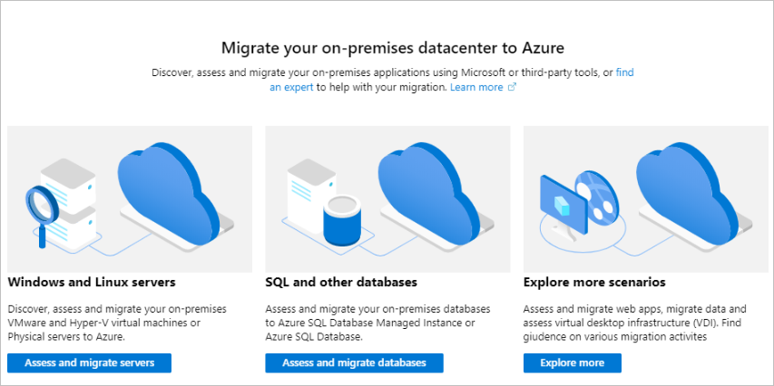

# Add migration tools

This article describes how to add migration tools in [Azure Migrate](migrate-overview.md).

Azure Migrate provides a hub of tools for assessment and migration to Azure. It includes native tools, tools provided by other Azure services, and third-party independent software vendor (ISV) offerings.

If you want to add an migration tool and haven't yet set up an Azure Migrate project, follow this [article](how-to-add-tool-first-time.md).

## Selecting an ISV tool

If you choose an [ISV tool](migrate-services-overview.md#isv-integration) for migration, you can start by obtaining a license, or signing up for a free trial, in accordance with the ISV policy. In each tool, there's an option to connect to Azure Migrate. Deploy the tool, and follow the tool instructions to connect the tool workspace with Azure Migrate. 

## Select a migration scenario

1. In the Azure Migrate project, click **Overview**.
2. Select the migration scenario you want to use:

    - To migrate machines and workloads to Azure, select **Assess and migrate servers**.
    - To migrate on-premises SQL machines, select **Assess and migrate databases**.
    - To migrate on-premises web apps, select **Assess and migrate web apps**.
    - To migrate large amounts of on-premises data to Azure in offline mode, select **Order a Data Box**.

    

## Select a server migration tool

1. Click **Assess and Migrate Servers**.
2. In **Azure Migrate - Servers**, if you haven't added migration tools yet, under **Migration tools**, select **Click here to add a migration tool**. If you've already added migration tools, in **Add more migration tools**, select **Click here**.

    

    > [!NOTE]
    > If you need to navigate to a different project, in **Azure Migrate - Servers**, next to **See details for a different migrate project**, click **Click here**.

3. In **Azure Migrate**, select the migration tool you want to use.
    - If you use Azure Migrate Server Migration, you can set up and run migrations directly in the Azure Migrate project.
    - If you use a third-party assessment tool, navigate to the link provided for the ISV, and run the migration in accordance with the instructions they provide.

## Select a database migration tool

1. Click **Assess and migrate databases**
2. In **Databases**, click **Add tools**.
3. In Add a tool > **Select migration tool**, select the tool you want to use to migrate your database.

## Select a web app migration tool

1. Click **Assess and migrate web apps**.
2. Follow the link to the Migration tool for the Azure App Service. Use the migration tool to:

    - **Assess apps online**: You can assess and migrate apps with a public URL online, using the Azure App Service Migration Assistant.
    - **.NET/PHP**: For internal .NET and PHP apps, you can download and run the Migration Assistant.

## Order an Azure Data Box

To migrate large amounts of data to Azure,  you can order an Azure DAta Box for offline data transfer.

1. Click **Order a Data Box**.
2. In **Select your Azure Data Box**, specify your subscription. 
3. The transfer will be an import to Azure. Specify the data source, and the Azure region destination for the data.

## Next steps

Try out a migration using Azure Migrate Server Migration for [Hyper-V](tutorial-migrate-hyper-v.md) or [VMware](tutorial-migrate-vmware.md) VMs.
