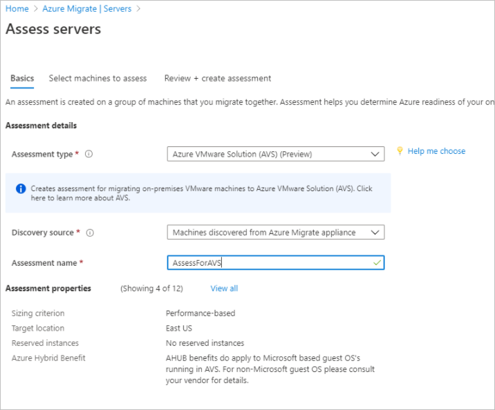
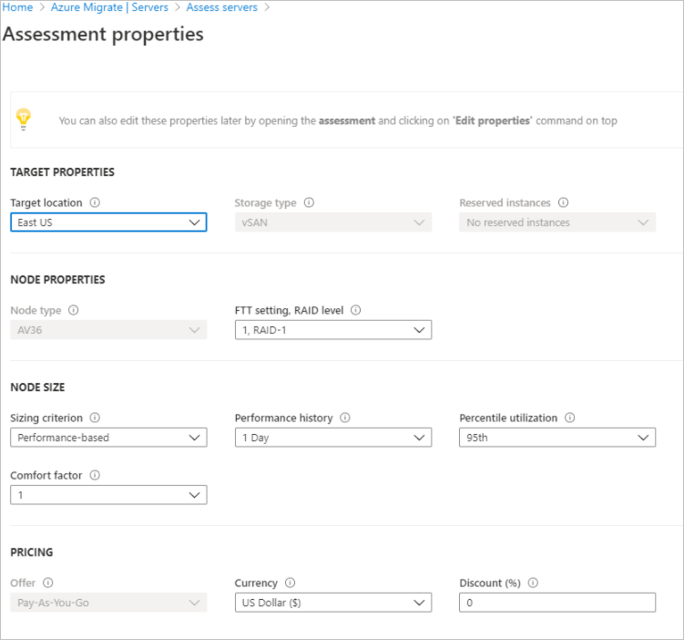

# Tutorial: Assess VMware VMs for migration to AVS

As part of your migration journey to Azure, you assess your on-premises workloads to measure cloud readiness, identify risks, and estimate costs and complexity.

This article shows you how to assess discovered VMware virtual machines (VMs) for migration to Azure VMware Solution (AVS), using the Azure Migrate: Server Assessment tool. AVS is a managed service that allows you to run the VMware platform in Azure.

In this tutorial, you learn how to:
> [!div class="checklist"]
- Run an assessment based on machine metadata and configuration information.
- Run an assessment based on performance data.

> [!NOTE]
> Tutorials show the quickest path for trying out a scenario, and use default options where possible. 

If you don't have an Azure subscription, create a [free account](https://azure.microsoft.com/pricing/free-trial/) before you begin.

## Prerequisites

Before you follow this tutorial to assess your machines for migration to AVS, make sure you've discovered the machines you want to assess:

- To discover machines using the Azure Migrate appliance, [follow this tutorial](tutorial-discover-vmware.md). 
- To discover machines using an imported CSV file, [follow this tutorial](tutorial-discover-import.md).

## Decide which assessment to run

Decide whether you want to run an assessment using sizing criteria based on machine configuration data/metadata that's collected as-is on-premises, or on dynamic performance data.

**Assessment** | **Details** | **Recommendation**
--- | --- | ---
**As-is on-premises** | Assess based on machine configuration data/metadata.  | Recommended node size in AVS is based on the on-premises VM size, along with the settings you specify in the assessment for the node type, storage type, and failure-to-tolerate setting.
**Performance-based** | Assess based on collected dynamic performance data. | Recommended node size in AVS is based on CPU and memory utilization data, along with the settings you specify in the assessment for the node type, storage type, and failure-to-tolerate setting.

## Run an assessment

Run an assessment as follows:

1. On the **Servers** page > **Windows and Linux servers**, click **Assess and migrate servers**.

   

2. In **Azure Migrate: Server Assessment**, click **Assess**.

3. In **Assess servers** > **Assessment type**, select **Azure VMware Solution (AVS) (Preview)**.
4. In **Discovery source**:

    - If you discovered machines using the appliance, select **Machines discovered from Azure Migrate appliance**.
    - If you discovered machines using an imported CSV file, select **Imported machines**. 
    
5. Specify a name for the assessment. 
6. Click **View all** to review the assessment properties.

    

7. 1n **Assessment properties** > **Target Properties**:

    - In **Target location**, specify the Azure region to which you want to migrate.
       - Size and cost recommendations are based on the location that you specify.
       - You can currently assess for three regions (East US, West US, West Europe)
   - In **Storage type**, leave **vSAN**. This is the default storage type for an AVS private cloud.
   - **Reserved Instances** aren't currently supported for AVS nodes.
8. In **VM Size**:
    - In **Node type**, select a node type based on the workloads running on the on-premises VMs.
        - Azure Migrate recommends the node of nodes needed to migrate the VMs to AVS.
        - The default node type is AV36.
    - **FTT setting, RAID level**, select the Failure to Tolerate and RAID combination.  The selected FTT option, combined with the on-premises VM disk requirement, determines the total vSAN storage required in AVS.
    - In **CPU Oversubscription**, specify the ratio of virtual cores associated with one physical core in the AVS node. Oversubscription of greater than 4:1 might cause performance degradation, but can be used for web server type workloads.

9. In **Node Size**: 
    - In **Sizing criterion**, select if you want to base the assessment on static metadata, or on performance-based data. If you use performance data:
        - In **Performance history**, indicate the data duration on which you want to base the assessment
        - In **Percentile utilization**, specify the percentile value you want to use for the performance sample. 
    - In **Comfort factor**, indicate the buffer you want to use during assessment. This accounts for issues like seasonal usage, short performance history, and likely increases in future usage. For example, if you use a comfort factor of two:
    
        **Component** | **Effective utilization** | **Add comfort factor (2.0)**
        Cores | 2 | 4
        Memory | 8 GB | 16 GB     

10. In **Pricing**:
    - In **Offer**, [Azure offer](https://azure.microsoft.com/support/legal/offer-details/) you're enrolled in is displayed Server Assessment estimates the cost for that offer.
    - In **Currency**, select the billing currency for your account.
    - In **Discount (%)**, add any subscription-specific discounts you receive on top of the Azure offer. The default setting is 0%.

11. Click **Save** if you make changes.

    

12. In **Assess Servers**, click **Next**.
13. In **Assess Servers** > **Select machines to assess**, to create a new group of servers for assessment, select **Create New**, and specify a group name. 
14. Select the appliance, and select the VMs you want to add to the group. Then click **Next**.
15. In **Review + create assessment**, review the assessment details, and click **Create Assessment** to create the group and run the assessment.

    > [!NOTE]
    > For performance-based assessments, we recommend that you wait at least a day after starting discovery before you create an assessment. This provides time to collect performance data with higher confidence. Ideally, after you start discovery, wait for the performance duration you specify (day/week/month) for a high-confidence rating.

## Review an assessment

An assessment describes:

- **Ready for AVS**: The machine can be migrated as-is to Azure AVS, without any changes. The machine will start in AVS, with full AVS support.
- **Ready with conditions**: The machine might have compatibility issues with the current vSphere version. It might need VMware tools installed, or other settings, before it has full functionality in AVS.
- **Not ready for AVS**: The VM won't start in AVS. For example, if an on-premises VMware VM has an external device (like a CD-RON) attached to it and you're using VMware VMotion, the VMotion operation fails.
- **Readiness unknown**: Azure Migrate couldn't determine machine readiness, due to insufficient metadata collected from the on-premises environment.

To view an assessment:

1. In **Servers** > **Azure Migrate: Server Assessment**, click the number next to **Assessments**.
2. In **Assessments**, select an assessment to open it.

    

3. Review the assessment summary. You can also edit the assessment properties, or recalculate the assessment.
 
 
### Review readiness

1. Click **Azure readiness**.
2. In **Azure readiness**, review the VM status.
3. Select an **Azure readiness** status. You can view VM readiness details. You can also drill down to see VM details, including compute, storage, and network settings.

### Review cost estimates

The assessment summary shows the estimated compute and storage cost of running VMs in Azure. 

1. Review the monthly total costs. Costs are aggregated for all VMs in the assessed group.

    - Cost estimates are based on the size recommendations for a machine, its disks, and its properties.
    - Estimated monthly costs for compute and storage are shown.
    - The cost estimation is for running the on-premises VMs on Azure VMs. The estimation doesn't consider PaaS or SaaS costs.

2. Review monthly storage costs. The view shows the aggregated storage costs for the assessed group, split over different types of storage disks. 
3. You can drill down to see cost details for specific VMs.

### Review confidence rating

Server Assessment assigns a confidence rating to performance-based assessments. Rating is from one star (lowest) to five stars (highest).

The confidence rating helps you estimate the reliability of size recommendations in the assessment. The rating is based on the availability of data points needed to compute the assessment.

> [!NOTE]
> Confidence ratings aren't assigned if you create an assessment based on a CSV file.

Confidence ratings are as follows.

**Data point availability** | **Confidence rating**
--- | ---
0%-20% | 1 star
21%-40% | 2 stars
41%-60% | 3 stars
61%-80% | 4 stars
81%-100% | 5 stars

[Learn more](concepts-assessment-calculation.md#confidence-ratings-performance-based) about confidence ratings.

## Next steps

- Find machine dependencies using [dependency mapping](concepts-dependency-visualization.md).
- Set up [agentless](how-to-create-group-machine-dependencies-agentless.md) or [agent-based](how-to-create-group-machine-dependencies.md) dependency mapping.