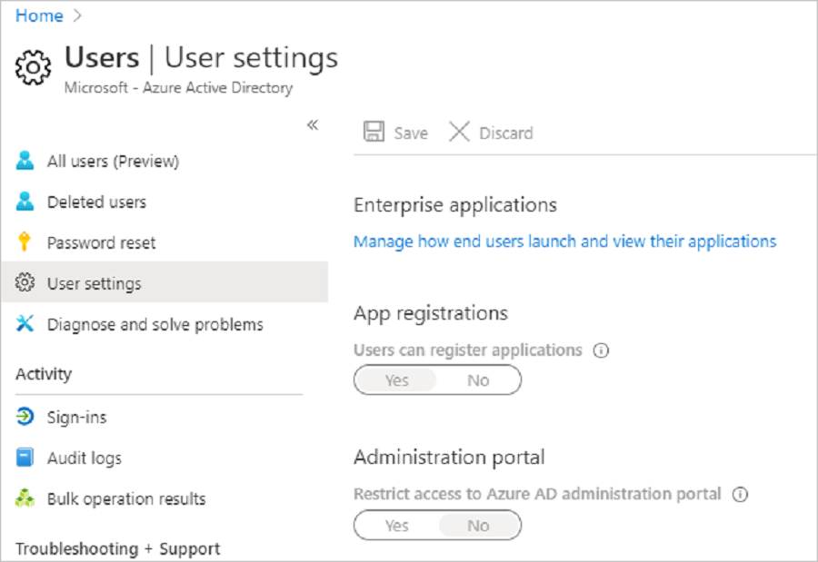
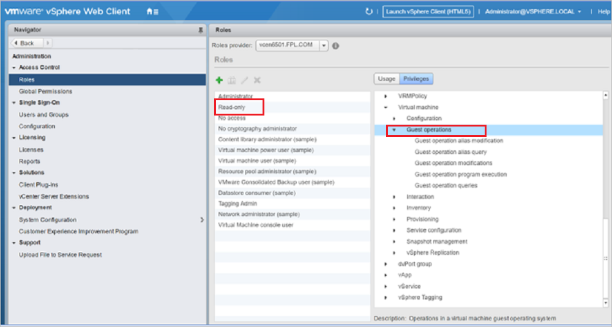
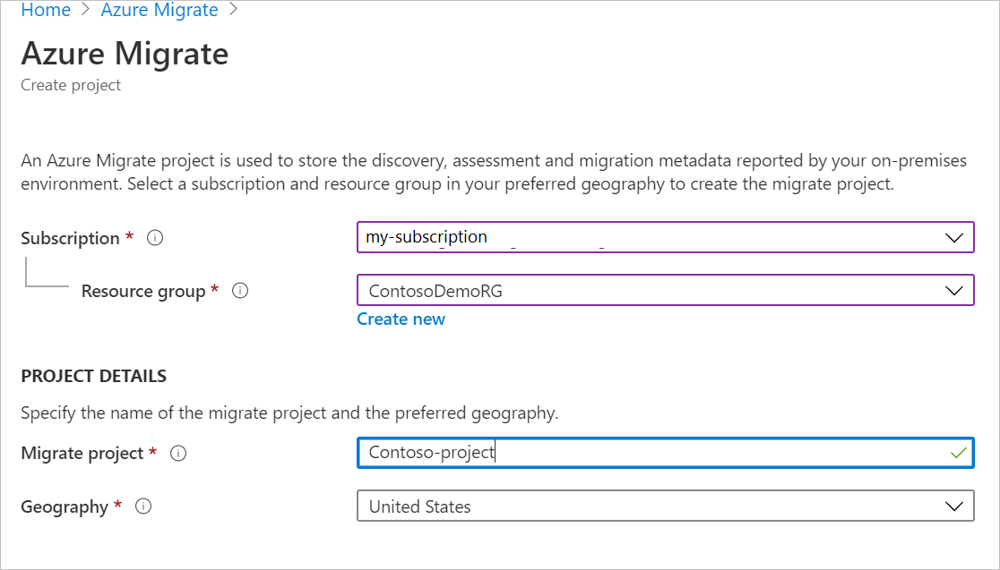
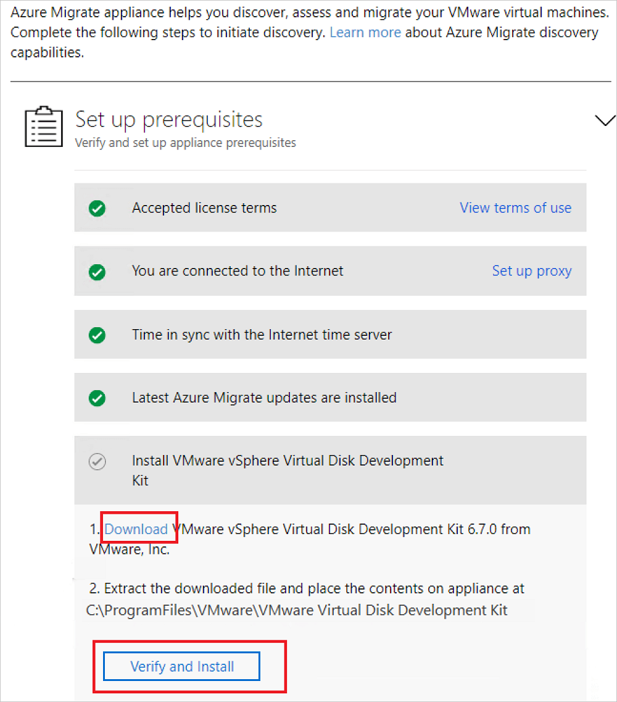
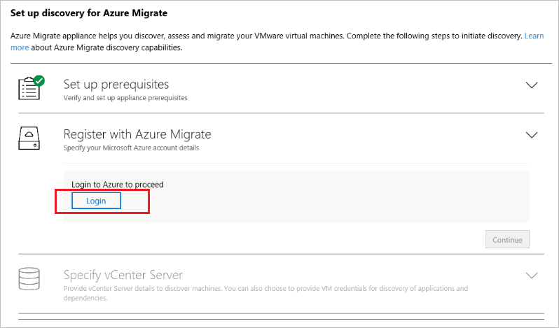
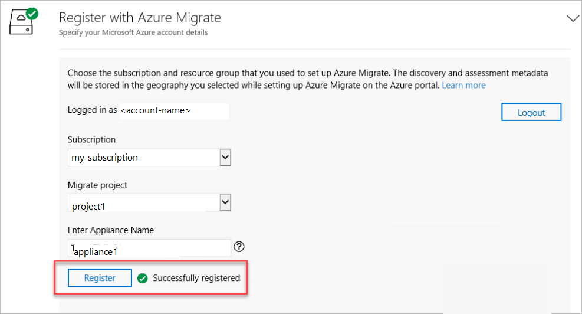
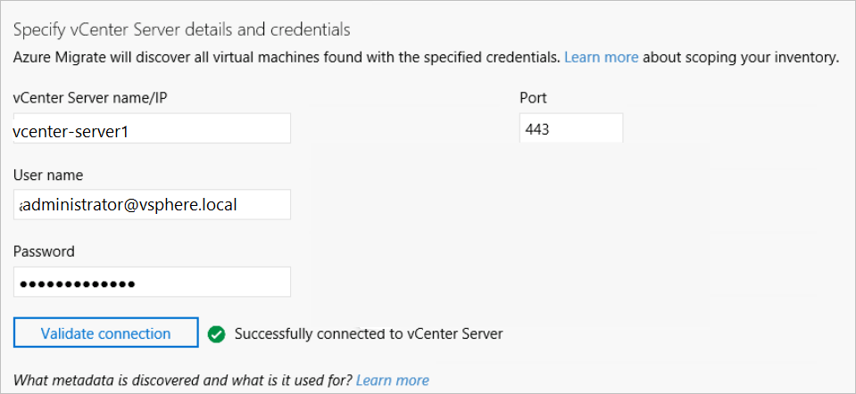
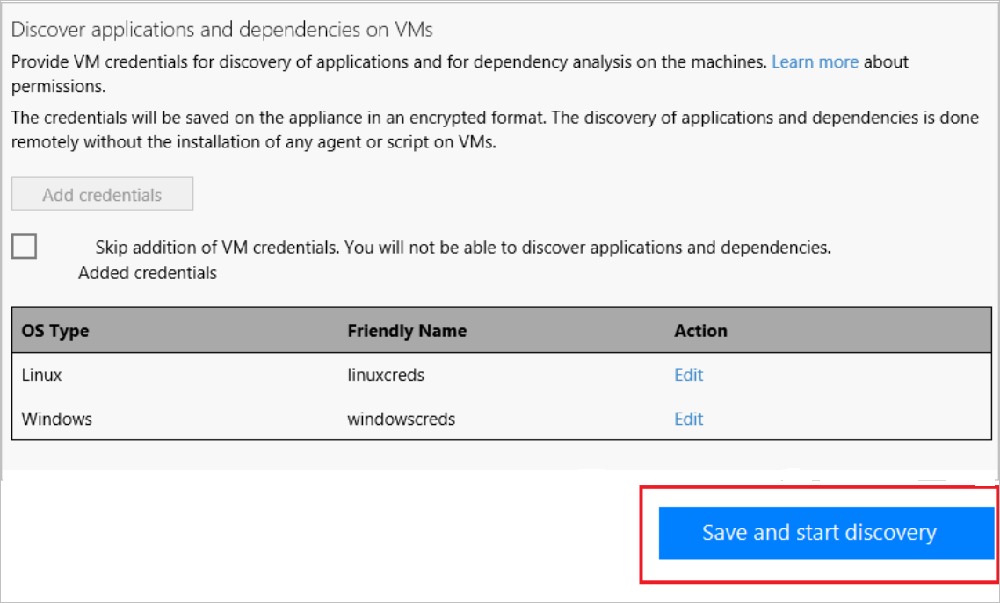

# Tutorial: Discover VMware VMs with Server Assessment

As part of your migration journey to Azure, you discover your on-premises inventory and workloads. 

This tutorial shows you how to discover on-premises VMware virtual machines (VMs) with the Azure Migrate: Server Assessment tool, using a lightweight Azure Migrate appliance. You deploy the appliance as a VMware VM, to continuously discover VM and performance metadata, apps running on VMs, and VM dependencies.

In this tutorial, you learn how to:

> [!div class="checklist"]
> * Set up an Azure account.
> * Prepare the VMware environment for discovery.
> * Create an Azure Migrate project.
> * Set up the Azure Migrate appliance.
> * Start continuous discovery.

> [!NOTE]
> Tutorials show the quickest path for trying out a scenario, and use default options where possible.  

If you don't have an Azure subscription, create a [free account](https://azure.microsoft.com/pricing/free-trial/) before you begin.

## Prerequisites

Before you start this tutorial, check you have these prerequisites in place.

**Requirement** | **Details**
--- | ---
**vCenter Server/ESXi host** | You need a vCenter Server running version 5.5, 6.0, 6.5 or 6.7.   VMs must be hosted on an ESXi host running version 5.5 or later.   On the vCenter Server, allow inbound connections on TCP port 443, so that the appliance can collect assessment data.   The appliance connects to vCenter on port 443 by default. If the vCenter server listens on a different port, you can modify the port when you connect from the appliance to the server to start discovery.   On the EXSi server that hosts the VMs, make sure that inbound access is allowed on TCP port 443, for app discovery.
**Appliance** | vCenter Server needs resources to allocate a VM for the Azure Migrate appliance:   - Windows Server 2016   - 32 GB of RAM, eight vCPUs, and around 80 GB of disk storage.   - An external virtual switch, and internet access on for the VM, directly or via a proxy.
**VMs** | To use this tutorial, Windows VMs must be running Windows Server 2016, 2012 R2, 2012, or 2008 R2.   Linux VMs must be running Red Hat Enterprise Linux 7/6/5, Ubuntu Linux 14.04/16.04, Debian 7/8, Oracle Linux 6/7, or CentOS 5/6/7.   VMs need VMware tools (a version later than 10.2.0) installed and running.   On Windows VMs, Windows PowerShell 2.0 or later should be installed.

## Prepare an Azure user account

To create an Azure Migrate project and register the Azure Migrate appliance, you need an account with:
- Contributor or Owner permissions on an Azure subscription.
- Permissions to register Azure Active Directory apps.

If you just created a free Azure account, you're the owner of your subscription. If you're not the subscription owner, work with the owner to assign the permissions as follows:

1. In the Azure portal, search for "subscriptions", and under **Services**, select **Subscriptions**.

    

2. In the **Subscriptions** page, select the subscription in which you want to create an Azure Migrate project. 
3. In the subscription, select **Access control (IAM)** > **Check access**.
4. In **Check access**, search for the relevant user account.
5. In **Add a role assignment**, click **Add**.

    

6. In **Add role assignment**, select the Contributor or Owner role, and select the account (azmigrateuser in our example). Then click **Save**.

    

7. In the portal, search for users, and under **Services**, select **Users**.
8. In **User settings**, verify that Azure AD users can register applications (set to **Yes** by default).

    

## Prepare VMware

On the vCenter Server, create an account that the appliance can use to access the vCenter Server, and check that required ports are open. You also need an account that the appliance can use to access VMs. 

### Create an account to access vCenter

In vSphere Web Client, set up an account as follows:

1. Using an account with admin privileges, in the vSphere Web Client > select **Administration**.
2. **Access**, select **SSO Users and Groups**.
3. In **Users**, add a new user.
4. In **New User**, type in the account details. Then click **OK**.
5. In **Global Permissions**, select the user account, and assign the **Read-only** role to the account. Then click **OK**.
6. In **Roles** > select the **Read-only** role, and in **Privileges**, select **Guest Operations**. These privileges are needed to discover apps running on VMs, and to analyze VM dependencies.
 
    

### Create an account to access VMs

The appliance accesses VMs to discover apps, and analyze VM dependencies. The appliance doesn't install any agents on VMs.

1. Create a Local Admin account that the appliance can use to discover apps and dependencies on Windows VMs.
2. For Linux machines, create a user account with Root privileges, or alternately, a user account with these permissions on /bin/netstat and /bin/ls files: CAP_DAC_READ_SEARCH and CAP_SYS_PTRACE.

> [!NOTE]
> Azure Migrate supports one credential for app-discovery on all Windows servers, and one credential for app-discovery on all Linux machines.

## Set up a project

Set up a new Azure Migrate project.

1. In the Azure portal > **All services**, search for **Azure Migrate**.
2. Under **Services**, select **Azure Migrate**.
3. In **Overview**, select **Create project**.
5. In **Create project**, select your Azure subscription and resource group. Create a resource group if you don't have one.
6. In **Project Details**, specify the project name and the geography in which you want to create the project. Review supported geographies for [public](migrate-support-matrix.md#supported-geographies-public-cloud) and [government clouds](migrate-support-matrix.md#supported-geographies-azure-government).

   

7. Select **Create**.
8. Wait a few minutes for the Azure Migrate project to deploy.

The **Azure Migrate: Server Assessment** tool is added by default to the new project.

## Set up the appliance

This tutorial sets up the appliance on a VMware VM.
- You download the appliance template, and import it into vCenter Server to create the appliance VM.
- After creating the appliance, you set it up it for the first time, and register it with the Azure Migrate project.

> [!NOTE]
> If for some reason you can't set up the appliance using the template, you can set it up using a PowerShell script. [Learn more](deploy-appliance-script.md#set-up-the-appliance-for-vmware).

### Download the OVA template

1. In **Migration Goals** > **Servers** > **Azure Migrate: Server Assessment**, select **Discover**.
2. In **Discover machines** > **Are your machines virtualized?**, select **Yes, with VMWare vSphere hypervisor**.
3. Select **Download** to download the OVA template file.

   

### Deploy the appliance VM

Import the downloaded file, and create a VM:

1. Sign in to the vSphere Client console, using the vCenter account you created.
2. On the **Virtual Machines** tab > **Actions** menu, select **Deploy OVF template**, to open the Deploy OVF Template wizard.
3. In **Select an OVF template**, select **Local file**, and browse to the download template. 
   
3. Specify the rest of the wizard settings wizard, includes the deployment location, the host/cluster on which the VM will run, and storage/network settings.
4. In **Ready to complete**, click **Finish**. The system imports and deploys the template. 
5. After deployment, the appliance VM appears on the **Virtual Machines** tab.
6. Select the VM > **Power On**.
7. In the VMware Remote Console > **License terms**, review/accept the license terms.
8. In **Customize settings**, set up a password for the user account.

### Verify appliance access to Azure

Check appliance VM access.

1. Check that the VM can connect to Azure.
    - In the public cloud, the appliance machine should be able to connect to these [URLs](migrate-appliance.md#public-cloud-urls).
    - In the government cloud, the VM should be able to connect to these [government URLs](migrate-appliance.md#government-cloud-urls).
2. Make sure that these ports are open on the appliance machine:

    - Allow inbound connections on TCP port 3389, to allow remote desktop connections to the appliance.
    - Allow inbound connections on port 44368, to remotely access the appliance web app using the URL: https://<appliance-ip-or-name>:44368.
    - Allow outbound connections on port 443 (HTTPS), to send discovery and performance metadata to Azure Migrate.

### Configure the appliance

Set up the appliance for the first time.

1. Sign into the appliance VM. 
    - The appliance web app opens automatically in a browser.
    - Alternately, you can open the app from the appliance desktop with the app shortcut.
2. In the Azure Migrate Appliance web app > **Set up prerequisites**, review/accept the license terms, and read the third-party information.
3. The appliance checks that the VM has internet access, and that the time on the VM is in sync with internet time.
    - If you're using a proxy, click **Set up proxy** and specify the proxy address and port (in the format http://ProxyIPAddress or http://ProxyFQDN). 
    - Specify credentials if the proxy requires authentication. Only HTTP proxy is supported.
4. The appliance installs the latest Azure Migrate updates, and checks whether the VMWare vSphere Virtual Disk Development Kit (VDDK) is installed.
5. To install VDDK 6.7, click **Download** to download it from VMware, and extract the downloaded zip file contents to the specified location on the appliance. Then click **Verify and Install**.

    
  
3. After VDDK is installed, review the settings, and click **Continue**.

### Register the appliance 

1. In **Register with Azure Migrate**, select **Login**. If it doesn't appear, make sure you've disabled the pop-up blocker in the browser.

    

1. On the **Sign in** page, sign in with your Azure user name and password. Sign-in with a PIN isn't supported.

    
1. After you successfully sign in, go back to the app.
1. In **Register with Azure Migrate**, select the subscription in which the Azure Migrate project was created, and then select the project.
1. Specify a name for the appliance. The name should be alphanumeric with 14 characters or fewer.
3. Select **Register**. Then click **Continue**. A message shows registration as successful.

    

## Start continuous discovery

The appliance needs to connect to vCenter Server to discover VMs.

### Connect to vCenter Server

The appliance needs to connect to vCenter Server to discover VMs.

1. In **Specify vCenter Server**, specify the name (FQDN) or IP address of the vCenter Server.
2. Leave the default port, or specify a custom port on which vCenter Server listens.
3. In **Username** and **Password**, specify the vCenter Server account credentials that the appliance will use to discover VMs on the vCenter Server.
3. Select **Validate connection**, to make sure that the appliance can connect to vCenter Server. 

    

1. In **Discover applications and dependencies on VMs**,  click **Add credentials**.
1. Specify the Windows/Linux credential you're using for app discovery and dependency analysis.
1. Click **Save and start discovery**, to kick off the discovery process.

    

After discovery starts:

- It takes around 15 minutes for discovered VM metadata to appear in the portal.
- App discovery takes some time. The time depends on the number of VMs being discovered. For 500 VMs, it takes approximately one hour for the application inventory to appear in the Azure Migrate portal.

## Verify discovered VMs in the portal

After discovery, you can verify that the VMs appear in the Azure portal:

1. Open the Azure Migrate dashboard.
2. In **Azure Migrate - Servers** > **Azure Migrate: Server Assessment**, select the icon that displays the count for **Discovered servers**.

## Next steps

- [Assess VMware VMs](tutorial-assess-vmware.md) for migration to Azure VMs..
- [Review the data](migrate-appliance.md#collected-data---vmware) that the appliance collects during discovery.
