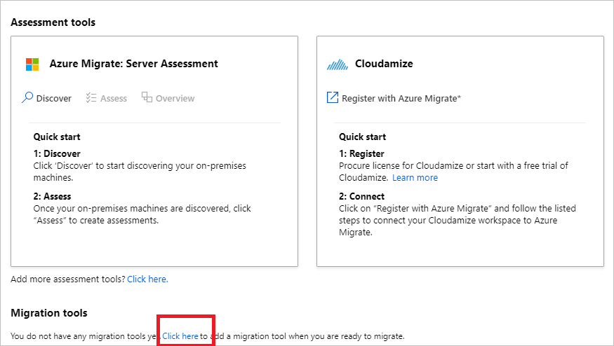
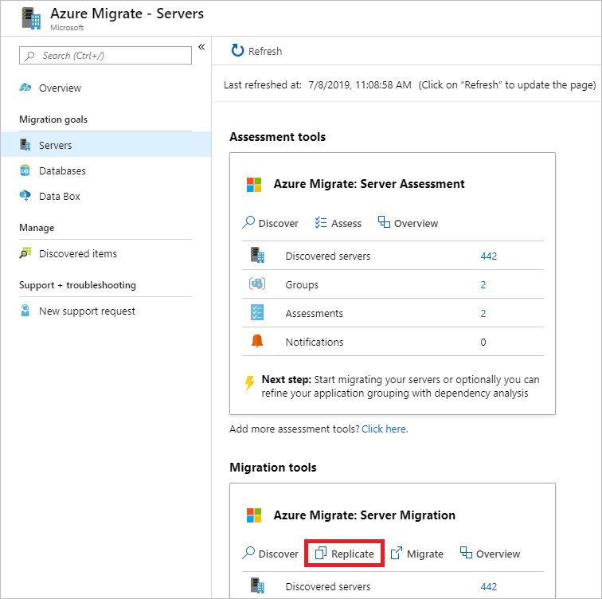
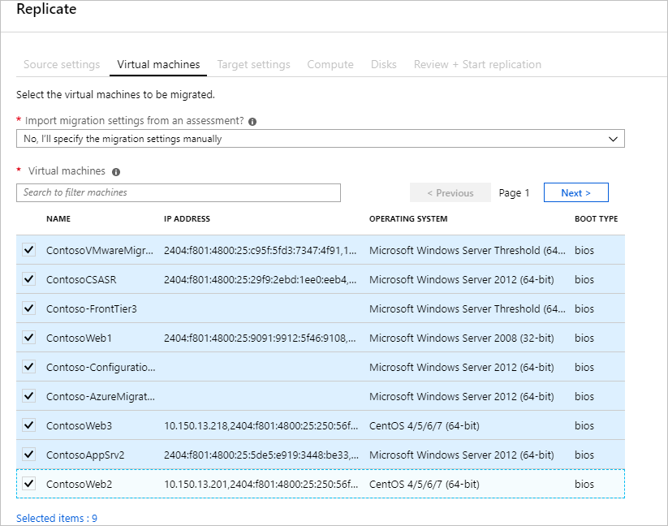

# Migrate VMware VMs to Azure (agentless)

This article shows you how to migrate on-premises VMware VMs to Azure, using agentless migration with the Azure Migrate Server Migration tool.

[Azure Migrate](migrate-services-overview.md) provides a central hub to track discovery, assessment and migration of your on-premises apps and workloads, and AWS/GCP VM instances, to Azure. The hub provides Azure Migrate tools for assessment and migration, as well as third-party independent software vendor (ISV) offerings.

This tutorial is the third in a series that demonstrates how to assess and migrate VMware VMs to Azure using Azure Migrate Server Assessment and Migration. In this tutorial, you learn how to:

> [!div class="checklist"]
> * Prepare VMs for migration.
> * Add the Azure Migration Server Migration tool.
> * Discover VMs you want to migrate.
> * Start replicating VMs.
> * Run a test migration to make sure everything's working as expected.
> * Run a full VM migration.

If you don't have an Azure subscription, create a [free account](https://azure.microsoft.com/pricing/free-trial/) before you begin.

## Migration methods

You can migrate VMware VMs to Azure using the Azure Migrate Server Migration tool. This tool offers a couple of options for VMware VM migration:

- Migration using agentless replication. Migrate VMs without needing to install anything on them.
- Migration with an agent for replication. Install an agent on the VM for replication.

To decide whether you want to use agentless or agent-based migration, review these articles:

- [Learn how](server-migrate-overview.md) agentless migration works, and [review the limitations](server-migrate-overview.md#agentless-migration-limitations).
- [Read this article](tutorial-migrate-vmware-agent.md) if you want to use the agent-based method.

## Prerequisites

Before you begin this tutorial, you should:

1. [Understand](migrate-architecture.md) the VMware migration architecture.
2. [Complete the first tutorial](tutorial-prepare-vmware.md) in this series to set up Azure and VMware for migration. Specifically, in this tutorial  you need to:
    - [Prepare Azure](tutorial-prepare-vmware.md#prepare-azure) for migration.
    - [Prepare the on-premises environment](tutorial-prepare-vmware.md#prepare-for-agentless-vmware-migration) for migration.
    
3. We recommend that you try assessing VMware VMs with Azure Migrate Server Assessment before migrating them to Azure. To set up assessment, [complete the second tutorial](tutorial-assess-vmware.md) in this series. If you don't want to assess VMs you can skip this tutorial. Although we recommend that you try out an assessment, but you don't have to run an assessment before you try a migration.

## Add the Azure Migrate Server Migration tool

If you didn't follow the second tutorial to assess VMware VMs, you need to [follow these instructions](how-to-add-tool-first-time.md) set up an Azure Migrate project, and select the Azure Migrate Server Migration tool. 

If you followed the second tutorial and already have an Azure Migrate project set up, add the Azure Migrate Server Migration tool as follows:

1. In the Azure Migrate project, click **Overview**. 
2. In **Discover, assess, and migration servers**, click **Assess and migrate servers**.

     

3. In **Migration tools**, select **Click here to add a migration tool when you are ready to migrate**.

    

4. In the tools list, select **Azure Migrate: Server Migration** > **Add tool**

    

## Set up the Azure Migrate appliance

Azure Migrate Server Migration runs a lightweight VMware VM appliance. The appliance performs VM discovery and sends VM metadata and performance data to Azure Migrate Server Migration. The same appliance is also used by the Azure Migrate Server Assessment tool.

If you followed the second tutorial to assess VMware VMs, you already set up the appliance during that tutorial. If you didn't follow that tutorial, you need to set up the appliance now. To do this, you: 

- Download an OVA template file, and import it to vCenter Server.
- Create the appliance, and check that it can connect to Azure Migrate Server Assessment. 
- Configure the appliance for the first time, and register it with the Azure Migrate project.

Follow the instructions in [this article](how-to-set-up-appliance-vmware.md) to set up the appliance.

## Prepare VMs for migration

Azure Migrate requires some VM changes to ensure that VMs can be migrated to Azure.

- For some [operating systems](server-migrate-overview.md#agentless-migration-limitations), Azure Migrate makes these changes automatically.
- If you're migrating a VM that doesn't have one of these operating systems, follow the instructions to prepare the VM.
- It's important to make these changes before you begin migration. If you migrate the VM before you make the change, the VM might not boot up in Azure.
- Configuration changes you make on on-premises VMs are replicated to Azure after replication for the VM is enabled. To ensure that changes are replicated, make sure that the recovery point you migrate to is later than the time at which the configuration changes were made on-premises.

### Prepare Windows Server VMs

**Action** | **Details** | **Instructions**
--- | --- | ---
Ensure that Windows volumes in Azure VM use the same drive letter assignments as the on-premises VM. | Configure the SAN policy as Online All. | 1. Sign in to the VM with an admin account, and open a command window.  2. Type **diskpart** to run the Diskpart utility.  3. Type **SAN POLICY=OnlineAll**  4. Type Exit to leave Diskpart, and close the command prompt.
Enable Azure serial access console for the Azure VM | This helps with troubleshooting. You don't need to reboot the VM. The Azure VM will boot using the disk image, and this is equivalent to a reboot for the new VM. | Follow [these instructions](https://docs.microsoft.com/azure/virtual-machines/windows/serial-console#enable-serial-console-in-custom-or-older-images) to enable.
Install Hyper-V Guest Integration | If you're migrating machines running Windows Server 2003, install Hyper-V Guest Integration Services on the VM operating system. | [Learn more](https://docs.microsoft.com/windows-server/virtualization/hyper-v/manage/manage-hyper-v-integration-services#install-or-update-integration-services).
Remote Desktop | Enable Remote Desktop on the VM, and check that the Windows Firewall isn't blocking Remote Desktop access on any network profiles. | [Learn more](https://docs.microsoft.com/windows-server/remote/remote-desktop-services/clients/remote-desktop-allow-access).

### Prepare Linux VMs

**Action** | **Details** 
--- | --- | ---
Install Hyper-V Linux Integration Services | Most new versions of Linux distributions have this included by default.
Rebuild the Linux init image to contain the necessary Hyper-V drivers | This ensures that the VM will boot in Azure, and is only required on some distributions.
Enable Azure serial console logging | This helps with troubleshooting. You don't need to reboot the VM. The Azure VM will boot using the disk image, and this is equivalent to a reboot for the new VM.  Follow [these instructions](https://docs.microsoft.com/azure/virtual-machines/linux/serial-console) to enable.
Update device map file | Update the device map file that has the device name to volume associations, to use persistent device identifiers
Update fstab entries | Update entries to use persistent volume identifiers.
Remove udev rule | Remove any udev rules that reserves interface names based on mac address etc.
Update network interfaces | Update network interfaces to receive IP address based on DHCP.
Enable ssh | Ensure ssh is enabled and the sshd service is set to start automatically on reboot.  Ensure that incoming ssh connection requests are not blocked by the OS firewall or scriptable rules.

[Follow this article](https://docs.microsoft.com/azure/virtual-machines/linux/create-upload-generic) that discusses these steps for running a Linux VM on Azure, and include instructions for some of the popular Linux distributions.  

## Replicate VMs

With discovery completed, you can begin replication of VMware VMs to Azure.

1. In the Azure Migrate project > **Servers**, **Azure Migrate: Server Migration**, click **Replicate**.

    

2. In **Replicate**, > **Source settings** > **Are your machines virtualized?**, select **Yes, with VMware vSphere**.
3. In **On-premises appliance**, select the name of the Azure Migrate appliance that you set up > **OK**. 

    

    - This step presumes that you have already set up an appliance when you completed the tutorial.
    - If you haven't set up an appliance, then follow the instructions in [this article](how-to-set-up-appliance-vmware.md).

4. In **Virtual machines**, select the machines you want to replicate.
    - If you've run an assessment for the VMs, you can apply VM sizing and disk type (premium/standard) recommendations from the assessment results. To do this, in **Import migration settings from an Azure Migrate assessment?**, select the **Yes** option.
    - If you didn't run an assessment, or you don't want to use the assessment settings, select the **No** options.
    - If you selected to use the assessment, select the VM group, and assessment name.

    

5. In **Virtual machines**, search for VMs as needed, and check each VM you want to migrate. Then click **Next: Target settings**.

    

6. In **Target settings**, select the subscription, and target region to which you'll migrate, and specify the resource group in which the Azure VMs will reside after migration. In **Virtual Network**, select the Azure VNet/subnet to which the Azure VMs will be joined after migration.
7. In **Azure Hybrid Benefit**:

    - Select **No** if you don't want to apply Azure Hybrid Benefit. Then click **Next**.
    - Select **Yes** if you have Windows Server machines that are covered with active Software Assurance or Windows Server subscriptions, and you want to apply the benefit to the machines you're migrating. Then click **Next**.

    

8. In **Compute**, review the VM name, size, OS disk type, and availability set. VMs must conform with [Azure requirements](migrate-support-matrix-vmware.md#agentless-migration-vmware-vm-requirements).

    - **VM size**: If you're using assessment recommendations, the VM size dropdown will contain the recommended size. Otherwise Azure Migrate picks a size based on the closest match in the Azure subscription. Alternatively, pick a manual size in **Azure VM size**. 
    - **OS disk**: Specify the OS (boot) disk for the VM. The OS disk is the disk that has the operating system bootloader and installer. 
    - **Availability set**: If the VM should be in an Azure availability set after migration, specify the set. The set must be in the target resource group you specify for the migration.

    

9. In **Disks**, specify whether the VM disks should be replicated to Azure, and select the disk type (standard SSD/HDD or premium-managed disks) in Azure. Then click **Next**.
    - You can exclude disks from replication.
    - If you exclude disks, won't be present on the Azure VM after migration. 

    

10. In **Review and start replication**, review the settings, and click **Replicate** to start the initial replication for the servers.

> [!NOTE]
> You can update replication settings any time before replication starts, in **Manage** > **Replicating machines**. Settings can't be changed after replication starts.

### Provisioning for the first time

If this is the first VM you're replicating in the Azure Migrate project, Azure Migrate Server Migration automatically provisions these resources in same resource group as the project.

- **Service bus**: Azure Migrate Server Migration uses the service bus to send replication orchestration messages to the appliance.
- **Gateway storage account**: Server Migration uses the gateway storage account to store state information about the VMs being replicated.
- **Log storage account**: The Azure Migrate appliance uploads replication logs for VMs to a log storage account. Azure Migrate applies the replication information to the replica managed disks.
- **Key vault**: The Azure Migrate appliance uses the key vault to manage connection strings for the service bus, and access keys for the storage accounts used in replication. You should have set up the permissions that the key vault needs to access the storage account when you prepared. [Review these permissions](tutorial-prepare-vmware.md#assign-role-assignment-permissions).   

## Track and monitor

- When you click **Replicate** a Start Replication job begins. 
- When the Start Replication job finishes successfully, the machines begin their initial replication to Azure.
- During initial replication, a VM snapshot is created. Disk data from the snapshot is replicated to replica managed disks in Azure.
- After initial replication finishes, delta replication begins. Incremental changes to on-premises disks are periodically replicated to the replica disks in Azure.

You can track job status in the portal notifications.

You can monitor replication status by clicking on **Replicating servers** in **Azure Migrate: Server Migration**.

## Run a test migration

When delta replication begins, you can run a test migration for the VMs, before running a full migration to Azure. We highly recommend that you do this at least once for each machine, before you migrate it.

- Running a test migration checks that migration will work as expected, without impacting the on-premises machines, which remain operational, and continue replicating. 
- Test migration simulates the migration by creating an Azure VM using replicated data (usually migrating to a non-production VNet in your Azure subscription).
- You can use the replicated test Azure VM to validate the migration, perform app testing, and address any issues before full migration.

Do a test migration as follows:

1. In **Migration goals** > **Servers** > **Azure Migrate: Server Migration**, click **Test migrated servers**.

     

2. Right-click the VM to test, and click **Test migrate**.

    

3. In **Test Migration**, select the Azure VNet in which the Azure VM will be located after the migration. We recommend you use a non-production VNet.
4. The **Test migration** job starts. Monitor the job in the portal notifications.
5. After the migration finishes, view the migrated Azure VM in **Virtual Machines** in the Azure portal. The machine name has a suffix **-Test**.
6. After the test is done, right-click the Azure VM in **Replicating machines**, and click **Clean up test migration**.

    

## Migrate VMs

After you've verified that the test migration works as expected, you can migrate the on-premises machines.

1. In the Azure Migrate project > **Servers** > **Azure Migrate: Server Migration**, click **Replicating servers**.

    [Replicating servers](./media/tutorial-migrate-vmware/replicate-servers.png)

2. In **Replicating machines**, right-click the VM > **Migrate**.
3. In **Migrate** > **Shut down virtual machines and perform a planned migration with no data loss**, select **Yes** > **OK**.
    - By default Azure Migrate shuts down the on-premises VM, and runs an on-demand replication to synchronize any VM changes that occurred since the last replication occurred. This ensures no data loss.
    - If you don't want to shut down the VM, select **No**
4. A migration job starts for the VM. Track the job in Azure notifications.
5. After the job finishes, you can view and manage the VM from the **Virtual Machines** page.

## Complete the migration

1. After the migration is done, right-click the VM > **Stop migration**. This stops replication for the on-premises machine, and cleans up replication state information for the VM.
2. Install the Azure VM [Windows](https://docs.microsoft.com/azure/virtual-machines/extensions/agent-windows) or [Linux](https://docs.microsoft.com/azure/virtual-machines/extensions/agent-linux) agent on the migrated machines.
3. Perform any post-migration app tweaks, such as updating database connection strings, and web server configurations.
4. Perform final application and migration acceptance testing on the migrated application now running in Azure.
5. Cut over traffic to the migrated Azure VM instance.
6. Remove the on-premises VMs from your local VM inventory.
7. Remove the on-premises VMs from local backups.
8. Update any internal documentation to show the new location and IP address of the Azure VMs. 

## Post-migration best practices

- For increased resilience:
    - Keep data secure by backing up Azure VMs using the Azure Backup service. [Learn more](../backup/quick-backup-vm-portal.md).
    - Keep workloads running and continuously available by replicating Azure VMs to a secondary region with Site Recovery. [Learn more](../site-recovery/azure-to-azure-tutorial-enable-replication.md).
- For increased security:
    - Lock down and limit inbound traffic access with [Azure Security Center - Just in time administration](https://docs.microsoft.com/azure/security-center/security-center-just-in-time).
    - Restrict network traffic to management endpoints with [Network Security Groups](https://docs.microsoft.com/azure/virtual-network/security-overview).
    - Deploy [Azure Disk Encryption](https://docs.microsoft.com/azure/security/azure-security-disk-encryption-overview) to help secure disks, and keep data safe from theft and unauthorized access.
    - Read more about [securing IaaS resources](https://azure.microsoft.com/services/virtual-machines/secure-well-managed-iaas/), and visit the [Azure Security Center](https://azure.microsoft.com/services/security-center/).
- For monitoring and management:
-  Consider deploying [Azure Cost Management](https://docs.microsoft.com/azure/cost-management/overview) to monitor resource usage and spending.

## Next steps

Investigate the [cloud migration journey](https://docs.microsoft.com/azure/architecture/cloud-adoption/getting-started/migrate) in the Azure Cloud Adoption Framework.
