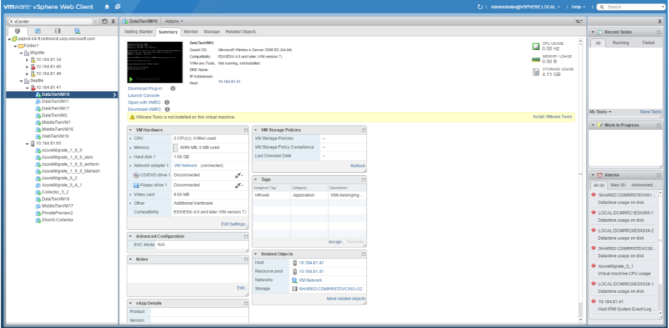
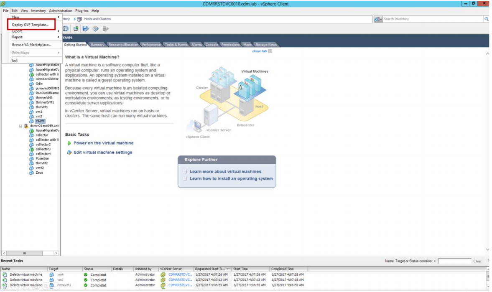
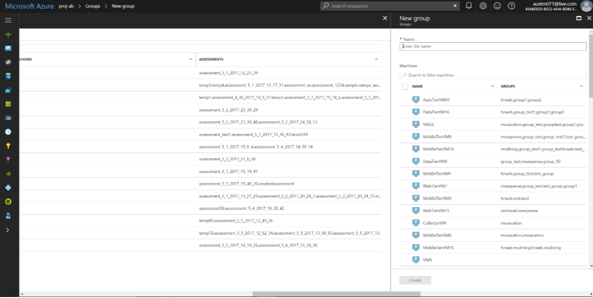

# Assess on-premises VMware VMs for migration to Azure

[Azure Migration Planner](migration-planner-overview.md) assesses on-premises workloads for migration to Azure.

In this tutorial, you learn how to:

> [!div class="checklist"]
> * Create a Migration Planner project
> * Set up and run the collector appliance, to discover on-premises VMs
> * Group VMs for assessment
> * Run and view an assessment

After you complete the steps in this tutorial, you will have a complete migration assessment for selected on-premises VMware virtual machines (VMs). 

Post any comments or questions at the bottom of this article.

## Before you start

1. Get an [overview](migration-planner-overview.md) of Migration Planner, and [learn](assessment-calculation.md) how assessments are calculated.
2. Read about the [limitations](troubleshooting-general.md#release-limitations) for this release.

## Prequisites

- **Azure**: You need an [Azure subscription](http://azure.microsoft.com/). You can start with a [free trial](https://azure.microsoft.com/pricing/free-trial/).
- **vCenter**: VMware VMs you want to assess should be located on vSphere ESXi hosts that are managed with a vCenter server running version 5.5 or 6.0.
- vSphere ESXi host: The ESXi host or cluster on which the collector VM (version 8.0) runs must be running version 5.0 or higher.
- **Credentials**: Migration Planner needs an account with read-ony administrator credentials for the vCenter server, to discover VMs.
- **Create a VM**: You must be able to create a vCenter VM in .OVA format. You download an appliance, and import it to the vCenter server to create the VM. The VM must be able to connect to the internet, in order to send metadata to Azure.
- **Statistics settings**: The statistics settings for the vCenter server should be set to statistics level 2. The default is level 1. Level 1 will work, but Migration Planner won't be able to collec data for performance-based sizing for storage.


## Tag VMs in vCenter (optional)

Migration Planner gathers VMs into groups for assessment. You can define those groups using tagging in vCenter, or manually during Migration Planner deployment. If you want to use VMware tags, do the following:

1. In the VMware vSphere Web Client, navigate to the vCenter server instance.
2. To review current tags, click **Tags**.
3. To tag a VM, select **Related Objects** > **Virtual Machines**, and select the VM you want to tag.
4. In **Summary** > **Tags**, click **Assign**.
5. Click **New Tag**, and specify a tag name and description.
6. To create a category for the tag, select **New Category** in the drop-down list.
7. Specify a category name and description, and the cardinality. Then click **OK**.

    


## Create a project

Get started by creating a new Migration Planner project.

1. In the Azure Portal, click **New**.
2. Search for **Migration Planner**, and select the service (**Migration Planner (preview)** in the search results, and click **Create**.
3. Specify a project name, and the subscription under which to create the project.
4. Select an existing resource group, or create a new one.
5. Specify an Azure location in which to create the project, then click **Create**

> [!NOTE]
> This preview supports only the West Central US location for a project. However, you can
assess your machines for a different target Azure location.

    


## Download and verify the collector appliance

The collector appliance is a single file in Open Virtualization Appliance format (OVA). You download it, and use it to create an on-premises VM.

1. In **Getting Started** > **Discover & Assess**, click **Discover Machines**.
2. In **Discover machines**, click **Download**, to download the collector appliance template (.ova file).
3. In **Copy project credentials**, copy the project ID and key. You need these when you configure the collector on-premises.


### Verify the collector

Check that the downloaded collector appliance (OVA) is secure before you deploy it, as follows:

1. On the machine to which you downloaded the file, open an administrator command window.
2. Run the following command to generate the hash for the OVA:
    - ```C:\>CertUtil -HashFile <Location_of_downloaded_appliance> [Hashing Algorithm]```
    - Example usage: ```C:\>CertUtil -HashFile C:\AzureMigrate\AzureMigrate.ova SHA256```
3. The generated hash should match the table.

    **Algorithm** | **Hash value**
    --- | ---
    MD 5 | 1b4dc6698b83eac6c5a0f71838e887bf
    SHA1 | ceeddb17e97f1e38f393890e5986452bec23adbf
    SHA256 | 9a379033deaa2af6e243267faaef37339f2be4eb55bafb736b1587fe840ceba4

## Create the collector appliance VM

Import the .ovf file on the vCenter server.

1. In the vSphere Client console, click **File** > **Deploy OVF Template**.

    

2. In the Deploy OVF Template Wizard > **Source**, specify the location of the .ovf file.
3. In **Name** and **Location**, specify a friendly name for the collector VM, the inventory object in which the VM
will be hosted.
5. In **Host/Cluster**, specify the host or cluster on which the collector VM will run.
7. In storage, specify the storage destination for the collector VM. In **Disk Format**, specify the disk type and size.
8. In **Network Mapping**, specify the network to which the collector VM will connect. The network needs internet connectivity, to send metadata to Azure. 
9. Review and confirm the settings, then click **Finish**.


## Run the collector to discover VMs

1. In the vSphere Client console, right-click the VM > **Open Console**.
2. Provide the language, time zone and password preferences for the appliance.
3. In the Azure Migration Planner Collector, open **Set Up Prequisites**.
    - Accept the license terms, and read third party information.
    - The collector checks that the VM has internet access. If the VM accesses the internet via a proxy, click **Proxy settings**, and specify the proxy address and listening port. Specify credentials if proxy access need authentication.
    - The collector checks that the Windows profiler service is running. The service is installed by default on the collector VM. 
    - Select to download and install the VMware PowerCLI.

4. In **Discover Machines**, do the following:
    - Specify the name (FQDN) or IP address of the vCenter server, and the read-only account that the collector will use to discover VMs on the vCenter server.
    - Select a scope for VM discovery. The collector can only discover VMs within the specified scope. Scope can be set to a specific folder, datacenter, or cluster, but it shouldn't contain more than 1000 VMs. 
    - Select tag categories for VM grouping. This is only relevant if you're using tagging on the vCenter server. Migration Planner automatically groups VMs based on tag values in the category. If you're not using tagging, you can group VMs in the Azure portal.
5. In **Select Project**, specify the Migration Planner project ID and key. You should have copied these from the Azure portal. If didn't copy them, open Azure in a browser from the collector VM. In the Migration Planner project **Overview** page, click **Discover Machines**, and copy the values.  
6. In **Complete Discovery**, you can monitor the discovery status, and check that metadata is collected from the VMs in scope. The collector provides an approximate discovery time.


### Verify discovered VMs in the portal

Discovery time depends on how many VMs you are discovering. Typically, for 100 VMs, after the collector finishes running, it takes around an hour for discovery to finish. 

1. In the Migration Planner project, click **Manage** > **Machines**.
2. Check that the VMs you want to discover appear in the portal.


## Assess machine dependencies before adding them to a group (optional)

You can optionally use dependency mapping to help you group machines more accurately. You can either verify dependencies for specific machines before adding them to a group, or verify the dependencies of a group after creating it. If you want to verify dependencies for a specific machine before you add it to a group, do the following:

1. In **Overview**, click **View Dependencies**.
2. In **Select Item**, select **Machine** in the dropdown list, and click the machine name.
3. To calculate dependencies, you need to download and install agents on the machine:
    - Download the Microsoft Monitoring agent 
    - Download the Dependency agent
4. Copy the project ID and key. You need these when you install the Microsoft Monitoring agent on a machine.
5. After you install the agents on the machine, return to the portal, and in **Overview**, click **View Dependencies** again. This time the **Agent Status** for a machine should show as **Installed**. Click **>** to show the dependencies.
6. By default the dependency time range is an hour. Click the time range to modify it. You can shorten the time range, or specify start and end dates, and duration.
7. Click **View wider discovery** to show dependencies that aren't displayed on the dependency map. You can filter these results by IP address range.
8. To create a group, click the machines on the map. In **Group machines**, specify a group name. Verify that machines you add to the group have the dependendency agents installed, and have been discovered by Migration Planner. Machines must be discovered in order to assess them. We recommend that you install the dependency agents so that dependency mapping is complete.
9. click **OK** to save the group settings. Alternatively, you can add machines to an existing group.
  

## Group VMs for assessment

If you're using tagging in vCenter, Migration Planner automatically gathers VMs into groups based on those tags. If you're not using vCenter tagging, you need to manually group VMs. Typically, you group VMs that belong to the same app together, so that there's no loss of functionality after migration to Azure.

1. In the project dashboard, click **Create assessment**. 
2. In **Select or create a group**, click **Create New**, and specify a group name.
3. Add machines to the group, by selecting and clearing machines.

    


> [!NOTE]
> You can also group machines on the dashboard > **Machines** > **Group Machines**.


    - 
### Verify group dependencies (optional)

If you didn't verify dependencies for specific machines before adding them to a group, you can optionally verify group dependencies, to help you create groups with a high level of confidence.

> [!NOTE]
> Don't assess group using group dependencies if you have more than 10 machines in the group. In this case you should either reduce group sizes, or view dependencies for specific machines before adding them to a group.

Check group dependencies as follows:

1. In **Overview**, click **View Dependencies**.
2. In **Select Item**, select **Group** in the dropdown list, and click the group name.
3. To calculate dependencies, you need to download and install agents on machines in the group:
    - Download the Microsoft Monitoring agent 
    - Download the Dependency agent
4. Copy the project ID and key. You need these when you install the Microsoft Monitoring agent on a machine.
5. After you install the agents on the machine in the group, return to the portal, and in **Overview**, click **View Dependencies** > **Group** again. Click **>** to open the **Dependencies** map.
6. For each machine you can review the following settings:
    - FQDN and IP address of the machine.
    - Whether the Migration Planner agents are installed on the machine, and whether the machine has been discovered.
    - The guest operating system running on the machine.
    - Incoming and outbound IP connections and ports.
    - Processes running on machines
    - Dependencies between machines
7. You can get more granular dependencies as follows:
    - Click the dependency time range to modify it. By default the time range used is an hour. You can shorten the time range, or specify start and end dates, and duration.
    - Click **View wider discovery** to show dependencies that aren't displayed on the dependency map. You can filter these results by IP address range.
8. Based on the map,  you can remove or add machines as needed.
    - Removing a machine from a group invalidates past assessments for it. A new assessment will be generated automatically when you modify the group.
    - Machines that you add to the group should be discovered by Migration Planner, in order to assess them.
    - We recommend that you install the dependency agents on group machines, so that dependency mapping is complete.
9. Click **OK** to save the group settings. 

## Create and view an assessment

When groups are in place, you can create an assessment. Learn more about [what's in an assessment](migration-planner-overview.md#what-do-assessments-provide), and [how assessments are calculated](assessment-calculation.md).

1. In the project dashboard, click **Groups**, and select the group you want to assess.
2. Click **Create Assessment**. 
3. After the assessment is created, view it on the dashboard, or download it as an Excel file.


## Next steps

[Learn more](assessment-calculation.md) about how assessments are calculated.